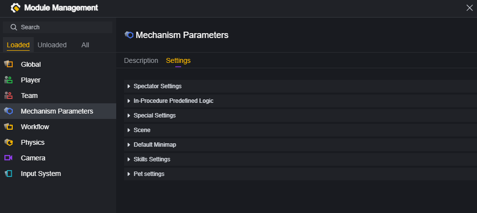
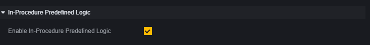
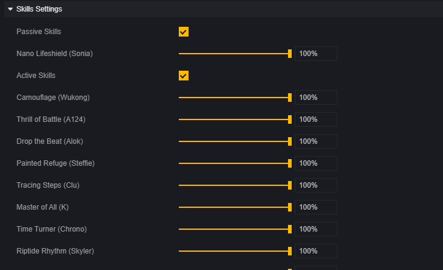

# Mechanism Parameters - User Manual

In the module, there is a setting category for mechanism parameters.

This category is a collection of configurations for some mechanisms, and you can directly modify some game mechanism settings in this category.

## Spectator Settings

Spectator settings can be used to set whether spectators can watch the game and the rules for spectating.

## Preset Logic within Process

Preset logic within the process refers to default built-in logic such as player invincibility and turn start sound effects at the beginning of a round.

## Special Settings

Some unique game mechanism settings.

The implementation method for infinite ammunition, infinite ice walls, and infinite projectiles does not consume reserve ammunition, ice walls, or projectiles. Therefore, you need to add at least one weapon, one ice wall, or one projectile to use these settings.

## Scene

**Enable Default Map Loot Spawn Points**: Some map templates, such as Bermuda, come with default loot spawn points. Enabling this setting will spawn these loot on the map.

**Enable Area of Interest Filtering**: Disabling this function will synchronize all objects, while enabling it will automatically ignore objects that are far away to save performance.

## Default Mini Map

The map depth map is a feature on the mini-map that displays the height of objects in different colors.

## Skill Settings

Decide whether to enable character skills in the game and adjust the cooldown of character skills. The cooldown can be adjusted from 0% to 100%, where 0% means no cooldown.

## Pet Settings

Whether to support the use of pets and pet skills.
