# Interface - User Manual

The interface is always displayed in 2D at the forefront of the game window, providing information to players and accepting their interactions.

This document will introduce some related concepts, how to use the UI editor, and how to script UI logic.

## Concept Introduction

### UI Files

UI files store information about custom UIs and create corresponding UI entities during gameplay.

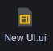

UI files can be created and edited in assets. Within a single UI file, you can add multiple UI controls that offer various functions such as text display, image display, and input reception.

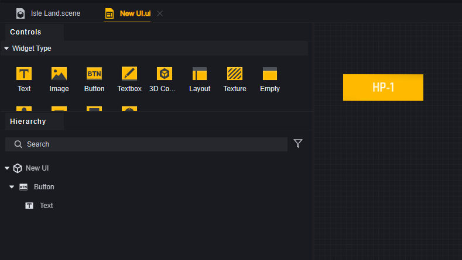

A UI file can create multiple custom interface entities. For example, each player might create a button using the same UI file, or a player might use the UI file multiple times to create several buttons on their interface. These buttons belong to different entities created from the same UI file.

### Custom Interface Entities

During gameplay, custom interface entities are created based on UI files, referred to as UI entities hereafter.

UI entities can have scripts attached and possess attributes. They contain several controls that can be accessed through the UI entity.

> Creating a UI Entity

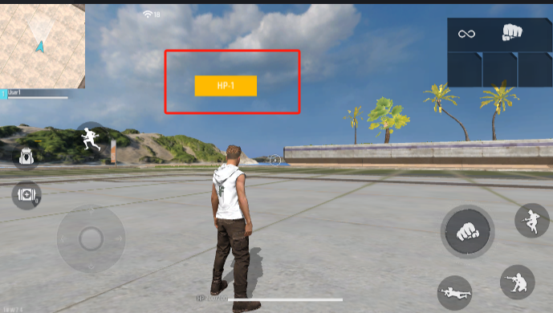

> A UI entity with only one button control created for this player.

> Some properties of a UI entity

> Controls of a UI entity

The UI file name is the custom interface entity ID. The custom interface entity ID is an index, which is different from the concept of an entity.

### Controls

Controls are the basic building blocks of the UI and are components that provide actual functionality. In a UI file, you can select controls to use and configure their properties.

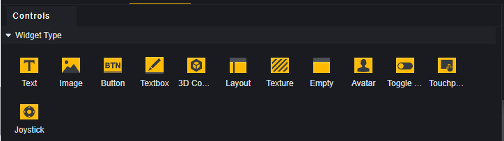

Every UI file has a root node. All UI controls have either the root node or other controls as their parent. This root node corresponds to the UI entity created by the UI file and serves only structural purposes without providing actual control functionality.

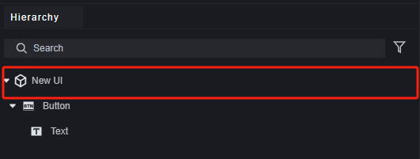

In scripts, you can access all controls of a custom interface entity and read/write their properties.

> The UI in this script node is an interface entity created based on a UI file. However, since one UI file can create multiple entities, you need to specify which player's interface entity's controls you are accessing.

### Panels

Panels are containers for controls.

Panels themselves have certain visual representations and affect display hierarchy; controls within the same panel are influenced by its hierarchy level.

Besides basic panels, we also offer scrolling panels for browsing multiple controls within a fixed area.

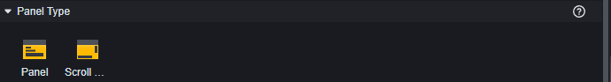

### Built-in UIs

Built-in UIs are pre-made official content. Some load by default, like movement joysticks and jump keys; others do not load by default, like countdowns and compasses.

You cannot modify controls within built-in UIs but can dynamically change properties open for editing in built-in UI entities.

## UI Hierarchy

When different interfaces overlap, the concept of UI hierarchy is introduced.

UI hierarchy determines the drawing order of this custom UI. If it conflicts with other rendering layers, it may cause interleaved rendering order. The rendering order of controls within a custom UI is automatically set based on this property. It's recommended to reserve reasonable rendering level intervals for potentially overlapping custom UIs.

When attempting to operate in an overlapping area, it will always try to interact with the control displayed on top.

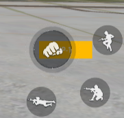

> Clicking on the overlapping part of attack and custom buttons will only trigger an attack. Clicking on parts of the custom button not overlapping with attack will trigger the custom button.

Custom UI hierarchy consists of UIRoot level, panel level, and control level.

Among them:

**UIRoot Level** has the greatest impact. The order of display for UI entities created from different files is determined by UIRoot level; higher levels mean overall display on top.

> If UIRoot levels are identical, inconsistencies between operation detection and display may occur. Do not set two overlapping UIs at the same level.

> Here, the custom button's UIRoot level is -1, lower than the default attack button's level 0.
> Built-in UIs have a Root level of 0; if you need to place below built-in UIs, set levels to negative values.

**Panel Level** has secondary influence; it affects internal display order within one file. Panel levels follow these rules:

1. Panels and controls within them always display above same-level controls.
2. Among same-level panels, order in Hierarchy menu determines priority; lower ones have higher levels and display above others.

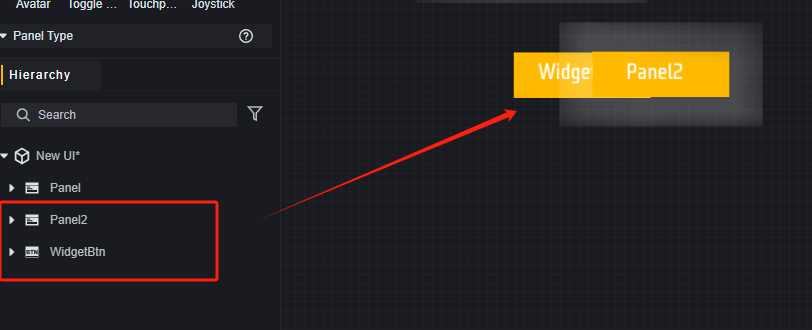 

> Controls under Panel2 will also be obscured by Panel2 due to order.

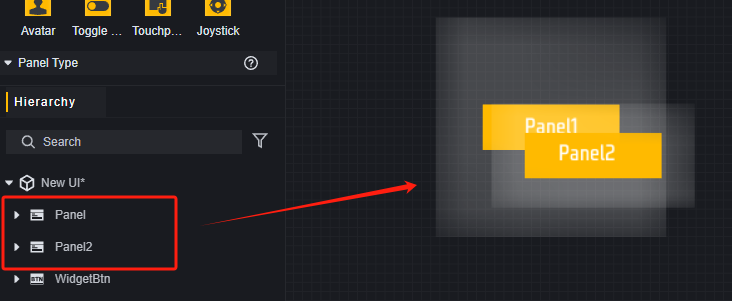

> Among two same-level panels, lower one obscures upper one.

Panel levels are hidden; they cannot be directly set but adjusted via hierarchy menu for display order changes.

**Control Level**

For controls under same UIRoot and panel, their levels are determined by order in Hierarchy menu; lower ones have higher levels.

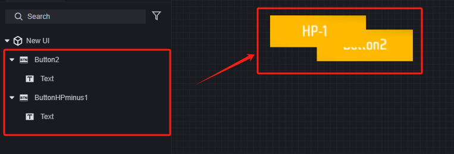

Control levels are also hidden; they cannot be directly set but adjusted via hierarchy menu for display order changes.

## Editing UI Files

### Introduction to the UI Editor

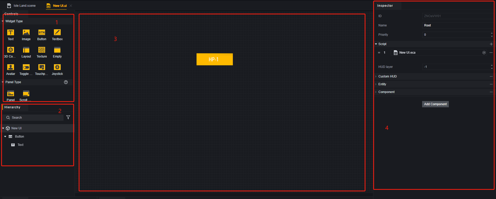

1. **Controls/Panels**: Templates for all controls and panels.
2. **Hierarchy Menu**: View controls in this file here. Confirm internal control levels; lower ones show at front.
3. **Canvas**: Adjust control positions/sizes here for desired effects.
4. **Property Menu**: Edit control properties here.

### Usage Example

Drag a control from selection panel onto canvas to create it at that position. Controls dragged onto canvas default to having root node as parent.

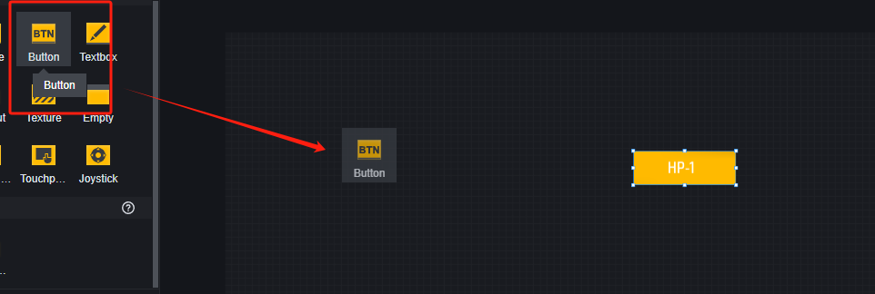

Dragging onto any control or root node in hierarchy menu makes it parent for new child control at parent's position; if root node is parented then centered on canvas creation occurs instead.

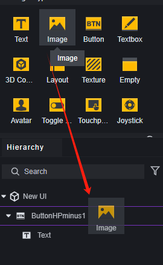

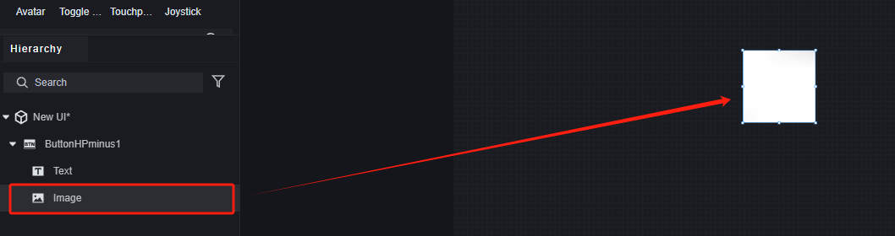

> Newly added image covers previous button due its highest level within this UI now being highest overall too!

Modify selected control's properties via property panel; each has common plus type-specific attributes related only unto itself alone!

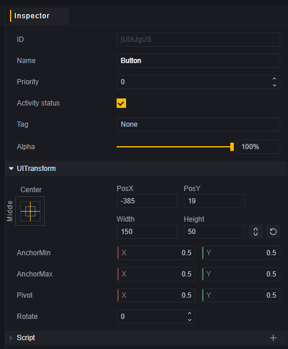

> Common Properties

UI controls adjust size/position based upon anchor parameters/parent size while those without parents adapt device aspect ratios achieving resolution adaptability instead!

In most simple cases use preset anchors avoiding manual parameter adjustments altogether!

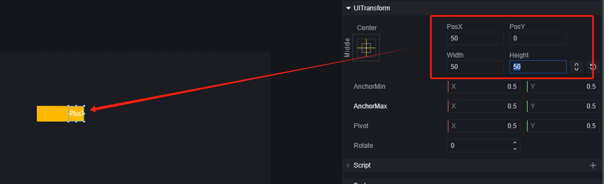

> Modify text control's `UITransform` property relative offset against its parent: custom button itself!

Each type also possesses unique attributes specific unto itself alone!

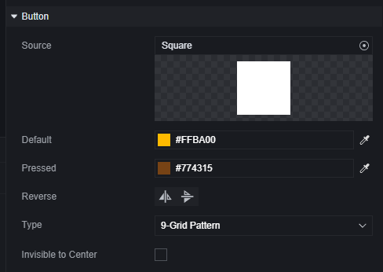

> Unique Button Attributes

## UI Logic

### Creating UIs

Only create platform-specific UIs via script APIs alone!

For example using primitive scripts:

Recommend adding dedicated management scripts into Global module itself!

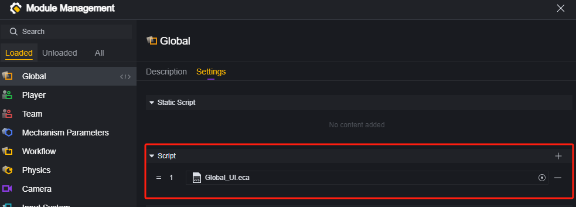

When creating server-side APIs specify players involved making dictionary management convenient:

### Destroying UIs

When needing destruction find corresponding player's involved quickly using dictionaries instead:

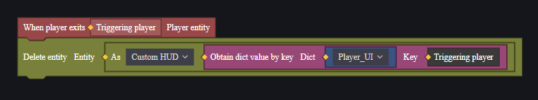

### Control Logic

Players input via buttons/joysticks/switches etc., retrieve inputs through events executing designed logic accordingly!

Suppose having both button/text where clicking increases number displayed upon text itself incrementally:

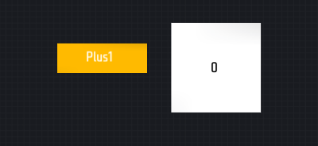

Upon pressing button change text displayed elsewhere requiring retrieval from stored global variable containing relevant entity instead:

> Script used globally managing creation process itself!

Add script onto button itself:

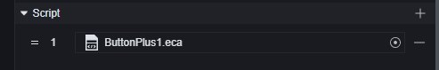

Retrieve text control from globally stored variable containing relevant entity instead:

Upon pressing button increment value displayed accordingly:

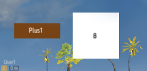

> Button pressed eight times

### Callback

In the example above, it's clear that modifying text isn't complicated, but accessing the entity containing the text control can be cumbersome.

Using callbacks can avoid this hassle and quickly enable interaction between different controls within the same UI entity.

In fact, in most cases, using callbacks is more efficient.

In the same example, create a script for the UI entity:

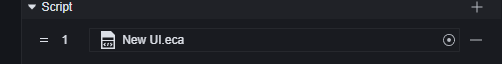

Create a callback function for a button, which increments the number displayed in the text control each time it's called:

> UI callback functions have special nodes located under the event category.

Add a callback to the button:

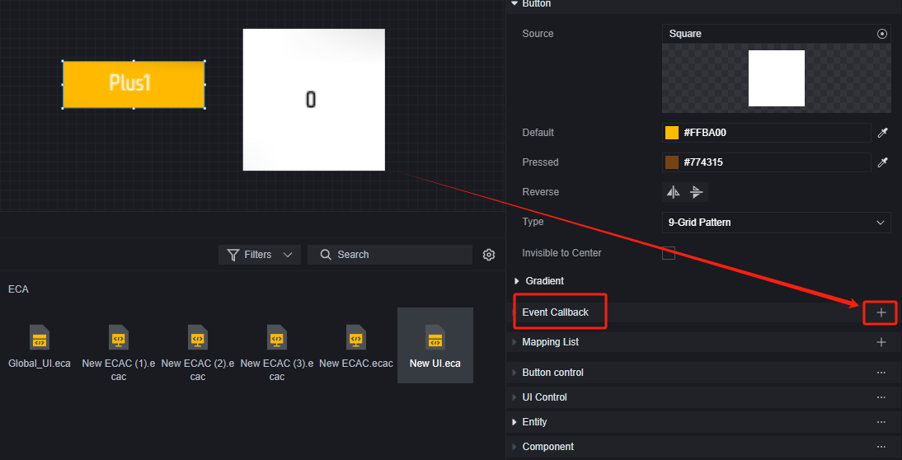

Select the callback function you just created:

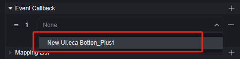

And you're done:

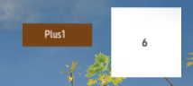

> Button pressed six times

Since the callback function is on the UI entity, accessing controls under the UI entity is much easier than when on individual controls. It's also more convenient for maintenance when there are many controls and logic within a UI entity.

### Client UI

Similar to scripts themselves, UI is also divided into server and client. Server UI is created by server APIs and uses server APIs and events internally. The same applies to client UI. Since we've restricted which primitives can be used within scripts based on their runtime platform, a UI created with server primitive scripts is server UI; one created with client primitive scripts is client UI. When using code scripts, ensure that the API's runtime platform matches that of the code script.

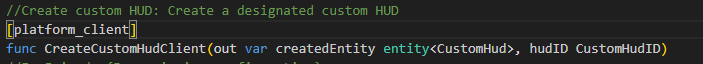

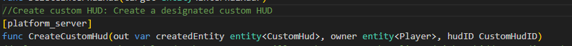

## Example

Let's assume a simple custom interface requirement to demonstrate how to create a functional custom interface and destroy it.

Assumed requirement: Create a button at the center of each player's screen that decreases HP by 10 each time it's clicked. Destroy the button when HP falls to 100 or below after clicking and reducing HP.

### Creating a UI File

Create a new UI file and open it for editing.

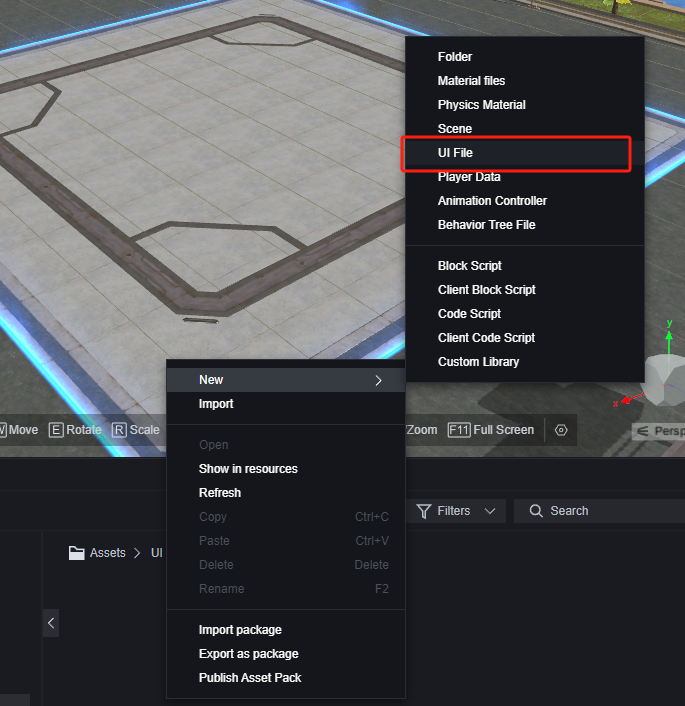

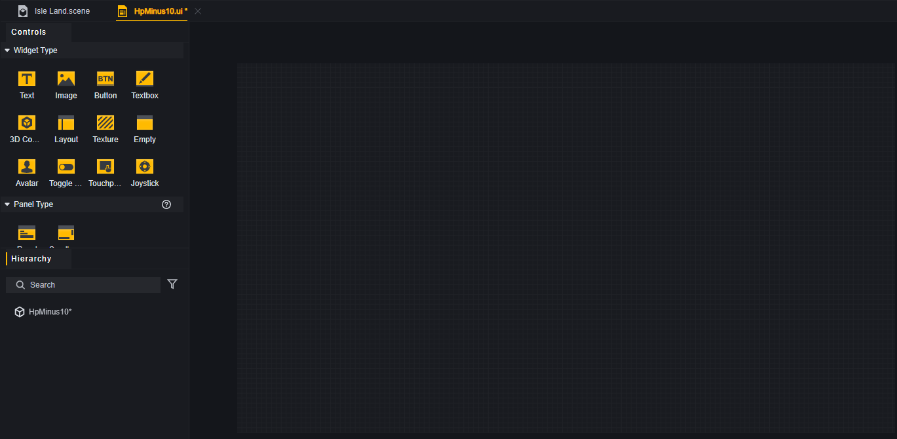

The canvas corresponds to the player's screen. Create a button slightly above center. Also, add a text control as a sub-control to explain the button's function to players.

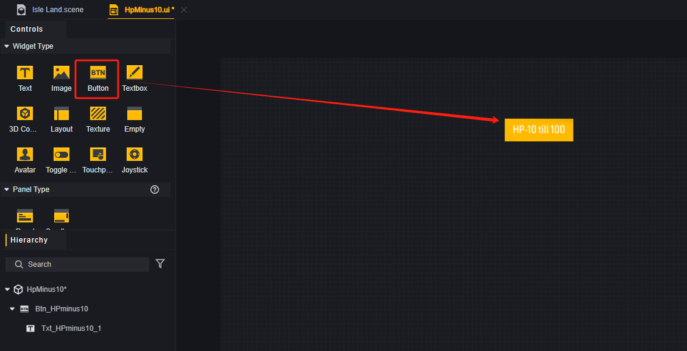

For easier management, you can rename controls in the hierarchy menu.

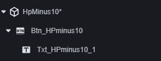

### Creating UI

Create a script in the global module to manage UI.

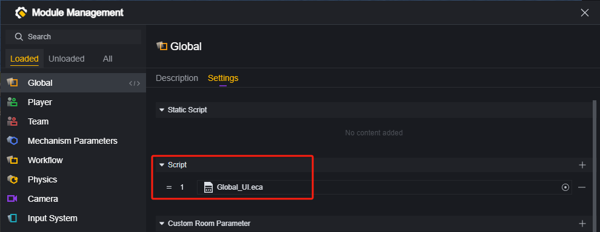

Create this UI file for each player upon joining.

> You can also choose other creation times, such as game start or phase start.

Create a dictionary to manage each player's HP reduction button.

Enter debugging mode to check button creation:

### Button Logic

We decided to use callbacks to handle reducing player HP by attaching a script to the root node.

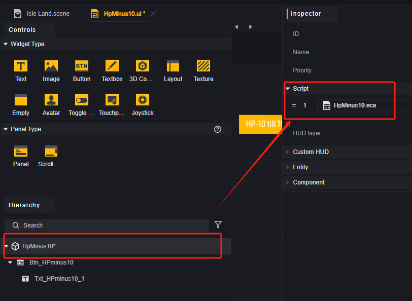

Write logic for the UI entity script.

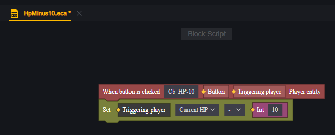

> Here we created a callback function Cb_HP-10 for button clicks

Return to edit the UI file, select the button control, and add a callback.

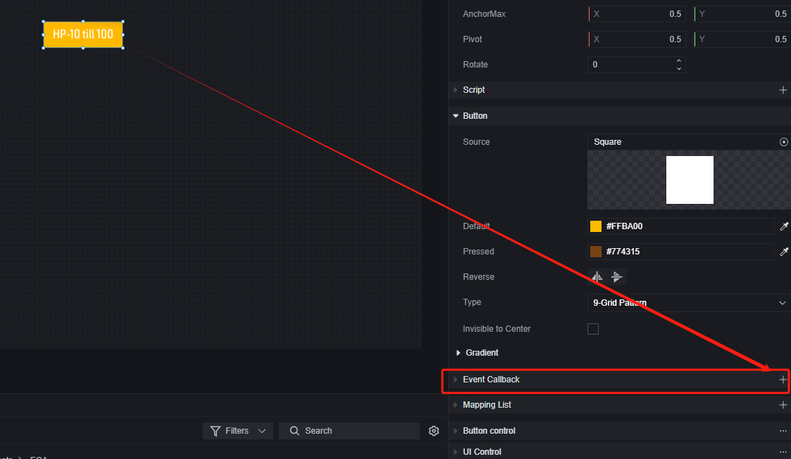

Enter debugging mode for testing:

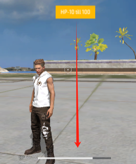

### Destroy Button Logic

In the global UI management script, create a function to destroy UI, triggered externally by buttons.

> 1. Set player as an input parameter.
> 2. Confirm if the player has specific controls to check if custom UI is deleted.
> 3. If not deleted, remove custom UI.
> 4. Also clear stored custom UI entities from the dictionary.

Return to edit the root node script of the UI, add deletion conditions, and call external functions to delete custom UI when conditions are met.

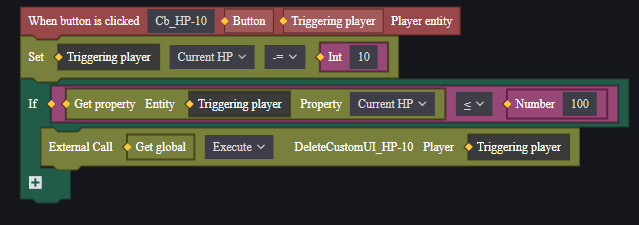

Enter debugging mode for testing:

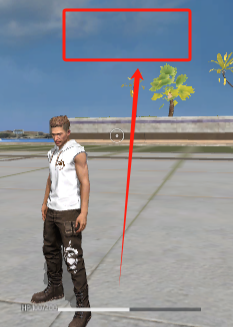

## Suggestions

For server UIs, frequent operations might cause high traffic consumption. If your UI becomes unresponsive, consider limiting sync operation frequency. For example, use a progress bar for experience points; frequent experience gains might cause high traffic. It's recommended to separate experience data from its display and sync them periodically (this technique can be applied elsewhere too).

Additionally, frequently creating and destroying UIs can lead to high performance costs and traffic consumption. If you need to intermittently show and hide a UI, consider changing related display properties instead of repeatedly creating and destroying it. This approach is more friendly to servers and low-performance devices.
