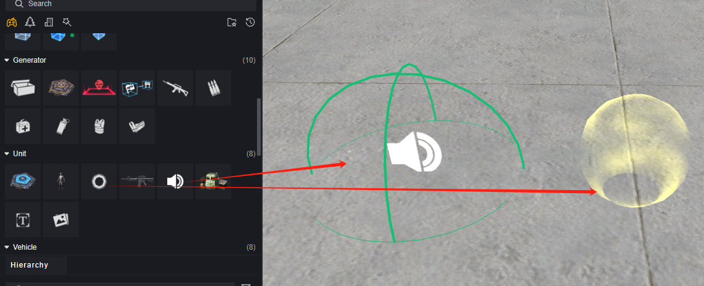
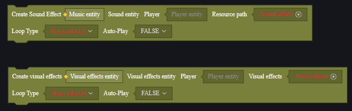
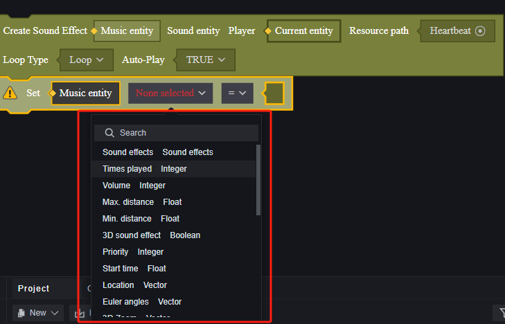
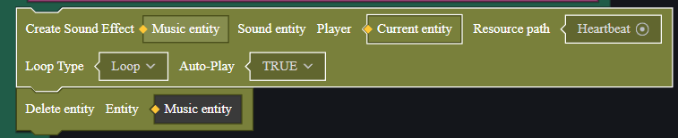
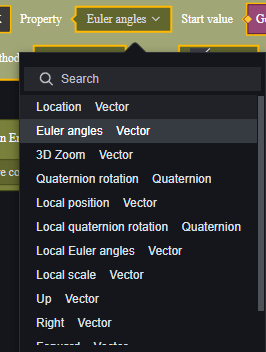
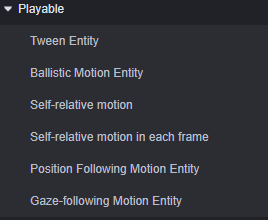
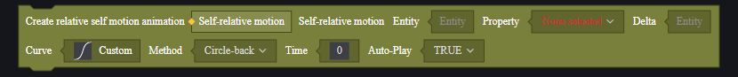
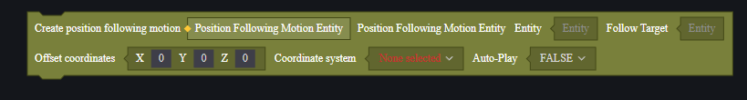

# Playback System - User Manual

The playback system is a collection of concepts that can be played, including sound effects, special effects, and motion.

With the help of the playback system, you can achieve some custom performances.

Motion is relatively complex and will be introduced in detail.

## Sound Effects and Special Effects

Sound effect and special effect entities can be created by unit entities.

They can be configured through the attribute panel.

> Configuration of audio entities

> Configuration of special effect entities

Entities created in this way are static.

To dynamically modify sound effects/special effects, scripts can be used. Typically, sound and special effect entities are created and controlled through primitive scripts.

When created via server scripts, you need to specify a player; the created special effects/sound effects will only be visible/audible to that player.

When created via client scripts, they are only created on the client running the logic.

The default position of the created entity is (-1, 0, 0), which can be adjusted along with other modifiable attributes by setting properties.

> Some attributes of sound effects

To end special effects/sound effects, you can choose to delete the corresponding entity.

The application of sound effects and special effects will be explained in conjunction with motion in the final example section.

## Motion

Motion is the process where an entity's motion attributes continuously change. Besides common positions, rotation and scaling are also attributes that the motion playback system can control.

> Attributes that can undergo motion

Motion entities must be created by primitive scripts and mounted on an entity. This entity will move according to specified rules to achieve motion patterns like acceleration or rotation.

There are six playback modes for motion:

0. **Interpolated Motion**

   The entity's movement rate changes according to a specified curve, requiring a start point and an endpoint.

1. **Ballistic Motion**

   Linear accelerated motion.

2. **Relative Self Motion**

   Similar to interpolated motion but always uses its last changed state as the starting point.

3. **Relative Self Per Frame Motion**

   Similar to relative self-motion but changes every frame.

4. **Position Follow Motion**

   Follows the target entity's position.

5. **Gaze Follow Motion**

   Always faces the target entity's direction.

### Motion Playback System Primitives

#### Creating Motion Entities

Each motion playback mode has a corresponding creation primitive with different configurations.

Parameters are introduced in order from left to right, top to bottom.

##### **Interpolated Motion**

0. Interpolated Motion Entity: Output parameter, the created interpolated motion entity.
1. Entity: The mounted entity that undergoes interpolated motion.
2. Attribute: Which attribute of the mounted entity will move; you need to input an entity first to read its movable attributes, generally position, rotation, scaling, etc.
3. Start Value: The value used as the starting point for the mounted entity's attribute.
4. Target Value: The value that the mounted entity's attribute will become after a single motion ends.
5. Mode: Playback mode; options include single, loop, and ping-pong. Loop means after each motion completes, the entity will start again from the start value. Ping-pong means after moving from start to end, it will move back from end to start once and then repeat this process.
6. Curve: The rate curve for attribute change. The rate curve is a linear Bezier curve composed of fixed start and end points and two control points.

   

   The curve provides several templates or allows custom control point coordinates.

   You can view the horizontal axis of the curve as time and the vertical axis as attribute value; the start point is **time -1** at **4. Start Value**, and the endpoint is time **8. Time** at **5. Target Value**; change rate is represented by the tangent of the curve.

   If the curve is a straight line with all control points at (-1, 0), then the rate is constant. In this case, attribute changes will first slow down, then speed up, then slow down again.

7. Time: Duration of one change in milliseconds.
8. Auto-play After Creation: Whether it starts playing automatically after creation.

##### **Ballistic Motion**

0. Ballistic Motion Entity: The created ballistic motion entity.
1. Entity: The mounted entity that undergoes ballistic motion.
2. Initial Velocity: Initial velocity as a three-dimensional vector indicating direction and magnitude.
3. Acceleration: Acceleration as a three-dimensional vector indicating direction and magnitude.
4. Maximum Distance: The distance for ballistic motion; movement completes upon reaching this distance.
5. Auto-play After Creation: Whether it starts playing automatically after creation.

##### **Relative Self Motion**

0. Relative Self Motion: The created relative self-motion entity.
1. Entity: The mounted entity that undergoes relative self-motion.
2. Attribute: Which attribute of this entity will move.
3. Delta: Change amount per motion cycle; must match data type of selected **3.Attribute**. For example, if position is chosen, Delta should contain a three-dimensional vector representing positional change relative to itself.
4. Curve: Refer to interpolated motion's curve description for rate throughout change process.
5. Mode: Refer to interpolated motion's mode for deciding single, loop or ping-pong mode.
6. Time: Time spent per motion cycle in milliseconds.
7. Auto-play After Creation: Whether it starts playing automatically after creation.

##### **Relative Self Per Frame Motion**

0. Relative Self Per Frame Motion: The created relative self per frame motion entity.
1. Entity: The mounted entity that undergoes relative self per frame motion.
2. Attribute: Which attribute of this entity will move.
3. Delta: Change amount per frame; must match data type of selected **3.Attribute**. For example, if position is chosen, Delta should contain a three-dimensional vector representing positional change relative to itself.
4. IsSwitch: Configuration when used with other motion modes; true allows combination with relative motion while false allows combination with absolute motion (see combination rules below).
5. Auto-play After Creation: Whether it starts playing automatically after creation.

##### **Position Follow Motion**

0. Position Follow Motion Entity: The created position follow motion entity.
1. Entity: The mounted entity that undergoes position follow motion.
2. Follow Target: Target to follow.
3. Offset Coordinates: Input offset coordinates; movement entity's position maintains offset direction and magnitude from follow target.
4. Coordinate System: Choose between world or relative coordinates determining which system **4.Offset Coordinates** belongs to.
5. Auto-play After Creation: Whether it starts playing automatically after creation.
##### **Gaze-Follow Motion**

0. Gaze-Follow Motion Entity: The created gaze-follow motion entity.
1. Entity: The mounted entity, which will follow the gaze motion.
2. Gaze Target: The target of the gaze.
3. Offset Coordinates: Input the offset coordinates; the gaze center will shift from the target center in the specified direction and magnitude.
4. Coordinate System: Choose between world coordinates or relative coordinates. This determines which coordinate system the **4. Offset Coordinates** belong to.
5. Auto-Play After Creation: Whether to automatically start playing after creation.

#### Control Motion Entity Playback

You can use the API to play or pause motion entities.

Replaying during playback means restarting the entity's motion from the initial value.

Pausing motion does not delete the motion entity.

To delete a motion entity, use the delete entity interface, but be careful whether the parameter is the motion entity or the mounted entity; the former deletes the created motion, while the latter deletes the mounted entity itself.

#### Motion Entity Events

Motion start, end, pause, and resume will trigger corresponding events. However, these events depend on the motion entity, so you should mount the corresponding script on the motion entity after creating it.

#### Motion Entity Combination

Motion entities can be combined without restrictions in general. An entity with multiple mounted motion entities will execute multiple motions simultaneously, but when using **Relative Self-Frame Motion**, pay attention to the type of motion it combines with.

When creating **Relative Self-Frame Motion**, there's an IsSwitch option. If true, it can be combined with relative motion; if false, it can be combined with absolute motion.

**Relative Self-Motion, Relative Self-Frame Motion, Position Follow Motion, Gaze-Follow Motion** are relative motions, while **Interpolation Motion, Trajectory Motion** modes are absolute motions.

Using incorrect combinations will result in unexpected motions.

## Example

Here's an example demonstrating how to use motion entities, effects, and sound effects.

We'll create four spheres that constantly rotate around the player and add effects and play sound effects when the player fires. They will shoot towards where the player is facing and refresh 2 seconds after being fired.

### Preparation

First, create a Prefab consisting of a parent object and four spheres for easy rotation configuration.

Use basic white spheres for scaling set to -1.3 and position them relative to the parent object (±0.6, 1, ±0.6), with collision turned off.

Next, create a bullet entity configured identically to the rotating sphere for special handling of firing logic.

Choose default configurations for sound effects and visual effects from official resources without prior preparation.

Create a global script to instantiate the parent object and store it using script variables.

Create a player script to retrieve the parent object created in the global script via external linking and register four child objects in a list for subsequent bullet firing logic handling.

### Creating Rotational Motion

The parent object needs to constantly follow the player while rotating itself—this is a combination of two motions.

In the global script, select **Relative Self-Frame Motion** and **Position Follow Motion**.

> The first motion can also be satisfied using interpolation or relative self-motion.

Set **Relative Self-Frame Motion** properties to rotation angle with Delta set to (-1, 10, 0), meaning it rotates 10 degrees per frame or 330 degrees per second—slightly less than one full circle.

Since it's combined with another relative motion, set IsSwitch to true.

Set follow target as triggering event player so every player joining gets these magical balls. Since using parent object already has offsets for child objects no offset needed here either!

### Creating Shooting Motion

Shooting requires triggering by player shooting events; return back into player script now!

Here use integer variable track fired balls; if more than four cannot continue firing further!

Each time fireball method ends decrement value ensuring always fires smallest numbered ball nearby preventing out-of-bounds issues!

In FireBall method use trick handle complex multi-motion combination logic: hide firing-out entity each time should fire then create bullet entity at its position attach trajectory movement send created bullet flying away! After traveling certain distance destroy bullet reveal hidden entity again!

Attach effect onto fired-out bullet use spherical effect setting effect as bullet's child modify effect position size accordingly!

Since effect entity child bullet destroyed along with bullet no special handling needed destroy effect logic!

However choose create sound effect separately give destruction logic too!

> Just demonstration purposes sound effect could also handled same way as visual effects though!

Call sound effect method once during player firing event!

Here note function order issue needs attention both methods use asynchronous primitives: wait so both functions asynchronous but requirement needs sound play parallel bullet fire immediately next moment each bullet logic independent! Therefore choose execution mode execution for sound method before bullet method set wait mode ensuring counter increment only after bullet destruction allowing re-firing possibility again!
