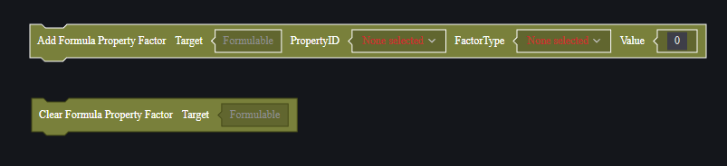
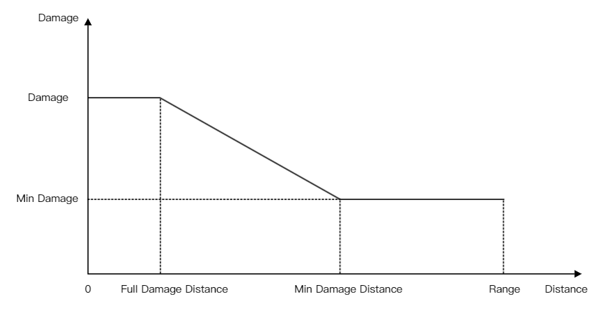

# Computable Attributes - User Manual

In Craftland Studio PC, some player attributes and weapon attributes support formulaic calculations. This helps achieve more complex numerical operations.

For attributes that support formula calculations, they have the following computable parameters:

```go
type Formula struct{
	minValue float32
	maxValue float32
	baseMul float32
	beforeAccumulator float32
	multiplier float32
	afterAccumulator float32
	SumMultiplier float32
}
```

The calculation logic is as follows:
$$
FinalValue=Min(maxValue,Max(minValue,(BaseValue×baseMul+beforeAccumulator)×multiplier×(1+SumMultiplier)+afterAccumulator))
$$

Here, BaseValue is the base value of the attribute.

Assuming the player's maximum health is 200, without setting any parameters, the player's health is 200.

Under the following settings:

```
	baseMul = 1.1
	beforeAccumulator = -100.0
```

The player's maximum health equals:
$$
PlayerMaxHp = (200×1.1-100.0)×1×(1+0)+0=120
$$

# Setting Computable Parameters

In the script, you can set computable parameters for specified attributes or clear all computable parameters:



As in the example above:


Note: Setting computable parameters establishes a formula for attribute calculation, rather than directly setting attribute values.

The attribute interface sets the BaseValue of that attribute. If a formula has been added to that attribute, the final result will be the result of the formula calculation.


# Weapon Damage Calculation

Weapon damage calculation also involves some formulas, and formula parameters have been made available as weapon attributes, such as minimum damage and minimum damage distance.

## Weapon Base Damage

Parameters related to the damage of a single bullet from a weapon include:

1. Damage Value
2. Min Damage
3. Min Damage Distance
4. Full Damage Distance
5. Range



Within the full damage distance, weapons deal full damage. Between full damage distance and min damage distance, weapon damage decreases, dealing minimum damage at min damage distance. Weapons cannot deal damage beyond their range.

All parameters may be affected by attachments or skins, typically adding value directly to weapon damage parameters.

## Hit Location Damage Multiplier Adjustment

When a weapon hits different parts of a character, damage is adjusted by different multipliers.

1. When hitting the head, the location damage multiplier is 5.5 plus headshot damage offset, with offset decreasing over distance.
2. When hitting the body, the location damage multiplier is 1 plus torso damage offset.
3. When hitting limbs, the location damage multiplier is 0.75 plus limb damage offset.

Each location's damage multiplier is calculated separately. For example, if a single bullet hits the torso causing 30 points of damage and the torso damage offset is set to 1, then within maximum damage distance a single bullet deals 30*(1+1)=60 points of damage. However, headshot damage should use base damage of 30 multiplied by headshot multiplier instead of torso offset-adjusted 60.

## Calculating Adjusted Damage

In some situations, weapon damage undergoes an additional adjustment calculation.

1. Attachment traits: Continuous fire increases damage until reaching a maximum.
2. Extra damage to downed units.
3. Extra damage ratios to special objects like vehicles, barrels, and ice walls.

## Calculating Armor Damage Reduction

If the hit unit wears armor, armor damage reduction must also be calculated.
$$
RealDamage *= (1 - DmgReduction）
$$

$$
DmgReduction = DmgRedfactor* CurrentDurability/DurabilityMax*(1 - ArmorPenetration）
$$

- DmgRedfactor: Equipment attribute for maximum reduction rate.
- CurrentDurability: Equipment attribute for current durability; durability decreases when dealing player damage.
- DurabilityMax: Equipment attribute for total durability.
- ArmorPenetration: Weapon penetration + skill penetration + FS mode penetration; penetration range [0,1].

## Other Attributes

During actual combat, the following attributes also affect weapon-inflicted player damage:

- Fire Rate 
- Weapon Spread
- Crosshair Recovery Speed
- Ammo Capacity
- Aim Assist
- Weapon's Effect on Movement Speed
