# Publish Website

# Publish your project through Craftland Editor
Go through the following steps to publish the project:
1. Go the `Files`, then click `Publish Project`  
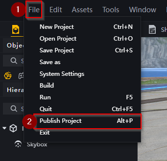
2. Wait for the map to `Build`
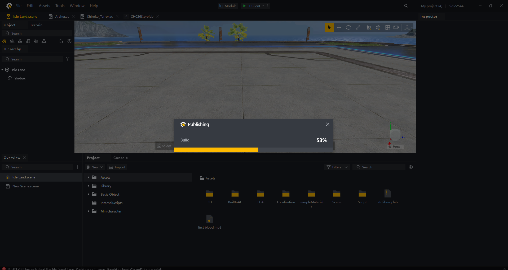
3. After the build process, click on `Confirm` in the following UI to be redirected to the publishing website. 
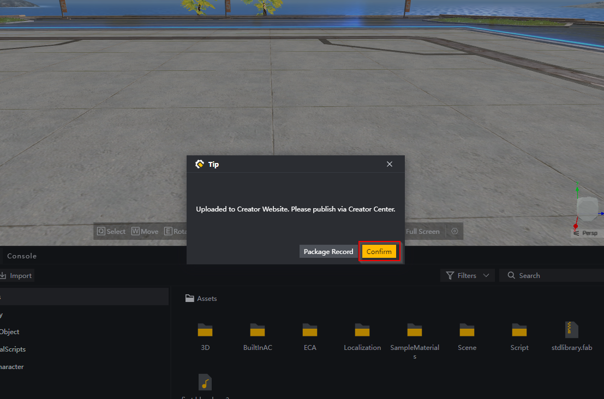

# Configuring the published map through the Craftland website
After being redirected to the website, you should choose the first project.  
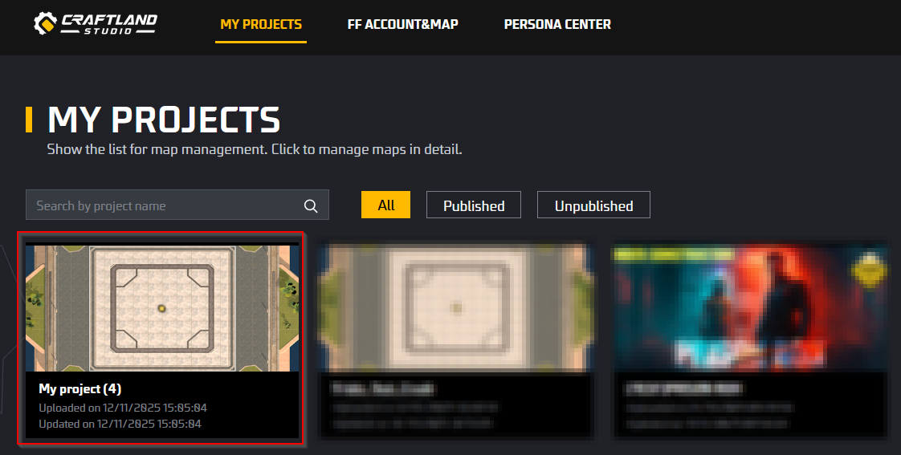

You would then be redirected to the following page containing the overall information of the published project.  
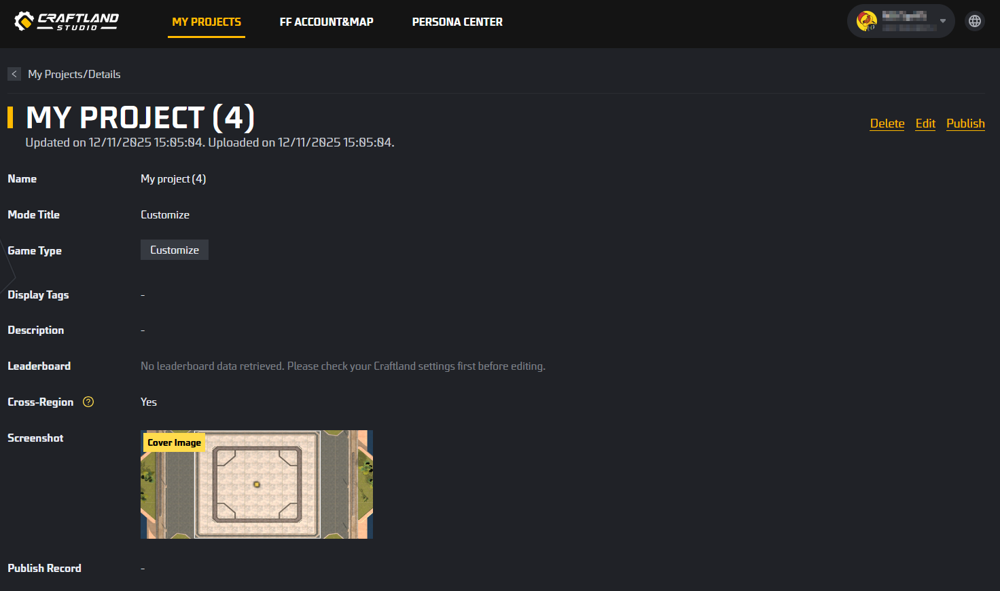

To further edit these map you can click on the `Edit` button at the top of the page to access the following configs.  
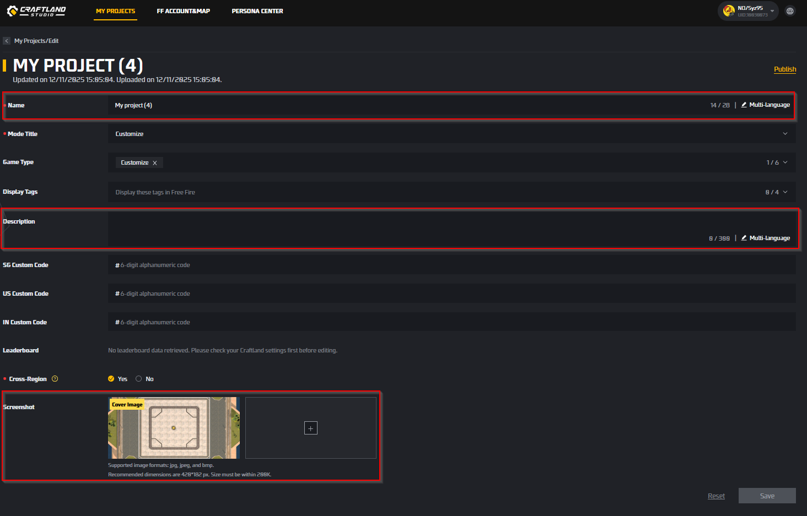. 
Through which, important aspects of the map can be adjusted including the map's name,  description and its screenshot. Of note, after editing these information, please remember to `Save` the information through the button at the bottom right of the page.  

To publish the map, click on the `Publish` option at the top right of the page. Then choose an empty map slot, then click the `Publish` option at the top right of the map.  
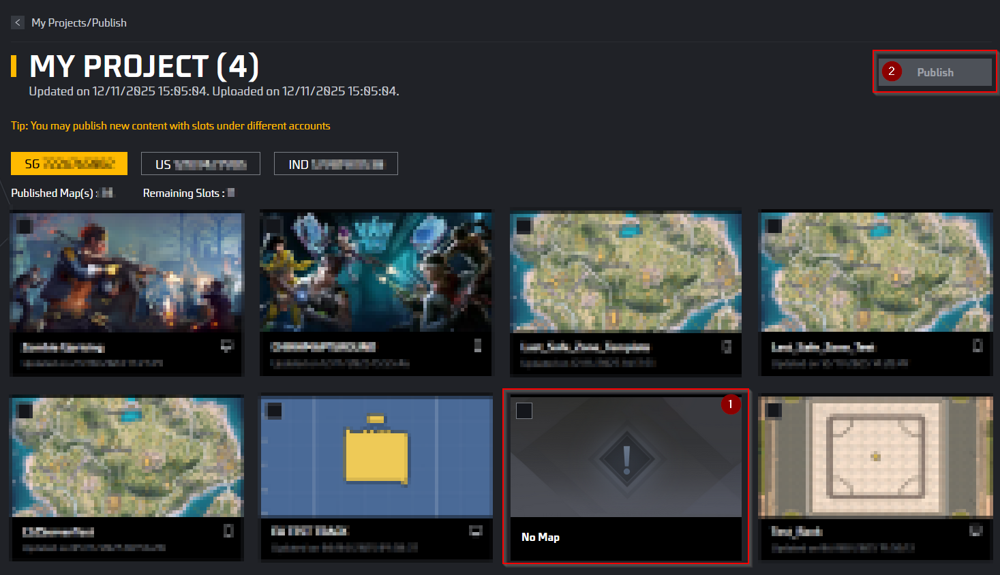

Please wait so that the map can be published successfully.  

Afterward, click on the `Detail` option in the Publish Record section to find the map's Map Code.  
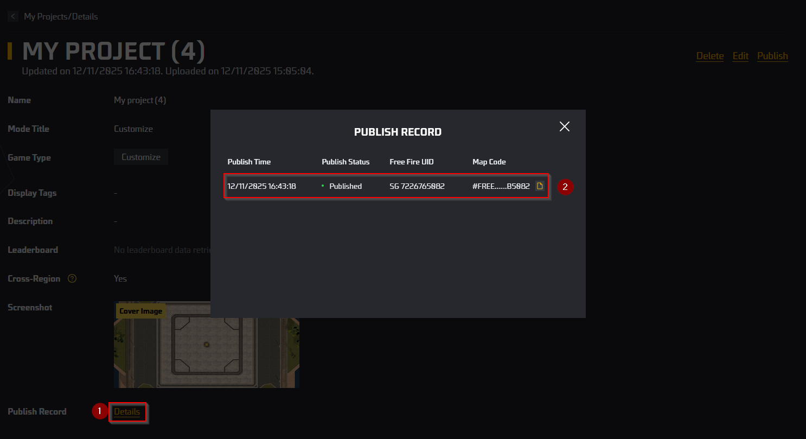

# Publishing to multiple servers
Before doing so, please check if you have a Free Fire account on each server. 
> After binding, the account currently cannot be changed. 
If this page does not show your account on other region, please click the bind option to connect to your Free Fire account on other region. 
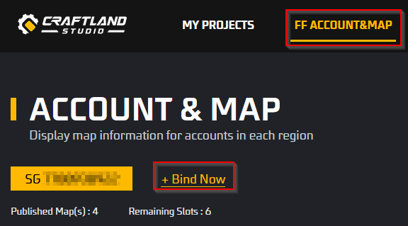

The final result of the process should look similar to this.  
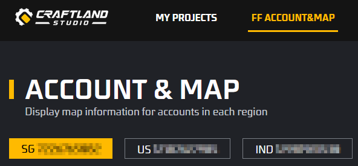

During the publishing process, simply choose the region that you would like to publish by clicking on the account UID. Then follow the steps similarly to the instruction above to publish your map.  
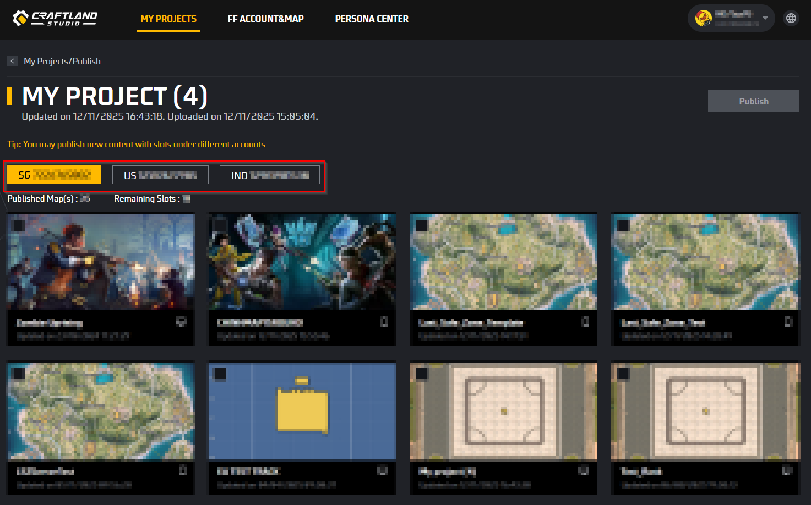
