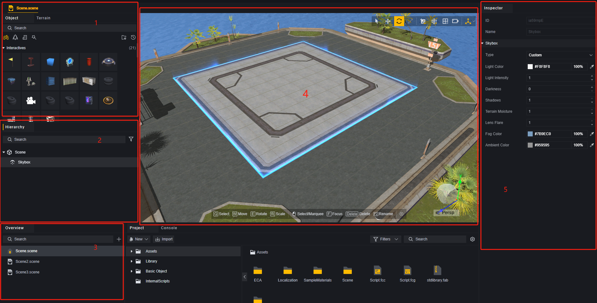
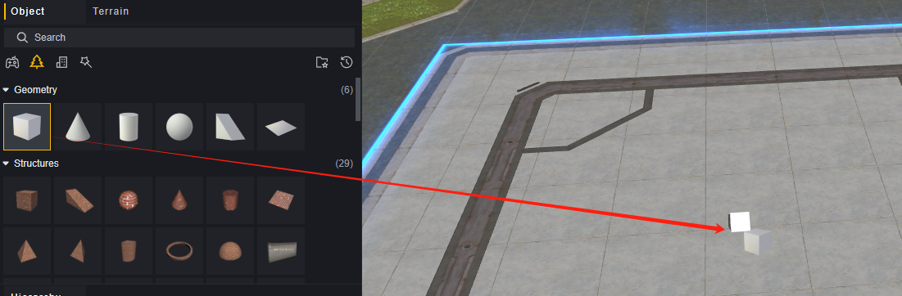
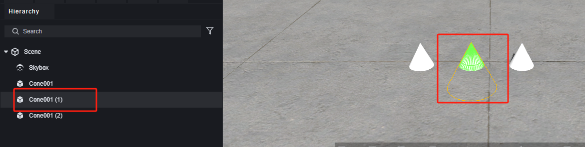
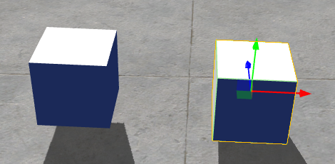
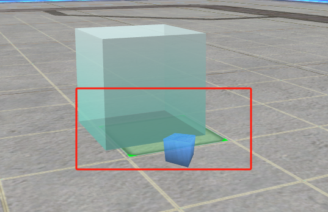
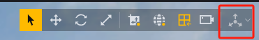
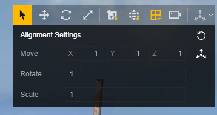
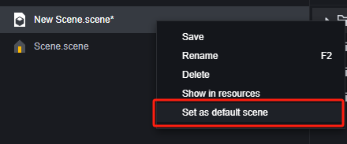

# Trình chỉnh sửa cảnh - Hướng dẫn sử dụng

Bài viết này sẽ cung cấp các tài liệu hướng dẫn liên quan đến trình chỉnh sửa cảnh.

## Tổng quan

1. Bộ chọn Đối tượng: Chọn đối tượng từ bộ chọn đối tượng để đặt vào cảnh.
2. Menu Hierarchy: Hiển thị tất cả các đối tượng có thể chỉnh sửa trong cảnh theo lớp.
3. Tổng quan: Hiển thị loại tệp đang chỉnh sửa hiện tại trong dự án. Trong ngữ cảnh này, nó hiển thị tất cả các tệp cảnh.
4. Trình chỉnh sửa cảnh: Bảng vẽ cho việc chỉnh sửa cảnh, điều chỉnh vị trí đối tượng, xem trước hiệu suất cảnh.
5. Menu Thuộc tính: Chỉnh sửa các thuộc tính cụ thể của đối tượng.

## Đặt Đối tượng

### Đặt Một Đối tượng

Kéo một đối tượng từ bộ chọn đối tượng vào cảnh để tạo một đối tượng tương ứng ở vị trí đã chỉ định:

Nhấp chuột phải vào một đối tượng để tạo một đối tượng trong cảnh. Các đối tượng được tạo theo cách này sẽ được đặt ở tọa độ thế giới (0,0,0).

### Đặt Đối tượng Liên tục

Nhấp vào một đối tượng trong bộ chọn đối tượng và sau đó di chuyển chuột vào trình chỉnh sửa cảnh.

Theo hướng dẫn dưới đây:

1. Nhấp một lần để đặt đối tượng ở vị trí hiện tại.
2. Kéo khi giữ nút chuột trái xuống sẽ liên tục tạo ra đối tượng. Chúng chỉ có thể được tạo theo các trục X và Z.

   

3. Sử dụng phím tắt ZXC để nhanh chóng xoay đối tượng theo ba trục. Mỗi lần xoay 90 độ.

   

4. Nhấp chuột phải để thoát khỏi chế độ đặt đối tượng hiện tại.

Nhấn Ctrl+D cho phép bạn nhân bản một đối tượng đã chọn với thông tin biến đổi giống nhau.

### Xóa Đối tượng

Chọn đối tượng muốn xóa trong cảnh hoặc menu hierarchy, sau đó sử dụng phím tắt Delete:

Hoặc bạn có thể nhấp chuột phải vào một đối tượng cụ thể trong menu hierarchy để xóa nó:

## Hoạt Động Camera

Các hoạt động camera cho phép bạn xem vị trí của các đối tượng trong cảnh.

1. Giữ nút giữa chuột cho phép bạn di chuyển camera trên mặt phẳng hiện tại.
2. Sử dụng bánh xe cuộn chuột cho phép bạn thu phóng vào và ra bằng camera.
3. Giữ nút chuột phải cho phép bạn di chuyển camera.
   1. Kéo với nút chuột phải nhấn giữ cho phép bạn xoay góc nhìn của camera.
   2. Giữ nút chuột phải và sử dụng các phím WASD cho phép bạn di chuyển camera.
   3. Giữ nút chuột phải và sử dụng các phím QE cho phép bạn nâng hoặc hạ camera.
   4. Giữ Shift khi di chuyển với nút chuột phải giúp gia tốc di chuyển camera.

> Hướng dẫn vĩnh viễn cho việc điều chỉnh camera khi giữ nút chuột phải.

Trong menu ở góc trên bên phải, bạn có thể điều chỉnh tốc độ di chuyển mặc định của camera:

## Điều Chỉnh Đối Tượng

### Chế Độ Điều Chỉnh

Sử dụng các phím tắt QWER hoặc chọn từ menu để nhập bốn chế độ điều chỉnh cho các đối tượng.

Q: Chọn - nhấp vào một đối tượng để chọn nó, kéo nó sẽ tự động đặt nó trên một mặt phẳng ngay dưới.

W: Di Chuyển - kéo theo một trục toạ độ di chuyển các đối tượng chỉ theo trục này. Kéo trên một mặt phẳng di chuyển các đối tượng chỉ trong mặt phẳng này.

E: Xoay - kéo theo một trục xoay các đối tượng chỉ theo hướng này.

R: Thay Đổi Kích Thước - kéo theo một trục toạ độ thay đổi kích thước của các đối tượng chỉ trên trục này.

Khi điều chỉnh các đối tượng, nếu đã chọn một cha hoặc nhiều cha, họ sẽ bị ảnh hưởng. Nếu đã chọn một con, cha của nó sẽ không bị ảnh hưởng.

### Biểu tượng Điều khiển Phụ trợ

Đặt hai khối trong cảnh để minh họa:

Trong cấu trúc, hợp nhất hai khối thành một đối tượng, với một bên trái là cha và một bên phải là con.

#### Trục/Pivot

Trong chế độ pivot, biểu tượng phụ trợ xuất hiện trên các đối tượng đã chọn.

Khi chọn nhiều đối tượng, biểu tượng phụ trợ xuất hiện trên đối tượng đầu tiên đã chọn.

Trong chế độ center, biểu tượng phụ trợ xuất hiện ở trung tâm của các đối tượng, tự động tính toán bởi chương trình cho nhiều đối tượng:

> Khi chọn một đối tượng cha

> Khi chọn một đối tượng con

### Đối tượng trò chơi / Không gian thế giới

Khi ở chế độ đối tượng trò chơi, trục tọa độ biểu tượng hỗ trợ là tọa độ cục bộ, sẽ thay đổi hướng theo vật phẩm trò chơi.

Khi ở chế độ không gian thế giới, trục tọa độ biểu tượng hỗ trợ luôn là trục tọa độ thế giới, không thay đổi hướng theo vật phẩm.

### Lưới

Lưới chỉ có hiệu lực đối với các vật phẩm do chính thức cung cấp, không có hiệu lực đối với mô hình thuần túy và tài nguyên nhập khẩu.

Khi bật lưới, di chuyển vật phẩm sẽ xuất hiện lưới trên mặt phẳng ngang hiện tại, vật phẩm sẽ tự động gắn vào trung tâm lưới màu xanh lá cây.

### Căn chỉnh

Sau khi bật tùy chọn căn chỉnh, bạn có thể cấu hình độ chi tiết của việc di chuyển, xoay, co giãn. Vật phẩm sẽ chỉ thay đổi theo tỷ lệ đã cấu hình.

**Di chuyển:** Bằng cách nhấn vào nút bên phải, bạn có thể bật hoặc tắt cấu hình theo trục, sau khi bật bạn có thể quy định khoảng cách di chuyển trên mỗi trục mỗi lần, nếu tắt sẽ di chuyển ở bất kỳ hướng nào. Đơn vị là mét. Cấu hình này chỉ có hiệu lực trong chế độ di chuyển, việc di chuyển nhanh trong chế độ đã chọn không bị ảnh hưởng.

**Xoay:** Góc xoay thay đổi mỗi lần.

**Co giãn:** Tỷ lệ thay đổi co giãn mỗi lần điều chỉnh.

### Điều chỉnh thuộc tính

Ngoài các tính năng đã nêu trên, trong menu thuộc tính, thành phần biến đổi ghi lại dữ liệu cụ thể về vị trí, xoay và co giãn của vật phẩm hiện tại. Bạn có thể điều chỉnh trực tiếp các thông số của thành phần này để điều chỉnh chính xác vị trí của vật phẩm.

## Quản lý tệp cảnh

Trong tổng quan, bạn có thể xem tất cả các tệp cảnh.

Tên của tệp cảnh sẽ là tên được sử dụng khi tham chiếu đến cảnh đó, không bao gồm phần mở rộng .scene.

Nhấp chuột phải vào cảnh không phải mặc định, bạn có thể thiết lập một cảnh làm cảnh mặc định, cảnh mặc định là cảnh được tải mặc định khi vào trò chơi, trò chơi luôn cần một cảnh mặc định.

