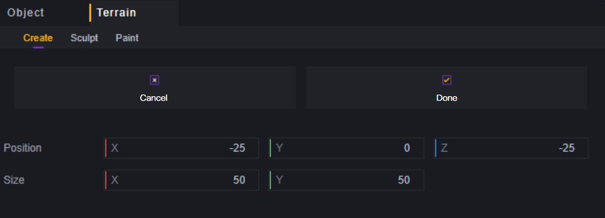
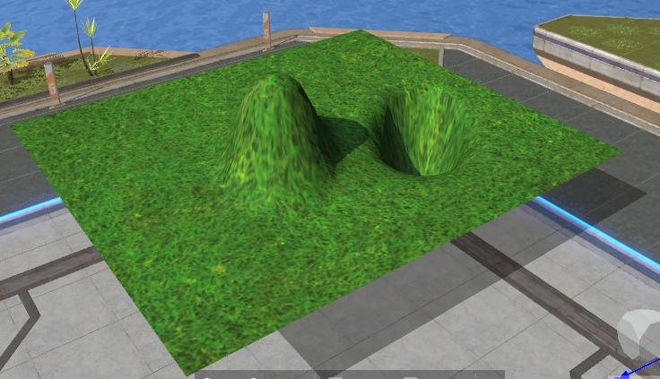

# Trình chỉnh sửa địa hình - Hướng dẫn sử dụng

Bài viết này sẽ cung cấp tài liệu tham khảo về hướng dẫn liên quan đến trình chỉnh sửa địa hình.

## Vật thể địa hình

Địa hình là một loại vật thể cảnh đặc biệt, có thể tạo ra một bề mặt tùy chỉnh. Địa hình là một mặt phẳng, có va chạm nhưng không có độ dày.

Nếu chọn đặt nổi, từ dưới lên trên sẽ không thấy địa hình, nhưng có thể thấy bóng của địa hình.

Là một vật thể cảnh, địa hình cũng có thể được chỉnh sửa trong giao diện cảnh, nhưng chỉ có thể thay đổi vị trí.

## Tạo và xóa địa hình

Trong menu chỉnh sửa địa hình, chọn Tạo mới để vào chế độ tạo trước:

Lúc này trong cảnh sẽ xuất hiện một bản xem trước địa hình màu xanh:

Có thể điều chỉnh tham số trong giao diện tạo trước hoặc kéo quả cầu xanh để điều chỉnh kích thước và vị trí của địa hình:

Vị trí của địa hình có thể thay đổi sau này, nhưng kích thước và tỷ lệ dài rộng không thể thay đổi sau khi đã xác định.

Chọn vùng địa hình, sử dụng phím tắt Delete hoặc trong menu cấp độ để xóa vùng địa hình đã chọn.

## Điêu khắc

Điêu khắc là việc thay đổi độ nhấp nhô của địa hình, có bốn tùy chọn điêu khắc:

Nâng cao, Hạ thấp, Làm mịn, Làm phẳng.

### **Nâng cao**

Địa hình mà cọ đi qua sẽ được nâng lên, nhấn giữ một điểm sẽ làm điểm đó tiếp tục nâng lên. Kích thước cọ ảnh hưởng đến phạm vi nâng cao mỗi lần nhấn hoặc kéo. Cường độ cọ quyết định tốc độ nâng cao của địa hình. Mỗi khu vực địa hình có giới hạn nâng cao nhất định, cường độ cọ chỉ ảnh hưởng đến tốc độ đạt đến chiều cao tối đa.

### **Hạ thấp**

Ngược lại với nâng cao, địa hình mà cọ đi qua sẽ hạ xuống. Tương tự, việc hạ thấp cũng có giới hạn. Kích thước cọ ảnh hưởng đến phạm vi tác động khi nhấn hoặc kéo, cường độ cọ ảnh hưởng đến tốc độ đạt đến độ sâu tối thiểu.

### **Làm mịn**

Làm cho chiều cao của khu vực bị ảnh hưởng bởi cọ tăng hoặc giảm đến giá trị trung bình của chiều cao xung quanh để đạt được hiệu ứng làm mịn. Kích thước cọ ảnh hưởng đến phạm vi tác động khi nhấn hoặc kéo, cường độ cọ ảnh hưởng đến tốc độ đạt được chiều cao mục tiêu.

> Vì khi di chuyển cọ sẽ ảnh hưởng đến chiều cao của địa hình nên những khu vực đã đạt được chiều cao mục tiêu làm mịn trước đó sẽ tạo ra chiều cao mục tiêu mới, do đó việc sử dụng làm mịn lặp đi lặp lại cuối cùng sẽ dẫn đến sự thay đổi tổng thể chiều cao mặt đất, giá trị là tổng của tất cả các phần nâng lên và hạ xuống.

### **Làm phẳng**

Làm phẳng sẽ làm cho địa hình bị ảnh hưởng bởi cọ trở thành chiều cao mục tiêu, mục tiêu làm phẳng chính là chiều cao mục tiêu. Kích thước cọ ảnh hưởng đến phạm vi tác động khi nhấn hoặc kéo. Ngoài ra, làm phẳng cung cấp ba chế độ:

Chế độ đầu tiên xử lý tất cả các địa hình, chế độ thứ hai chỉ xử lý những địa hình cao hơn chiều cao mục tiêu và chế độ thứ ba chỉ xử lý những địa hình thấp hơn chiều cao mục tiêu.

## Vẽ

Vẽ cung cấp hai cách chỉnh sửa: Cọ thực vật và kết cấu.

### Cọ thực vật

Đặt một số cây trang trí hoặc đá trên địa hình.

Kích thước cọ ảnh hưởng đến phạm vi tác động mỗi lần nhấn hoặc kéo đối với thảm cỏ và xóa.

Mật độ cọ ảnh hưởng đến số lượng thảm cỏ tạo ra mỗi lần nhấn và tốc độ tạo ra thảm cỏ khi kéo.

Đối với cây và đá, mỗi lần nhấn tạo ra một vật thể tương ứng và khi kéo sẽ tạo ra liên tục vật thể đó.

Khi sử dụng cọ giữ Ctrl để xóa cây đã chọn khỏi địa hình và giữ Shift để xóa tất cả các thực vật hoặc đá mà cọ chạm vào.

Cọ thực vật có giới hạn số lượng cho mỗi loại trang trí.

### Kết cấu

Kết cấu quyết định diện mạo của chính địa hình.

Thông qua các tùy chọn nhập khẩu, thay thế và xóa bỏ, có thể chỉnh sửa kết cấu dự phòng của địa hình.

Kích thước cọ ảnh hưởng đến phạm vi tác động khi nhấn hoặc kéo. Khi chọn toàn bộ phủ kín sẽ lấp đầy toàn bộ khu vực địa hình.

Sử dụng kết cấu mới sẽ ghi đè kết cấu cũ.

## Thiết lập thuộc tính địa hình

Địa hình có một số thuộc tính:

**Vị trí**: Vị trí tổng thể của địa hình.

**Tỷ lệ giảm mặt**: Có thể cải thiện hiệu suất bằng cách giảm số lượng mặt của địa hình, phạm vi từ 0.1 - 1, 1 đại diện cho không giảm mặt, 0.1 đại diện cho số mặt giảm xuống còn 1/10 mặc định.

**Tệp tin địa hình**: Mỗi khu vực địa hình sau khi chỉnh sửa sẽ tạo ra một tệp tin địa hình. Có thể thông qua việc chỉnh sửa tệp tin này để sử dụng trực tiếp các thiết lập của khu vực khác.

**Pixel kết cấu**: Pixel của mỗi loại kết cấu. Khi thay đổi giá trị theo bất kỳ trục nào thì trục còn lại cũng sẽ thay đổi theo. Giá trị càng lớn thì mật độ càng dày đặc. Ví dụ với kết cấu khăn trải bàn:

Trong trường hợp (1,1):

Trong trường hợp (3,3):

