# Giao Diện - Hướng Dẫn Sử Dụng

Giao diện luôn được hiển thị dưới dạng 2D ở phía trước cửa sổ trò chơi, cung cấp thông tin và nhận tương tác từ người chơi.

Bài viết này sẽ giới thiệu một số khái niệm liên quan, cách sử dụng trình chỉnh sửa UI cũng như cách viết logic UI thông qua script.

## Giới Thiệu Khái Niệm

### Tệp UI

Tệp UI lưu trữ thông tin về giao diện tùy chỉnh. Khi trò chơi chạy, tệp UI sẽ tạo ra các thực thể giao diện tương ứng.

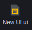

Bạn có thể tạo và chỉnh sửa tệp UI trong phần tài sản. Trong mỗi tệp UI, bạn có thể thêm nhiều thành phần UI khác nhau để cung cấp các chức năng như hiển thị văn bản, hiển thị hình ảnh, và nhận đầu vào.

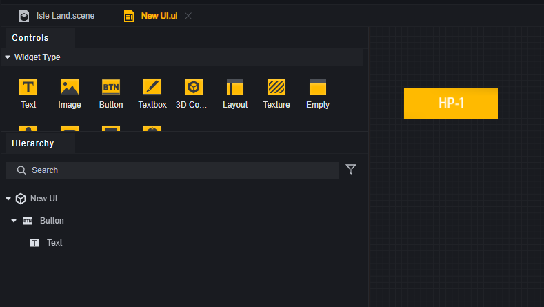

Một tệp UI có thể tạo ra nhiều thực thể giao diện tùy chỉnh, chẳng hạn như mỗi người chơi có thể tạo ra một nút từ cùng một tệp UI, hoặc trên giao diện của một người chơi, cùng một tệp UI có thể được sử dụng để tạo nhiều nút khác nhau. Những nút này thuộc về các thực thể UI khác nhau nhưng đều được tạo ra từ cùng một tệp UI.

### Thực Thể Giao Diện Tùy Chỉnh

Khi trò chơi chạy, thực thể giao diện tùy chỉnh sẽ được tạo ra từ tệp UI, được gọi tắt là thực thể UI trong bài viết này.

Thực thể UI có thể được gắn script và có thuộc tính riêng. Thực thể UI cũng chứa các thành phần UI, và bạn có thể truy cập các thành phần này thông qua thực thể UI.

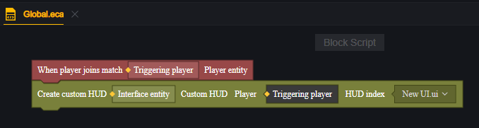

> Tạo Thực Thể UI

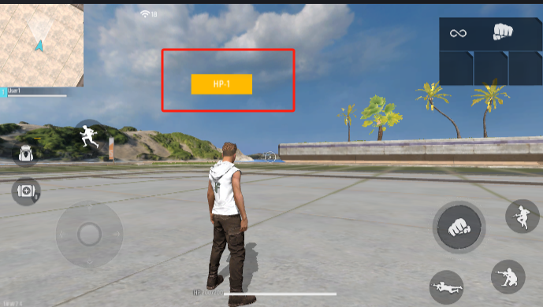

> Thực thể UI trên người chơi này chỉ chứa một thành phần nút.

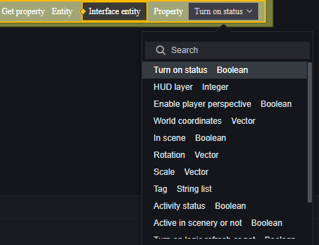

> Một số thuộc tính của Thực thể UI

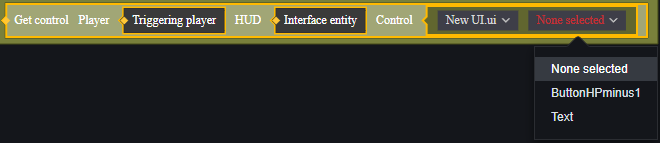

> Các thành phần của Thực thể UI

Tên tệp UI chính là ID của thực thể giao diện tùy chỉnh. ID này là một chỉ số, và chỉ số khác với khái niệm về thực thể.

### Thành Phần

Thành phần là đơn vị cơ bản của UI và là yếu tố thực sự mang lại chức năng. Trong tệp UI, bạn có thể chọn sử dụng thành phần nào và cấu hình các thuộc tính của từng thành phần.

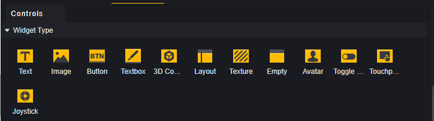

Mọi tệp UI đều có một nút gốc. Các thành phần UI đều có nút gốc hoặc các thành phần UI khác làm cha. Nút gốc này tương ứng với thực thể UI được tạo từ tệp UI và chỉ có vai trò cấu trúc, không cung cấp chức năng thực tế nào.

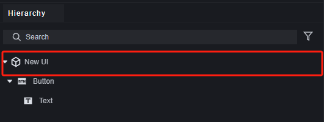

Trong script, bạn có thể truy cập tất cả các thành phần từ một thực thể giao diện tùy chỉnh và đọc, viết thuộc tính của chúng.

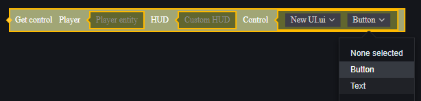

> Script này cho thấy UI được tạo ra từ tệp UI nhưng có thể tạo ra nhiều thực thể, cần xác định thực thể nào của người chơi nào có chứa thành phần cần truy cập.

### Bảng

Bảng là nơi chứa các thành phần.

Bản thân bảng cũng có một số hiệu ứng hình ảnh và tác động đến thứ tự hiển thị. Các thành phần trong cùng một bảng sẽ bị ảnh hưởng bởi thứ tự hiển thị của bảng.

Ngoài bảng cơ bản, chúng tôi còn cung cấp bảng cuộn để hiển thị nhiều thành phần trong một vùng cố định.

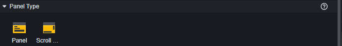

### UI Tích Hợp

UI tích hợp là giao diện đã được phát triển bởi nhà phát hành, một số được tải mặc định như cần điều khiển di chuyển, nút nhảy; một số khác thì không được tải mặc định như bộ đếm thời gian, la bàn.

UI tích hợp không thể thay đổi các thành phần bên trong, nhưng có thể chỉnh sửa các thuộc tính của thực thể UI tích hợp.

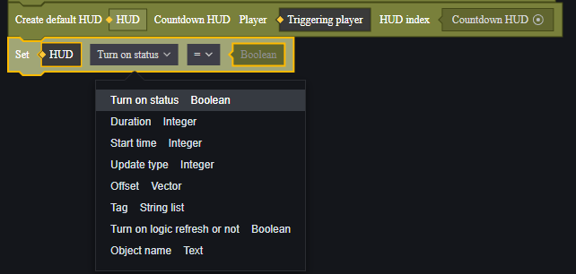

### Thứ Tự Lớp UI

Khi các giao diện khác nhau chồng chéo nhau, khái niệm thứ tự lớp UI sẽ được áp dụng.

Thứ tự lớp UI quyết định thứ tự vẽ của UI tùy chỉnh này. Nếu có xung đột với thứ tự vẽ khác, có thể dẫn đến sự lộn xộn trong thứ tự hiển thị. Thứ tự vẽ của các thành phần UI trong giao diện tùy chỉnh được tự động thiết lập dựa trên thuộc tính này. Khuyến cáo nên dành khoảng cách hợp lý cho thứ tự vẽ của các UI tùy chỉnh có thể chồng chéo nhau.

Nếu cố gắng thao tác trên một vùng chồng chéo, hệ thống sẽ luôn cố gắng thao tác trên thành phần hiển thị trên cùng.

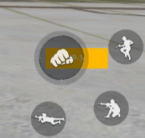

> Khi nhấn vào phần trùng lặp giữa nút tấn công và nút tùy chỉnh, chỉ có nút tấn công sẽ được kích hoạt. Khi nhấn vào phần không trùng lặp của nút tùy chỉnh, nút tùy chỉnh sẽ được kích hoạt.

Thứ tự lớp của UI tùy chỉnh bao gồm thứ tự lớp UIRoot, thứ tự lớp bảng và thứ tự lớp thành phần.

Trong đó:

**Thứ tự lớp UIRoot** có ảnh hưởng lớn nhất. Các thực thể UI được tạo từ các tệp UI khác nhau sẽ được sắp xếp theo thứ tự lớp UIRoot. UIRoot có thứ tự lớp càng cao thì thực thể UI được tạo ra sẽ hiển thị ở vị trí càng trên.

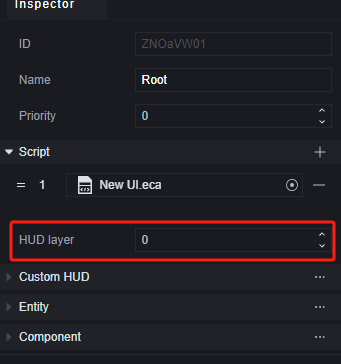

> Nếu UIRoot có cùng thứ tự lớp, có thể xảy ra sự không đồng nhất giữa thao tác và hiển thị. Không nên đặt hai UI có thể chồng chéo ở cùng một thứ tự lớp.

> Lúc này, nút tùy chỉnh có thứ tự lớp UIRoot là -1, nhỏ hơn thứ tự lớp 0 của nút tấn công mặc định.
> Tất cả các UI tích hợp có thứ tự lớp Root là 0, nếu cần đặt dưới UI tích hợp, hãy thiết lập thứ tự lớp thành số âm.

**Thứ tự lớp bảng** có ảnh hưởng kế tiếp, nó ảnh hưởng đến thứ tự hiển thị bên trong một tệp UI. Thứ tự lớp bảng tuân theo các quy tắc sau:

1. Bảng và các thành phần trong bảng luôn hiển thị trên các thành phần cùng lớp.
2. Các bảng cùng lớp sẽ được sắp xếp theo thứ tự trong menu Hierachy, bảng nào nằm dưới sẽ có lớp cao hơn và hiển thị ở phía trên.

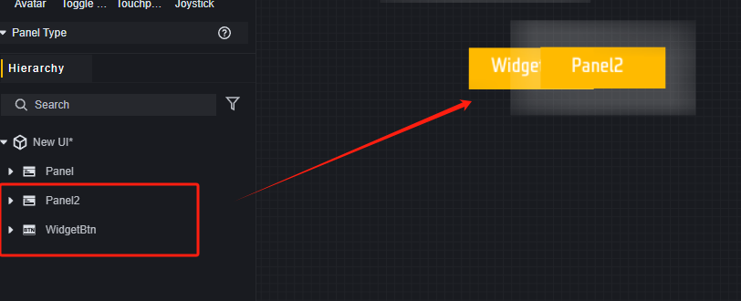

> Các thành phần trong bảng sẽ bị bảng che khuất.

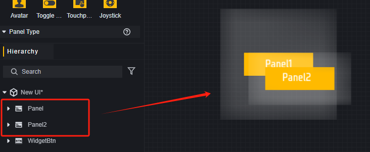

> Hai bảng cùng lớp, bảng dưới sẽ che khuất bảng trên.

Thứ tự lớp bảng là ẩn và không thể thiết lập trực tiếp, chỉ có thể điều chỉnh thứ tự hiển thị của bảng thông qua việc thay đổi thứ tự trong menu lớp.

**Thứ tự lớp thành phần**

Đối với các thành phần trong cùng một UIRoot, cùng một bảng, thứ tự lớp của chúng sẽ được xác định theo thứ tự trong menu Hierachy, thành phần nằm dưới sẽ có lớp cao hơn.

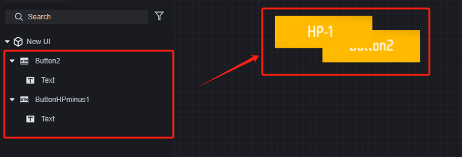

Thứ tự lớp thành phần cũng là ẩn và không thể thiết lập trực tiếp, chỉ có thể điều chỉnh thứ tự hiển thị của thành phần thông qua việc thay đổi thứ tự trong menu lớp.

## Giao Diện Tùy Chỉnh

### Chỉnh Sửa Giao Diện

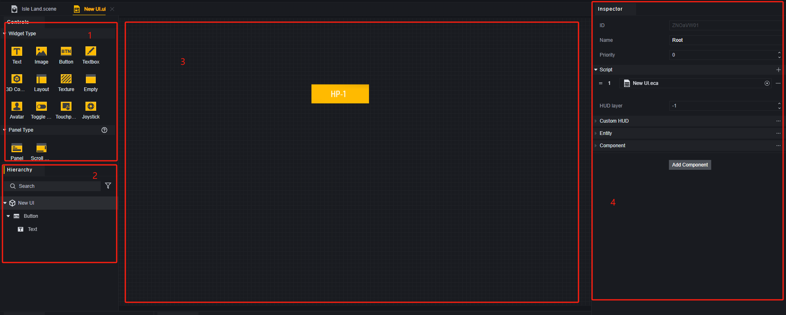

1. **Thành phần/Bảng**: Đây là nơi chứa các mẫu thành phần và bảng.
2. **Menu Lớp**: Trong menu lớp, bạn có thể xem các thành phần trong tệp UI. Bạn cũng có thể xác nhận thứ tự lớp của các thành phần, thành phần nào nằm dưới sẽ hiển thị ở trên cùng.
3. **Canvas**: Trên Canvas, bạn có thể điều chỉnh vị trí, kích thước của các thành phần để đạt được hiệu quả mong muốn.
4. **Menu Thuộc Tính**: Trong menu thuộc tính, bạn có thể chỉnh sửa các thuộc tính của thành phần.

### Sử Dụng Thành Phần

Kéo thành phần từ bảng chọn thành phần vào Canvas để tạo thành phần tại vị trí tương ứng. Thành phần được kéo vào Canvas sẽ mặc định có nút gốc làm cha.

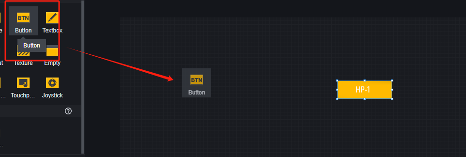

Kéo thành phần từ bảng chọn thành phần vào một thành phần hoặc nút gốc bất kỳ trong menu lớp, thành phần mới sẽ có thành phần hoặc nút gốc đó làm cha. Vị trí tạo thành phần sẽ giống với cha của nó, nếu cha là nút gốc thì thành phần sẽ xuất hiện ở trung tâm Canvas.

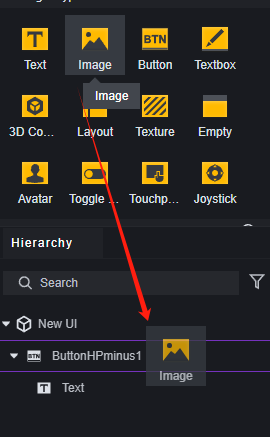

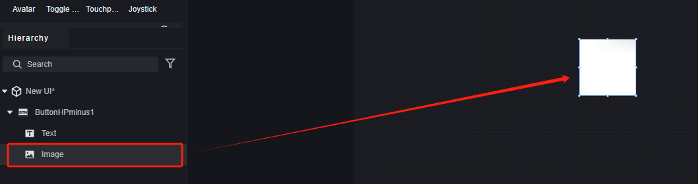

> Vì hình ảnh mới thêm có thứ tự lớp cao nhất trong UI này, nên nó đã che phủ nút trước đó.

### Chỉnh Sửa Thành Phần

Trong bảng thuộc tính, chỉnh sửa các thuộc tính của thành phần đã chọn. Mỗi thành phần có thuộc tính chung và các thuộc tính riêng biệt, liên quan đến loại thành phần.

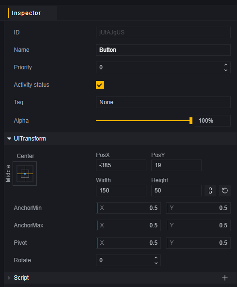

> Thuộc tính chung

Thành phần UI sẽ điều chỉnh kích thước và vị trí dựa trên thông số neo và kích thước của cha nó. Đối với các thành phần UI không có cha, chúng sẽ thích ứng với tỷ lệ khung hình của thiết bị người dùng, giúp đạt được hiệu quả tương thích độ phân giải.

Trong hầu hết các trường hợp đơn giản, bạn có thể sử dụng các cài đặt neo sẵn mà không cần phải điều chỉnh thông số neo thủ công.

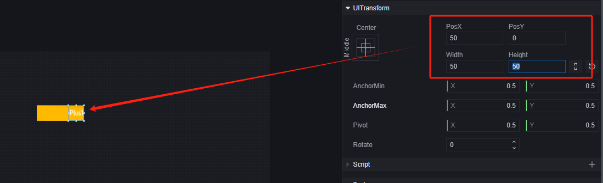

> Chỉnh sửa thuộc tính UITransform của thành phần văn bản, nó sẽ di chuyển theo cha của nó là nút tùy chỉnh.

Đối với mỗi loại thành phần, chúng cũng có các thuộc tính đặc biệt riêng.

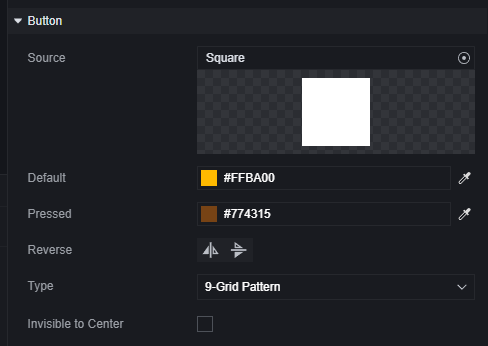

> Thuộc tính riêng của nút.

## Script

### Phân Biệt Máy Chủ Và Máy Khách

#### Tạo

Tương tự như script, UI cũng cần phân biệt giữa máy chủ và máy khách. UI máy chủ được tạo bởi API máy chủ và sử dụng các sự kiện và API nội bộ của máy chủ. UI máy khách tương tự. Vì chúng tôi đã hạn chế các script đồ họa có thể sử dụng trên nền tảng hoạt động, nên các UI được tạo bởi script đồ họa máy chủ là UI máy chủ; các UI được tạo bởi script đồ họa máy khách là UI máy khách. Khi sử dụng script code, cần xác nhận thông tin nền tảng của API sử dụng và phù hợp với nền tảng hoạt động của script code.

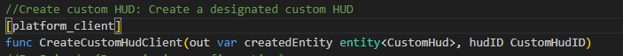

#### Gắn Script

Script có thể được gắn vào thực thể UI, và chúng tôi khuyến khích chỉ gắn script máy chủ vào UI máy chủ, và chỉ gắn script máy khách vào UI máy khách.

> Các sự kiện máy chủ trong script gắn vào UI máy khách sẽ không kích hoạt. Không khuyến khích sử dụng script đa nền tảng.

### Tạo UI

Chỉ có thể tạo UI tương ứng với nền tảng hoạt động thông qua API trong script.

Ví dụ với script đồ họa:

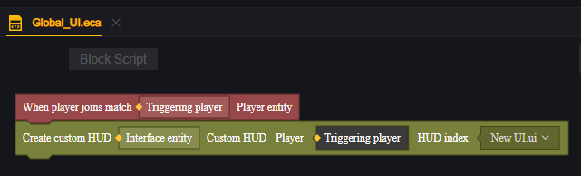

Chúng tôi khuyến khích thêm một script riêng để quản lý UI vào mô-đun Global.

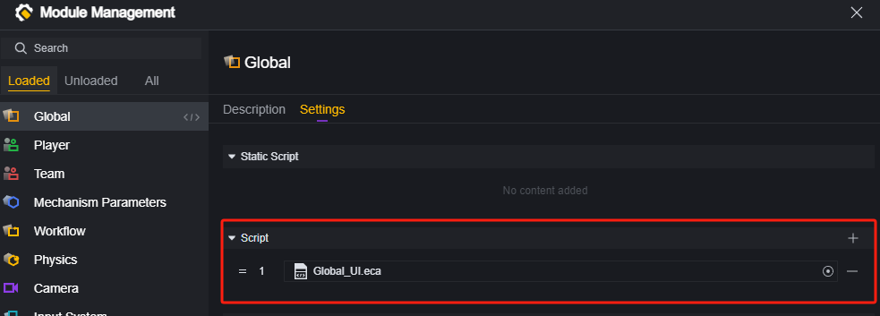

Khi tạo UI bằng API máy chủ, cần xác định người chơi. Do đó, việc sử dụng từ điển để quản lý UI trên người chơi rất tiện lợi:

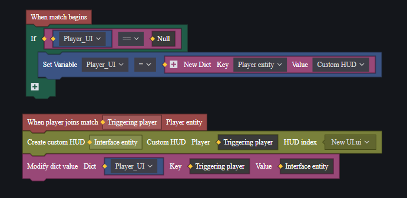

Khi cần chỉnh sửa UI trên người chơi tương ứng, việc sử dụng từ điển có thể nhanh chóng lấy được thực thể UI:

### Logic Thành Phần

Người chơi có thể thực hiện đầu vào thông qua nút, cần điều khiển, phím chuyển đổi,... Sử dụng sự kiện tương ứng để nhận đầu vào từ người chơi và thực hiện logic đã thiết kế.

Giả sử chúng ta có một nút và một văn bản, mỗi lần nhấn nút sẽ tăng số trên văn bản lên 1.

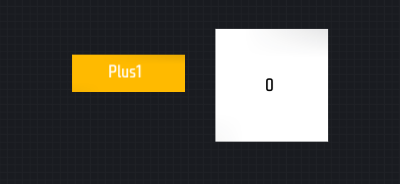

Khi nút này được nhấn, cần thay đổi văn bản trên một thành phần văn bản khác, do đó cần lấy thành phần văn bản từ thực thể UI tương ứng. Sử dụng từ điển, khi tạo UI, hãy lưu trữ thực thể UI vào một biến toàn cục:

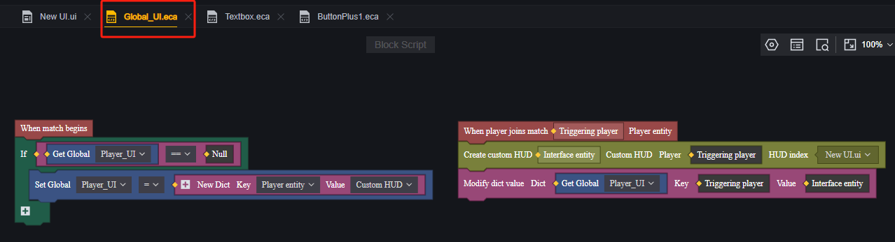

> Đây là script trong mô-đun Global để tạo UI.

Thêm script vào nút:

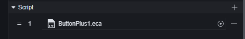

Lấy thành phần văn bản từ thực thể UI đã lưu trữ trong biến toàn cục:

Khi nút được nhấn, đặt giá trị hiển thị của thành phần này tăng thêm 1:

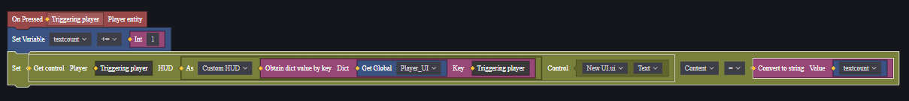

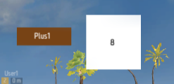

> Đã nhấn nút tám lần.

### Callback

Trong ví dụ trên, không khó để thấy rằng việc chỉnh sửa văn bản không phức tạp, nhưng việc lấy thực thể chứa thành phần văn bản khá phức tạp.

Sử dụng callback, có thể tránh được sự phức tạp này và nhanh chóng thực hiện tương tác giữa các thành phần khác nhau trong cùng một thực thể UI.

Thực tế, trong hầu hết các trường hợp, sử dụng callback sẽ nhanh hơn.

Trong cùng ví dụ, tạo một script cho thực thể UI:

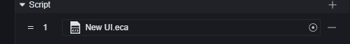

Tạo một hàm callback cho nút, logic của nó là mỗi khi được gọi, số trên thành phần văn bản sẽ tăng lên 1:

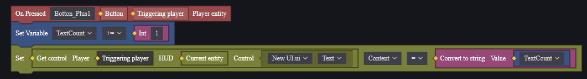

> Các hàm callback của UI có các nút đặc biệt, nằm trong mục sự kiện.

Thêm callback vào nút:

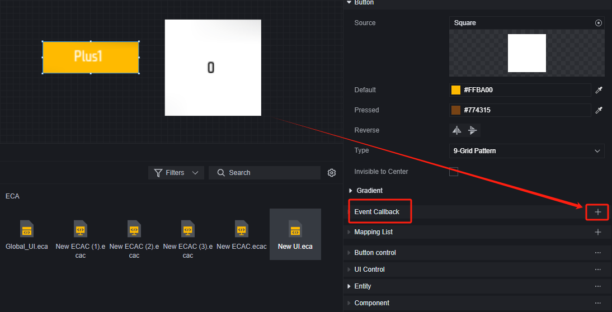

Chọn hàm callback vừa tạo:

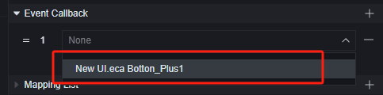

Vậy là đã hoàn thành:

> Đã nhấn nút sáu lần.

Vì hàm callback nằm trên thực thể UI, nên việc truy cập các thành phần trong thực thể UI sẽ dễ dàng hơn nhiều so với khi nó nằm trên thành phần. Khi có nhiều thành phần và logic trong thực thể UI, việc duy trì cũng dễ dàng hơn.

### Khuyến Nghị

Đối với UI máy chủ, việc thao tác UI với tần suất cao có thể gây ra lượng lưu lượng lớn, nếu UI của bạn trở nên kém nhạy, bạn có thể thử giới hạn tần suất đồng bộ thông tin. Ví dụ, sử dụng một thanh tiến độ để hiển thị điểm kinh nghiệm của người chơi, khi người chơi nhận được điểm kinh nghiệm với tần suất cao, có thể gây ra lượng lưu lượng lớn. Khuyến nghị tách biệt dữ liệu điểm kinh nghiệm và hiển thị UI, đồng bộ dữ liệu và hiển thị sau một khoảng thời gian nhất định (kỹ thuật này cũng có thể được áp dụng ở những nơi khác).

Ngoài ra, việc tạo và hủy UI với tần suất cao sẽ gây ra tải trọng lớn về hiệu năng và lưu lượng. Nếu cần hiển thị và ẩn UI tạm thời, hãy xem xét thay đổi thuộc tính hiển thị của UI thay vì tạo và hủy liên tục. Điều này sẽ thân thiện hơn với máy chủ và thiết bị có hiệu suất thấp.

## Ví Dụ

Dưới đây là một ví dụ đơn giản về giao diện tùy chỉnh, minh họa cách tạo và hủy giao diện tùy chỉnh có chức năng.

Giả sử yêu cầu: tạo một nút ở trung tâm màn hình của mỗi người chơi, mỗi lần nhấn nút sẽ giảm HP -10, khi HP nhỏ hơn hoặc bằng 100 sau khi nhấn nút, sẽ hủy nút đó.

### Tạo UI

Tạo một tệp UI mới và mở để chỉnh sửa.

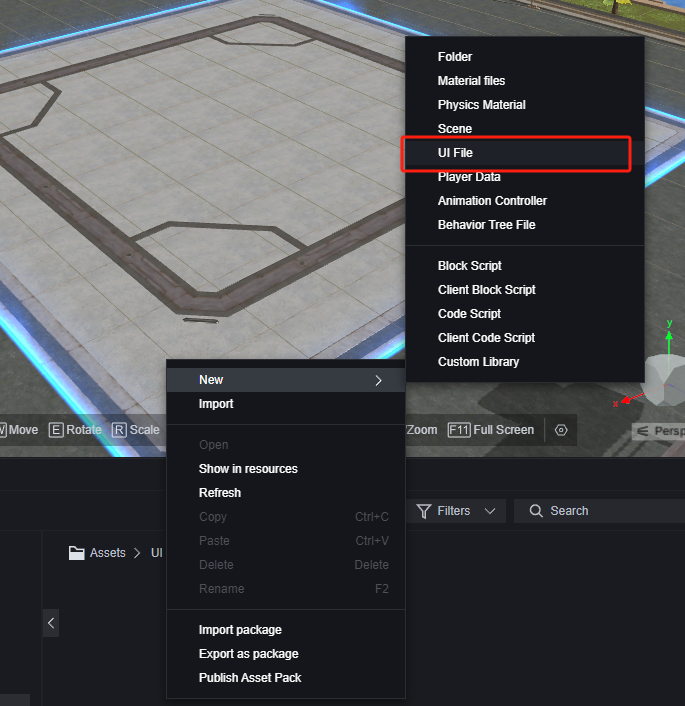

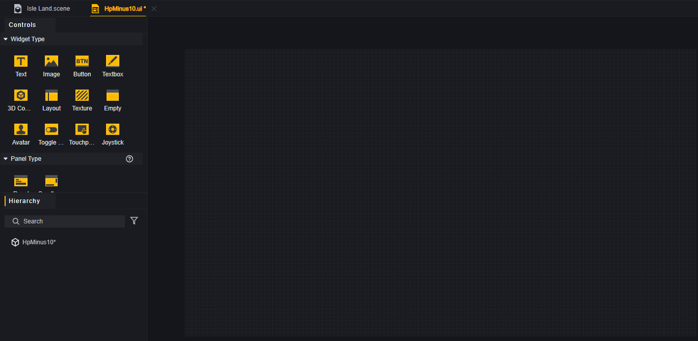

Canvas tương ứng với màn hình người chơi, tạo một nút ở vị trí trung tâm trên. Đồng thời, thêm một thành phần văn bản vào nút như một thành phần con để giải thích chức năng của nút cho người chơi.

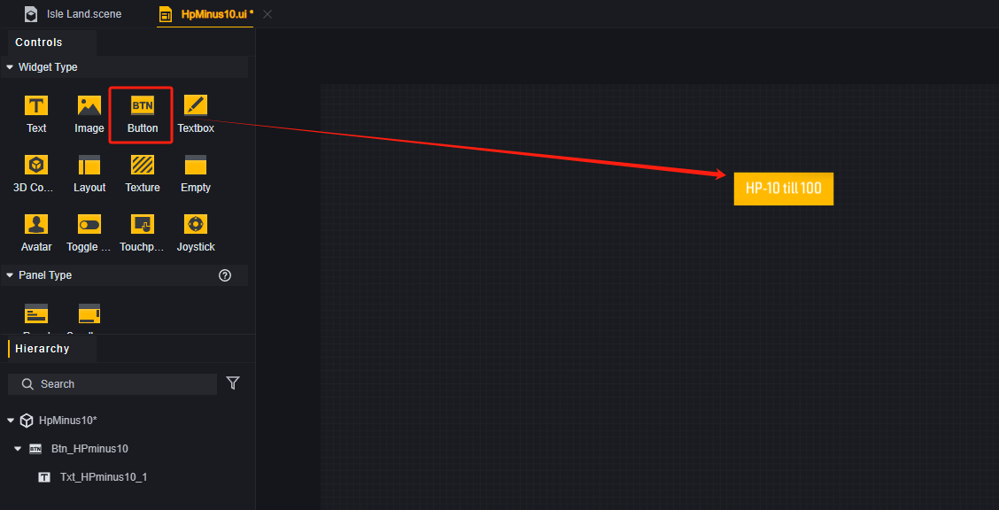

Để dễ quản lý, có thể đổi tên các thành phần trong menu lớp.

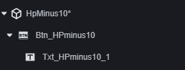

### Logic Nút

Chúng tôi quyết định sử dụng callback để xử lý việc giảm máu của người chơi, gắn một script vào nút gốc.

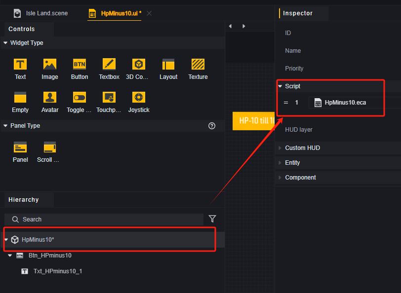

Viết logic cho script gốc.

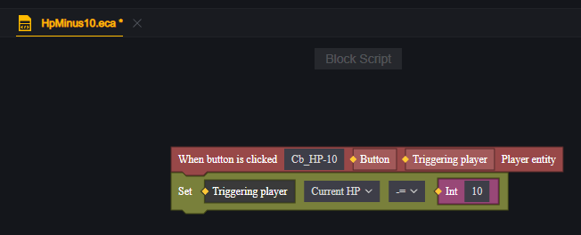

> Tạo một hàm callback cho nút bấm có tên Cb_HP-10

Quay lại chỉnh sửa tệp UI, chọn thành phần nút và thêm callback.

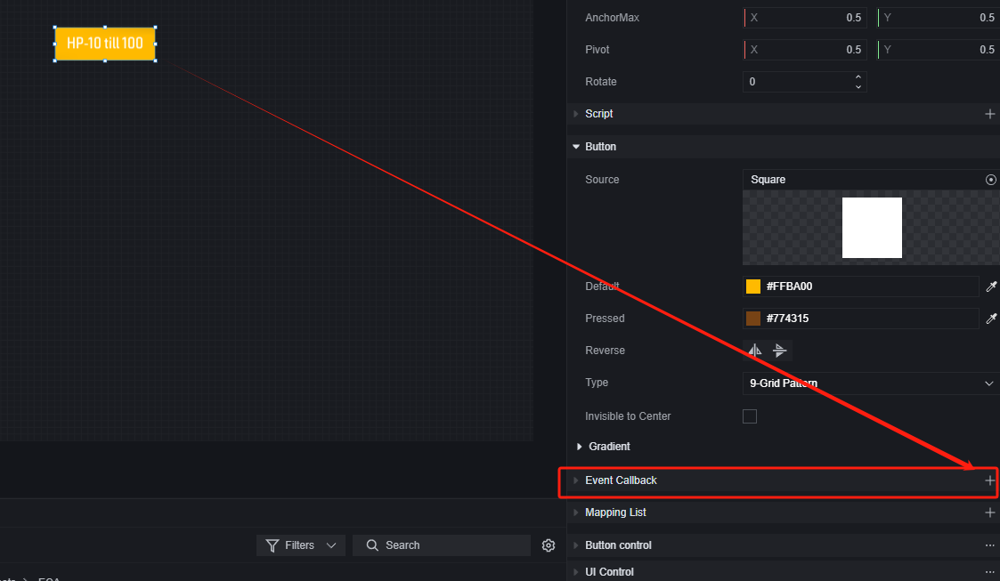

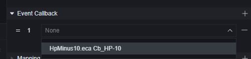

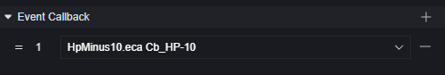

### Script Quản Lý UI Toàn Cầu

Việc chỉnh sửa tệp UI đã hoàn tất, giờ cần chỉnh sửa điều kiện tạo và hủy tệp UI này. Trong mô-đun Global, tạo một script để quản lý UI. Vì liên quan đến máu, nên chọn sử dụng script máy chủ.

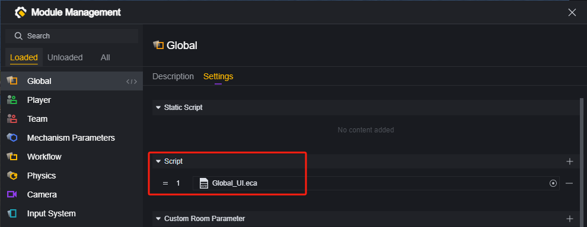

Khi mỗi người chơi tham gia, tạo UI này cho họ.

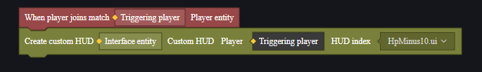

> Bạn cũng có thể chọn thời điểm tạo khác, chẳng hạn như khi bắt đầu trò chơi, hoặc khi bắt đầu một giai đoạn. Chọn thời điểm người chơi tham gia chỉ là cách dễ dàng hơn để lấy thực thể người chơi.

Tạo từ điển để quản lý nút giảm máu của mỗi người chơi.

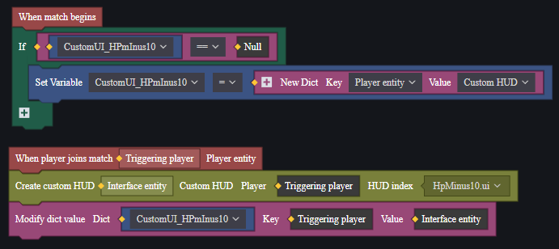

Điều kiện hủy là khi nhấn nút, vì vậy trong quản lý UI toàn cầu cần tạo một hàm để hủy UI, được kích hoạt bởi nút thông qua callback.

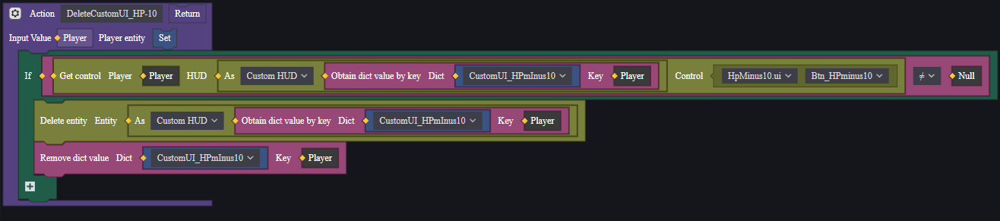

> 1. Đặt người chơi làm tham số đầu vào.
> 2. Xác nhận xem UI tùy chỉnh của người chơi đã bị xóa hay chưa bằng cách kiểm tra thành phần đặc biệt.
> 3. Nếu chưa bị xóa, thì xóa UI tùy chỉnh.
> 4. Đồng thời xóa thực thể UI tùy chỉnh đã lưu trong từ điển.

### Thêm Logic Hủy UI

Quay lại chỉnh sửa script gốc của UI, thêm điều kiện hủy, khi thỏa mãn sẽ kích hoạt hàm hủy UI tùy chỉnh từ bên ngoài.

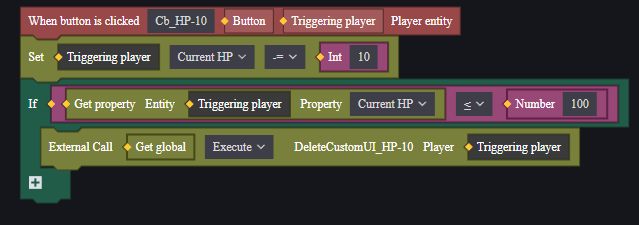

### Thử Nghiệm

