# Chiến Đấu - Hướng Dẫn Người Dùng

Hệ thống chiến đấu là một phần quan trọng trong game.

Mặc định, người chơi, AI zombie và tháp phòng thủ là các thực thể có thể chiến đấu, tự nhiên có các thuộc tính như máu, khả năng gây sát thương.

Mục tiêu chiến đấu tùy chỉnh phụ thuộc vào các thực thể có thể nhắm mục tiêu và liên quan chặt chẽ đến hỗ trợ ngắm bắn, khả năng tấn công.

Sử dụng linh hoạt hệ thống chiến đấu, bạn có thể tạo ra một trận chiến tùy chỉnh, thậm chí vượt qua giới hạn của game bắn súng. Tuy nhiên, sử dụng vũ khí gốc của FF để chiến đấu là hỗ trợ toàn diện nhất. Nếu bạn muốn tạo một trận chiến không sử dụng vũ khí (như kiếm và phép thuật), có thể cần nhiều công sức và tài nguyên hơn. Vì vậy, bài viết này chủ yếu giới thiệu hệ thống chiến đấu sử dụng vũ khí do chính thức cung cấp, nhưng có lẽ bạn sẽ nhận được nhiều cảm hứng hơn.

Trong bài viết này, sẽ lần lượt giới thiệu các nội dung sau:

1. Thực thể có thể chiến đấu
2. Thực thể chiến đấu tùy chỉnh
3. Cách tạo thực thể chiến đấu
4. Cách tạo một ví dụ về trận chiến
5. Mở rộng: Tự chế mục tiêu và súng bắn đạn AOE

## Thực Thể Có Thể Chiến Đấu

Thực thể có thể chiến đấu là những thực thể mặc định tham gia vào trận chiến, hiện tại chỉ có người chơi, AI zombie và tháp phòng thủ là các thực thể có thể chiến đấu.

Có thể sử dụng các sự kiện và giao diện liên quan đến chiến đấu, nhưng không hỗ trợ thêm tùy chỉnh cho thành phần thực thể có thể chiến đấu.

Thực thể có thể chiến đấu đều có khả năng gây sát thương và đều có thuộc tính máu; khi máu về 0 thì sẽ chết hoặc bị phá hủy.

### Script

Thực thể có thể chiến đấu có thể sử dụng một số sự kiện và giao diện phụ thuộc vào chính nó.

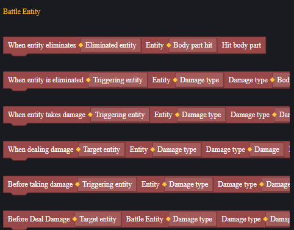

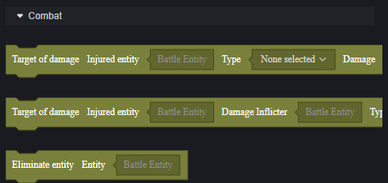

Người chơi, AI zombie và tháp phòng thủ cũng có thể sử dụng các sự kiện và giao diện của các thành phần thực thể khác mà chúng sở hữu.

Sử dụng linh hoạt nội dung script này, bạn có thể tùy chỉnh và mở rộng nội dung chiến đấu của FF ở mức độ nhất định.

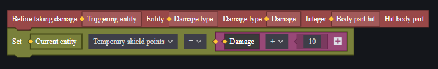

> Mỗi lần nhận sát thương sẽ thêm một khiên tạm thời cho bản thân, lượng sát thương là giá trị trước khi tăng giảm sát thương nên không hoàn toàn chặn được sát thương từ headshot.

### Vũ Khí và Đạo Cụ

Chiến đấu không thể thiếu vũ khí và đạo cụ; phần lớn sát thương người chơi gây ra đều phụ thuộc vào vũ khí và đạo cụ.

Trong trận chiến, chỉ người chơi mới có thể trực tiếp sử dụng vũ khí và đạo cụ.

#### Phát Vũ Khí và Đạo Cụ

Có thể phát vũ khí và đạo cụ cho người chơi thông qua script; mỗi người chơi mặc định mang theo hai vũ khí chính, một vũ khí phụ, một vũ khí cận chiến và một số đạo cụ.

Đạo cụ vượt quá giới hạn mang theo sẽ rơi tại vị trí của người chơi khi phát.

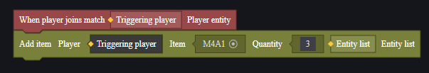

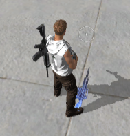

Ngoài ra, có thể sử dụng vật phẩm trong màn chơi để đặt vũ khí và đạo cụ hoặc máy phát của chúng trên sân. Cũng có thể bán vũ khí hoặc đạo cụ cho người chơi thông qua cửa hàng. Cách phát đạo cụ cho người chơi phụ thuộc vào nhu cầu thiết kế game.

#### Cấu Hình Thuộc Tính

Đối với vũ khí và đạo cụ đặt trong cảnh thông qua máy phát hoặc vật phẩm trong màn chơi, có thể cấu hình bảng thuộc tính trước khi bắt đầu game.

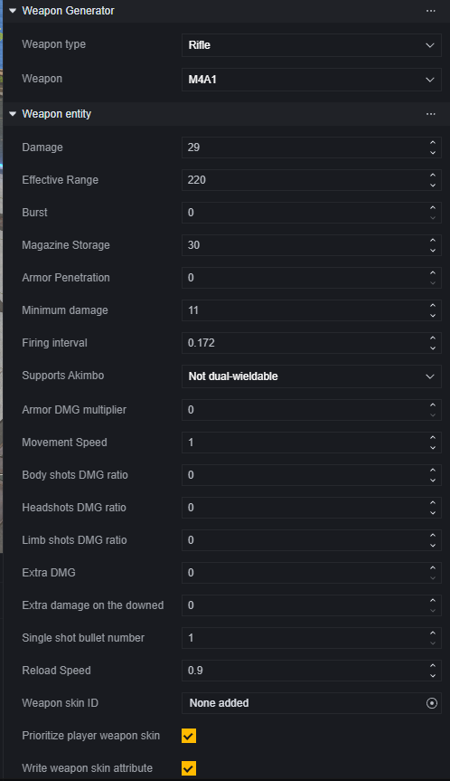

> Đơn vị vũ khí và cấu hình của nó

Đối với nhu cầu điều chỉnh thuộc tính vũ khí và đạo cụ sau khi game chạy, có thể thực hiện bằng cách đặt thuộc tính thông qua script.

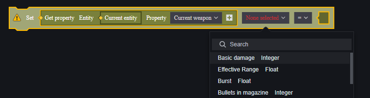

> Chỉnh sửa thuộc tính vũ khí chính của người chơi

Khi cố gắng chỉnh sửa thuộc tính vũ khí thông qua script, cần chú ý cách lấy đúng mục tiêu vũ khí.

Bản thân vũ khí cũng hỗ trợ một số sự kiện script:

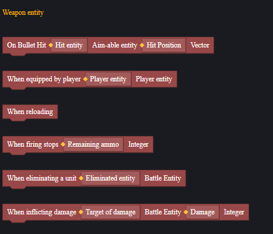

Khi sử dụng các sự kiện này, script cần được gắn vào thực thể vũ khí. Trong ví dụ về đạn nổ dưới đây sẽ có hướng dẫn thực tế.

### Người Chơi

Đối với người chơi trong trận chiến, mô đun người chơi cung cấp các cấu hình sau:

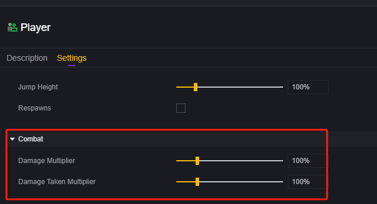

Điều này quyết định tỷ lệ gây sát thương và nhận sát thương của người chơi.

Ngoài cấu hình chiến đấu, cấu hình thuộc tính cơ bản của người chơi cũng ảnh hưởng đến trận chiến như máu, năng lượng, tốc độ di chuyển, khả năng hồi sinh.

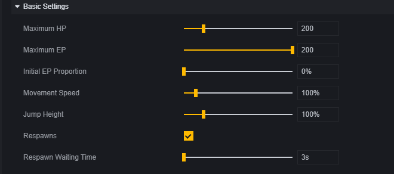

Tương tự, trong quá trình game chạy cũng có thể chỉnh sửa thuộc tính của người chơi bằng cách đặt thuộc tính.

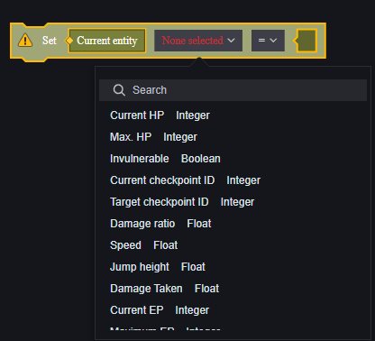

Cũng có thể sử dụng các sự kiện chuyên dùng cho chiến đấu để nhận tín hiệu kích hoạt từ người chơi tham gia trận chiến hoặc thực hiện hành động gây sát thương lên người chơi.

> Cách đặt thuộc tính để chỉnh sửa máu khác với gây sát thương; không kích hoạt sự kiện liên quan đến sát thương cũng như bỏ qua trạng thái bất tử hay giảm sát thương.

Các giải thích khác liên quan đến người chơi có thể tham khảo tài liệu tương ứng.

### AI Zombie

AI Zombie là một loại quái vật, có một bộ thuộc tính riêng biệt của thực thể AI.

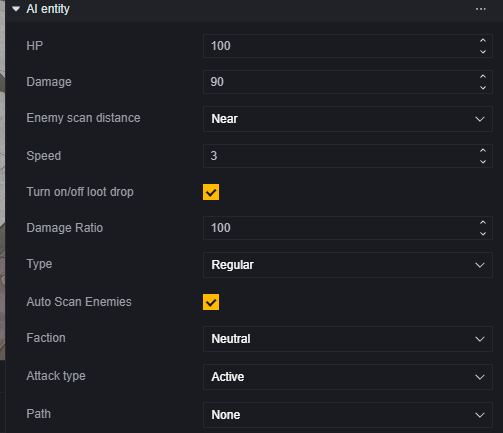

AI Zombie sẽ chủ động tấn công người chơi có đội hình khác nhau, nhưng không tấn công các zombie khác hoặc tháp phòng thủ.

Để biết thêm về AI Zombie, vui lòng tham khảo tài liệu tương ứng.

### Tháp Phòng Thủ

Tháp phòng thủ tương tự như AI Zombie, cũng có cấu hình thuộc tính riêng.

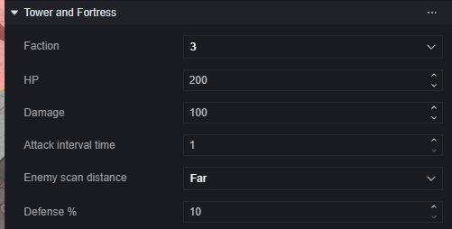

Tháp phòng thủ cũng chỉ tấn công người chơi có đội hình khác nhau, không tấn công tháp phòng thủ khác hoặc zombie.

## Thực Thể Chiến Đấu Tùy Chỉnh

### Thực Thể Có Thể Nhắm Bắn

Trong trường hợp không tạo một hệ thống chiến đấu từ đầu, sử dụng súng do nhà phát hành cung cấp để chiến đấu, các đơn vị có thể bị bắn trúng cần gắn thành phần **thực thể có thể nhắm bắn**.

Các đơn vị gắn thành phần thực thể có thể nhắm bắn có thể kích hoạt các sự kiện liên quan, từ đó hoàn thành logic chiến đấu.

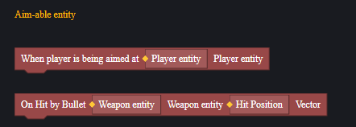

> Người chơi, zombie và tháp phòng thủ là những thực thể chiến đấu tự nhiên mang thành phần này.

Việc thực hiện các sự kiện của thành phần thực thể có thể nhắm bắn phụ thuộc vào va chạm, hãy đảm bảo đã thêm thành phần va chạm và kích hoạt va chạm.

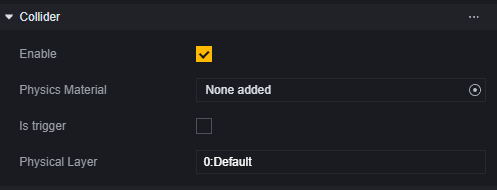

### Thực Thể Có Thể Hỗ Trợ Nhắm Bắn

Đối với người chơi, trò chơi cung cấp chức năng hỗ trợ nhắm bắn. Khi khai hỏa, tâm ngắm sẽ tự động dính vào thực thể có thể nhắm bắn.

Thành phần thực thể có thể hỗ trợ nhắm bắn phụ thuộc vào **thực thể có thể nhắm bắn**.

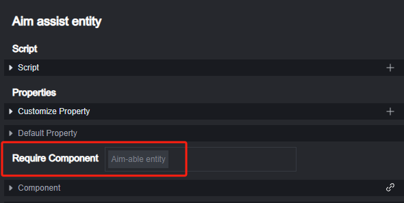

Tuy nhiên, để thành phần thực thể có thể hỗ trợ nhắm bắn có hiệu lực, mục tiêu phải là **thực thể người chơi có thể tấn công**. Đối với AI Zombie, người chơi khác và tháp phòng thủ, chỉ cần **khác phe** là thực thể người chơi hiện tại có thể tấn công; đối với các thực thể có thể nhắm bắn khác, cần thiết lập mối quan hệ tấn công thủ công trong kịch bản.

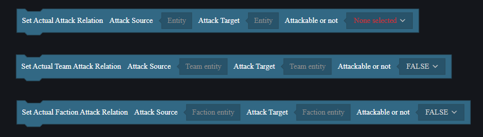

## Cách Tạo Thực Thể Chiến Đấu

Ngoài các thực thể chiến đấu mặc định, bạn cũng có thể cần thêm một số mục tiêu để bắn trong bản đồ, ví dụ như bia tập bắn.

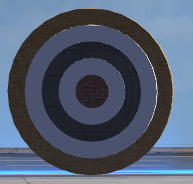

> Sẽ giới thiệu cách tạo một bia tập bắn có chức năng sau.

Lấy một hình cầu cơ bản làm ví dụ, bạn cần thêm thành phần thực thể có thể nhắm bắn sau khi tạo vật phẩm này và đảm bảo va chạm hoạt động.

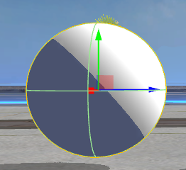

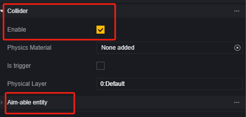

Nếu cần vật phẩm này kích hoạt chức năng hỗ trợ nhắm bắn của người chơi, cần thêm thành phần thực thể hỗ trợ nhắm bắn và xử lý mối quan hệ tấn công giữa nó và người chơi trong kịch bản.

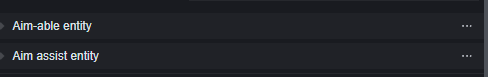

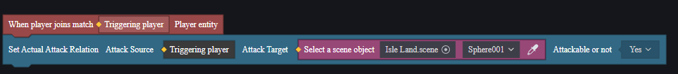

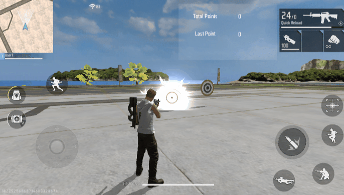

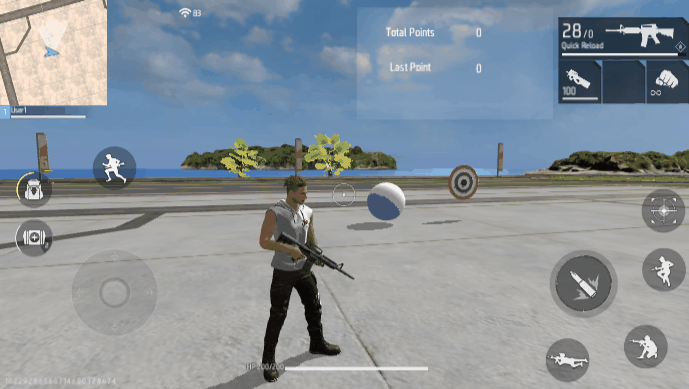

## Cách Tạo Ví Dụ Chiến Đấu

Dưới đây là một ví dụ đơn giản về cách tạo nội dung chiến đấu.

1. **Tạo Dự Án**

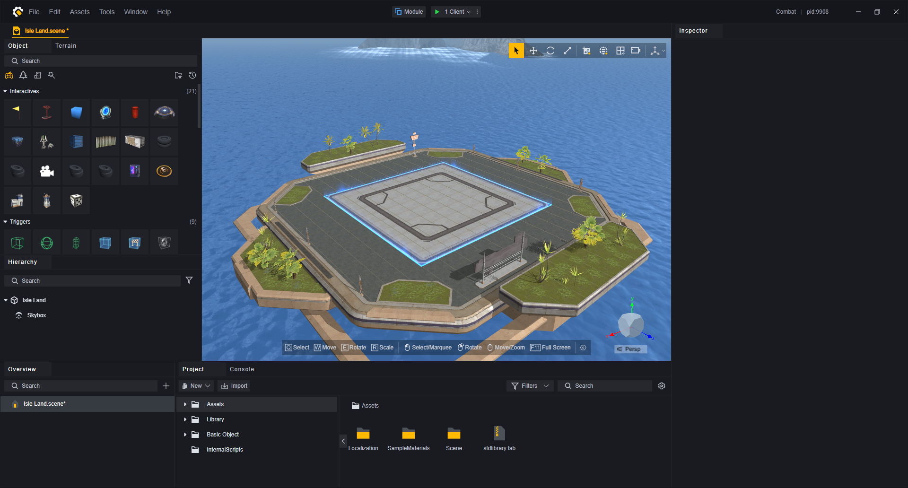

2. **Thiết Lập Vật Phẩm Trong Cảnh**

Chúng ta cần một điểm sinh ra để chỉ định vị trí sinh ra của người chơi, một số zombie và một số vật phẩm chiến đấu tùy chỉnh.

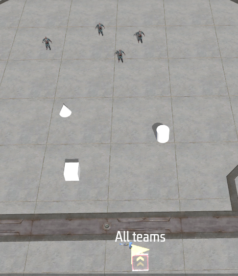

Thêm thành phần thực thể có thể nhắm bắn cho các vật phẩm chiến đấu tùy chỉnh.

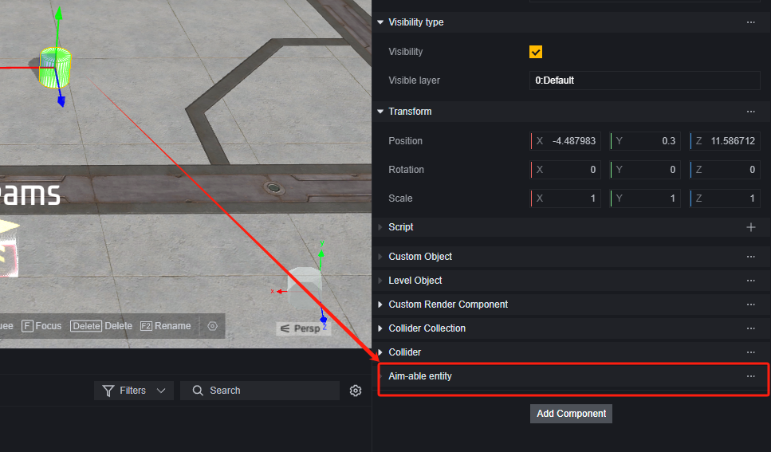

Sử dụng vũ khí và đơn vị vật phẩm, đặt một khẩu súng và đạn trước điểm sinh ra của người chơi.

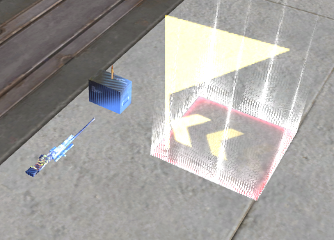

Điều chỉnh thuộc tính của súng để mỗi lần bắn chỉ gây 1 điểm sát thương.

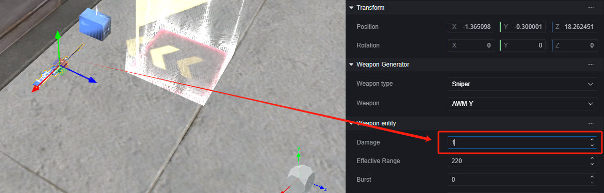
Điều chỉnh thuộc tính của zombie, khiến nó thuộc phe trung lập, có khoảng cách truy đuổi xa và có đến 200 HP.

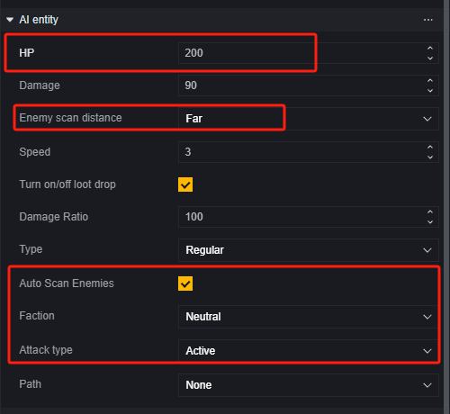

> Zombie thuộc phe trung lập sẽ chủ động tấn công người chơi trong phạm vi

Lúc này bạn nên nhận ra rằng, người chơi không thể tiêu diệt zombie bằng súng, chúng ta cần thêm một số tính năng cho thực thể chiến đấu tùy chỉnh:

Hình nón: Khi bị người chơi nhắm vào, sẽ điều chỉnh sát thương của vũ khí chính hiện tại của người chơi lên 500 rồi tự hủy.

Hình lập phương: Khi bị đạn tấn công, sẽ khiến tất cả người chơi nhận trạng thái bất khả xâm phạm và tự hủy.

Hình trụ: Khi bị tấn công, sẽ gây sát thương loại nổ thùng dầu 500 lên tất cả **thực thể có thể chiến đấu** rồi tự hủy.

**Script Hình nón**:

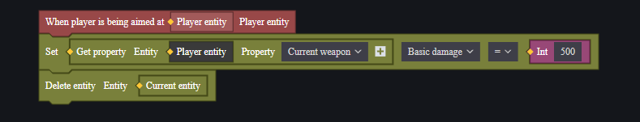

**Script Hình lập phương**:

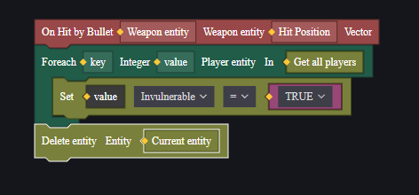

**Script Hình trụ**:

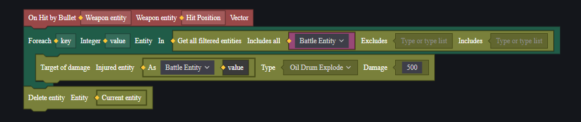

**Tấn công trực tiếp zombie**:

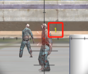

**Cách chiến đấu 1**:

Nhắm vào hình nón để nhận tăng sát thương và tiêu diệt tất cả zombie.

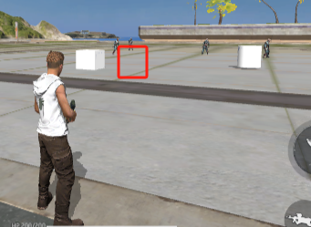

> Hình nón đã bị phá hủy khi nhắm vào

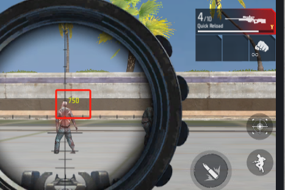

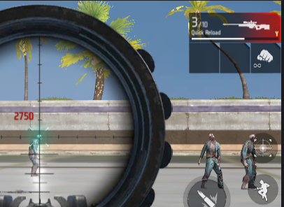

**Cách chiến đấu 2**:

Tấn công hình lập phương để nhận trạng thái bất khả xâm phạm và tấn công hình trụ để tiêu diệt tất cả zombie.

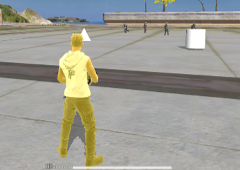

> Nhận trạng thái bất khả xâm phạm sau khi phá hủy hình lập phương.

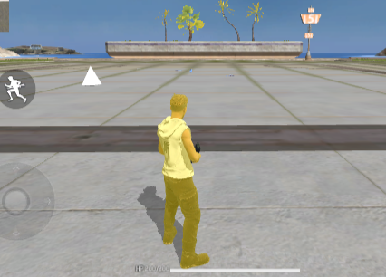

> Tiêu diệt tất cả zombie sau khi phá hủy hình trụ.

## Ví dụ mở rộng
### Mục tiêu đơn giản

Tạo mục tiêu trong cảnh.

Tạo một đối tượng cha, kéo vào năm quả cầu cơ bản bên dưới, lần lượt đại diện cho các vòng 2, 4, 6, 8, 10.

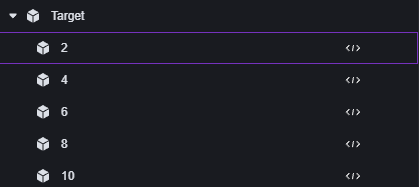

Thu nhỏ các quả cầu với X=0.01, Y và Z lần lượt là 1, 0.8, 0.6, 0.4, 0.2. Như vậy sẽ có năm đĩa tròn để kiểm tra số vòng trúng đạn.

Điều chỉnh giá trị X của vị trí để vòng lớn hơn nằm phía trước.

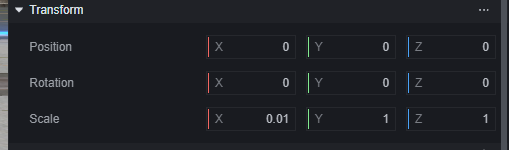

> Transform của quả cầu vòng 2

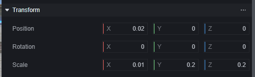

> Transform của quả cầu vòng 10

Chỉnh sửa hiển thị của quả cầu để hai vòng liền kề khác nhau.

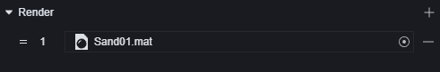

Chỉnh sửa loại va chạm của tất cả các đối tượng con thành Mesh để va chạm bám sát hình dạng vật thể.

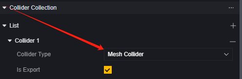

Thêm thành phần nhắm mục tiêu cho tất cả các đối tượng con.

Như vậy chúng ta đã có một mục tiêu, số vòng càng lớn thì va chạm kiểm tra càng ở phía trước, khi đạn trúng sẽ ưu tiên kiểm tra va chạm có số vòng lớn nhất tại vị trí hiện tại.

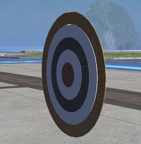

Đặt một nền lớn phía sau mục tiêu, tắt khả năng hiển thị của nó, chỉ giữ lại va chạm và nhắm mục tiêu để kiểm tra trượt mục tiêu.

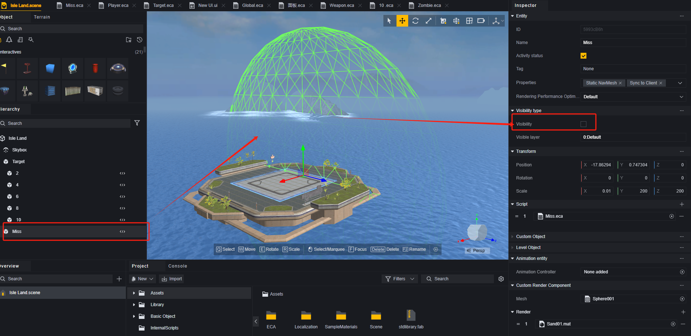

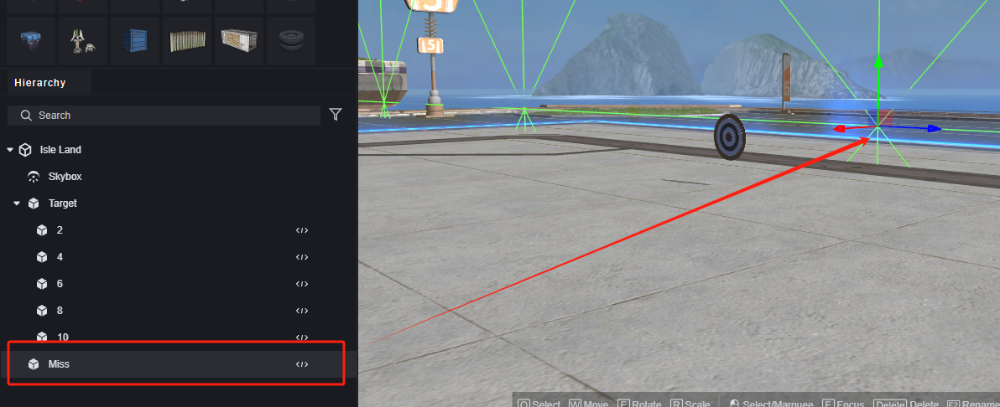

Tạo một UI để thông báo điểm số hiện tại của người chơi.

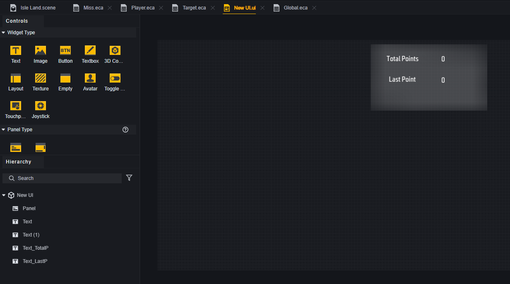

Thêm ba thuộc tính tùy chỉnh cho người chơi: điểm số hiện tại, tổng điểm số và liệu có phải là người chơi đang hoạt động hay không.

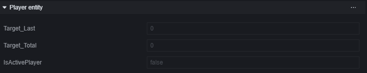

> Liệu có phải là người chơi đang hoạt động dùng để xác định khi có nhiều người chơi, ai là người đang bắn mục tiêu; hành vi bắn mục tiêu của những người chơi không hoạt động sẽ không được tính vào điểm số.
>

Thêm kịch bản cho tất cả các đối tượng con của mục tiêu và đối tượng kiểm tra trượt mục tiêu. Cấu trúc kịch bản tương tự nhau, chỉ khác ở giá trị thay đổi thuộc tính điểm số bắn mục tiêu của người chơi:

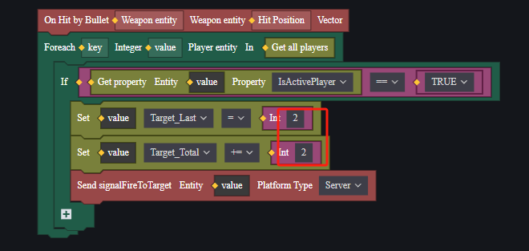

> Kịch bản của đối tượng vòng 2

> Kịch bản của nền trượt mục tiêu

Thêm kịch bản cho mô đun toàn cầu; khi người chơi tham gia trận đấu, đặt làm người chơi đang hoạt động và tạo UI tùy chỉnh.

> Trong ứng dụng thực tế có thể thay đổi người chơi đang hoạt động dựa trên điều kiện.

Khi mục tiêu hoặc nền bị đạn trúng, sẽ gửi một sự kiện cho người chơi.

Thêm kịch bản cho người chơi; khi nhận được sự kiện mục tiêu bị trúng đạn, thay đổi văn bản trên UI tùy chỉnh của mình.

Đặt súng trong cảnh và vào game để thử nghiệm.

> Trong ví dụ này chưa xử lý việc trượt mục tiêu do tấn công mặt đất.

### Đạn nổ

Dưới đây là hướng dẫn cách tạo súng bắn đạn gây sát thương AOE và có hiệu ứng nổ.

Trước tiên phân tích: gây sát thương và hiệu ứng trúng đích đều xảy ra khi đạn thực sự trúng mục tiêu, vì vậy chọn sự kiện khi đạn trúng đích.

Sự kiện này phụ thuộc vào thực thể vũ khí nên kịch bản này nên được gắn trên vũ khí.

Thêm hiệu ứng nổ khi trúng đích

> Hiệu ứng này sẽ hiển thị cho mọi người chơi

Thêm sát thương AOE

> Chỉ gây sát thương cho AI zombie và người chơi

Vậy là kịch bản vũ khí đã hoàn thành, gắn nó lên vũ khí tương ứng.

> Đây là kịch bản người chơi; bất kỳ người chơi nào trang bị vũ khí này sẽ có khả năng AOE.

Thêm một số AI zombie vào cảnh và thử nghiệm đa nền tảng.

