# Kinh Tế - Hướng Dẫn Sử Dụng

## Sử Dụng Mô-đun Kinh Tế

Mô-đun kinh tế hỗ trợ người chơi mua vật phẩm bằng tiền tệ. Thường được sử dụng trong mẫu HUD tích hợp, có thể nhanh chóng xây dựng một cửa hàng trong game.

Mô-đun kinh tế là một mô-đun tùy chọn, để sử dụng tiền tệ, cửa hàng và các nội dung khác, cần tải mô-đun kinh tế.

Sau khi tải mô-đun kinh tế, bạn có thể sử dụng các biểu tượng liên quan đến kinh tế trong phân loại mô-đun của kịch bản.

Khi gỡ cài đặt mô-đun kinh tế, cần chú ý rằng các biểu tượng mô-đun kinh tế đã sử dụng trước đó sẽ không còn hiệu lực, điều này có thể ảnh hưởng đến dự án của bạn.

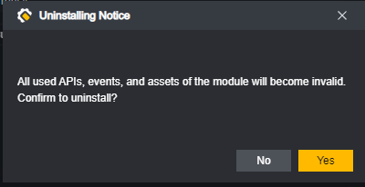

## Tiền Tệ và Ví

Theo mặc định, trong game chỉ có một loại tiền tệ mặc định. Trong trường hợp không thiết lập thêm, tất cả các cảnh sử dụng tiền tệ đều sử dụng loại tiền tệ mặc định này.

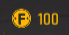

> 100 đơn vị tiền tệ mặc định

### Tạo Tiền Tệ Mới

Bạn có thể tạo tiền tệ tùy chỉnh trong mô-đun kinh tế.

Bạn có thể đặt tên cho tiền tệ mới, chọn biểu tượng và thay đổi màu sắc của nó.

Biểu tượng tiền tệ có thể được chọn từ hình ảnh có sẵn trong dự án hoặc hình ảnh nhập từ bên ngoài, hình ảnh nhập từ bên ngoài sẽ nằm ở cuối bộ chọn hình ảnh.

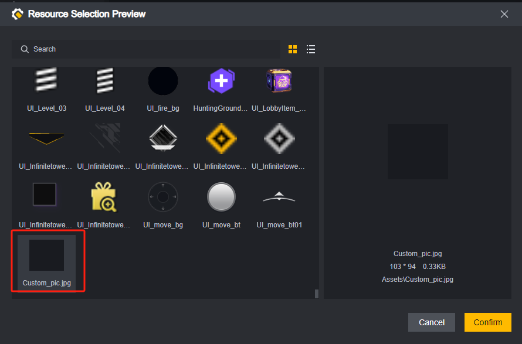

> Hình ảnh tùy chỉnh

Để sử dụng tiền tệ mới tạo, cần thiết lập thuộc tính hàng hóa và tiền tệ cho người chơi thành loại tiền tệ đó, xem nội dung liên quan dưới đây.

### Thêm/Xóa Tiền Tệ

Tiền tệ phải được lưu trữ trong ví, vì vậy cần tạo một ví cho người chơi trước.

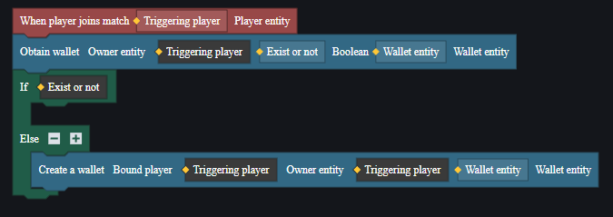

> Việc tạo nhiều ví là không cần thiết, chỉ có ví đầu tiên được tạo mới có hiệu lực.
>
> Người chơi ban đầu không có ví, nhưng bất kỳ thao tác nào liên quan đến ví như mua sắm, mở giao diện cửa hàng tích hợp, hiển thị số lượng tiền tệ đều sẽ tạo một ví cho người chơi đó.

Có thể thêm hoặc xóa tiền tệ mặc định hoặc tùy chỉnh vào/ra khỏi ví của người chơi.

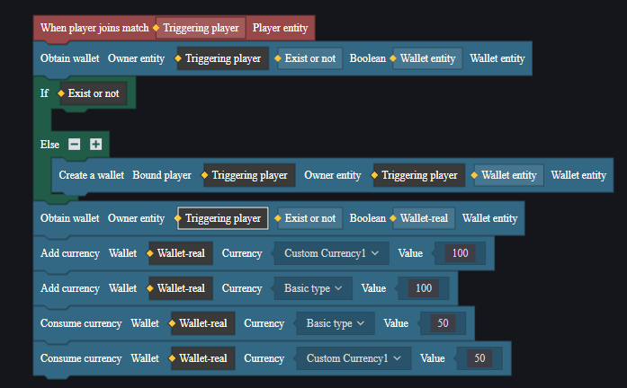

## Cửa Hàng

### Cấu Trúc Cửa Hàng

Giao diện cửa hàng hiển thị một thực thể cửa hàng, thực thể cửa hàng được cấu thành từ kệ hàng và kệ hàng được cấu thành từ các sản phẩm đã tạo ra.

#### Sản Phẩm

Khi sử dụng vật phẩm làm sản phẩm, cần thêm vật phẩm vào sản phẩm để sử dụng làm sản phẩm.

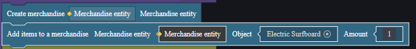

Đối với sản phẩm, có thể điều chỉnh thuộc tính thông qua việc thiết lập biểu tượng.

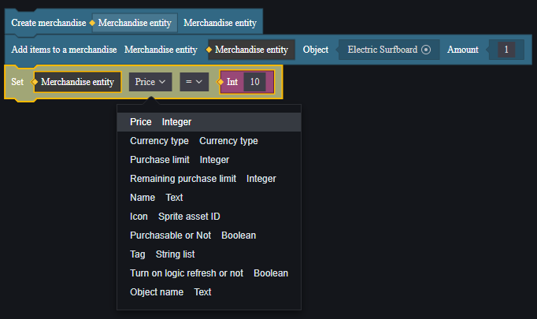

Có thể điều chỉnh giá bán sản phẩm, loại tiền tệ, giới hạn mua sắm, tên sản phẩm, biểu tượng và các thuộc tính khác khi làm sản phẩm.

Trong đó loại tiền tệ có thể chọn tiền tệ mặc định hoặc tùy chỉnh. Khi chọn tiền tệ tùy chỉnh, việc mua sản phẩm đó yêu cầu người mua phải có loại tiền tệ đó trong ví của mình.

#### Kệ Hàng

Kệ hàng là tập hợp của nhiều sản phẩm.

> Hai kệ hàng trong cửa hàng này

Sau khi đã tạo ra nhiều sản phẩm, cần đặt sản phẩm lên kệ:

Khi tạo kệ xong cũng có thể chỉnh sửa thuộc tính của nó.

#### Cửa Hàng

Cửa hàng là tập hợp của các kệ hàng.

Sau khi hoàn tất việc tạo ra nhiều kệ hàng, đặt chúng vào cửa hàng đã tạo thì thực thể cửa hàng có thể thực hiện logic bán hàng bình thường.

Thuộc tính của cửa hàng:

Ở phía dưới cửa hàng sẽ hiển thị số lượng loại tiền tệ mà ví của người chơi sở hữu và được liên kết với cửa hàng.

> Mặc định chỉ hiển thị số lượng tiền tệ mặc định mà người chơi sở hữu

### Tạo Cửa Hàng

Theo thứ tự: tạo sản phẩm trước, sau đó tạo kệ và cuối cùng là tạo cửa hàng. Chúng ta đã có một thực thể cửa hàng. Tuy nhiên nó vẫn chưa thể hiển thị trong game.

Chúng ta có thể sử dụng một số phương pháp sau để hiển thị cửa hàng trong game.

#### Máy Bán Hàng Tự Động

Trong đối tượng cấp độ có một đối tượng chức năng: máy bán hàng tự động. Sử dụng máy bán hàng tự động có thể mở thực thể cửa hàng chỉ định.

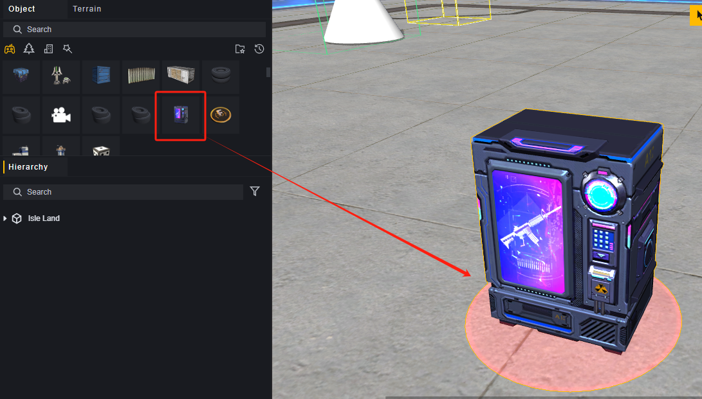

Máy bán hàng tự động đi kèm với hai cấu hình mặc định:

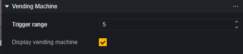

1. Phạm vi kích hoạt: Trong khoảng cách nhất định từ máy bán hàng tự động sẽ kích hoạt nút cửa hàng.
2. Hiển thị máy bán hàng tự động: Mô hình máy bán hàng tự động có hiển thị trên bản đồ hay không.

Để sử dụng thực thể cửa hàng đã tạo xong, cần thêm kịch bản cho máy bán hàng tự động.

Chúng ta đóng gói logic tạo cửa hàng thành một hàm trả về thực thể cửa hàng đã tạo. Trong kịch bản máy bán hàng tự động sẽ thiết lập hàm này làm cửa hàng của máy bán hàng tự động.

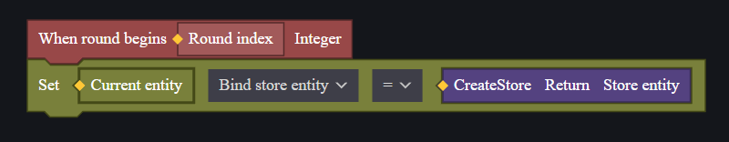

Khi đến gần máy bán hàng tự động sẽ kích hoạt biểu tượng cửa hàng trước tiên. Nhấn vào biểu tượng này sẽ mở giao diện cửa hàng.

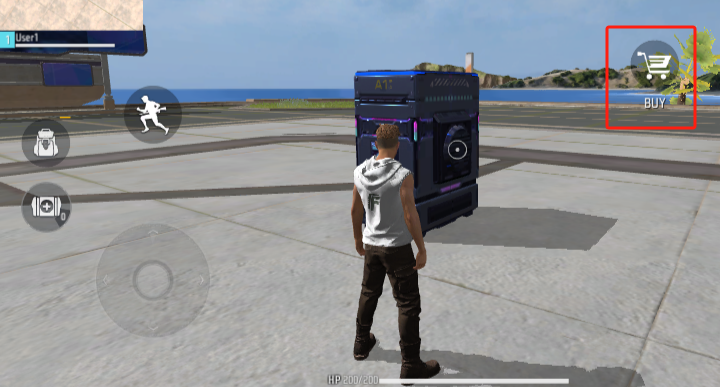

Nếu cần sử dụng phím để mở cửa hàng thì nên dùng trực tiếp đối tượng máy bán hàng tự động. Có thể đạt được việc kích hoạt phím mở cửa hàng trong phạm vi cố định bằng cách ẩn đối tượng này đi.

#### Giao Diện Cửa Hàng Tích Hợp

Nếu cần mở trực tiếp giao diện cửa hàng như khi bắt đầu vòng chơi hoặc khi vào khu vực nào đó thì cần sử dụng giao diện cửa hàng tích hợp.

Giao diện cửa hàng tích hợp có thể được tạo thông qua việc tạo biểu tượng UI tích hợp trò chơi:

Sau khi tạo giao diện cửa hàng tích hợp xong thì có thể thiết lập mục liên kết với thực thể cửa hàng đã tạo trong thuộc tính của UI này.

### Cửa hàng công cộng và cửa hàng cá nhân

Mặc định tạo ra là cửa hàng công cộng, không cần xử lý thêm, tất cả người chơi đều có thể mua sắm từ cửa hàng này. Khi hàng hóa đã được mua hết, người chơi khác sẽ không thể tiếp tục mua hàng từ cửa hàng này nữa.

Nếu cần mỗi người chơi sử dụng riêng một cửa hàng giống nhau, có thể thực hiện bằng cách tạo một cửa hàng cho từng người chơi.

> Khuyến khích mạnh mẽ việc đóng gói việc tạo cửa hàng thành một phương thức hoặc lưu trữ thực thể cửa hàng đã tạo vào biến công cộng.

Ví dụ trong kịch bản toàn cầu, mở rộng giao diện UI của cửa hàng cho mỗi người chơi tham gia trò chơi:

Như vậy, trên UI của mỗi người chơi đều là các phiên bản khác nhau được tạo ra từ cùng một thực thể cửa hàng, có thể đạt được mục đích mỗi người có riêng một cửa hàng.

## Ví dụ

Bán BUFF bất khả chiến bại trong cửa hàng.

Đầu tiên, chúng ta tạo một kịch bản quản lý BUFF của người chơi dưới mô-đun người chơi:

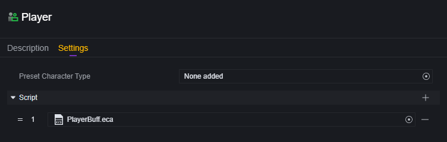

Trong kịch bản này, viết một BUFF bất khả chiến bại sẽ áp dụng cho người chơi hiện tại trong 5 giây:

Đặt một máy bán hàng tự động trong cảnh và thêm kịch bản cho nó:

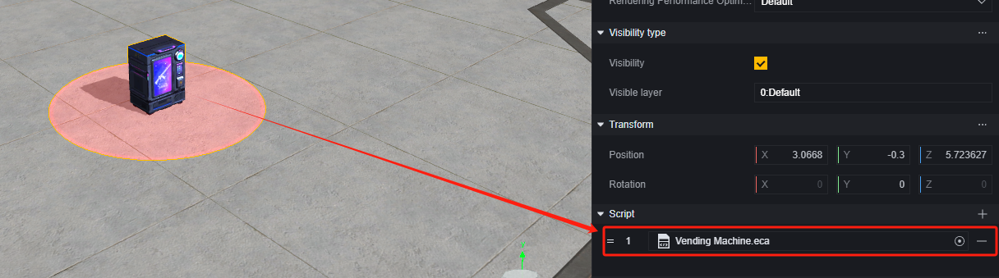

Trong kịch bản của máy bán hàng tự động, viết một phương thức tạo cửa hàng:

Trong cửa hàng này, chỉ có một kệ và trên kệ chỉ có một sản phẩm, sản phẩm này không tương ứng với bất kỳ vật phẩm thực tế nào.

Biểu tượng sản phẩm chọn dấu chấm than hoặc bất kỳ biểu tượng nào bạn thích:

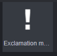

Giá bán sản phẩm định là 100 và lưu trữ sản phẩm đã tạo vào biến kịch bản để sử dụng sau.

Khi máy bán hàng tự động được tạo ra, gọi phương thức này để tạo thực thể cửa hàng và liên kết thực thể cửa hàng với máy bán hàng tự động:

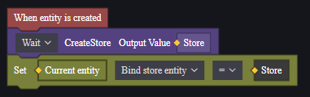

Lúc này trong cửa hàng đã có sản phẩm này nhưng không thể kích hoạt BUFF bất khả chiến bại.

Tạo thêm một kịch bản cửa hàng để giám sát sự kiện mua sắm của người chơi:

> Kết hợp với biến lưu trữ sản phẩm ở trên là biến kịch bản, ở đây sử dụng liên kết bên ngoài để lấy biến này. Bạn cũng có thể thông qua thuộc tính thành phần để lưu trữ sản phẩm vào biến toàn cục để lấy thực thể sản phẩm.

Vì sự kiện mua sắm vật phẩm, kịch bản này cần được gắn vào thực thể cửa hàng, và vì cửa hàng được tạo ra sau khi trò chơi chạy nên cần gắn động.

Quay lại kịch bản máy bán hàng tự động và gắn kịch bản cửa hàng này cho thực thể cửa hàng đã tạo ra:

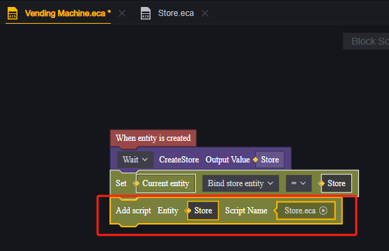

Như vậy, cửa hàng đã được xây dựng hoàn chỉnh nhưng người chơi chưa có tiền để mua sắm. Tạo một kịch bản toàn cục để thêm 500 đơn vị tiền mặc định cho mỗi người chơi.

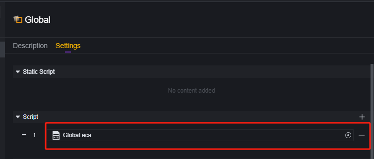

Chạy trò chơi:

Ban đầu hai người chơi đều không có bất khả chiến bại:

Mở cửa hàng, sản phẩm tồn tại và số lượng tiền trong ví của người chơi phù hợp với dự kiến:

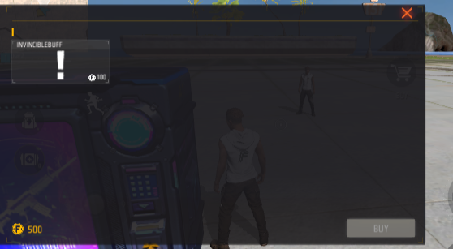

Mua thành công, người chơi mua được hiệu ứng bất khả chiến bại:

Sau 5 giây, hiệu ứng bất khả chiến bại kết thúc:

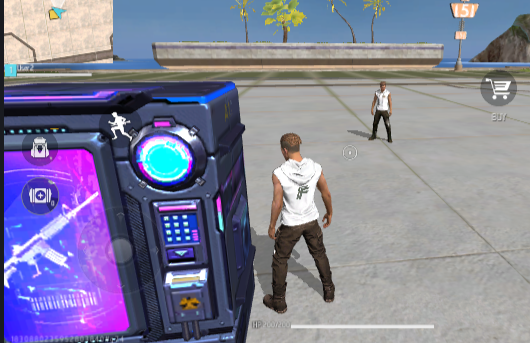

Mở lại cửa hàng và thấy tiền giảm đi 100 như bình thường:

