# AI Zombie - Hướng Dẫn Sử Dụng

Về mặt lý thuyết, AI là một thành phần của thực thể AI, giống như các thành phần chức năng khác, khi gắn vào bất kỳ thực thể nào, thực thể đó sẽ trở thành một đơn vị AI.

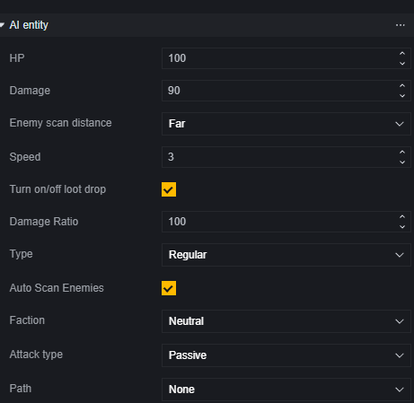

Tuy nhiên, hiện tại AI chỉ được gắn vào các thực thể zombie và không thể tự do cấu hình để gắn hoặc không gắn. Vì vậy, bài viết này sẽ hướng dẫn từ góc độ cấu hình và điều khiển zombie.

## Cấu Hình AI Zombie

Bạn có thể cấu hình zombie cá nhân thông qua cấu hình đơn vị, tạo zombie định kỳ thông qua máy tạo zombie, hoặc tạo hàng loạt zombie từ mẫu zombie đã định sẵn thông qua máy tạo đơn vị.

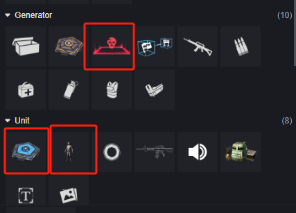

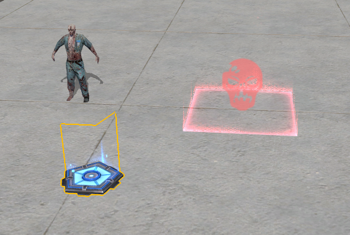

Cả máy tạo và zombie đều có thể cấu hình các thuộc tính của zombie. Máy tạo còn có một số cài đặt bổ sung về cách tạo zombie.

### **Cấu Hình Zombie Đơn Vị**

Các mục này cũng xuất hiện trong máy tạo zombie.

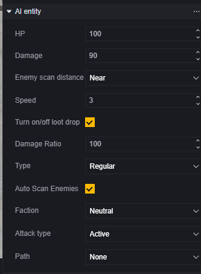

**Máu**: Máu của AI zombie.

**Sát Thương Tấn Công**: Sát thương cơ bản từ tấn công. Sát thương từ kỹ năng được tính riêng, không bị ảnh hưởng bởi cài đặt này.

**Phạm Vi Phát Hiện Kẻ Địch**: Phạm vi cơ bản mà AI zombie phát hiện kẻ địch. Nếu có sự tăng cường, phạm vi này sẽ được điều chỉnh dựa trên giá trị cơ bản.

**Tốc Độ Di Chuyển**: Tốc độ di chuyển cơ bản. Nếu có sự tăng cường, tốc độ này sẽ được điều chỉnh dựa trên giá trị cơ bản.

**Có Rơi Chiến Lợi Phẩm Không**: Có rơi chiến lợi phẩm khi bị giết hay không. Loại chiến lợi phẩm không thể cấu hình.

**Tỷ Lệ Chịu Sát Thương**: Phần trăm sát thương nhận vào, phạm vi từ 10-10000, giá trị thấp nhất là 10, nghĩa là chỉ nhận 10% sát thương gốc.

**Loại**: Loại AI, tức là loại zombie.

**Phát Hiện Kẻ Địch Tự Động**: Tự động phát hiện kẻ địch trong phạm vi phát hiện.

**Phe**: Phe của AI zombie.

**Chế Độ Tấn Công**: Tấn công chủ động: Tấn công kẻ địch được phát hiện. Tấn công bị động: Chỉ tấn công khi bị tấn công. Không tấn công: Không tấn công.

> Đối với những zombie có kỹ năng, chúng không nhất thiết phải tuân thủ nghiêm ngặt các cài đặt phát hiện kẻ địch và tấn công, mà sẽ luôn tấn công kẻ địch trong phạm vi bằng kỹ năng.
>
> Các loại zombie BOSS đều có kỹ năng riêng: Đồ Tể, Mr.V, Võ Sĩ.

**Đường Hành Trình**: Lộ trình mặc định, kết hợp với điểm đường.

Sử dụng đối tượng điểm đường trong cảnh để thiết lập lộ trình:

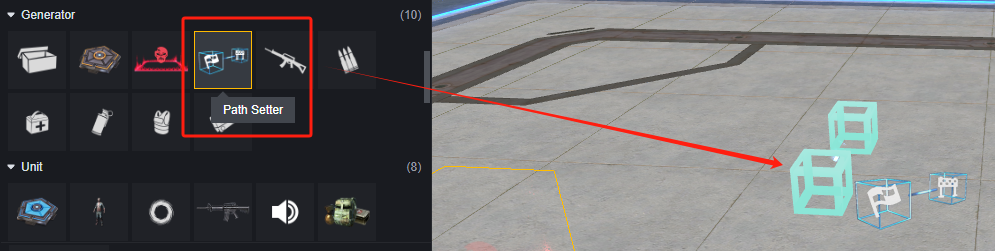

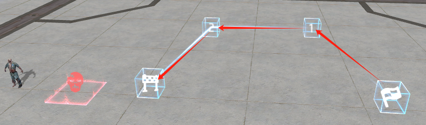

Sau khi thiết lập lộ trình, bạn có thể chọn lộ trình tương ứng trong cấu hình AI zombie.

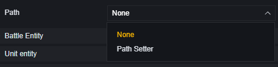

### **Cấu Hình Đặc Thù Của Máy Tạo Zombie**

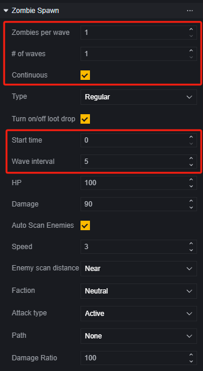

**Số Lượng Zombie Mỗi Đợt**: Số lượng zombie được tạo ra trong mỗi đợt.

**Số Lượng Đợt**: Số lượng đợt zombie được tạo ra trong mỗi vòng khi không tạo liên tục.

**Tạo Liên Tục**: Tạo zombie liên tục, bỏ qua cài đặt số lượng đợt, tiếp tục tạo zombie.

**Thời Gian Bắt Đầu Tạo**: Thời gian từ khi bắt đầu vòng đấu đến khi tạo ra đợt zombie đầu tiên, tính bằng giây.

**Thời Gian Giữa Các Đợt**: Khoảng thời gian giữa hai đợt zombie được tạo ra, tính bằng giây.

> Zombie được tạo bởi máy tạo sẽ bị tiêu diệt hoàn toàn vào đầu vòng đấu tiếp theo và không rơi chiến lợi phẩm.

### Cấu Hình Máy Tạo Đơn Vị

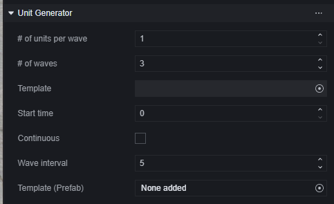

**Số Lượng Đơn Vị Mỗi Đợt**: Số lượng đơn vị được tạo ra trong mỗi đợt.

**Số Lượng Đợt**: Tổng số đợt được tạo ra.

**Mẫu**: Chọn mẫu đơn vị được tạo ra từ cảnh. Không tương thích với Mẫu (Prefab).

**Thời Gian Bắt Đầu Tạo**: Thời gian từ khi bắt đầu trò chơi đến khi tạo ra đợt đơn vị đầu tiên, tính bằng giây.

**Duy Trì**: Khi được chọn, bỏ qua cài đặt số lượng đợt, tiếp tục tạo đơn vị mỗi đợt.

**Thời Gian Giữa Các Đợt**: Khoảng thời gian giữa hai đợt đơn vị được tạo ra, tính bằng giây.

**Mẫu (Prefab)**: Chọn đơn vị cần tạo từ Prefab. Không tương thích với Mẫu.

## Điều Khiển AI Zombie Bằng Script Đồ Họa

Sau khi cấu hình AI zombie hoặc máy tạo của nó trong cảnh, bạn cũng có thể sử dụng script để điều khiển chúng trong quá trình chơi.

Ở đây chúng tôi sẽ giới thiệu về script đồ họa, các script mã có thể sử dụng API và sự kiện tương ứng trong script đồ họa để thực hiện các thao tác tương tự.

### Điều Khiển Máy Tạo

Không chỉ giới hạn ở AI zombie, API và sự kiện của máy tạo có thể áp dụng cho tất cả các máy tạo.

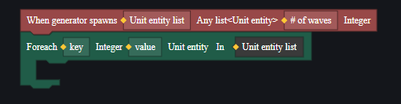

> Sử dụng kết hợp này để lấy các thực thể đơn vị được tạo ra trong mỗi đợt của máy tạo.

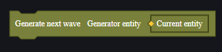

### Điều Khiển AI Zombie

Ngoài việc là một thực thể AI, zombie còn là một thực thể chiến đấu, thực thể có thể nhắm mục tiêu, và thực thể nói chung.

Sử dụng các sự kiện tương ứng để theo dõi hành vi của AI zombie và sử dụng API để điều khiển AI zombie thực hiện hành động.

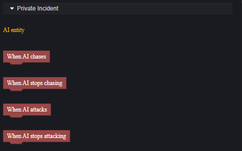

> Sự kiện của thực thể AI

### Ví Dụ

Một ví dụ đơn giản về cách sử dụng script đồ họa để điều khiển AI zombie.

Giả sử yêu cầu là: Mỗi khi người chơi nhắm mục tiêu vào zombie, zombie sẽ né tránh.

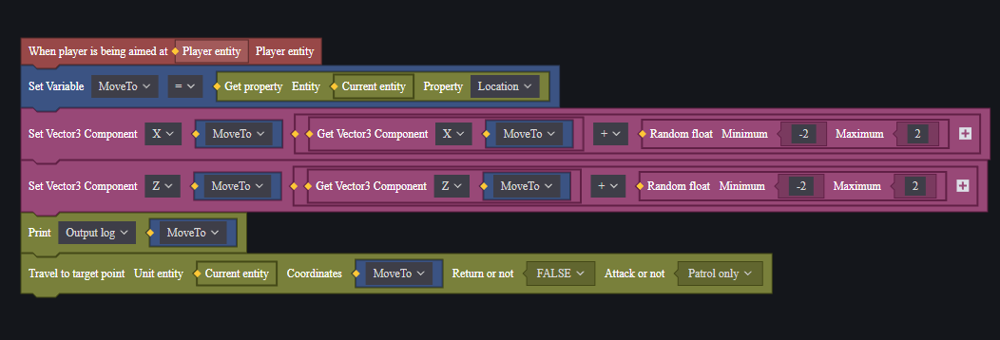

Gắn script này vào thực thể zombie.

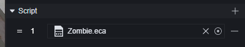

Khi đó, zombie sẽ di chuyển ngẫu nhiên theo chiều ngang khi bị nhắm mục tiêu.