# Hệ thống phát - Hướng dẫn sử dụng

Hệ thống phát là một tập hợp các khái niệm có thể phát, bao gồm phát âm thanh, phát hiệu ứng và phát chuyển động.

Với sự trợ giúp của hệ thống phát, bạn có thể thực hiện một số biểu hiện tùy chỉnh.

Trong đó, chuyển động khá phức tạp và sẽ được giới thiệu chi tiết.

## Âm thanh và hiệu ứng

Thực thể âm thanh và hiệu ứng có thể được tạo bởi thực thể đơn vị.

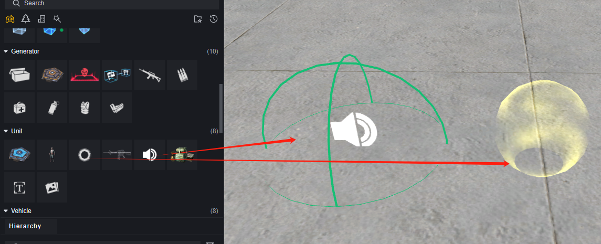

Và có thể chỉnh sửa cấu hình thông qua bảng thuộc tính.

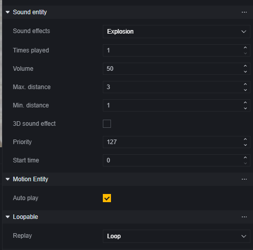

> Cấu hình thực thể âm thanh

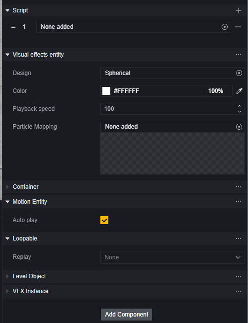

> Cấu hình thực thể hiệu ứng

Các thực thể được tạo theo cách này là tĩnh.

Khi cần thay đổi động âm thanh/hiệu ứng, bạn có thể sử dụng script. Thông thường, các thực thể âm thanh và hiệu ứng được tạo và điều khiển thông qua script đồ họa.

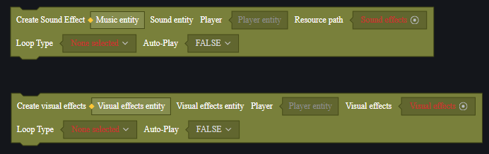

Khi tạo thông qua script máy chủ, cần chỉ định người chơi, các hiệu ứng/âm thanh được tạo ra chỉ có người chơi đó mới có thể nhìn thấy/nghe thấy.

Khi tạo thông qua script máy khách, chỉ được tạo trên máy khách đang chạy logic.

Vị trí của các thực thể được tạo mặc định là (0, 0, 0), có thể điều chỉnh vị trí và các thuộc tính khác thông qua việc thiết lập thuộc tính.

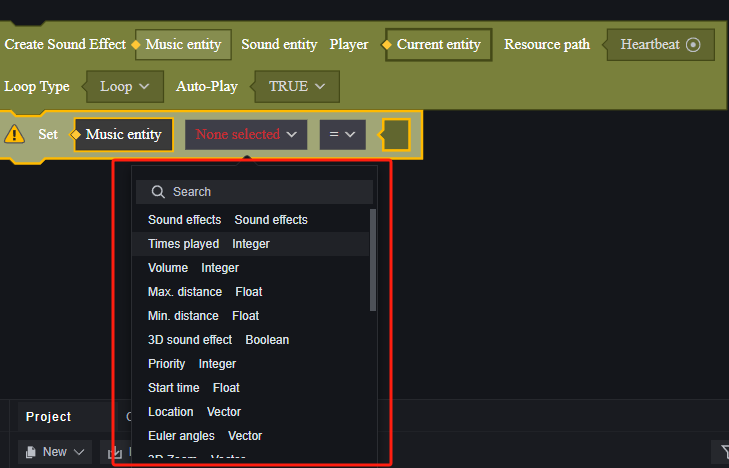

> Một số thuộc tính của âm thanh

Khi muốn kết thúc hiệu ứng/âm thanh, bạn có thể chọn xóa thực thể tương ứng.

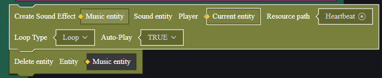

Ứng dụng của âm thanh và hiệu ứng sẽ được giải thích cùng với chuyển động trong phần ví dụ cuối cùng.

## Chuyển động

Chuyển động là quá trình thay đổi liên tục của một thuộc tính chuyển động của thực thể. Ngoài vị trí phổ biến, xoay, thu phóng cũng là những thuộc tính mà hệ thống phát chuyển động có thể kiểm soát.

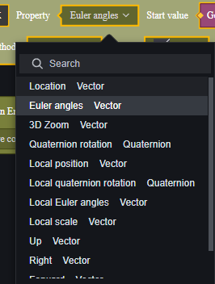

> Các thuộc tính có thể thực hiện chuyển động

Thực thể chuyển động phải được tạo bởi script đồ họa và gắn vào một thực thể nào đó. Thực thể này sẽ di chuyển theo quy tắc quy định để thực hiện các chế độ chuyển động như tăng tốc, xoay.

Chuyển động có tổng cộng sáu chế độ phát:

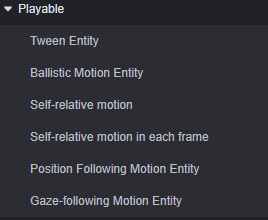

1. **Chuyển động nội suy**

   Tốc độ chuyển động của thực thể thay đổi theo đường cong quy định, cần xác định điểm đầu và điểm cuối.

2. **Chuyển động đạn đạo**

   Chuyển động tăng tốc theo đường thẳng.

3. **Chuyển động tương đối với bản thân**

   Tương tự như chuyển động nội suy nhưng luôn lấy điểm bắt đầu là vị trí sau lần thay đổi trước đó của bản thân.

4. **Chuyển động mỗi khung hình tương đối với bản thân**

   Tương tự như chuyển động tương đối với bản thân nhưng tần suất thay đổi là mỗi khung hình một lần.

5. **Chuyển động theo dõi vị trí**

   Theo dõi vị trí của thực thể mục tiêu.

6. **Chuyển động theo dõi hướng nhìn**

   Luôn hướng về phía thực thể mục tiêu.

### Đồ họa hệ thống phát chuyển động

#### Tạo thực thể chuyển động

Mỗi chế độ phát chuyển động đều có đồ họa tạo tương ứng và cấu hình khác nhau.

Các tham số dưới đây được giới thiệu theo thứ tự từ trái sang phải từ trên xuống dưới

##### **Chuyển động nội suy**

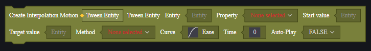

1. Thực thể chuyển động nội suy: Tham số đầu ra, tạo ra thực thể chuyển động nội suy.
2. Thực thể: Thực thể được gắn, làm cho thực thể này di chuyển nội suy.

3. Thuộc tính: Thuộc tính nào của thực thể được gắn sẽ di chuyển, cần nhập thực thể trước để có thể đọc các thuộc tính có thể di chuyển của nó. Thường là vị trí, xoay, phóng to/thu nhỏ, v.v.

4. Giá trị khởi đầu: Giá trị bắt đầu của thuộc tính của thực thể được gắn.

5. Giá trị mục tiêu: Sau khi kết thúc một lần di chuyển, thuộc tính của thực thể được gắn sẽ trở thành giá trị này.

6. Phương thức: Phương thức phát, có thể chọn đơn lẻ, lặp lại và qua lại. Lặp lại nghĩa là sau mỗi lần di chuyển hoàn thành, thực thể sẽ từ giá trị khởi đầu di chuyển lại một lần nữa. Qua lại nghĩa là sau khi di chuyển từ điểm đầu đến điểm cuối, thực thể sẽ từ điểm cuối quay lại điểm đầu một lần nữa rồi lặp lại quá trình này.

7. Đường cong: Đường cong tốc độ thay đổi của thuộc tính. Đường cong tốc độ là đường cong Bézier tuyến tính, gồm điểm bắt đầu cố định, điểm kết thúc và hai điểm điều khiển.

   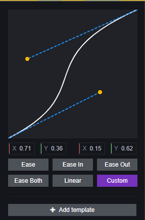

   Đường cong cung cấp một số mẫu, cũng có thể tùy chỉnh tọa độ của các điểm điều khiển.

   Bạn có thể xem trục hoành của đường cong trong hình là thời gian, trục tung là giá trị thuộc tính, điểm bắt đầu là **thời gian 0** với **giá trị khởi đầu** ở mục **4**, điểm kết thúc là thời gian **8** với **giá trị mục tiêu** ở mục **5**, tốc độ thay đổi là tiếp tuyến của đường cong.

   Nếu đường cong là đường thẳng, tức là tọa độ các điểm điều khiển đều là (0, 0), tốc độ sẽ không đổi. Trong trường hợp hiển thị trong hình, sự thay đổi thuộc tính sẽ chậm trước, sau đó nhanh dần rồi chậm lại.

8. Thời gian: Thời gian thay đổi một lần, đơn vị là mili giây.

9. Tự động phát sau khi tạo: Sau khi tạo có tự động bắt đầu phát hay không.

##### **Chuyển động đạn đạo**

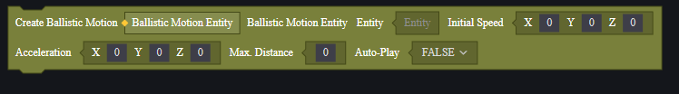

1. Thực thể chuyển động đạn đạo: Thực thể chuyển động đạn đạo được tạo ra.
2. Thực thể: Thực thể được gắn, làm cho thực thể này chuyển động đạn đạo.
3. Tốc độ ban đầu: Tốc độ ban đầu, vector ba chiều, biểu thị hướng và độ lớn của tốc độ.
4. Gia tốc: Gia tốc, vector ba chiều, biểu thị hướng và độ lớn của gia tốc.
5. Khoảng cách tối đa: Khoảng cách chuyển động đạn đạo, sau khi đạt khoảng cách này thì hoàn thành chuyển động.
6. Tự động phát sau khi tạo: Sau khi tạo có tự động bắt đầu phát hay không.

##### **Chuyển động tương đối bản thân**

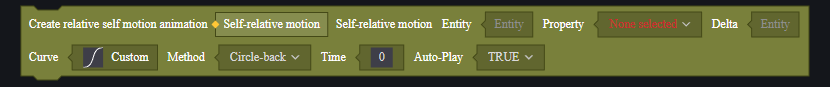

1. Chuyển động tương đối bản thân: Thực thể chuyển động tương đối bản thân được tạo ra.
2. Thực thể: Thực thể được gắn, làm cho thực thể này chuyển động tương đối bản thân.
3. Thuộc tính: Thuộc tính nào của thực thể này sẽ di chuyển.
4. Delta: Lượng thay đổi mỗi lần di chuyển, yêu cầu cùng loại dữ liệu với thuộc tính đã chọn ở mục **3. Thuộc tính**. Ví dụ khi chọn vị trí thì Delta phải nhập một vector ba chiều, biểu thị giá trị thay đổi vị trí so với bản thân.
5. Đường cong: Tham khảo mô tả đường cong trong chuyển động nội suy, biểu thị tốc độ trong quá trình thay đổi.
6. Phương thức: Tham khảo phương thức trong chuyển động nội suy để quyết định phương thức di chuyển: đơn lẻ, lặp lại hay qua lại.
7. Thời gian: Thời gian mỗi lần di chuyển mất bao lâu, đơn vị là mili giây.
8. Tự động phát sau khi tạo: Sau khi tạo có tự động bắt đầu phát hay không.

##### **Chuyển động tương đối bản thân mỗi khung hình**

1. Chuyển động tương đối bản thân mỗi khung hình: Thực thể chuyển động tương đối bản thân mỗi khung hình được tạo ra.
2. Thực thể: Thực thể được gắn, làm cho thực thể này chuyển động tương đối bản thân mỗi khung hình.
3. Thuộc tính: Thuộc tính nào của thực thể này sẽ di chuyển.
4. Delta: Lượng thay đổi mỗi khung hình, yêu cầu cùng loại dữ liệu với thuộc tính đã chọn ở mục **3. Thuộc tính**. Ví dụ khi chọn vị trí thì Delta phải nhập một vector ba chiều, biểu thị giá trị thay đổi vị trí so với bản thân.
5. IsSwitch: Cấu hình khi sử dụng kết hợp với các chế độ di chuyển khác; nếu đúng thì có thể kết hợp với di chuyển tương đối; nếu sai thì có thể kết hợp với di chuyển tuyệt đối. Vui lòng xem quy tắc sử dụng kết hợp dưới đây.
6. Tự động phát sau khi tạo: Sau khi tạo có tự động bắt đầu phát hay không.

##### **Chuyển động theo dõi vị trí**

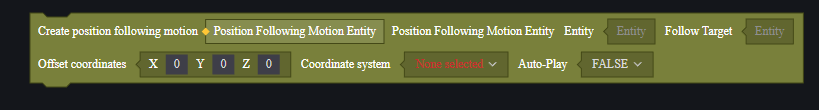

1. Thực thể chuyển động theo dõi vị trí: Thực thể chuyển động theo dõi vị trí được tạo ra.
2. Thực thể: Thực thể được gắn, làm cho thực thể này chuyển động theo dõi vị trí.
3. Mục tiêu theo dõi: Mục tiêu theo dõi.
4. Tọa độ lệch: Nhập tọa độ lệch vào đây; vị trí của thực thể sẽ giữ nguyên hướng và khoảng cách lệch so với mục tiêu theo dõi.
5. Hệ tọa độ: Có thể chọn hệ tọa độ thế giới hoặc hệ tọa độ tương đối; điều này quyết định tọa độ lệch ở mục **4** thuộc hệ tọa độ nào.
6. Tự động phát sau khi tạo: Sau khi tạo có tự động bắt đầu phát hay không.

##### **Chuyển động theo dõi ánh nhìn**

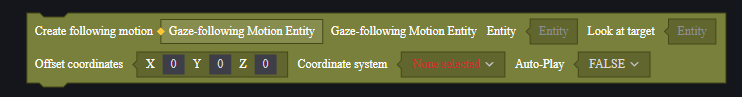

1. Thực thể chuyển động theo dõi ánh nhìn: Thực thể chuyển động theo dõi ánh nhìn được tạo ra.
2. Thực thể: Thực thể được gắn, làm cho thực thể này chuyển động theo dõi ánh nhìn.
3. Mục tiêu ánh nhìn: Mục tiêu ánh nhìn.
4. Tọa độ lệch: Nhập tọa độ lệch vào đây; trung tâm ánh nhìn sẽ lệch khỏi trung tâm mục tiêu theo hướng và khoảng cách tương ứng.
5. Hệ tọa độ: Có thể chọn hệ tọa độ thế giới hoặc hệ tọa độ tương đối; điều này quyết định tọa độ lệch ở mục **4** thuộc hệ tọa độ nào.
6. Tự động phát sau khi tạo: Sau khi tạo có tự động bắt đầu phát hay không.

#### Điều khiển phát thực thể

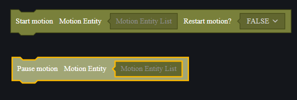

Có thể sử dụng API để phát hoặc tạm dừng thực thể.

Phát lại trong quá trình đang phát nghĩa là liệu có làm cho thực thể bắt đầu lại từ giá trị khởi đầu hay không.

Tạm dừng không xóa thực thể.

Xóa thực thể cần sử dụng giao diện xóa thực thể; tuy nhiên cần chú ý đến tham số nhập vào là thực thể vận hành hay thực thể được gắn; cái trước sẽ xóa vận hành đã tạo ra còn cái sau sẽ xóa chính bản thân thực thể được gắn.

#### Sự kiện thực thể vận hành

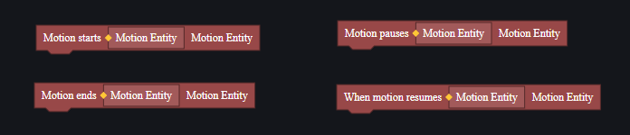

Bắt đầu vận hành, kết thúc vận hành, tạm dừng vận hành và tiếp tục vận hành sẽ kích hoạt các sự kiện tương ứng riêng biệt; tuy nhiên các sự kiện này đều phụ thuộc vào thực thể vận hành nên cần gắn script tương ứng lên thực thể sau khi đã tạo ra nó.
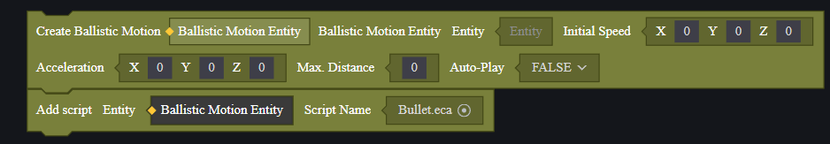

#### Tổ hợp thực thể chuyển động

Thực thể chuyển động có thể được sử dụng kết hợp và thường không bị giới hạn. Thực thể được gắn nhiều thực thể chuyển động sẽ thực hiện nhiều chuyển động cùng lúc, nhưng khi sử dụng **chuyển động tương đối mỗi khung hình** cần chú ý đến loại chuyển động kết hợp.

Khi tạo **chuyển động tương đối mỗi khung hình**, có một tùy chọn IsSwitch. Chọn True để kết hợp với chuyển động tương đối, chọn False để kết hợp với chuyển động tuyệt đối.

**Chuyển động tương đối, chuyển động tương đối mỗi khung hình, chuyển động theo vị trí, chuyển động theo ánh nhìn** là các loại chuyển động tương đối. **Chuyển động nội suy, chuyển động đạn đạo** là các loại chuyển động tuyệt đối.

Sử dụng sai cách kết hợp sẽ dẫn đến kết quả không như mong đợi.

## Ví dụ

Dưới đây là một ví dụ minh họa cách sử dụng thực thể chuyển động, hiệu ứng và âm thanh.

Chúng ta sẽ tạo bốn quả cầu luôn xoay quanh người chơi và thêm hiệu ứng khi người chơi bắn, phát âm thanh và bắn ra theo hướng người chơi. Sau 3 giây, quả cầu bắn ra sẽ được làm mới.

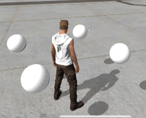

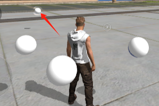

### Chuẩn bị

Đầu tiên tạo một Prefab gồm một vật thể cha và bốn quả cầu để dễ dàng cấu hình xoay.

Quả cầu sử dụng vật thể cơ bản màu trắng, tỷ lệ thu nhỏ là 0.3, vị trí so với vật thể cha là (±0.6, 1, ±0.6), tắt va chạm.

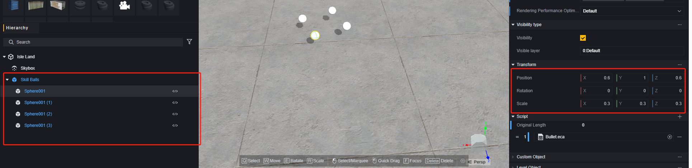

Tiếp theo tạo một thực thể đạn có cấu hình giống quả cầu để xử lý logic bắn ra đặc biệt.

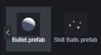

Âm thanh và hiệu ứng đều sử dụng cấu hình mặc định từ tài nguyên chính thức mà không cần chuẩn bị trước.

Tạo kịch bản toàn cục để tạo ra vật thể cha và lưu trữ bằng biến kịch bản.

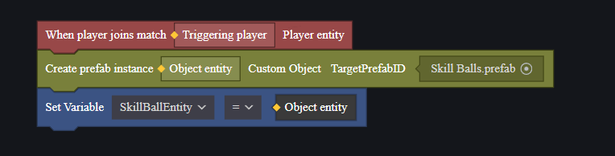

Tạo kịch bản người chơi để lấy vật thể cha từ kịch bản toàn cục và đăng ký bốn vật thể con vào danh sách để tiện xử lý logic bắn đạn sau này.

### Tạo chuyển động xoay

Vật thể cha cần luôn theo dõi người chơi và tự xoay quanh mình. Đây là sự kết hợp của hai loại chuyển động.

Trong kịch bản toàn cục, chúng ta chọn **chuyển động tương đối mỗi khung hình** và **chuyển động theo vị trí**

> Chuyển động đầu tiên có thể sử dụng nội suy hoặc chuyển động tương đối cũng đáp ứng nhu cầu.

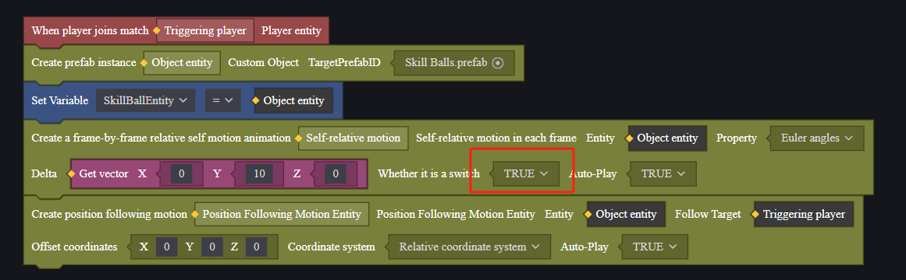

Thuộc tính của **chuyển động tương đối mỗi khung hình** được đặt là góc xoay, Delta là (0, 10, 0), nghĩa là mỗi khung hình vật thể sẽ tự xoay 10 độ, mỗi giây tự xoay 330 độ, gần bằng một vòng tròn.

Vì kết hợp với một loại chuyển động tương đối khác nên IsSwitch được đặt là True.

Mục tiêu theo dõi là người chơi kích hoạt sự kiện, tức là mỗi người chơi tham gia trò chơi sẽ có bốn quả cầu kỳ diệu này. Vì sử dụng vật thể cha nên các vật thể con đã có độ lệch sẵn nên không cần đặt độ lệch.

### Tạo chuyển động bắn

Chuyển động bắn cần sự kiện bắn của người chơi để kích hoạt. Chúng ta quay lại kịch bản người chơi.

Ở đây thông qua một biến số nguyên để kiểm tra số quả cầu đã bắn ra. Nếu lớn hơn bốn thì không thể tiếp tục bắn.

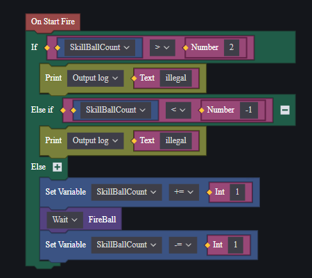

Biến này sẽ tăng thêm 1 mỗi lần bắn, phạm vi từ -1 đến 2. Trong thực tế sử dụng, giá trị nhận được trong phương pháp FireBall là từ 0 đến 3, tương ứng với 4 quả cầu trong danh sách lưu trữ.

Mỗi lần phương pháp FireBall kết thúc, giá trị này sẽ giảm đi 1 để luôn bắn ra quả cầu có số thứ tự nhỏ nhất xung quanh người chơi nhằm tránh vượt quá giới hạn.

Trong phương pháp FireBall, chúng ta sử dụng một mẹo nhỏ để xử lý logic tổ hợp nhiều loại chuyển động phức tạp: mỗi lần cần bắn ra chỉ cần ẩn thực thể muốn bắn ra và tạo một thực thể đạn tại vị trí của nó. Gán cho đạn đó chuyển động đạn đạo rồi bắn ra. Sau khi di chuyển một đoạn thời gian thì hủy đạn đó và hiển thị lại thực thể đã bị ẩn.

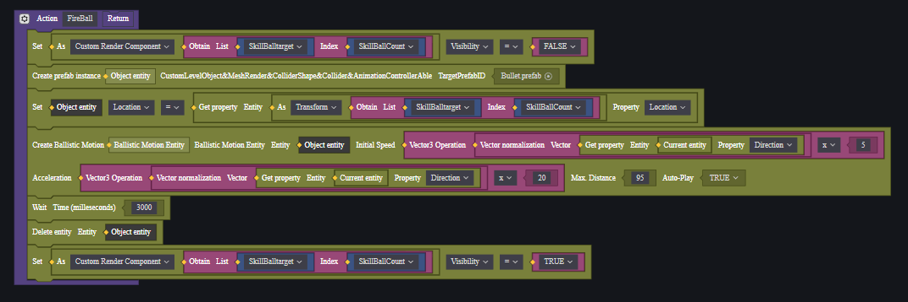

Thêm hiệu ứng cho đạn đã bắn ra bằng cách sử dụng hiệu ứng hình cầu và đặt nó làm con của đạn. Chỉnh sửa vị trí và kích thước của hiệu ứng một chút.

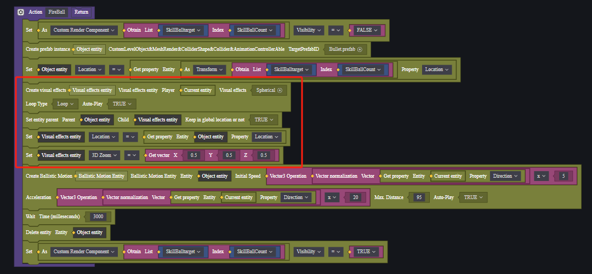

Vì hiệu ứng là con của đạn nên sẽ bị hủy cùng với đạn nên không cần xử lý logic hủy hiệu ứng riêng biệt.

Nhưng âm thanh chúng ta chọn tạo riêng và thêm logic hủy bỏ cho nó.

> Đây chỉ là minh họa cho mục đích giảng dạy; âm thanh cũng có thể xử lý giống như hiệu ứng.

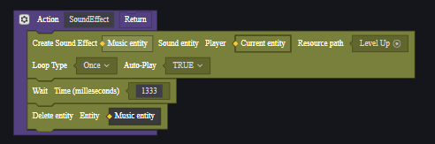

Gọi phương pháp âm thanh một lần khi người chơi bắn.

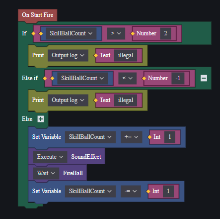

Ở đây cần chú ý đến thứ tự gọi hàm: cả hai phương pháp đều sử dụng nguyên tố bất đồng bộ: chờ đợi. Vì vậy cả hai phương pháp đều là hàm bất đồng bộ nhưng yêu cầu âm thanh phát cùng lúc với việc bắn đạn; đạn phải được bắn ngay sau đó. Mỗi viên đạn có logic độc lập nên phương pháp âm thanh được chọn cách thực thi ngay lập tức trước phương pháp đạn. Phương pháp đạn được đặt cách thực thi chờ đợi tức là sau khi hủy đạn mới tăng bộ đếm lên 1 để nó có thể được bắn lại.

### Kiểm tra hoạt động

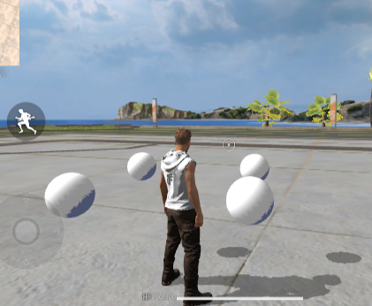

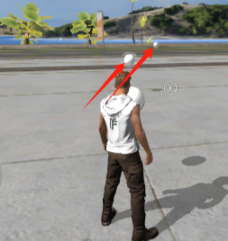

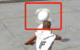

Đúng như mong đợi.

> Ví dụ này chỉ dùng để minh họa hệ thống phát; nhu cầu tương tự trong thực tế có thể được thực hiện bằng các cách khác nhau. 