# Nhận biết cửa sổ của trình chỉnh sửa

## Giao diện quản lý dự án

### Bố cục

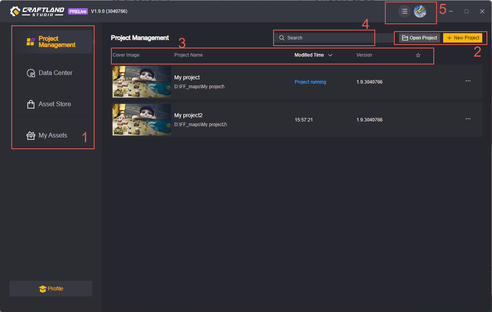

### Giới thiệu bố cục

#### 1. Dự án và các giao diện khác

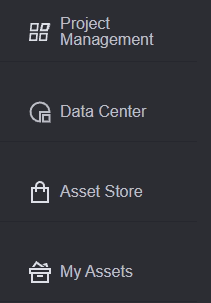

Trong cửa sổ quản lý dự án, có bốn tab, bao gồm:

1. Quản lý dự án, quản lý các dự án cục bộ.
2. Trung tâm dữ liệu, dữ liệu của bản đồ đã được xuất bản bởi tài khoản hiện tại.
3. Chợ tài nguyên, cung cấp các tài nguyên cần thiết cho phát triển trò chơi.
4. Tài nguyên của tôi, quản lý các tài nguyên mà tài khoản hiện tại đã mua.

Bài viết này sẽ giới thiệu về nội dung trong **1. Quản lý dự án**.

#### 2. Tạo/Dự án mở

##### Tạo dự án mới

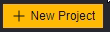

Nhấn vào nút tạo dự án mới để mở giao diện tạo dự án.

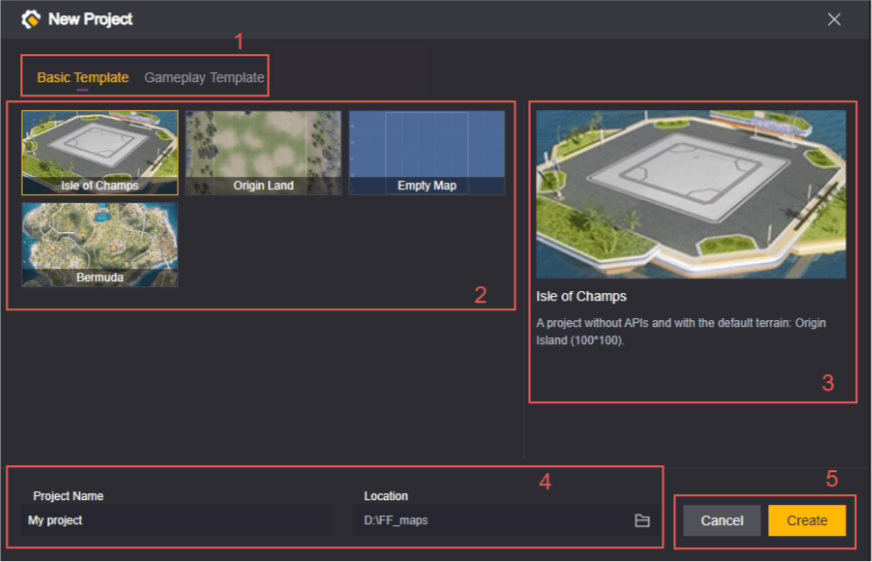

1. **Loại mẫu**, chúng tôi đã chuẩn bị một số loại mẫu, trong đó:

   Mẫu cơ bản là các mẫu không chứa mã nguồn. Chúng tôi cung cấp một số bản đồ ban đầu, với các kích thước và cảnh thiết lập khác nhau, bạn có thể chọn theo nhu cầu.

   Mẫu chơi là các mẫu có mã nguồn trò chơi, cung cấp các lối chơi mở rộng phổ biến, bạn có thể sử dụng trực tiếp hoặc tùy chỉnh theo nhu cầu.

2. **Chọn mẫu**, sau khi chọn loại mẫu, bạn có thể chọn mẫu cụ thể, mô tả mẫu sẽ được hiển thị tại mục 3.

3. **Mô tả mẫu**, giới thiệu ngắn gọn về mẫu này.

4. **Tên dự án và đường dẫn lưu trữ dự án**, bạn có thể tự do đặt tên và chỉnh sửa đường dẫn, nhưng cần đảm bảo không có dự án trùng tên trong cùng đường dẫn (dù sử dụng mẫu giống hay khác), nếu không sẽ có cảnh báo:

   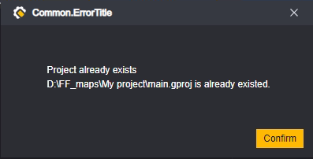

5. **Hủy và Tạo**, nhấn hủy sẽ đóng cửa sổ này và tất cả các chỉnh sửa sẽ không được lưu. Nhấn tạo sẽ tạo một dự án mới theo cài đặt hiện tại và tự động mở nó.

##### Mở dự án

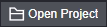

Mở dự án sẽ mở dự án hiện có trong hệ thống của bạn và thêm nó vào danh sách quản lý dự án của bạn.
Nhấn vào nút **Mở dự án** sẽ hiển thị giao diện chọn tệp của hệ thống, bạn cần chọn thư mục dự án, thường được đặt tên theo tên dự án, và thư mục con của nó là các tệp và thư mục trong dự án của bạn.
Ví dụ như thư mục My project là một thư mục dự án:

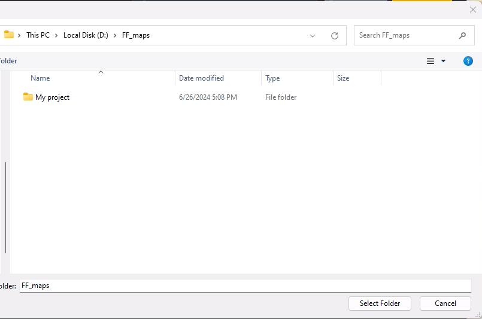

Cấu trúc thư mục bên dưới của nó nên là:

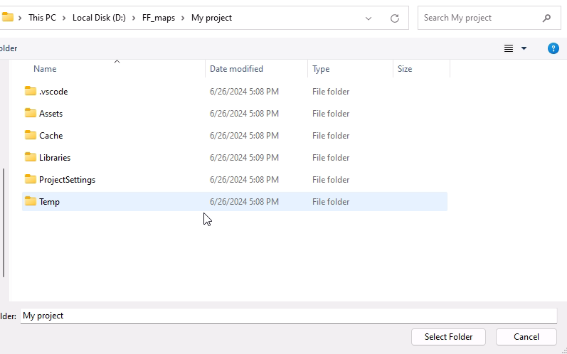

> Đây là một dự án mới được tạo trống, nếu là dự án đã chỉnh sửa thì cấu trúc có thể khác

Chọn My project hoặc sau khi mở rộng cấp thư mục đó mà không chọn tệp hoặc thư mục nào khác thì đều có thể mở dự án thành công. Nếu mở sai cấp thư mục hoặc dự án không đầy đủ sẽ có cảnh báo:

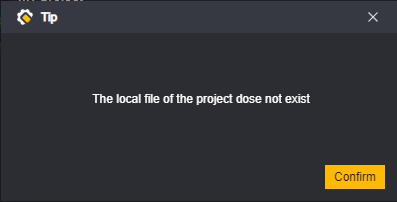

Trong một số trường hợp, có thể xuất hiện một số thông báo, chúng không ngăn bạn mở dự án, nhưng bạn có thể gặp vấn đề khi chỉnh sửa dự án đó.

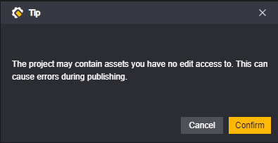

#### 3. Sắp xếp dự án

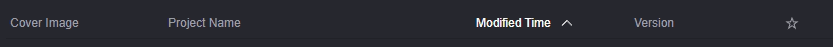

Tất cả các dự án bạn tạo hoặc mở sẽ được lưu trong giao diện chính của quản lý dự án, bạn có thể sắp xếp chúng.

Sắp xếp theo tên dự án, có thể chuyển đổi giữa thứ tự xuôi và ngược.

Sắp xếp theo thời gian chỉnh sửa, có thể chuyển đổi giữa thứ tự xuôi và ngược.

Sắp xếp theo phiên bản dự án, có thể chuyển đổi giữa thứ tự xuôi và ngược.

Bạn có thể nhấn vào nút ngôi sao trong dự án để đánh dấu yêu thích:

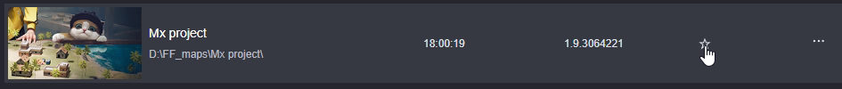

Kích hoạt menu yêu thích để đưa các dự án đã đánh dấu yêu thích lên đầu danh sách hiển thị

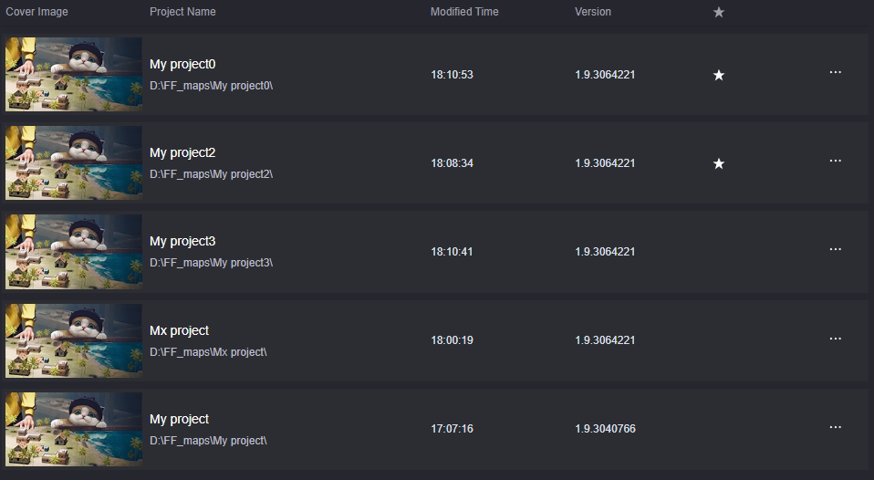

Dự án đã đánh dấu yêu thích và chưa đánh dấu sẽ được sắp xếp ngược lại theo thời gian chỉnh sửa

> Chỉ có thể sử dụng một quy tắc sắp xếp cùng lúc
> Yêu thích cũng là một quy tắc sắp xếp, không thể hoạt động đồng thời với các sắp xếp khác

#### 4. Tìm kiếm dự án hiện có

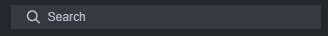

Có thể tìm kiếm các dự án đã lưu, tìm kiếm sẽ đồng thời khớp với tên dự án và đường dẫn dự án, chỉ những dự án có tên hoặc đường dẫn chứa nội dung nhập vào ô tìm kiếm mới được hiển thị.

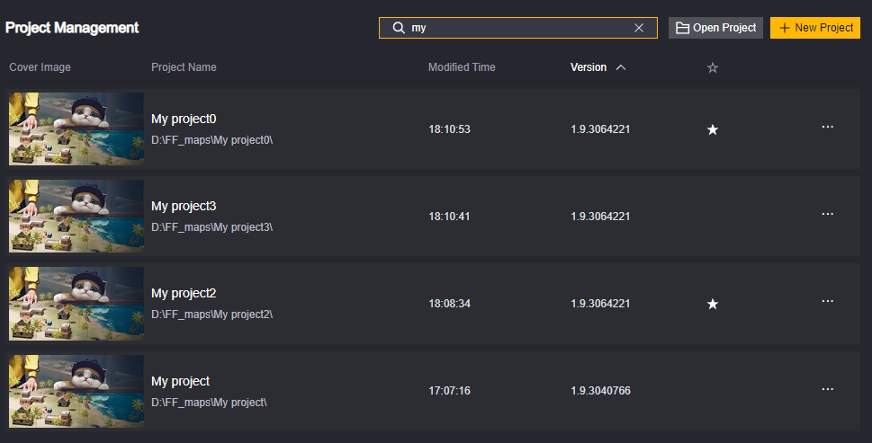

Các dự án được tìm kiếm sẽ được sắp xếp ngược lại theo thời gian chỉnh sửa, tức là dự án chỉnh sửa gần nhất sẽ xuất hiện trên cùng.

> Khi tìm kiếm, các cài đặt sắp xếp khác sẽ không có hiệu lực

#### 5. Cài đặt và người dùng

##### Cài đặt

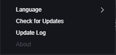

​	**Ngôn ngữ**, có thể thay đổi ngôn ngữ hiển thị của giao diện quản lý dự án và giao diện chỉnh sửa dự án theo thời gian thực. Tuy nhiên, ngôn ngữ thay đổi theo thời gian thực sẽ không áp dụng cho các trường tùy chỉnh.

​	**Kiểm tra cập nhật**, có thể kiểm tra xem có phiên bản chỉnh sửa nào cao hơn không.

​	**Nhật ký cập nhật**, có thể xem nội dung cập nhật.

​	**Thông tin**, vui lòng đợi thông tin mới.

##### Người dùng

Có thể thực hiện các thao tác với người dùng đã đăng nhập. Bạn cần đăng nhập để sử dụng trình chỉnh sửa dự án bình thường.

### Thao tác với dự án

Nhấp chuột phải vào dự án để mở bảng điều khiển thao tác với dự án

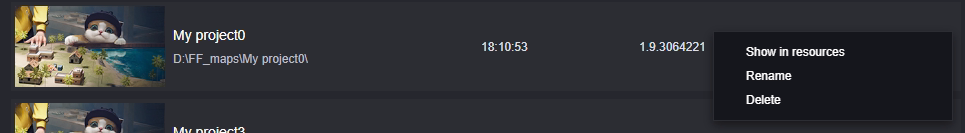

**Mở trong trình quản lý tài nguyên:** Duyệt qua dự án trong trình quản lý tài nguyên cục bộ

**Đổi tên:** Đổi tên dự án.

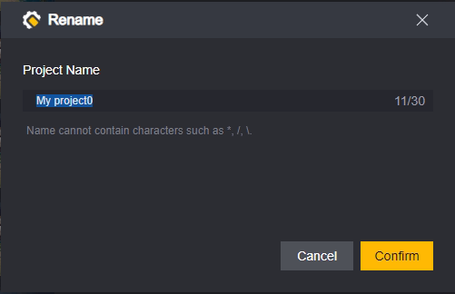

> Tên dự án không thể chứa các ký tự đặc biệt đã được cảnh báo

**Xóa:** Xóa dự án

Nhấn vào xóa sẽ hiện ra hộp thoại xác nhận lần hai

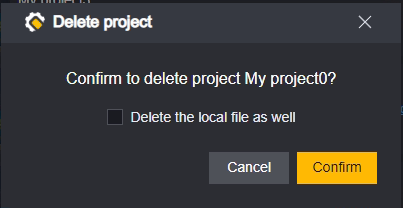

Nhấn chọn **Xóa tệp cục bộ**, sẽ xóa thư mục dự án khỏi bộ lưu trữ cục bộ của bạn.
Không chọn **Xóa tệp cục bộ**, thư mục dự án vẫn sẽ tồn tại trên máy tính của bạn, bạn có thể thêm nó lại vào bảng quản lý bằng cách mở dự án.

### Mở nhiều dự án

Nhấn vào dự án sẽ mở dự án đó, hỗ trợ mở nhiều dự án cùng lúc.

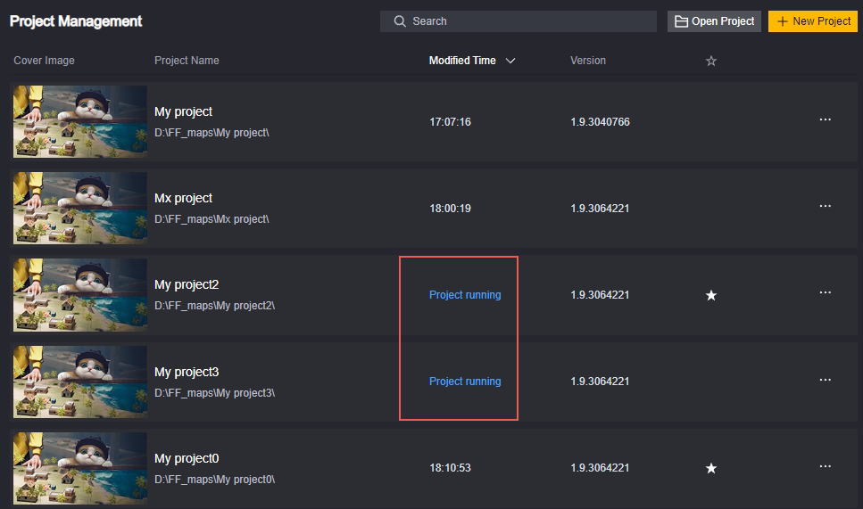

> Khi mở nhiều dự án, cần lưu ý bạn đang chỉnh sửa đúng dự án cần chỉnh sửa

## Giao diện chỉnh sửa dự án

### Bố cục

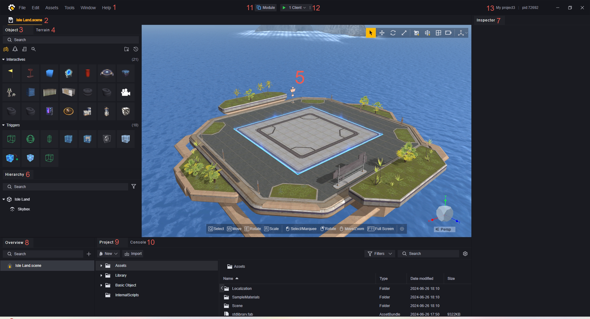

> Trong đó, các mục 3-7 là các yếu tố đặc trưng của trình chỉnh sửa cảnh, sẽ được giải thích chi tiết trong các bài viết khác
>
> Tất cả các cửa sổ hỗ trợ kéo cạnh để thay đổi kích thước, giúp bạn tập trung hơn vào việc chỉnh sửa một khía cạnh cụ thể.

### Giới thiệu bố cục

#### 1. Menu

Menu là các thao tác đối với toàn bộ dự án, có một số phân loại như sau:

1. Tệp tin: Thực hiện thao tác trên tệp tin của dự án, thực hiện cài đặt hệ thống, thoát khỏi chế độ chỉnh sửa dự án.
2. Chỉnh sửa: Lưu, hoàn tác, khôi phục thao tác trên toàn bộ dự án, thực hiện thao tác chỉnh sửa trên các đối tượng được chọn.
3. Tài sản: Thực hiện thao tác nhập xuất tài sản và mua sắm trực tuyến.
4. Công cụ: Cung cấp các công cụ sử dụng cho các nhà phát triển, có thể chọn sử dụng theo nhu cầu.
5. Trợ giúp: Cung cấp hướng dẫn sử dụng, tài liệu giải thích và các hỗ trợ khác.

#### 2. Tab Tệp Tin

Tất cả các tệp tin mở, không phân biệt loại, sẽ được sắp xếp lần lượt ở các tab.

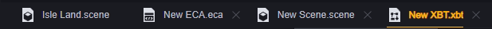

Các tệp tin đã được sửa đổi nhưng chưa lưu sẽ được đánh dấu bằng “*”. Chỉ có việc sửa đổi nội dung tệp tin (hoặc xóa tệp tin) mới được đánh dấu, việc thay đổi vị trí lưu tệp tin, thứ tự các tab sẽ không được đánh dấu.

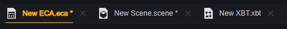

Tệp tin đang được chọn sẽ được đánh dấu bằng gạch chân màu vàng.

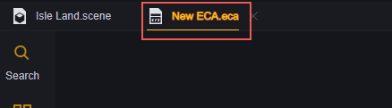

Tùy theo loại tệp tin được chọn, trang chính sẽ chuyển thành giao diện chỉnh sửa tương ứng với loại tệp tin. Bao gồm nhưng không giới hạn:

1. Chỉnh sửa cảnh
2. Chỉnh sửa kịch bản đồ họa
3. Chỉnh sửa cây hành vi
4. Bộ điều khiển hoạt ảnh
5. Dữ liệu người chơi
6. Tệp UI

Kéo thả các tab có thể điều chỉnh thứ tự sắp xếp các tab.

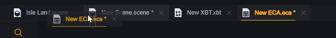

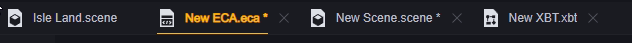

Khi số lượng tệp tin mở đạt đến một mức nhất định, bạn có thể cuộn qua các tab bằng con lăn chuột. Các nút nhanh để nhảy đến tab đầu tiên/cuối cùng cũng sẽ xuất hiện ở đầu và cuối của các tab.

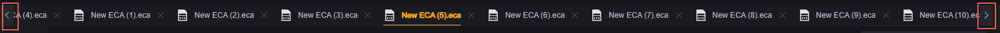

Nhấp chuột phải vào tệp tin trên tab có thể mở menu thao tác.

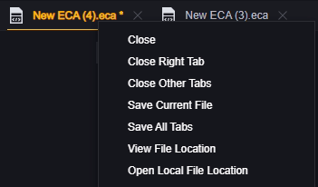

Trong đó, đóng tab bên phải sẽ đóng tất cả các tab bên phải của tệp tin đó, đóng các tab khác sẽ đóng tất cả các tab ngoại trừ tab hiện tại.

> Cảnh chính sẽ không bị đóng.
> Các tệp tin đã sửa đổi nhưng chưa lưu sẽ lần lượt xuất hiện thông báo.

Xem vị trí tệp tin sẽ định vị đến tệp tin đó trong giao diện 9. Tài sản dự án.

Mở vị trí tệp tin cục bộ sẽ định vị đến tệp tin đó trên máy tính của bạn.

#### 3. Trình Chọn Đối Tượng

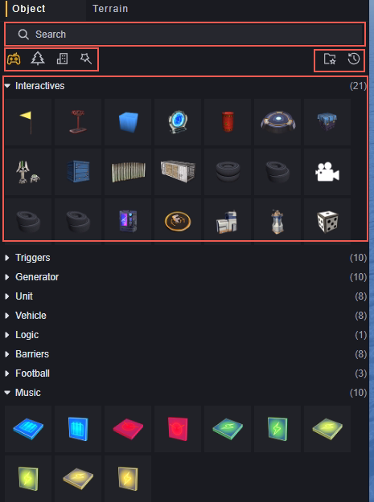

Trình chọn đối tượng là trình chỉnh sửa tệp cảnh, bạn có thể chọn các đối tượng cần đặt trong cảnh.

Chúng tôi cung cấp một số phân loại, bao gồm:

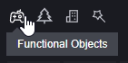

Đối tượng có chức năng:

Đối tượng có logic nhất định, có thể được sử dụng để xây dựng gameplay.

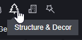

Cấu trúc và trang trí:

Các cấu trúc hoặc đồ trang trí độc lập, không có logic.

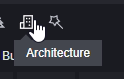

Liên quan đến xây dựng:

Xây dựng hoặc đồ nội thất hoàn chỉnh, không có logic.

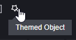

Đối tượng theo chủ đề:

Cấu trúc hoặc trang trí theo chủ đề, phân loại theo chủ đề. Có thể được sử dụng để tạo ra không khí của một chủ đề cụ thể, không có logic.

Đối tượng thường dùng:

Bạn có thể nhấp chuột phải để đặt một số đối tượng làm thường dùng, sau đó xem trong phần đối tượng thường dùng:

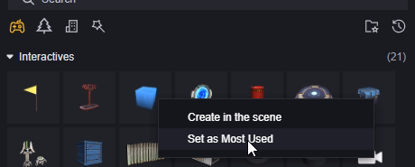

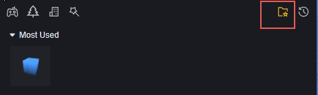

Các đối tượng đã được đặt làm thường dùng có thể hủy bỏ cài đặt này.

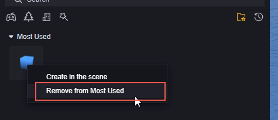

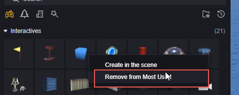

Đối tượng hỗ trợ tìm kiếm.

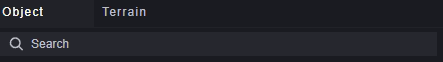

> Cách sắp xếp đối tượng trong cảnh sẽ được giải thích chi tiết trong các bài viết khác.
#### 4. Trình Chỉnh Sửa Địa Hình

Có thể chỉnh sửa địa hình của cảnh, chẳng hạn như xây dựng các đỉnh núi và thung lũng.

> Sẽ được giải thích chi tiết trong các bài viết khác.

#### 5. Trình Chỉnh Sửa Cảnh

Trình chỉnh sửa cảnh có thể hiển thị trực quan các yếu tố trong cảnh hiện tại.
Bạn có thể chỉnh sửa cảnh thông qua 3. Trình Chọn Đối Tượng và 4. Trình Chỉnh Sửa Địa Hình.

> Sẽ được giải thích chi tiết trong các bài viết khác.

#### 6. Cấp Độ (Hierarchy)

Cấp độ hiển thị tất cả các đối tượng tùy chỉnh trong cảnh và mối quan hệ cấp bậc của chúng. Có thể xây dựng mối quan hệ cha-con của các đối tượng thông qua menu cấp độ.

> Sẽ được giải thích chi tiết trong các bài viết khác.

#### 7. Thuộc Tính (Inspector)

Khi chọn một đối tượng trong 5. Trình Chỉnh Sửa Cảnh, bảng thuộc tính sẽ hiển thị tất cả các thành phần của thực thể đó.

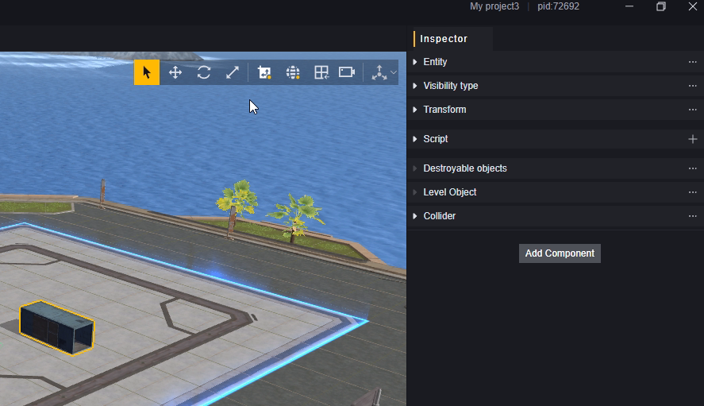

Bạn có thể chỉnh sửa các tham số của thành phần, thêm hoặc xóa các thành phần tùy chỉnh tại đây.

> Sẽ được giải thích chi tiết trong các bài viết khác.

#### 8. Tổng Quan

Tổng quan hiển thị các loại tệp tin trong dự án của bạn, phụ thuộc vào loại tệp tin bạn đã chọn trong 2. Tab Tệp Tin. Hình dưới đây là trường hợp chọn tệp kịch bản đồ họa:

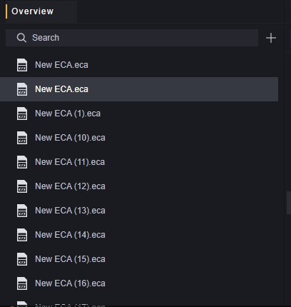

Khi bạn nhấp đúp vào bất kỳ tệp tin nào trong tổng quan, nó sẽ được mở để chỉnh sửa. Nếu tệp tin này chưa được mở trong 2. Tab Tệp Tin, nó sẽ được mở, nếu đã mở nhưng chưa được chọn, nó sẽ nhảy đến và chọn tệp tin đó.

Khi chỉnh sửa bất kỳ tệp tin nào trong tab, tệp tin tương ứng trong tổng quan sẽ tự động được làm nổi bật. Sự nổi bật này sẽ sáng hơn so với việc chọn thủ công trong tổng quan:

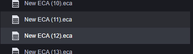

Đang chỉnh sửa là New ECA(12).eca, trong tổng quan chọn là New ECA(11).eca.

Nhấp chuột phải vào bất kỳ tệp tin nào trong tổng quan, bạn có thể thực hiện các thao tác sau:

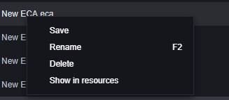

Lưu, đổi tên, xóa hoặc duyệt tài nguyên của tệp tin đó trên máy tính của bạn.

Tổng quan hỗ trợ tìm kiếm, điều này chủ yếu dùng để xác định tệp tin cụ thể khi có quá nhiều tệp tin cùng loại.

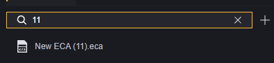

Nhấp vào nút dấu cộng trong tổng quan sẽ tạo một tệp tin mới của loại đó. Tệp tin mới sẽ được lưu vào thư mục tương ứng:

| Loại Tệp Tin   | Đuôi        | Thư Mục              |
| -------------- | ------------ | -------------------- |
| Kịch bản Đồ Họa | .eca        | Assets/ECA           |
| Cây Hành Vi     | .xbt        | Assets/XBT           |
| Cảnh            | .scene      | Assets/Scene         |
| Bộ Điều Khiển Hoạt Ảnh | .ac         | Assets              |
| Dữ Liệu Người Chơi   | .playerdata | Không hỗ trợ tạo mới |
| Tệp UI          | .ui         | Assets/UI            |

#### 9. Tài Sản Dự Án

Tài sản dự án hiển thị các tệp tài sản trong dự án của bạn. Bạn có thể phân loại vị trí của các tệp tin để dễ dàng tìm thấy tài nguyên cần thiết.

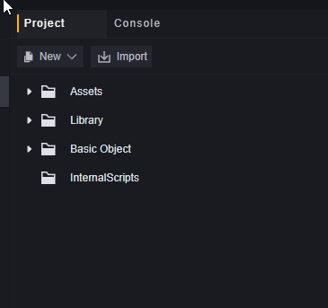

Trong đó, nội dung của thư mục Assets có thể tùy chỉnh, các thư mục khác không thể thay đổi. Bạn có thể xem các tài sản chính thức không thể thay đổi này.
Trình chỉnh sửa chỉ nhận diện các thư mục tương ứng trong tệp cục bộ, các thư mục khác trong dự án sẽ không xuất hiện trong trình chỉnh sửa.

Thư mục Assets trong dự án trống mới như hình dưới đây:

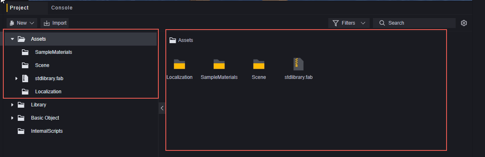

Khu vực bên trái là cấu trúc thư mục, chỉ có thư mục mới xuất hiện bên trái. Bên phải là các tệp tin cụ thể, cả thư mục và tệp tin đều hiển thị ở bên phải. Bên phải có thể phóng to hoặc thu nhỏ bằng cách Ctrl + cuộn chuột. Chúng tôi đã thêm một tệp ECA và thu nhỏ nó.

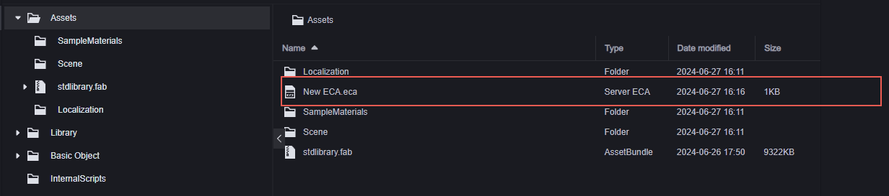

Tại cấu trúc thư mục, bạn có thể tạo nội dung mới bằng nút Tạo mới, hoặc nhập tài sản của bạn từ máy tính bằng nút Nhập.

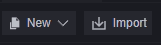

Đối với thao tác tạo mới, nhấp chuột phải vào thư mục và chọn Tạo mới, hoặc nhấp chuột phải vào khu vực trống trong vùng tệp và chọn Tạo mới, đều tạo nội dung mới trong thư mục chỉ định.

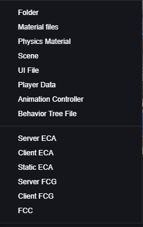

> Đây là danh sách nội dung mới dựa trên phiên bản v1.9.0, các loại tệp được hỗ trợ có thể khác nhau tùy theo phiên bản.

#### 10. Bảng Điều Khiển

Dùng để hiển thị các thông báo, cảnh báo và lỗi toàn cục của trò chơi. Trong 12. Gỡ Lỗi cũng có một bảng điều khiển, chủ yếu dùng để hiển thị thông tin trong một lần chạy trò chơi.

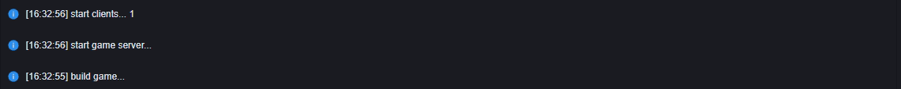

Sử dụng bảng điều khiển, bạn có thể nhận được thời điểm xảy ra ở các nút khác nhau, cùng với cảnh báo và thông tin lỗi, giúp trong quá trình gỡ lỗi.

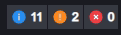

Nhấp vào phân loại sẽ bật/tắt hiển thị của phân loại đó.

Sử dụng tìm kiếm sẽ hiển thị thông tin gợi ý có chứa nội dung tìm kiếm trong các phân loại đã hiển thị, và phân loại bên phải cũng sẽ trở thành kết quả tìm kiếm.

#### 11. Mô-đun

Trong phần mô-đun, bạn có thể quản lý các mô-đun của dự án. Một số mô-đun quan trọng đã được tải sẵn, và cũng cung cấp một số mô-đun tùy chọn có thể sử dụng theo nhu cầu.

Đối với các mô-đun chưa được tải, bạn có thể tải chúng bằng nút tải. Phân loại trang sẽ được làm mới khi chuyển đổi tab.

Các mô-đun đã được tải, một phần không hỗ trợ gỡ bỏ, các mô-đun hỗ trợ gỡ bỏ có thể được gỡ bỏ bằng nút gỡ bỏ. Phân loại trang sẽ được làm mới khi chuyển đổi tab.

Khi gỡ bỏ mô-đun, cần lưu ý xem liệu mô-đun đó có được sử dụng trong API, sự kiện hoặc tài sản nào không, việc gỡ bỏ trực tiếp mô-đun có thể gây ra các hành vi không mong muốn.

> Giới thiệu về các nội dung mô-đun quan trọng sẽ được giải thích chi tiết trong các bài viết khác.

#### 12. Gỡ Lỗi

Gỡ lỗi là cách để xem nội dung trò chơi một cách trực quan và xác nhận xem các biểu hiện có đáp ứng mong đợi không. Sử dụng gỡ lỗi sẽ mở ít nhất một tiến trình trò chơi, bạn có thể kiểm tra xem tình trạng chạy của trò chơi có đúng như mong đợi không.

Khi sử dụng gỡ lỗi, toàn bộ dự án sẽ được tự động lưu.

Gỡ lỗi hỗ trợ nhiều khách hàng cùng lúc, chọn số lượng khách hàng, sẽ mở số lượng khách hàng tương ứng, các khách hàng này sẽ được coi là các người chơi khác nhau tham gia vào trò chơi. Tối đa hỗ trợ tám khách hàng chạy cùng lúc.

Gỡ lỗi có một số tùy chọn cấu hình có thể được thay đổi để đạt được môi trường gỡ lỗi theo nhu cầu của bạn.

> Gỡ lỗi sẽ được giải thích chi tiết trong các bài viết khác.

#### 13. Thông Tin Cơ Bản

Thông tin cơ bản hiển thị tên dự án hiện tại và ID dự án.