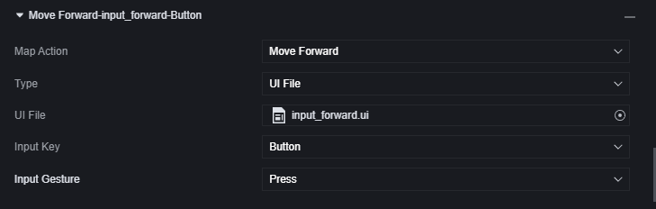
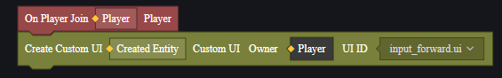

# Hệ Thống Nhập Liệu - Sổ Tay Người Dùng

Hệ thống nhập liệu là một mô-đun mặc định, có thể thay đổi cấu hình để ánh xạ lại thao tác trong game.

## Nút Chung Trong Trận

Trong game có sẵn một bộ nút chung trong trận, giao diện mặc định này được tạo tự động và có thể dùng để điều khiển người chơi.

Có thể điều khiển hiển thị hoặc ẩn các nút chung trong trận thông qua script:

{
  "type": "a",
  "id": "A5dC35^!WzQibCaFKtGx",
  "extraState": {
    "X": 528,
    "L": [
      1,
      2,
      3
    ],
    "T": "SetPlayerHubSwitch",
    "OT": null
  },
  "inputs": {
    "P1": {
      "shadow": {
        "type": "tys",
        "id": "yQYArCczLxf9yw3FNXAT",
        "extraState": "Player"
      }
    },
    "P2": {
      "shadow": {
        "type": "ipe",
        "id": "-)h5GeGgU0{HBI{KpY[.",
        "extraState": "PlayerHudSwitchType",
        "fields": {
          "I": "MovementHUD"
        }
      }
    },
    "P3": {
      "shadow": {
        "type": "ipe",
        "id": "Spr.Q/3v;moE6P^U%6x2",
        "extraState": "CommonHudSwitchValue",
        "fields": {
          "I": "Close"
        }
      }
    }
  }
}

## Hệ Thống Nhập Liệu Tùy Chỉnh

Trong hệ thống nhập liệu có thể thêm hoặc xóa một mục nhập:

Đối với một mục nhập, có thể chọn loại nhập liệu là bàn phím, chuột hoặc tệp UI.

### Bàn Phím và Chuột

Nhập liệu từ bàn phím và chuột hiện chỉ có hiệu lực khi Debug trên PC, không giới thiệu thêm.

### UI Tùy Chỉnh

Đối với bản đồ tùy chỉnh, thao tác trong game chủ yếu thông qua ánh xạ lại UI tùy chỉnh.

Trong hệ thống nhập liệu, có thể liên kết một mục nhập với một điều khiển trên UI tùy chỉnh, nhờ đó sử dụng điều khiển của UI tùy chỉnh để thực hiện thao tác. Điều này sẽ giúp bạn tạo ra chế độ chơi độc đáo hoặc các cảnh muốn thay đổi cách nhập liệu của người chơi.

### Cách Cấu Hình Nhập Liệu Tùy Chỉnh

Lấy UI tùy chỉnh làm ví dụ, bạn cần chuẩn bị sẵn UI tùy chỉnh cho việc nhập liệu tùy chỉnh.

Chúng tôi tạo một UI chỉ có một nút dưới UI tùy chỉnh này, dự định cho nút này có tác dụng làm người chơi tiến lên.

Thêm một mục nhập mới trong mô-đun hệ thống nhập liệu.

Chọn thao tác ánh xạ là tiến lên, loại là tệp UI, chọn UI tùy chỉnh và nút đã tạo trước đó, cử chỉ nhập liệu là giữ.

Tạo UI tùy chỉnh cho người chơi, script phần tử này được tạo trên mô đun toàn cầu.

{
  "type": "e",
  "id": "*%pI`W(dS_piURm|VMA!",
  "extraState": {
    "X": 14,
    "L": [
      1
    ],
    "T": "OnPlayerAdd",
    "OT": null
  },
  "fields": {
    "P1": {
      "name": "Player",
      "type": "Player"
    }
  },
  "next": {
    "block": {
      "type": "a",
      "id": "rk0cKIssMKf0cmAf5K1b",
      "extraState": {
        "X": 34,
        "L": [
          1,
          2,
          3
        ],
        "T": "CreateCustomHud",
        "OT": null
      },
      "fields": {
        "P1": {
          "name": "Created Entity",
          "type": "CustomHud"
        }
      },
      "inputs": {
        "P2": {
          "shadow": {
            "type": "tys",
            "id": "zCSt9:DaP7Fym?RosxoY",
            "extraState": "Player"
          },
          "block": {
            "type": "lcg",
            "id": "9f?Pdkf6=$dO1G6psZ?%",
            "extraState": "*%pI`W(dS_piURm|VMA!P1",
            "fields": {
              "VR": "Player"
            }
          }
        },
        "P3": {
          "shadow": {
            "type": "pkh",
            "id": "bjBa_(1|Qv}i=[l#w=p7",
            "fields": {
              "HD": "02xr50iei5df-m11x1qdn-kqt9qw8jx19"
            }
          }
        }
      }
    }
  }
}

Chạy trò chơi, phát hiện chức năng của nút này đã hoạt động bình thường.

