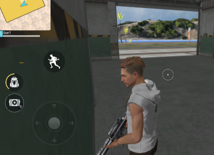
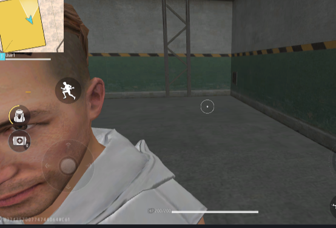
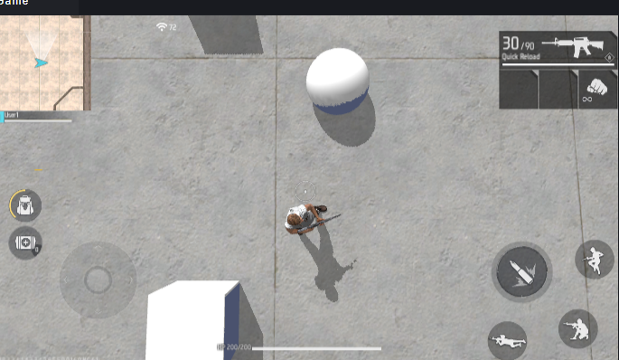
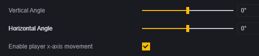
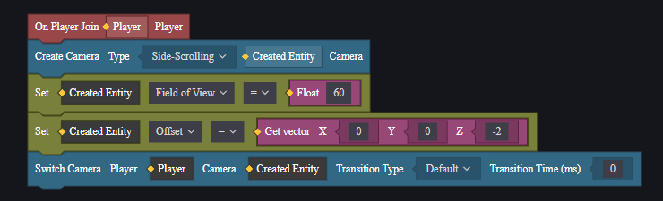
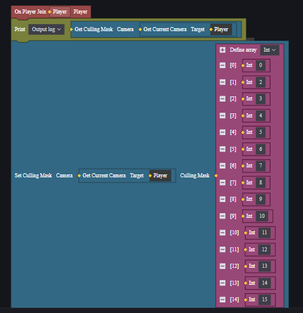

# Hướng dẫn sử dụng camera

Người chơi sử dụng camera để quan sát trận đấu trong game, việc sử dụng các chế độ camera và thông số khác nhau có thể mang lại trải nghiệm hình ảnh khác biệt.

## Mô-đun camera

Mô-đun camera là mô-đun mặc định, không cần tải thêm.

Bạn có thể cấu hình camera chính trong mô-đun camera.

## **Chế độ camera**

Trong mô-đun camera, sau khi chọn chế độ camera, bạn có thể điều chỉnh thêm các thông số của chế độ đó.

Trong các thông số, có một số thông số chung cho các chế độ camera:

### Cấu hình chung

**Loại giới hạn góc xoay ống kính**: Chọn giữ nguyên logic gốc, camera sẽ giới hạn góc xoay của người chơi. Chọn WideRange, giới hạn này sẽ được nới lỏng.

**Phạm vi tầm nhìn**: Góc mà camera có thể nhìn thấy.

**Chế độ che chắn**: Ngoài camera góc nhìn thứ nhất, cách xử lý khi có vật cản giữa camera và nhân vật người chơi. Có ba cách: cố định, đẩy gần và xuyên thấu.

> Khi này, nếu tiếp tục xoay camera, nó sẽ bị tường chặn lại.

Trong chế độ cố định, dù có vật cản giữa camera và nhân vật người chơi cũng không xử lý.

Trong chế độ đẩy gần, camera sẽ thay đổi vị trí của mình, như bị vật cản ép sát vào nhân vật người chơi.

Trong chế độ xuyên thấu, nhân vật người chơi sẽ được đánh dấu bằng viền đỏ.

**Chế độ chiếu**: Trong chế độ xuyên thấu, khi xử lý sự vật, camera sử dụng quy tắc gần lớn xa nhỏ như thực tế. Trong chế độ trực giao, quy tắc này không được áp dụng.

> Chế độ xuyên thấu

> Chế độ trực giao thường áp dụng cho game đi cảnh ngang có yêu cầu đặc biệt về cảnh quan.

**Độ lệch**: Trong các camera hỗ trợ thiết lập độ lệch, khi độ lệch là (0, 0, 0) thì đó là vị trí mặc định ban đầu của camera. Bằng cách điều chỉnh thông số này, bạn có thể điều chỉnh vị trí mặc định của camera.

### Camera góc nhìn thứ ba

Camera góc nhìn thứ ba có khoảng cách nhất định với người chơi và sẽ hiển thị nhân vật người chơi. Trong chế độ mặc định của camera góc nhìn thứ ba, người chơi có thể tự do xoay camera và lệnh di chuyển về phía trước của người chơi sẽ khiến nhân vật tiến về hướng mà camera đang quan sát.

> Nhân vật sẽ quay về hướng di chuyển trước rồi mới tiến lên.

#### FF cổ điển

FF cổ điển giống như trong game FreeFire với camera góc nhìn thứ ba. Chế độ FF cổ điển không thể thay đổi thông số.

#### Theo sau lưng

Camera theo sau lưng luôn hướng về phía sau lưng người chơi. Trong chế độ này, hướng ngang của nhân vật luôn bằng hướng ngang của camera và thao tác xoay camera cũng đồng thời xoay nhân vật người chơi.

### Camera góc nhìn thứ nhất

Vị trí của camera góc nhìn thứ nhất trùng với nhân vật người chơi, giống như quan sát thế giới game từ góc nhìn của nhân vật. Camera góc nhìn thứ nhất mặc định không hỗ trợ điều chỉnh phạm vi tầm nhìn.

#### Tài nguyên mới cho góc nhìn thứ nhất

Ở phần dưới của mô-đun, bạn có thể sử dụng tài nguyên mới cho góc nhìn thứ nhất.

Khi tài nguyên mới cho góc nhìn thứ nhất được chọn, camera sẽ luôn hiển thị đôi tay thay vì chỉ hiển thị khi thực hiện hành động như trước đây.

#### FF cổ điển

Camera góc nhìn thứ nhất FF cổ điển giống với góc nhìn thứ nhất trong game FreeFire. Camera FF cổ điển có hiệu ứng động thay đổi phạm vi tầm nhìn khi di chuyển.

### Camera từ trên xuống

Camera từ trên xuống luôn hướng về mặt phẳng ngang trong trạng thái mặc định và sẽ theo dõi chuyển động của người chơi khi di chuyển.

### Camera ngang

Camera ngang trong trạng thái mặc định luôn hướng về trục Z dương trong hệ tọa độ thế giới và sẽ di chuyển cùng với người chơi.

Camera ngang có cấu hình độc đáo:

**Góc nghiêng và góc ngang**: Có thể điều chỉnh góc ban đầu của camera. Sau khi cấu hình xong, camera sẽ giữ nguyên góc này.

**Có cho phép người chơi di chuyển theo trục X không**: Khi bật lên, lệnh di chuyển vào trong và ra ngoài màn hình sẽ bị chặn lại; người chơi chỉ có thể di chuyển sang hai bên trái phải của màn hình.

### Camera tự do

Trong chế độ camera tự do, lệnh di chuyển của người chơi sẽ điều khiển camera thay vì nhân vật. Trong trạng thái mặc định, điều khiển góc dọc của camera tự do bị đảo ngược.

### Camera tùy chỉnh

Camera tùy chỉnh chỉ theo dõi người chơi mà không có chức năng khác; hiệu suất khi sử dụng phụ thuộc vào cấu hình của bạn.

## Script

Ngoài việc cấu hình cho camera chính, sử dụng script có thể điều chỉnh động các thông số của camera hoặc tạo mới hay chuyển đổi giữa các camera.

### Tạo & chuyển đổi camera

Bằng cách tạo một camera mới nhưng chưa đưa vào sử dụng nên không làm thay đổi gì đến trải nghiệm của người chơi hiện tại. 

Sau khi tạo xong có thể điều chỉnh thuộc tính để thay đổi hiệu suất của nó. 

Sử dụng chức năng chuyển đổi để bắt đầu sử dụng một chiếc mới đã được chỉ định sẵn trước đó .

### Lớp phủ

Camera có thể chọn lọc render các đối tượng trên bản đồ hoặc nhân vật bằng cách thay đổi cấp lớp phủ. Tất cả đơn vị hiển thị đều có thành phần hiển thị .

Thiết lập cấp lớp phủ trong thành phần này , sau đó sửa đổi cấp lớp phủ mà máy ảnh sẽ render .

> Theo mặc định , máy ảnh sẽ render tất cả các cấp lớp phủ ( 0 - 15 ) , nhưng không render cấp lớp phủ là 1 .

Bằng cách sửa đổi cấp lớp phủ , bạn có thể đạt được mục tiêu giấu đơn vị thuộc loại cụ thể , tiết kiệm hiệu suất , v.v .

Tuy nhiên , dù đơn vị không hiển thị nhưng vẫn tồn tại va chạm hoặc chức năng khác ; Người chơi vẫn bị chặn hoặc kích hoạt sự kiện va chạm bởi đối tượng không được render .
