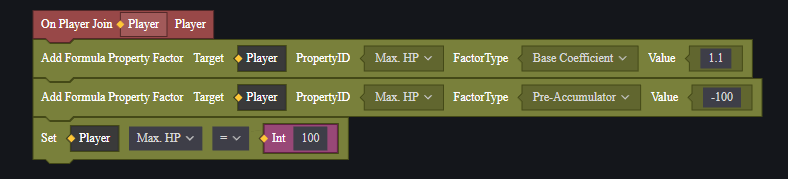
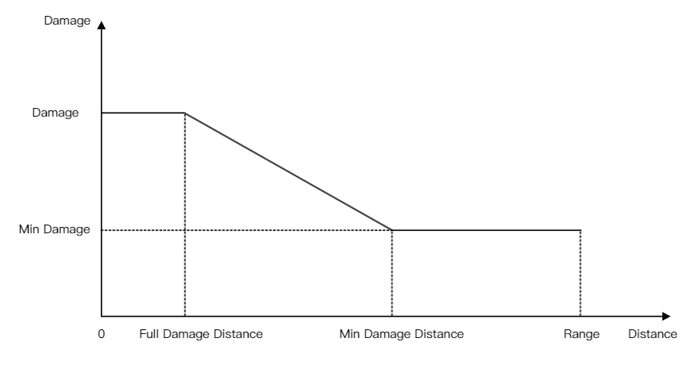

# 可计算属性-用户手册

在Craftland Studio PC中，玩家的部分属性与武器的属性是支持公式化计算的。这有助于实现较为复杂的数值运算。

对于支持公式计算的属性，它具有以下可计算参数：

```go
type Formula struct{
	minValue float32
	maxValue float32
	baseMul float32
	beforeAccumulator float32
	multiplier float32
	afterAccumulator float32
	SumMultiplier float32
}
```

计算逻辑如下：
$$
FinalValue=Min(maxValue,Max(minValue,(BaseValue×baseMul+beforeAccumulator)×multiplier×(1+SumMultiplier)+afterAccumulator))
$$


其中，BaseValue是这个属性的基础数值。

假设玩家最大生命值为200，在不设定任何参数的情况下，玩家的血量就是200。

在如下设定的情况下：

```
	baseMul = 1.1
	beforeAccumulator = -100.0
```

玩家最大生命等于：
$$
PlayerMaxHp = (200×1.1-100.0)×1×(1+0)+0=120
$$

# 设定可计算参数

在脚本中，可以为指定属性设置可计算参数或清除所有可计算参数：


如上文的例子为：


注意：设定可计算参数是为属性计算设定了一个公式，而非直接设定属性数值。

设置属性接口设置的是该属性的BaseValue，如果该属性已经被添加了公式，最后的结果将是公式计算后的结果。




# 武器伤害计算

武器伤害计算时也有一些公式，且公式参数已经开放为了武器属性，例如最小伤害、最小伤害距离。

## 武器基础伤害

与武器单发子弹的伤害相关的参数有：

1. 伤害值 Damage
2. 最小伤害 Min Damage
3. 最小伤害距离 Min Damage Distance
4. 满伤害距离 Full Damage Distance
5. 攻击距离 Range



在满伤害距离内时，武器造成全额伤害。在满伤害距离到最小伤害距离间，武器造成的伤害递减，在最小伤害距离时造成最小伤害。武器在攻击距离外无法造成伤害。

所有参数都有可能受到枪械配件(Attachments)或枪械皮肤(Skin)的影响，通常来说是直接对武器伤害参数进行加值。

## 击中部位伤害倍率调整

在武器击中角色不同部位时，伤害会有不同倍率的调整。

1. 在击中头部时，部位伤害倍率为5.5+爆头伤害偏移量，且伤害偏移量会随着距离进行衰减。
2. 在击中身体时，部位伤害倍率为1+躯干伤害偏移量。
3. 在击中四肢时，部位伤害倍率为0.75+四肢伤害偏移量。

在计算部位伤害倍率时，每个部位单独计算。假设单发子弹击中躯干造成30点伤害，如果躯干伤害偏移量设为1，现在在最大伤害距离内单发子弹就造成30*(1+1)=60点伤害。但是计算爆头伤害时要使用基础伤害的30乘爆头伤害倍率，而非躯干伤害偏移后的60。

## 计算修正后的伤害

 在一些情境下，武器造成的伤害还会有一次修正计算。

1. 配件特性：连续射击伤害递增，直至达到最大值。
2. 对倒地单位额外伤害。
3. 对特殊物件，如车、油桶、冰墙造成的额外伤害比例。

## 计算护甲减伤

如果被击中单位穿戴了护甲，还要计算一次护甲减伤。
$$
RealDamage *=  (1 - DmgReduction）
$$

$$
DmgReduction = DmgRedfactor* CurrentDurability/DurabilityMax*（1 - AromrPenetration）
$$

- DmgRedfactor: 装备属性，满减伤率。
- CurrentDurability: 装备属性，当前耐久，在给玩家造成伤害时，也会减去装备等值的耐久。
- DurabilityMax: 装备属性，总耐久。
- AromrPenetration: 武器穿甲 + 技能穿甲 + FS模式穿甲，穿甲范围[0,1]。

## 其他属性

实际进行战斗时，以下属性也会对玩家使用武器造成的伤害产生影响。

- 开火速率 
- 武器散射
- 准星恢复速度
- 子弹容量
- 辅助瞄准
- 武器对移速的影响
