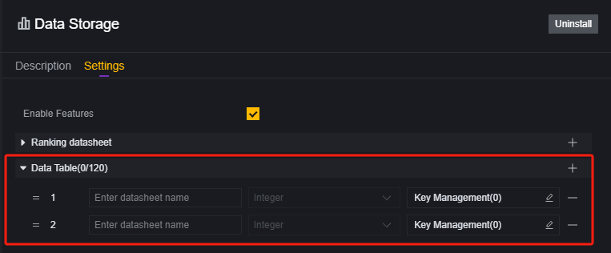
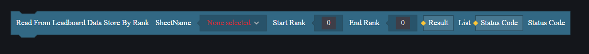
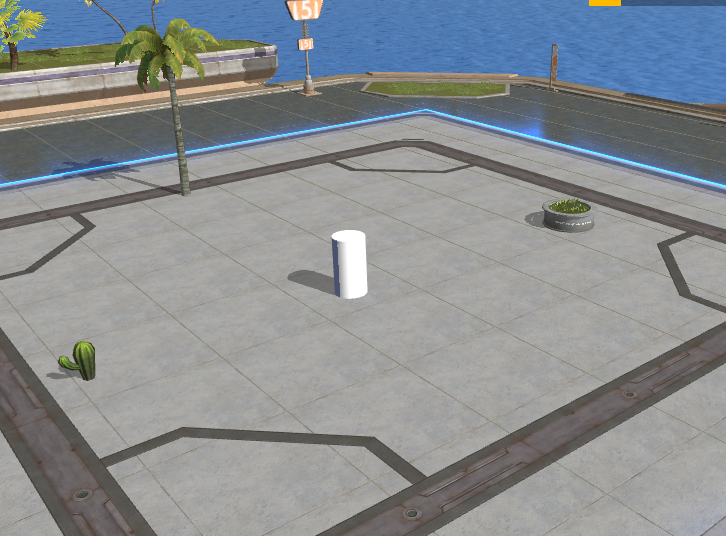
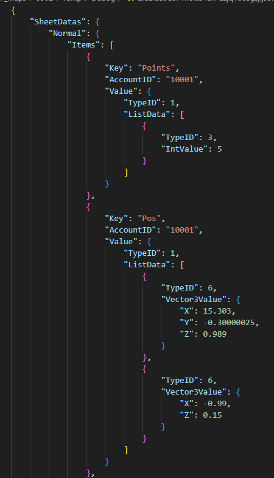

# Lưu trữ dữ liệu - Hướng dẫn người dùng

Lưu trữ dữ liệu có thể lưu dữ liệu ngoài tiến trình trò chơi và có thể sử dụng trong các chức năng như lưu trữ, xếp hạng, thống kê, lưu cài đặt trò chơi.

Ý nghĩa của lưu trữ dữ liệu là kết nối dữ liệu giữa các trận đấu khác nhau trên cùng một bản đồ.

## Tải mô-đun lưu trữ dữ liệu

Để sử dụng lưu trữ dữ liệu, cần tải mô-đun lưu trữ dữ liệu trước. Đây là một mô-đun tùy chọn, gỡ bỏ mô-đun này sẽ làm vô hiệu hóa các thành phần, mã và cấu hình liên quan đã sử dụng trước đó.

## Phân loại

Sau khi tải mô-đun lưu trữ dữ liệu, sẽ thấy ba cấu hình: lưu trữ dữ liệu xếp hạng, lưu trữ dữ liệu thống kê, và lưu trữ dữ liệu thông thường.

Bảng được tạo ra từ lưu trữ dữ liệu không thể duyệt trực tiếp, nhưng trong tài liệu này sẽ có hướng dẫn kiểu bảng.

### Lưu trữ dữ liệu thông thường

#### Giải thích tham số

Trong lưu trữ dữ liệu thông thường, thêm tham số, mỗi tham số đại diện cho một bảng dữ liệu, mỗi tham số có các mục cấu hình sau:

**Tên bảng**: Tên bảng được tạo

**Loại dữ liệu**: Loại dữ liệu mà bảng chấp nhận

Có thể thấy mỗi bảng dữ liệu chỉ chấp nhận một loại dữ liệu đầu vào.

#### Kiểu bảng

DataSheetName

| UUID | Key  | Value |
| ---- | ---- | ----- |
|      |      |       |

**DataSheetName**: Tên bảng được thêm trong mô-đun lưu trữ dữ liệu.

**UUID**: ID duy nhất của người chơi, khi ghi dữ liệu cần điền UUID của người chơi hiện tại.

**Key**: Chỉ mục được tạo bởi script khi thực hiện thao tác lưu trữ dữ liệu.

**Value**: Giá trị được điền bởi script khi thực hiện thao tác lưu trữ dữ liệu, chỉ chấp nhận loại đã thiết lập trong mô-đun lưu trữ dữ liệu.

#### Sử dụng trong trường hợp nào

Dùng để lưu trữ của người chơi.

Dùng trong các trường hợp khác có thể sử dụng dữ liệu từ bảng này.

### Lưu trữ dữ liệu xếp hạng

#### Giải thích tham số

Tương tự như cấu trúc của lưu trữ dữ liệu thông thường, nhưng lưu trữ dữ liệu xếp hạng chỉ chấp nhận đầu vào kiểu Int và cung cấp thêm chức năng sắp xếp. Bảng trong lưu trữ dữ liệu xếp hạng sẽ sắp xếp theo cách bạn đã cấu hình.

**Tên bảng**: Tên bảng được tạo.

**Cách sắp xếp**: Chọn sắp xếp tăng dần hay giảm dần giá trị kiểu Int đầu vào.

#### Kiểu bảng

**DataSheetName**

| Ranking | Key  | Value(Only Int) |
| ------- | ---- | --------------- |
| 1       |      |                 |
| 2       |      |                 |
| 3       |      |                 |

Lưu trữ dữ liệu xếp hạng không có UUID nhưng hỗ trợ KEY tùy chỉnh và giá trị chỉ chấp nhận đầu vào kiểu Int. Lưu trữ dữ liệu xếp hạng sẽ sắp xếp toàn bộ bảng dựa trên cột giá trị này.

#### Sử dụng trong trường hợp nào

Xếp hạng người chơi như xếp hạng tiêu diệt, xếp hạng điểm số, xếp hạng tốc độ.

### Lưu trữ dữ liệu thống kê

#### Giải thích tham số

Tương tự như cấu trúc của lưu trữ dữ liệu thông thường nhưng lưu trữ dữ liệu thống kê cũng chỉ chấp nhận đầu vào kiểu Int và phải thiết lập trước Key.

**Tên bảng**: Tên bảng được tạo.

**Quản lý Key**: Danh sách Key được thiết lập trước.

#### Kiểu bảng

DataSheetName

| **Key**  | **Value(Only Int)** |
| -------- | ------------------- |
| **KEY1** |                     |
| **KEY2** |                     |

Lưu trữ dữ liệu thống kê không có UUID, tất cả thông tin cùng Key sẽ được lưu vào cùng một dòng dữ liệu.

**Key**: Chỉ mục đã thiết lập trước.

**Value**: Giá trị, chỉ chấp nhận kiểu Int.

#### Sử dụng trong trường hợp nào

Thống kê toàn server như tổng số lần tiêu diệt BOSS, tổng tiền tiêu dùng.

## Cách sử dụng

### Thêm và sửa đổi

Thao tác thêm một dòng dữ liệu và sửa đổi một dòng trong bảng lưu trữ là giống nhau, đều sử dụng thành phần ghi vào.

Đối với lưu trữ dữ liệu xếp hạng và thống kê đều cần sử dụng thành phần tương ứng.

### Xóa

Xóa một dòng dữ liệu sử dụng thành phần xóa bỏ.

Các loại lưu trữ khác nhau sử dụng chỉ mục khác nhau cho việc xóa bỏ.

Lưu trữ dữ liệu thống kê vì đã thiết lập trước KEY nên không hỗ trợ xóa cả dòng mà chỉ có thể sửa đổi giá trị tương ứng với KEY đó.

### Tra cứu

Tra cứu cần sử dụng thành phần đọc vào, các loại lưu trữ khác nhau sử dụng chỉ mục khác nhau cho việc tra cứu.

Trong lưu trữ dữ liệu xếp hạng có thể lấy ra nhiều dòng dựa trên thứ hạng cùng lúc, kết quả trả về dưới dạng danh sách.

## Giới hạn sử dụng

Lưu trữ dữ liệu có một số giới hạn sử dụng:

1. Có giới hạn đọc/ghi mỗi phút: hỗ trợ đọc 60 lần/phút và ghi 75 lần/phút. Khi sử dụng cần giảm thiểu tần suất đọc/ghi và kiểm tra xem thao tác có thành công không.
2. Kích thước tối đa cho giá trị của một Key là 4k.
3. Lưu trữ dữ liệu xếp hạng tối đa chỉ chứa 150 dòng cho mỗi bảng; các dòng dư thừa sẽ không được ghi lại.
4. Lưu trữ dữ liệu thống kê tối đa chỉ hỗ trợ tạo 120 bảng.

## Trung tâm Dữ Liệu

Nếu bản đồ tùy chỉnh đã phát hành bật tính năng lưu trữ dữ liệu, bạn có thể xem tại trung tâm Dữ Liệu:

Mở phần lưu trữ của bản đồ tương ứng để duyệt qua các thông tin đang được lưu:

Tại trung tâm Dữ Liệu, thông tin được hiển thị dưới dạng bảng giúp bạn dễ dàng xem xét các loại thông tin:

Trong trung tâm Dữ Liệu của lưu trữ xếp hạng và thống kê có thể thiết lập để định kỳ dọn dẹp thông tin:

Tại trung tâm Dữ Liệu của thông tin xếp hạng và thống kê có thể nhập Key hoặc Value để tra cứu:

Nhưng với bảng thông thường phải nhập cả UID và Key mới tra cứu được:

Tra cứu tại trung tâm Dữ Liệu không hỗ trợ tìm kiếm mờ (fuzzy search).

Tại trung tâm Dữ Liệu cũng hỗ trợ thay đổi trực tiếp thông tin đã được lưu:

## Ví dụ minh họa

Tiếp theo là ví dụ đơn giản minh họa cách sử dụng lưu trữ để thực hiện việc ghi nhớ thông tin người chơi.

Chúng ta dự định tạo ra một trò chơi nhỏ đơn giản mà mỗi lần người chơi tấn công mục tiêu hình trụ sẽ nhận được 1 điểm số.

Trong bản ghi nhớ sẽ ghi lại vị trí của người chơi, hướng nhìn và điểm số; khi người chơi quay lại bản đồ này sẽ kế thừa thông tin từ bản ghi nhớ đó.

### Tạo trò chơi

Đầu tiên tạo ra trò chơi đơn giản:

Đặt một hình trụ mục tiêu trên sân khấu và thêm ba vật trang trí để định vị:

Mỗi lần người chơi đánh vào hình trụ trắng này sẽ nhận được 1 điểm số; điểm số hiện tại của người chơi sẽ hiển thị trên giao diện UI tùy chỉnh:

### Tạo bản ghi nhớ

Trong ví dụ này chúng ta chỉ lưu vị trí của người chơi, hướng nhìn và điểm số của họ. 

Điểm số đã được thiết lập là thuộc tính tùy chỉnh của người chơi; ba loại thông tin đều có thể lấy từ thực thể người chơi. 

Loại thông tin vị trí và hướng nhìn là Vector3; loại thông tin điểm số là Int. Cố gắng tránh dùng nhiều bảng để lưu thông tin người chơi vì mỗi bảng thêm vào sẽ làm tăng lượng đọc/ghi theo số lượng người chơi. Để tránh vượt quá giới hạn sử dụng chúng ta sẽ dùng danh sách kiểu bất kỳ để chứa hai loại thông tin này vào bản ghi nhớ. 

Chọn lựa chọn thông thường cho việc lưu giữ và thiết lập loại giá trị chấp nhận là danh sách kiểu bất kỳ. 

> Bạn cũng có thể dùng kiểu bất kỳ và chia làm ba Key để chứa thông tin nhưng vị trí và hướng nhìn thường đi cùng nhau nên ở đây dùng danh sách để chứa cả hai làm thông tin vị trí ban đầu và hướng nhìn của người chơi. 

Trong script toàn cục:

Khi kết thúc mỗi vòng trò chơi hoặc khi người chơi thoát ra thì thực hiện việc ghi nhớ cho họ:

Khi người chơi tham gia thì đặt điểm số, vị trí và hướng nhìn theo thông tin từ bản ghi nhớ đồng thời hiển thị điểm số hiện tại trên UI hiển thị điểm số:

Nếu vì lý do nào đó mà việc đọc thất bại cần xử lý lỗi đọc thất bại; ở đây chỉ in ra lỗi thất bại:

Chạy trò chơi bằng hai khách hàng thử nghiệm:

Sau khi đạt đủ điểm thì thoát khỏi trò chơi rồi quay lại bạn sẽ thấy điểm số và vị trí của người thoát vẫn giữ nguyên như trước khi thoát. 

Khi kết thúc vòng đấu thì thông tin người chơi sẽ được ghi nhớ bình thường nên nếu đợi đến khi trò chơi tự nhiên kết thúc rồi mở lại thì điểm số và vị trí của người chơi vẫn giữ nguyên như trước khi đóng trò chơi.

## Xem dữ liệu lưu trữ cục bộ

Dữ liệu lưu trữ được áp dụng cho bản đồ đã phát hành, thông thường chỉ có thể xem trong trung tâm dữ liệu.

Tuy nhiên, chúng tôi cung cấp một công cụ cho nhà phát triển để kiểm tra cục bộ:

Sau khi dự án của bạn sử dụng dữ liệu lưu trữ và đã lưu dữ liệu, nhấp vào tùy chọn này sẽ mở trình duyệt tệp cục bộ, trong đó sẽ có một tệp .jason được tạo:

Nếu không sử dụng dữ liệu lưu trữ hoặc chưa lưu trữ dữ liệu vào đó, sẽ có thông báo tệp không tồn tại:

Tệp .jason này được xuất từ dữ liệu lưu trữ, có thể dùng để kiểm tra dữ liệu đã lưu:

> Một phần lưu trữ người chơi trong ví dụ trên

Dữ liệu trong tệp .jason này là nguồn dữ liệu khi gỡ lỗi cục bộ, việc chỉnh sửa hợp lệ tệp .jason sẽ thay đổi trực tiếp dữ liệu đọc trong trò chơi:

