# Hướng Dẫn Sử Dụng Kịch Bản Đồ Họa

Bài viết này giới thiệu cách chỉnh sửa kịch bản đồ họa.

## Giải Thích Giao Diện

1. **Canvas**: Khu vực chỉnh sửa chính.
2. **Tệp hiện đang chỉnh sửa**.
3. **Phân loại các nút**, nhấp vào bất kỳ nút nào để mở giao diện chọn nút.
4. **Bảng thuộc tính**.

## Giải Thích Phân Loại Nút

Các loại nút tương ứng với khu vực 3 là:

1. **Tìm kiếm**: Tìm kiếm nút bằng cách nhập từ khóa.
2. **Thường dùng**: Những nút được đánh dấu là thường dùng sẽ xuất hiện ở đây.
3. **Sự kiện**: Được kích hoạt khi thỏa mãn điều kiện, là điểm khởi đầu của logic.
4. **Điều kiện**: Dùng để kiểm soát luồng kịch bản.
5. **Hành vi**: Thao tác thực tế trên thực thể hoặc dữ liệu.
6. **Mô-đun**: Một số hành vi độc quyền của mô-đun.
7. **Dữ liệu**: Xử lý dữ liệu.
8. **Biến**: Sử dụng hoặc thêm biến.
9. **Hàm**: Sử dụng hoặc tạo hàm tùy chỉnh mới.
10. **Gọi bên ngoài**: Gọi hàm tùy chỉnh từ kịch bản khác.

## Sử Dụng Các Nút

### Giải Thích Về Nút

Phần nhô ra bên dưới của nút biểu thị rằng có thể liên kết nút này với các nút khác sau nó.

Phần lõm ở phía trên của nút biểu thị rằng có thể liên kết nút này với các nút trước đó, và chỉ khi nút trước chạy thì nút này mới chạy.

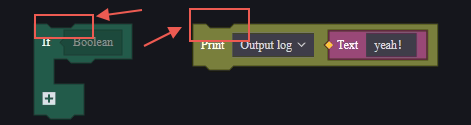

Nếu phía trên không có lõm nhưng phía dưới có nhô ra, điều đó biểu thị rằng nút này là điểm bắt đầu của một đoạn logic, thường là nút sự kiện.

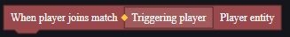

Nếu cả trên và dưới đều không có nhô ra hay lõm, nút này biểu thị một đoạn dữ liệu, có thể được áp dụng cho các nút khác.

Nút sẽ có tham số đầu vào và đầu ra:

**Tham số đầu vào**:

Tham số đầu vào mặc định là trống, loại bên trong được chỉ định là loại tham số cần thiết.

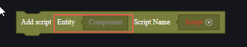

> Tên kịch bản cũng là tham số cần thiết, nhưng sử dụng công cụ chọn tài nguyên nên có thể trực tiếp chọn tài nguyên trong dự án mà không cần lo lắng về việc khớp loại.

**Tham số đầu ra**:

Tham số đầu ra mặc định là một ô vuông màu, có thể kéo ô này để điền vào khung tham số đầu vào cần thiết.

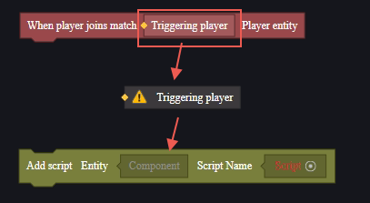

### Sử Dụng Nút

Chọn nút muốn sử dụng từ danh mục, sau đó nhấp hoặc kéo vào canvas để sử dụng nút tương ứng.

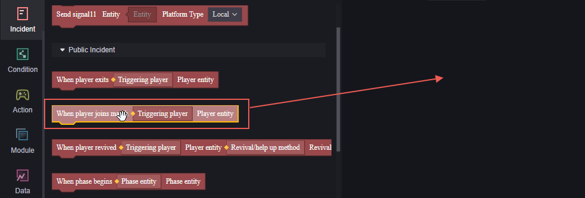

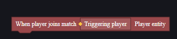

Sử dụng các nút có rãnh phía trên để ghép nối hai nút lại với nhau:

Logic của một nhóm nút luôn được thực hiện từ trên xuống dưới:

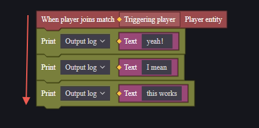

Với một nhóm nút được nối tiếp, các tham số đầu vào cần được điền bằng dữ liệu phù hợp để đảm bảo kịch bản hoạt động bình thường. Các biến không phù hợp sẽ báo lỗi, nhấp chuột vào thông báo lỗi để xem chi tiết.

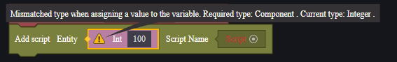

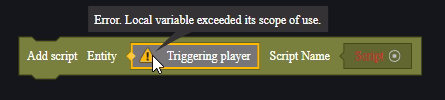

## Kiểm Soát Luồng

Mặc định, kịch bản đồ họa được thực hiện theo thứ tự từ trên xuống dưới. Bạn có thể cần kiểm soát luồng để thực hiện các logic phức tạp hơn.

Xin tham khảo phần kiểm soát luồng của kịch bản đồ họa trong liên kết dưới đây để biết thêm chi tiết:

[Hướng dẫn bổ sung về kịch bản - User Manual.md](./脚本附加说明-用户手册.md)

## Biến

Bạn có thể định nghĩa hoặc chỉnh sửa ba loại biến:

1. **Thuộc tính thực thể toàn cầu**: Thuộc tính của các thành phần toàn cầu, hỗ trợ tùy chỉnh. Có thể lấy hoặc chỉnh sửa thuộc tính này trong bất kỳ kịch bản nào.
2. **Biến kịch bản**: Chỉ được sử dụng trong kịch bản hiện tại, các kịch bản khác có thể lấy và chỉnh sửa biến này thông qua gọi bên ngoài.
3. **Biến cục bộ**: Chỉ được sử dụng trong khối mã hiện tại, không có hiệu lực ngoài khối mã.

### Thuộc Tính Thực Thể Toàn Cầu

Thông qua cài đặt thành phần, bạn có thể thêm thuộc tính thực thể toàn cầu.

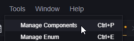

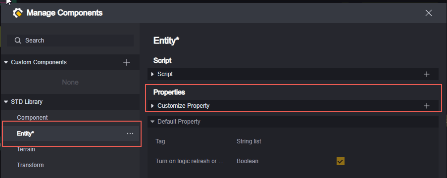

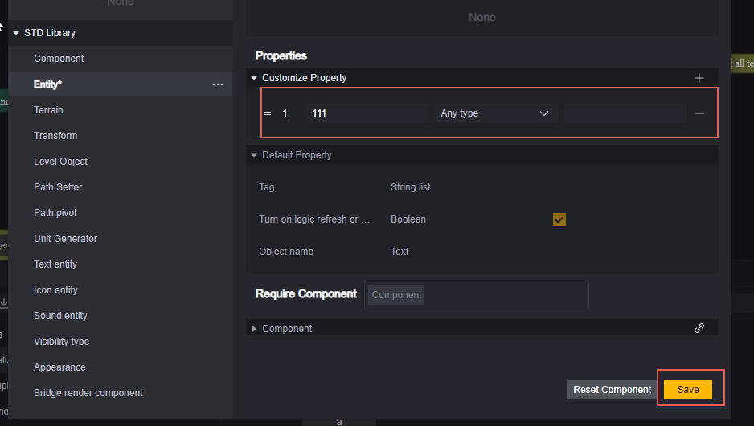

Sau khi tạo xong thuộc tính thực thể toàn cầu, bạn có thể sử dụng nút "Lấy toàn cầu" để lấy thuộc tính này:

Sử dụng nút "Thiết lập toàn cầu" để thiết lập thuộc tính này:

### Biến Kịch Bản

Trong danh mục biến, có một nút để tạo biến:

Biến được tạo theo cách này là biến kịch bản, dùng để xử lý dữ liệu trong kịch bản hiện tại.

Trong các kịch bản khác, bạn có thể lấy và thiết lập biến này thông qua cách gọi bên ngoài:

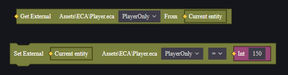

> Lưu ý khi gọi bên ngoài từ kịch bản khác: cần chỉ định thực thể gắn kịch bản khi lấy và thiết lập biến.

### Biến Cục Bộ

Bạn có thể tạo biến chỉ sử dụng được trong khối mã hiện tại thông qua nút biến cục bộ:

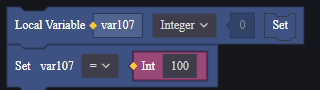

Bạn có thể đổi tên biến này bằng cách nhấp đúp vào tên biến:

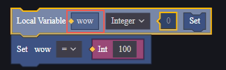

Khối mã là một đoạn kịch bản liên tục. Đáng lưu ý là các nút "Nếu - Nếu không" trong danh mục điều kiện được chia thành hai khối mã. Mỗi đoạn "Nếu", "Nếu không", và "Nếu không nếu" là một khối mã độc lập.

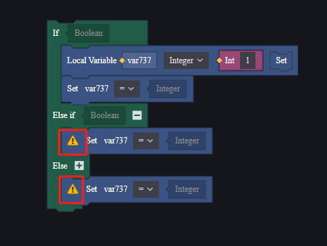

## Hàm Tùy Chỉnh và Sử Dụng

Kịch bản đồ họa hỗ trợ các hàm có giá trị trả về và không có giá trị trả về.

Các hàm có giá trị trả về không thể liên kết với các nút khác khi được gọi, nút gọi chính là giá trị trả về.

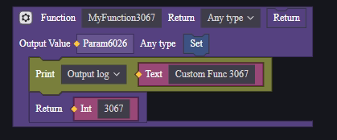

Các hàm không có giá trị trả về có thể liên kết với các nút khác khi được gọi.

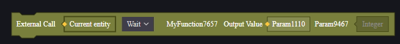

**Chờ đợi**: Nút này chặn các hàm không đồng bộ, đợi hàm không đồng bộ thực thi xong mới thực hiện các nút tiếp theo.

**Thực thi**: Nút này không chặn các hàm không đồng bộ, tiếp tục thực hiện các nút tiếp theo.

Hàm không đồng bộ là hàm mà trong đó sử dụng các nút sẽ thực hiện xử lý không đồng bộ, ví dụ như "Chờ đợi".

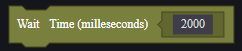

**Lưu ý**: Không hỗ trợ sử dụng các nút không đồng bộ trong hàm có giá trị trả về.

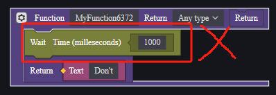

Nếu cần giá trị trả về của hàm không đồng bộ, hãy sử dụng hàm không có giá trị trả về và sử dụng biến đầu ra.

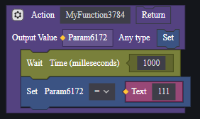

Dù có hay không có giá trị trả về, hàm tùy chỉnh vẫn có thể sử dụng biến đầu ra của hàm ở phía dưới nút gọi hàm để lấy kết quả đầu ra.

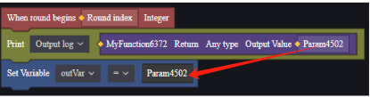

## Tìm Kiếm Nút và Sử Dụng Nút Thường Dùng

Nhập từ khóa có thể tìm kiếm ra nút tương ứng.

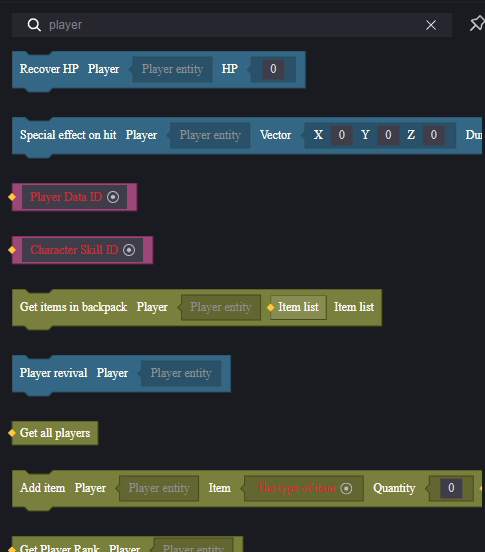

Trong giao diện chọn nút, nhấp chuột phải vào nút để đặt nút làm nút thường dùng. Trong danh mục nút thường dùng có thể sử dụng nút một cách nhanh chóng.

## Ví Dụ

Sử dụng một ví dụ đơn giản để minh họa cách sử dụng kịch bản:

Thiết kế như sau:

1. Mỗi người chơi khi tham gia cuộc thi sẽ được cấp một khẩu M4A1.
2. Khi người chơi bắn, mỗi lần bắn sẽ trừ 1 điểm sinh mệnh của người chơi.

**Tạo Kịch Bản**:

Yêu cầu 1 là toàn cục, yêu cầu 2 là cho từng người chơi. Vì vậy, cần gắn một kịch bản vào toàn cục và một kịch bản vào mỗi người chơi. Cả việc cấp vật phẩm và trừ sinh mệnh đều cần được server biết, do đó cả hai đều được tạo dưới dạng kịch bản server.

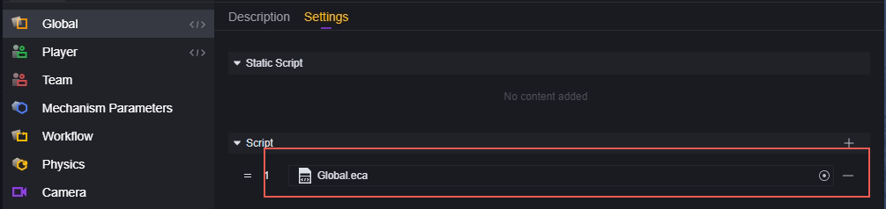

**Chỉnh Sửa Kịch Bản**:

Đối với yêu cầu 1, cần thực hiện việc cấp vật phẩm mỗi khi người chơi tham gia cuộc thi:

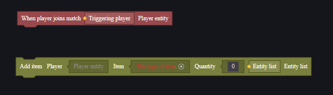

Với nút thêm vật phẩm, cần thêm ba tham số: mục tiêu thêm vật phẩm, vật phẩm được thêm, và số lượng vật phẩm.

Mục tiêu thêm vật phẩm chính là người chơi đã kích hoạt sự kiện khi tham gia cuộc thi, vật phẩm được chọn qua trình quản lý tài nguyên là M4A1, và số lượng là 1.

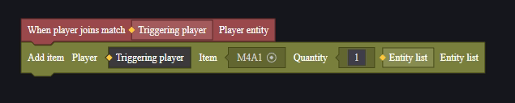

Đối với yêu cầu 2, mỗi khi bắn cần thực hiện việc trừ điểm sinh mệnh:

Chúng ta nhận thấy thực tế không có nút trừ điểm sinh mệnh:

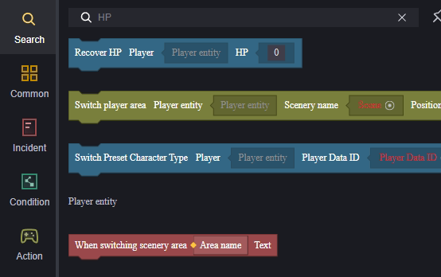

> Tham số phục hồi sinh mệnh điền số âm sẽ không trừ sinh mệnh.

Tuy nhiên, vì sinh mệnh là một thuộc tính của người chơi, ta có thể điều chỉnh thông qua việc thiết lập thuộc tính:

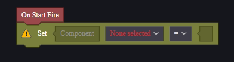

Nút thiết lập thuộc tính yêu cầu các tham số: thực thể được thiết lập thuộc tính, thuộc tính được thiết lập và giá trị cũng như phép toán.

Trong đó, thực thể được thiết lập thuộc tính chính là người chơi hiện tại, do đó có thể sử dụng thực thể này, nhấp đúp vào vị trí tham số để nhanh chóng điền thực thể này.

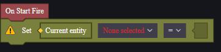

Thuộc tính cần thay đổi là sinh mệnh hiện tại, chọn sinh mệnh hiện tại.

Giá trị được thiết lập là sinh mệnh hiện tại trừ 1, do đó cần lấy sinh mệnh hiện tại.

Sử dụng phép trừ trong danh mục dữ liệu để trừ đi 1, sau đó điền vào tham số:

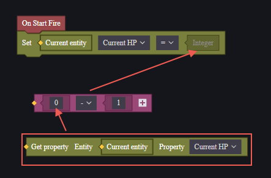

Cũng có thể sử dụng phép toán của nút thiết lập thuộc tính để thực hiện logic này:

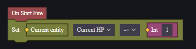

Chạy và gỡ lỗi để xem kết quả:

> Mỗi người đều được cấp một khẩu M4A1.

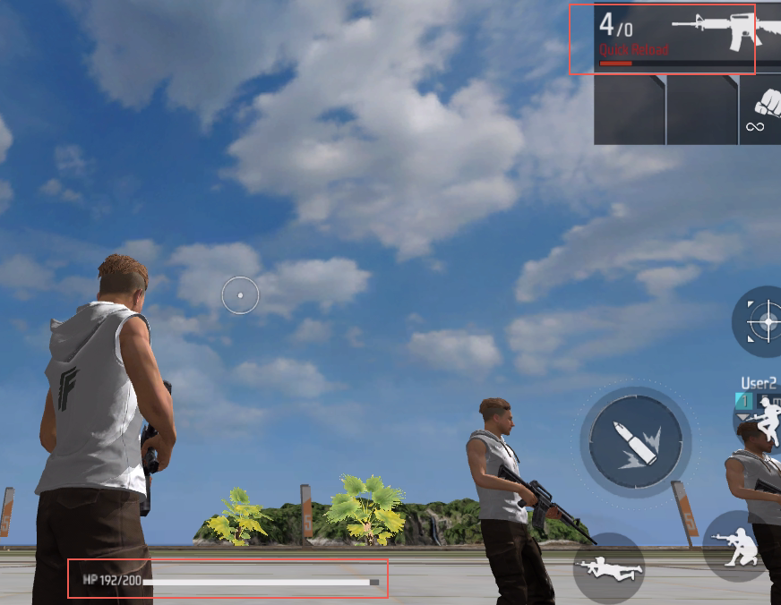

> Bắn 8 lần thì mất 8 điểm sinh mệnh.
>
> Khi bắn, sự kiện này được kích hoạt mỗi lần thực hiện lệnh bắn. Với vũ khí bắn liên thanh, các lần bắn liên tục trước khi đặt vũ khí xuống được tính là một lần bắn, và sự kiện chỉ kích hoạt một lần.
