# Workflow-Quy Trình Trò Chơi

Trong mô-đun này, bạn có thể thiết lập quy trình và thời gian của trò chơi theo đơn vị là giai đoạn và vòng. Đồng thời, bạn cũng có thể gắn script vào các thực thể của giai đoạn và vòng.

## Giải Thích Khái Niệm

Quy trình trò chơi của chúng tôi được cấu thành từ các giai đoạn, trò chơi sẽ bắt đầu từ giai đoạn khởi đầu cố định, trải qua các giai đoạn đã được thiết lập, và kết thúc ở giai đoạn kết thúc cố định.
Mỗi giai đoạn có thể thiết lập thời gian, nhưng ít nhất phải là 5 giây, và sau khi kết thúc, quy trình sẽ tự động chuyển sang giai đoạn tiếp theo.
Trong đó, hai giai đoạn khởi đầu trò chơi và kết thúc trò chơi là bắt buộc phải có và là điểm bắt đầu và kết thúc của trò chơi, do đó bạn không thể xóa hai giai đoạn này hoặc thay đổi tên của chúng.
Vòng là một loại giai đoạn đặc biệt, là tập hợp của nhiều giai đoạn và có thể chỉ định số lần lặp lại. Mỗi khi quy trình vào vòng, nó sẽ lặp lại các giai đoạn chứa trong đó theo thứ tự và sau khi đạt số lần lặp lại, vòng sẽ kết thúc và tiếp tục quy trình tiếp theo. Vòng không thể chứa vòng.

Tất cả các thực thể giai đoạn hoặc vòng đều được tạo khi bắt đầu và bị hủy khi kết thúc. Các script và thực thể liên quan được gắn vào chúng có thể bị ảnh hưởng bởi điều này.

> Nếu không có chỉ dẫn cụ thể, từ "giai đoạn" trong văn bản dưới đây sẽ bao gồm cả khái niệm của vòng.

## Xem Và Cấu Hình Quy Trình

Trong menu mô-đun "Workflow", bạn có thể xem và cấu hình quy trình hiện tại của trò chơi.

Chúng tôi đã tạo sẵn cho bạn một số giai đoạn mặc định, bạn có thể tùy chỉnh tất cả các giai đoạn và sắp xếp chúng theo thứ tự. Dưới đây là mô tả các thuộc tính:

1. ID: Mỗi giai đoạn sẽ được gán một ID duy nhất, ID này không thể thay đổi. Chỉ mục giai đoạn hoặc chỉ mục vòng được sử dụng trong script chính là ID này.
2. Tên: Bạn có thể tùy chỉnh tên của các giai đoạn, ngoại trừ giai đoạn bắt đầu và kết thúc trò chơi. Việc đặt tên có tổ chức sẽ giúp ích cho script của bạn, điều này sẽ được giải thích chi tiết ở phần dưới.
3. Thời Gian: Thời gian mà giai đoạn này kéo dài, đơn vị là giây. Khi đạt đến thời gian này, giai đoạn sẽ kết thúc tự động. Thời gian tối thiểu là 5 giây, tối đa là 16777216 giây. Tuy nhiên, mỗi ván trò chơi chỉ hỗ trợ tối đa một giờ, nên cấu hình thời gian quá dài là không cần thiết.
4. Script: Script được gắn vào giai đoạn chỉ có hiệu lực trong giai đoạn đó.
5. Thực Thể Giai Đoạn: Bạn có thể thêm script và thuộc tính vào thực thể giai đoạn bằng cách tùy chỉnh các thành phần của thực thể giai đoạn. Script hoặc thuộc tính được thêm vào thành phần sẽ được kế thừa mỗi khi thực thể giai đoạn được tạo.
6. Số Lần Lặp Lại: Chỉ dành cho vòng, xác định số lần vòng lặp các giai đoạn bên trong trước khi thoát khỏi vòng. Giá trị tối thiểu là 1, tối đa là 10.

## Thứ Tự Giai Đoạn

Thứ tự của các giai đoạn mặc định không thể thay đổi.
Giai đoạn bắt đầu trò chơi: Luôn ở trên cùng.
Giai đoạn kết thúc trò chơi: Luôn ở dưới cùng.

> Giai đoạn chuẩn bị trò chơi chỉ là một giai đoạn thông thường. Bạn có thể thay đổi tên của giai đoạn chuẩn bị trò chơi hoặc thậm chí xóa nó.

Đối với các giai đoạn khác, bạn có thể kéo để sắp xếp lại vị trí của chúng theo thứ tự mà bạn muốn.

Khi bạn kéo chuột mà biểu tượng trở thành dấu cấm, điều đó có nghĩa là bạn không chọn bất kỳ nút nào, và khi thả chuột ra, thứ tự sẽ không thay đổi. Cố gắng thay đổi thứ tự của giai đoạn bắt đầu trò chơi, kết thúc trò chơi hoặc giai đoạn chuẩn bị trò chơi cũng sẽ không thay đổi thứ tự của các giai đoạn.

## Thêm Và Xóa Giai Đoạn

Khi chọn một giai đoạn ngoại trừ giai đoạn bắt đầu hoặc kết thúc trò chơi, sẽ xuất hiện hai dấu cộng phía trên và dưới. Nhấp vào dấu cộng sẽ tạo ra một giai đoạn mới tại vị trí tương ứng **theo loại giai đoạn ở phía trên dấu cộng**, không liên quan đến loại của giai đoạn được chọn.
Khi tạo mới trong một vòng, giai đoạn mới nhất định sẽ là giai đoạn con của vòng.

Ví dụ 1: Dấu cộng nằm dưới vòng, tạo ra một vòng:

Ví dụ 2: Dấu cộng nằm dưới giai đoạn, tạo ra một giai đoạn:

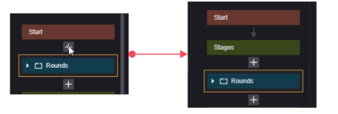

Bạn cũng có thể nhấp chuột phải vào giai đoạn:

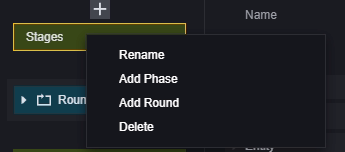

Bạn có thể đổi tên giai đoạn, thêm giai đoạn mới, thêm vòng mới, hoặc xóa giai đoạn này.

## Giải Thích Liên Quan Đến Script

### Thêm Script

Trong menu mô-đun "Workflow", khi bạn chọn một nút và thêm script, script tương ứng sẽ được gắn vào thực thể của nút đó.

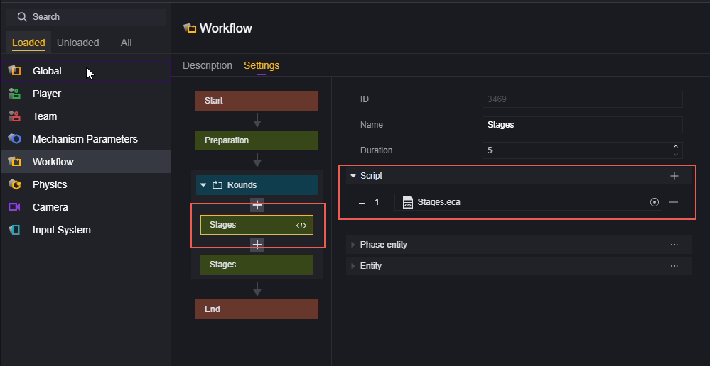

### Thuộc Tính

Bạn có thể sử dụng thuộc tính toàn cục để lấy chỉ mục giai đoạn hiện tại và chỉ mục vòng hiện tại:

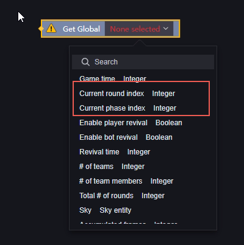

Sử dụng chỉ mục vòng hoặc chỉ mục giai đoạn, bạn có thể lấy bất kỳ chỉ mục giai đoạn hoặc vòng nào được cấu hình trong trò chơi hiện tại:

Node này sẽ lấy tất cả các giai đoạn và vòng theo thứ tự thực hiện. Chúng tôi khuyến nghị bạn đặt tên hợp lý cho mỗi giai đoạn và vòng ngay từ đầu.

### Sự Kiện

Chúng tôi cung cấp bốn sự kiện sau để bạn có thể lắng nghe sự khởi đầu và kết thúc của giai đoạn hoặc vòng, giúp bạn dễ dàng viết logic mong muốn.

Khi vòng bắt đầu
Khi vòng kết thúc
Khi giai đoạn bắt đầu
Khi giai đoạn kết thúc

Ở đây, vòng và giai đoạn được phân biệt rõ ràng, sự kiện "Khi giai đoạn bắt đầu/kết thúc" chỉ được kích hoạt khi giai đoạn bắt đầu/kết thúc và sẽ không kích hoạt sự kiện "Khi vòng bắt đầu/kết thúc". Vòng cũng tương tự.
**Ví dụ 1:** Khi vòng được chỉ định bắt đầu

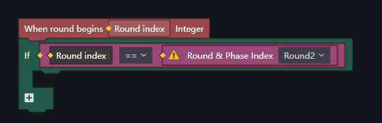

**Ví dụ 2:** Khi giai đoạn được chỉ định bắt đầu

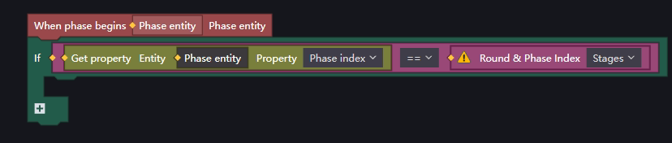

**Ví dụ 3:** Kiểm tra xem giai đoạn hiện tại có phải là giai đoạn được chỉ định hay không

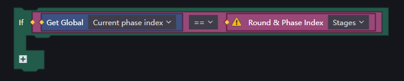

> Lưu ý rằng sự kiện "Khi vòng bắt đầu/kết thúc" sẽ trả về chỉ mục của vòng; sự kiện "Khi giai đoạn bắt đầu/kết thúc" sẽ trả về thực thể của giai đoạn.
> Chỉ mục của giai đoạn và vòng chính là ID trong trường ID trên bảng điều khiển quy trình của mô-đun.

### API

Chúng tôi cung cấp hai API để bạn sử dụng:

Chuyển đổi giai đoạn trò chơi
Kết thúc giai đoạn trò chơi hiện tại

Chuyển đổi giai đoạn trò chơi cho phép bạn buộc trò chơi chuyển sang giai đoạn chỉ định, lưu ý rằng API này cũng hỗ trợ nhập chỉ mục của vòng, do đó bạn có thể chuyển trực tiếp sang vòng chỉ định.
Cần cẩn thận khi chuyển đổi trực tiếp đến một giai đoạn trong vòng, các giai đoạn sẽ được thực hiện theo thứ tự trong vòng cho đến khi kết thúc giai đoạn cuối cùng

 của vòng, sau đó vòng sẽ bắt đầu lại từ giai đoạn đầu tiên. Dù bạn chuyển đến giai đoạn nào trong vòng, lần thực hiện đầu tiên không được tính vào số lần lặp lại của vòng, và khi vòng bắt đầu lại thì nó mới được tính là lần thực hiện đầu tiên của vòng.

Giả sử chúng tôi có một vòng cần lặp lại 2 lần.

Nếu trong một nơi nào đó ngoài vòng, script sử dụng "Chuyển đổi giai đoạn trò chơi" để chuyển sang giai đoạn 2 của vòng, trò chơi sẽ thực hiện theo thứ tự sau:

Điều này là do logic hoạt động của vòng là tăng biến đếm lặp lại sau khi bắt đầu, và sau khi kết thúc giai đoạn cuối cùng, kiểm tra xem số lần lặp lại có lớn hơn hoặc bằng số lần lặp lại đã cấu hình hay không. Chuyển đổi buộc hoặc nhảy giai đoạn trong vòng có thể dẫn đến kết quả không mong đợi.

#### Chuyển Đổi Sang Giai Đoạn Hoặc Vòng:

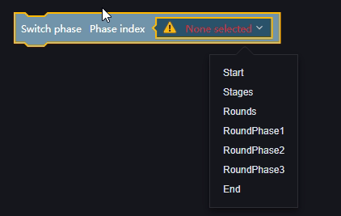

#### Kết Thúc Giai Đoạn Trò Chơi Hiện Tại:

## Ví Dụ

Một trò chơi 5 ván thắng 3, với thời gian chuẩn bị trước trò chơi là 5 giây, thời gian chuẩn bị cho mỗi vòng là 10 giây, và thời gian chơi là 180 giây.

1. Thiết lập các giai đoạn trong quy trình và đặt tên:

   

   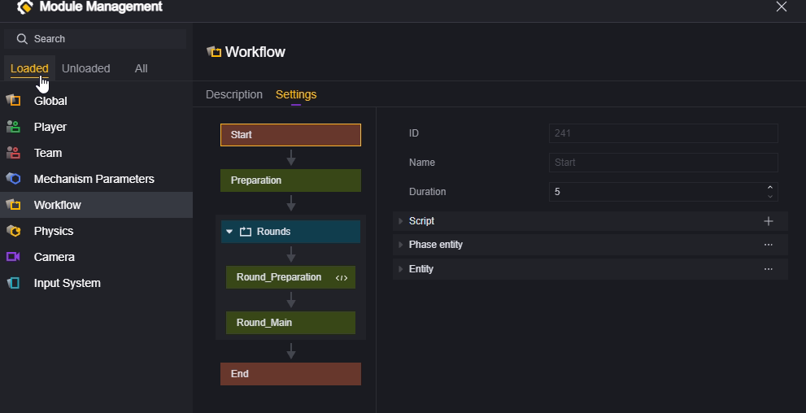

2. Cấu hình thời gian cần thiết:

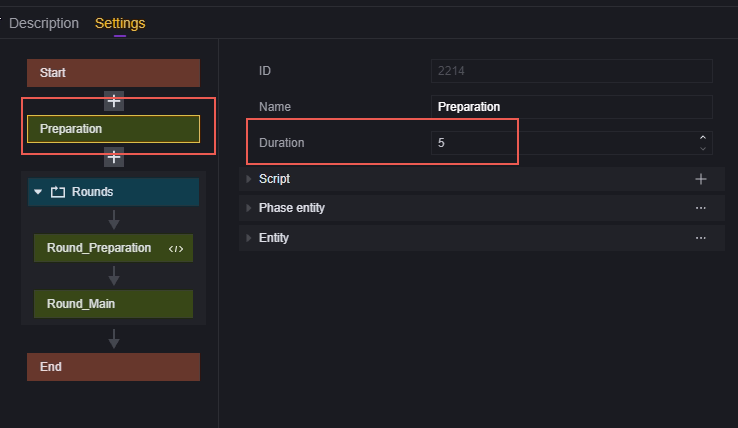

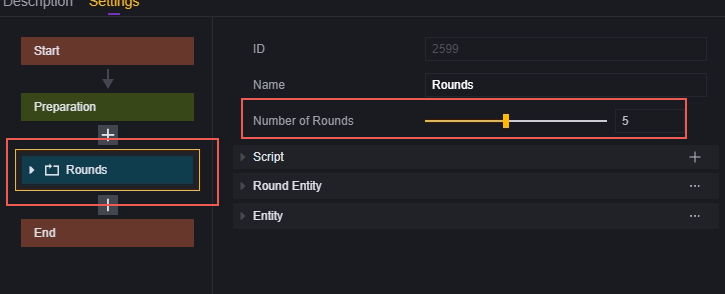

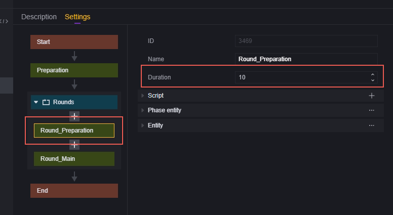

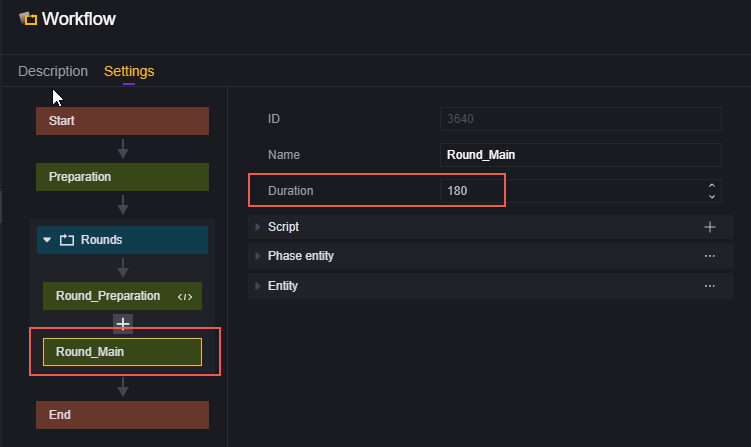

3. Thêm script:

Logic của script là: khi kết thúc mỗi vòng chơi, nếu bất kỳ đội nào đạt được số điểm lớn hơn hoặc bằng 3, trò chơi sẽ kết thúc.
Thông thường, chúng tôi sẽ tạo một script toàn cục để xác định quy trình của cả trò chơi.

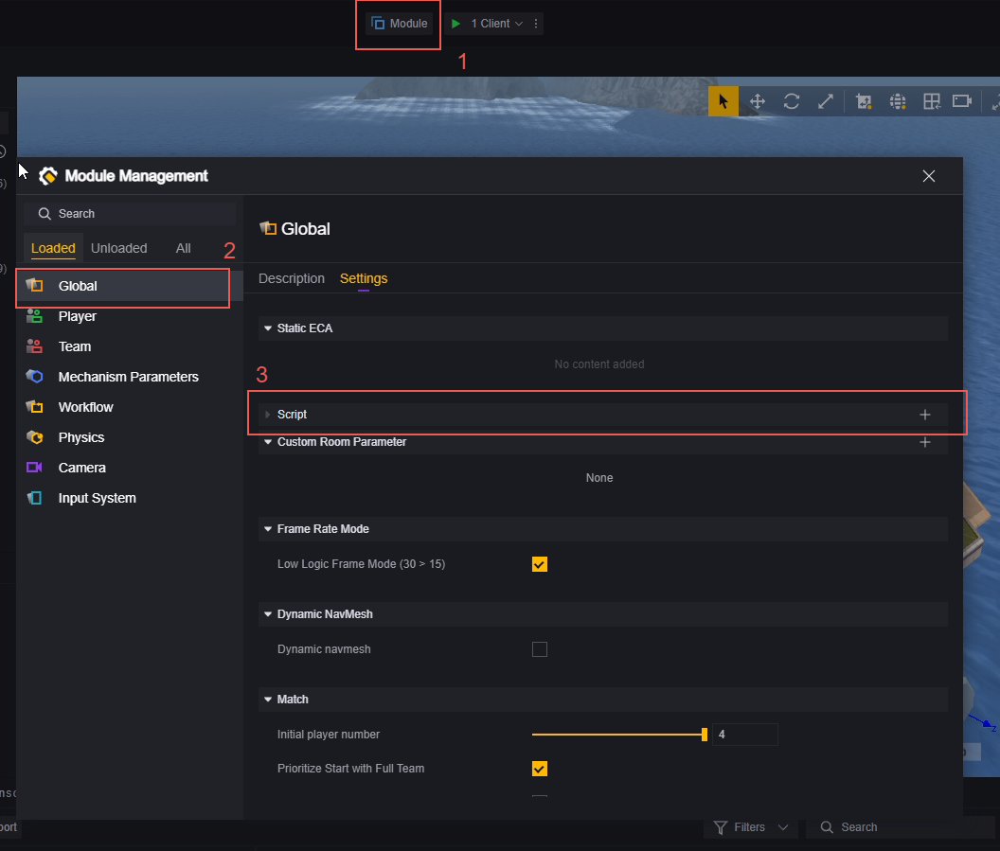

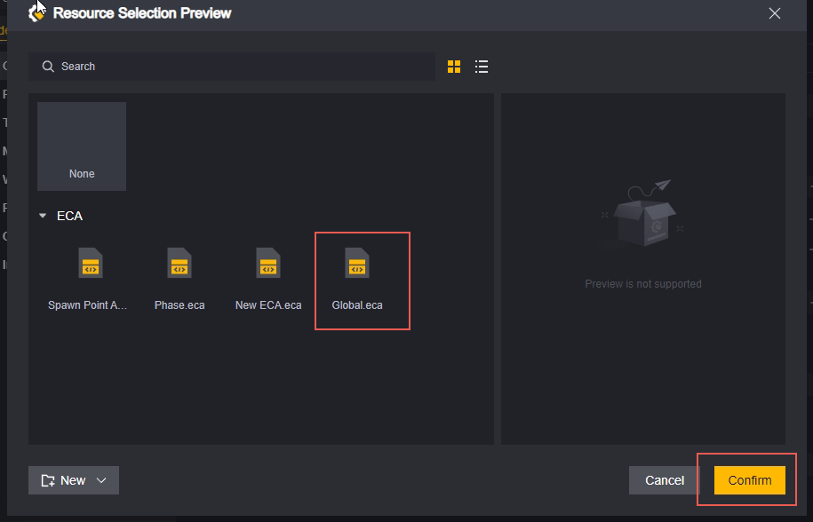

Chỉnh sửa script này:

Chúng tôi sẽ sử dụng sự kiện "Khi vòng kết thúc" để kích hoạt logic tính toán và khi điều kiện được đáp ứng, sử dụng API "Chuyển đổi sang giai đoạn hoặc vòng" để kết thúc trò chơi.

Khi vòng được chỉ định kết thúc:

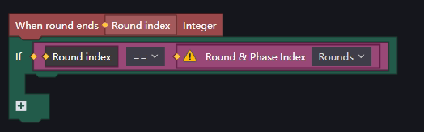

Nếu điểm của bất kỳ đội nào lớn hơn hoặc bằng 3, kết thúc trò chơi (chuyển sang giai đoạn kết thúc trò chơi).

> Vui lòng bỏ qua dấu chấm than màu vàng trong ví dụ.
> Ví dụ này chỉ để tham khảo, bạn có thể tự do viết logic của riêng mình.