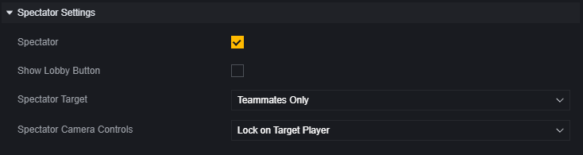
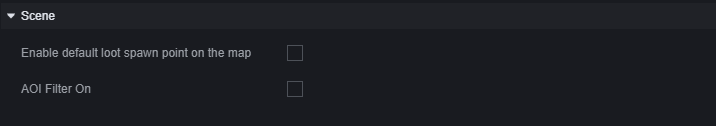
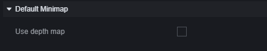

# 机制参数-用户手册

在模组中，有一个机制参数的设置分类。

这个分类是一些机制的配置集合，您可以通过在这个分类的设置直接修改一些游戏机制的设置。

## 观战设置

观战设置可以针对局外是否能观战以及观战的规则进行设置。

## 流程内预置逻辑

流程内预置逻辑是指回合开始时玩家无敌、回合开始音效等默认带有的流程内置逻辑。

## 特殊设置

一些独特游戏机制设置。

其中无限弹药、无限冰墙、无限投掷物的实现方法是不会消耗后备弹药、冰墙与投掷物。所以需要至少添加一把武器、一个冰墙或一个投掷物来使用这些设置。

## 场景

**启用地图默认战利品刷新点**：一些地图模板，如百慕大上会带有默认的战利品刷新点。启用该设置这些战利品会刷新在地图上。

**启用关注区域过滤**：关闭此功能会对所有物体都进行同步，启用此功能会自动忽略距离较远的物体从而节省性能。

## 默认小地图

地图深度图是在小地图上以不同颜色显示物件高度的功能。

## 技能设置

决定游戏内是否启用人物技能，和调整人物技能的CD。CD可以调整为默认的0%-100%，0%意味着没有CD。

## 宠物设定

是否支持使用宠物和宠物技能。
