# 场景编辑器-用户手册

本篇文章将提供场景编辑器相关的教学参考。

## 概览

1. 物件选择器：从物件选择器选择要放入场景的物件。
2. 层级菜单：分层显示场景中所有可编辑物件。
3. 总览：显示工程中当前编辑文件类型的文件。在本文环境下，显示所有场景文件。
4. 场景编辑器：场景编辑的画布，调整物件摆放，预览场景表现。
5. 属性菜单：对特定物件的属性进行编辑。

## 物件摆放

### 摆放单个物件

从物件选择器拖动物件至场景，即可在指定位置创建一个对应物件：

右键物体，也可以创建一个物件至场景，通过这种方式创建的物件会放置在世界坐标(0,0,0)的位置。

### 连续摆放物件

在物件选择器单击，然后移动鼠标至场景编辑器。

根据下方说明：

1. 每次单击会在当前位置摆放一个该物件。

2. 按住鼠标左键拖动，会连续创建该物件。只能在X、Z轴上创建。

   

3. 使用ZXC快捷键，可以沿三个轴快速翻转该物件。每次沿该轴翻转90度。

   

4. 按右键退出当前物件的摆放模式。

通过快捷键Ctrl+D,可以复制一个当前选中物件的复制体，transform信息与当前物件一致。

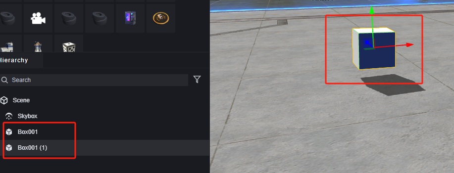

### 删除物件

在场景或层级菜单选中要删除的物件，使用快捷键Delete删除：

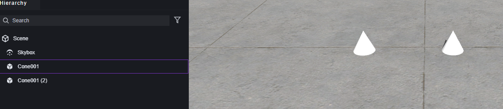

也可以通过层级菜单右键删除指定物件：

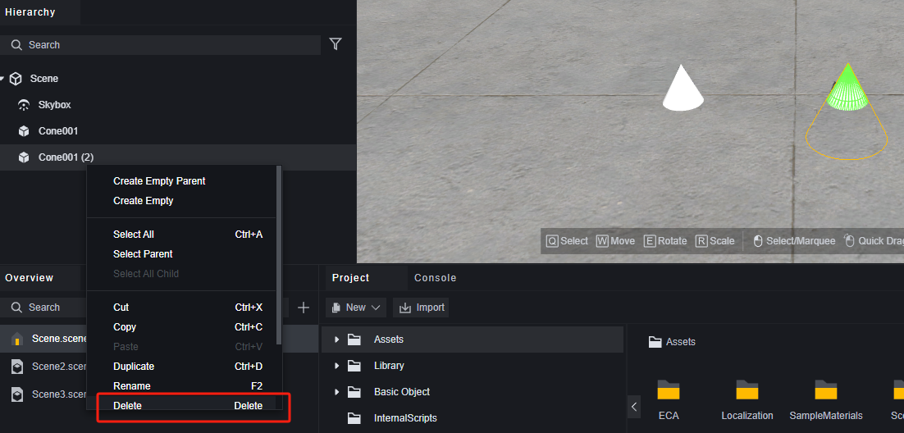

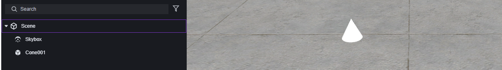

## 镜头操作

通过镜头操作可以查看场景中物件的摆放情况。

1. 按住鼠标中键，可以在当前平面移动摄像机。

2. 使用鼠标滚轮，可以缩放摄像机。

3. 按住鼠标右键，可以操作摄像机移动。
   1. 按住鼠标右键拖拽鼠标，可以旋转摄像机视角。
   2. 按住鼠标右键并使用WASD快捷键，可以让摄像机移动。
   3. 按住鼠标右键并使用QE快捷键，可以让摄像机升起或下降。
   4. 按住鼠标右键并按住SHIFT，可以让摄像机移动加速。

> 按住鼠标右键调整摄像机时的常驻说明。

在右上角的菜单中，可以调整摄像机的默认移速：

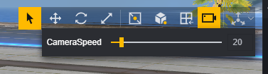

## 调整物件

### 调整模式

使用快捷键QWER或在菜单选择，可以进入四种对物件的调整模式。

Q：选中，点击物件则选中物件，拖动物件会使物件自动放置在正下方第一个平面上。

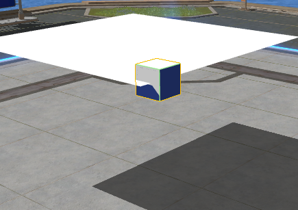

W：移动。选择坐标轴拖动，物件只会沿该轴移动。选择平面拖动，物件只会在该平面上移动。

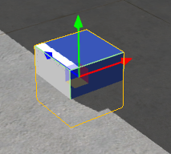

E：旋转。选择轴向并拖动，物件只会在该方向上旋转。

R：缩放。选择坐标轴并拖动，物件只会在该轴维度上缩放。

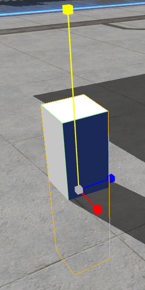

调整物件时，如果选中的是父物体或复数个物体，那么他们都会受到影响。如果选中的是子物体，父物体则不会受到影响。

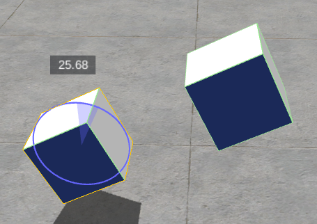

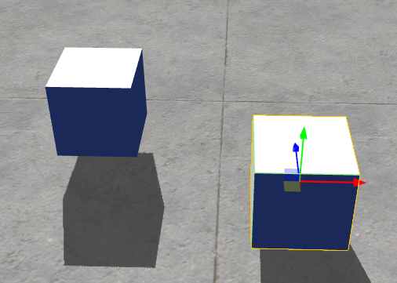

### 辅助图标控制

在场景中放置两个立方体方便说明：

在层级中将两个立方体合并成一个物体，以其中左侧作为父物体，右侧作为子物体。

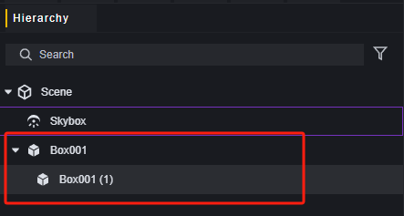

#### 枢轴/中心

枢轴模式下，辅助图标会出现在选中的物体上。

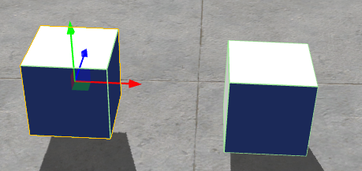

选中复数个物件时，辅助图标会出现在第一个选中的物体上。

中心模式下，辅助图标会出现在物件的中心位置，对于多个物件来说，是由程序自动计算出的中心位置：

> 选中父物体时

> 选中子物体时

#### 游戏对象/世界空间

游戏对象模式时，辅助图标的坐标轴为本地坐标，会随着游戏物件而改变朝向。

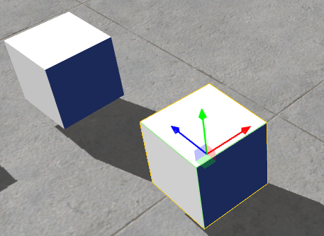

世界空间模式时，辅助图标的坐标轴始终为世界坐标轴，不会随物件改变朝向。

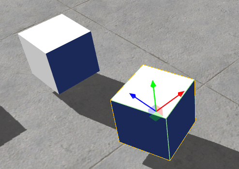

### 网格

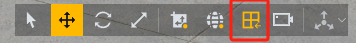

网格仅对官方提供的物件生效，对纯模型和导入的资源没有效果。

开启网格后，移动物件会在当前水平面出现网格，物件会自动吸附到绿色的网格中心。

### 对齐

对齐选项开启后，可以配置移动、旋转、缩放的颗粒度。物件每次只会变化配置的尺度。

**移动：**通过右侧按钮可以开启或关闭轴向配置，开启后可以规定每个轴向上每次移动的距离，关闭则为任何方向上的移动。单位是米。这项配置只对移动模式生效，选中模式下的快速移动不受影响。

**旋转：**每次旋转变化的角度。

**缩放：**每次调整缩放变化的倍率。

### 属性调整

除了上述功能外，在属性菜单处的transform组件记录了当前物件的位置、旋转、缩放的具体数据。可以直接调整该组件参数达到精确调整物件的目的。

## 场景文件管理

在总览中，可以查看所有场景文件。

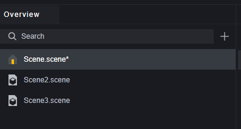

场景文件的名字，即为引用该场景时的名字，不含后缀.scene。

右键非默认场景，可以将一个场景设置为默认场景，默认场景是进入游戏时默认加载的场景，游戏总是需要一个默认场景。

