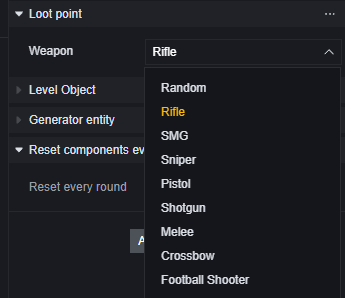
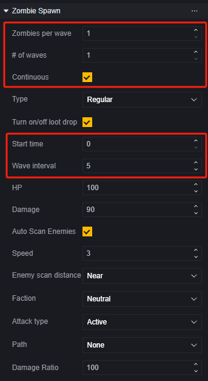

# 关卡物件-用户手册

关卡物件是关卡的重要组成。为了方便您更快速地搭建关卡，我们提供了一些关卡物件的模板。它们主要分为：

1. 带有功能的关卡物件，如会把玩家弹飞的轮胎、传送门。
2. 结构用物件。
3. 装饰用物件。

一个物件可以具有多种上述功能，比如一个轮胎既可以作为到达二楼的跳板，同时也可以作为装饰。这取决于您的设计。

在物件选择器中，我们已经为您将关卡物件进行了分类收纳，方便您更快地找到需要的物件：

页签1内收纳的都是带有功能的物件，它们带有默认的逻辑处理，可以通过进一步配置来调整功能表现。

页签2内收纳的是通用的结构体和装饰。

页签3内收纳的是建筑物和家具。

页签4内收纳的是主题物件，它们也是一些结构体或装饰，不过外观上具有特色主题。

接下来介绍一些物件搭建方式和重要关卡物件的使用方法。

## 通用-物件搭建方式

介绍一些物件搭建和管理方式，您也可以使用自己熟悉的方式进行关卡编辑和管理。

### 高度对齐

使用基础结构件进行搭建时，建议使用场景拖动+transform来调整各个物件的位置和高度。

比如在下图中，我们使用了一个楼梯和一个平台、但是平台默认放置在了地面上，需要将平台抬升到楼梯末端的高度。

首先将平台收纳为楼梯的子物体，这样平台的transform位置就是对于楼梯的相对位置：

调整平台高度，尝试对齐：

发现平台相对于楼梯的高度很接近1，猜测楼梯末端高度为1，将平台高度设置为1。然后对齐水平方向。

### 水平面编辑

在垂直方向上有多个高度的平面需要编辑时，可以通过摆放一个辅助几何体来使用编辑器的自动贴地功能，以简化调整高度的操作。

比如在刚刚的楼梯平台场景下，想继续编辑高度为1的平面，可以添加一个平面几何体：

> 也可以使用任何具有平面的物件作为参照，不过使用带厚度的物件时需要微调参照物高度。几何体中的平面是没有厚度的平面碰撞体，非常适合作为参照。

假设要编辑的范围在10*10以内，将平面缩放设定为(10,1,10)，高度设定为1，然后将平面水平拖动至要编辑的区域内：

此时，在平面范围内相当于生成了一个高度为1的地面，拖动物件到此地面上或使用快捷键Q快速移动物体到此地面上会自动设置物件高度为地面高度：

在编辑结束后，删除此参照物或设定为不激活即可。

### 层级管理

通常来说，一个场景上会有相当数量的物件，推荐使用层级管理来对物件进行归纳，提高维护性。

可以根据物件的功能、区域等适合的方式收纳物件。

> 对物件进行重命名可以更准确地找到对应的物件

## 基础结构件

基础结构件是几乎不带任何功能的纯结构体。它们可以供您拼凑出自定义的关卡结构，以充当地图中的阻挡、平台、掩体等。

> 一个简易楼梯平台。

对于一个拼装好的自定义结构体组，推荐您在层级中将对应的物件收纳到一个父物件下，以方便管理和微调：

> 这里是将楼梯作为父物体，您也可以根据实际情况新建一个空物体作为父物体、选择任何适合的物件作为父物体或者对子物体进一步进行层级管理。

如果该结构体组会大量复用，可以将其设置为Prefab。方式是从层级中拖至资产目录下：

通过将prefab拖入场景中，可以快速创建一个该结构体组。

Prefab推荐在资产中使用专门文件夹进行管理，必要时可以建立子文件夹以供查询和维护：

> 对Prefab的直接编辑会影响到所有使用该Prefab的物件、而编辑物件实例不会影响Prefab。

## 出生点

出生点是玩家进入游戏时出生的位置。在场景上没有任何出生点或没有合适的出生点时，玩家会出生在(0,0,0)附近。

出生点上的滚动箭头指向出生点的前方。也是在这个出生点上出生的玩家的朝向。

出生点具有两个独特配置，容纳人数、所属队伍：

**容纳人数：**决定了该出生点能同时容纳的出生人数。

**所属队伍：**决定了可以在该出生点出生的玩家所属队伍。如果不配置为所有队伍，就只能选择一个队伍。

所属队伍配置为某个特定队伍后，出生点会在场景中显示配置的队伍。

出生点支持配置复数个至场景。

## 战斗道具

关卡物件有两种方式可以在指定位置生成道具：生成器和单位。

使用生成器生成武器或道具，可以设定为每回合刷新，但是只能指定类型。如果刷新时上一次生成的道具没有被取走，则会替换为新生成的道具。

使用单位放置武器或道具，可以精确设定生成的武器或道具，默认状态下只会生成一份对应的道具。

### 生成器

根据类型选择对应的生成器，以武器为例：

在配置中可以选择生成的武器类型：

在每回合重置组件中可以设定该生成点会不会在每个回合开始时刷新。

特别的，当选择生成武器时，会生成配套的一组弹药和配件。

### 单位

使用单位中的武器和道具，可以在指定位置生成配置的武器或道具。

以这种方式摆放的道具可以修改属性：

## 安全区物件

使用安全区物件会同时创造一个安全区起点物件和一个安全区终点物件。

> 安全区起点物件

> 安全区终点物件

安全区会按照配置从起点的范围和位置匀速变化为终点的范围和位置。起点和终点的范围或位置没有限制，您可以根据需求使安全区收缩、扩张或者平移。

安全区起点物件和安全区终点物件都可以配置安全区相关的配置：

> 它们的配置是共享的，修改一个另一个也会立刻生效。

**安全区生效时间**：回合开始后，经过多久安全区和安全区外持续掉血的效果开始生效，单位为毫秒。

**缩圈用时**：经过多久后安全区从起点位置和范围变为终点的位置和范围，单位为毫秒。

**伤害时间间隔**：安全区外每两次伤害之间的间隔，单位为毫秒。

**每次伤害量**：安全区外每次造成的伤害量。

**安全区消失时间**：回合开始多久后，安全区消失。如果这个时间小于安全区生效时间，则安全区完全不会出现，单位为毫秒。

**安全区初始半径**：安全区初始的半径大小，单位为米。更改这个设置可以在场景中观察到起点物件的范围变化。

**安全区最终半径**：安全区最终的半径大小，单位为米。更改这个设置可以在场景中观察到终点物件的范围变化。

**开始缩圈时间**：回合开始多久以后，安全区开始变化，单位为毫秒。

## 触发器

触发器是一类会检测实体进入自身范围的关卡物件。它们常用来触发一些特定条件的事件。

我们提供了一些不同形状和基本触发器，和一些已经带有功能的触发器。

基本触发器区别只是形状不同，并不带有任何逻辑。想使用触发器触发具体事件，需要为触发器挂载脚本，并在触发器的脚本上使用相关事件检测实体触发。

触发器既可以检测实体从外到触发器区域中，也可以检测实体从区域中离开。当玩家进入/离开触发器时事件只会在玩家实体进入/离开触发器时触发，当实体进入/离开触发器事件则是任何实体都可以触发，比如感应地雷。

这些触发器事件需要在挂载在触发器的脚本上使用。

接下来介绍一些带有功能的触发器，您也可以在这些触发器上挂载脚本处理额外的逻辑，但它们总是会实现自身带有的逻辑：

**重力改变区**

在重力改变区内，重力加速度和跳跃高度会变更为设定的值。同时可以设定该区域是否可见。

**死亡/无敌区**

可以设置为死亡区或无敌区。

进入死亡区的玩家或AI实体会立刻死亡，和其他即死的逻辑一样，当前处于无敌状态的玩家或AI实体不受影响。

进入无敌区的玩家或AI实体会获得无敌状态，直到离开无敌区。离开无敌区会清除无敌状态，即使之前获得了其他的无敌效果，离开无敌区也会失去无敌效果。

可以设置该区域是否可见。

**翻越触发器**

玩家在翻越触发器的反向进入时，可以进行翻越。这主要用于翻越窗户等障碍物。

翻越触发器在场景中可以预览翻越的方向，玩家必须与翻越同向才能触发翻越键。如果要i实现双向翻越，需要设置两个该触发器。

可以设置翻越时的高度和距离。

## 僵尸

僵尸是一种具有AI的怪物。您可以使用僵尸生成点来持续地生成僵尸，或者使用僵尸单位在场景中摆放特定的僵尸。

无论通过哪种方式生成的僵尸，都可以设定僵尸的种类和属性。

有关AI实体的介绍，可以参考AI实体的用户手册：

【此处应该是AI实体的文档链接】

生成器比起单位有一些特殊的设置：

**每波僵尸数量**：每次生成的僵尸数量。

**生成波数**：非连续生成时，每回合生成多少波僵尸。

**连续**：连续生成，无视生成波数设置，持续生成僵尸。

**开始生成时间**：回合开始多久后开始生成第一波僵尸，单位为秒。

**每波间隔时间**：每两拨生成的僵尸中间间隔的时长，单位为秒。

由生成器生成的僵尸，会在下一回合开始时全部消灭，并不产生掉落。

## 商店和经济系统

【商店交互界面开发中，后续补上】
