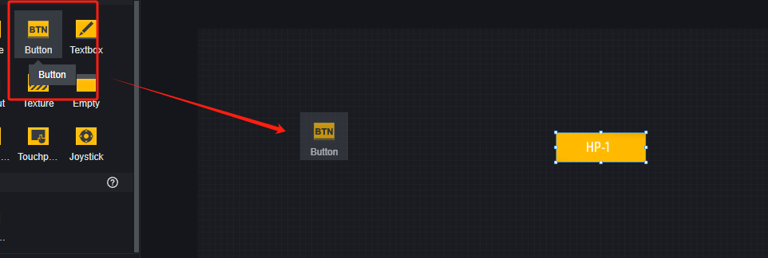
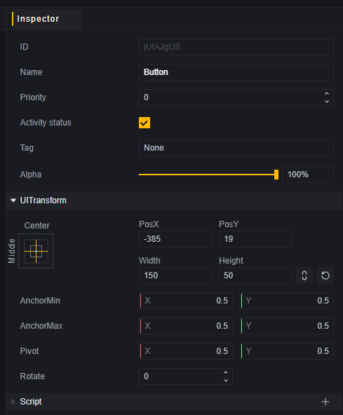
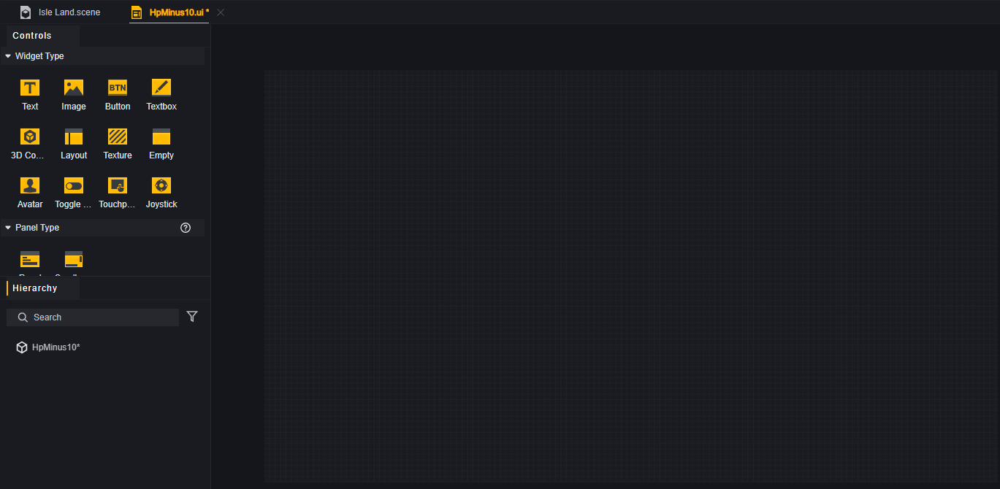
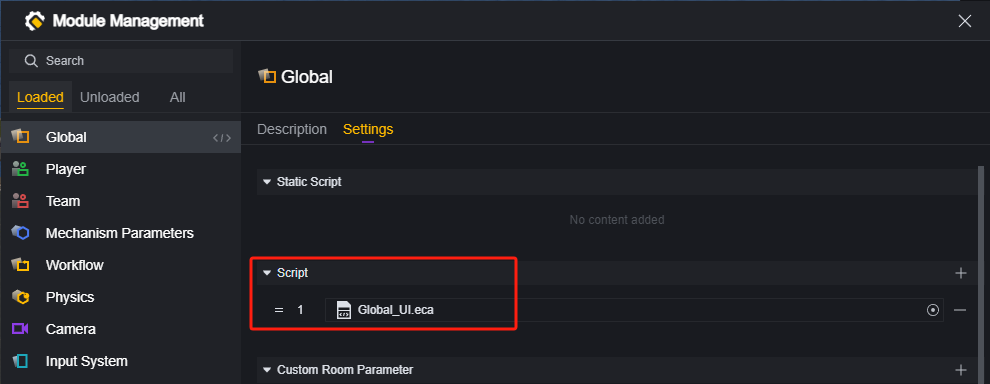
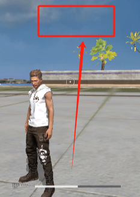

# 界面-用户手册

界面始终以2D画面展示在游戏窗口的最前端，为玩家提供信息和接受玩家的交互。

本文将介绍一些相关概念，如何使用UI编辑器以及如何通过脚本编写UI的逻辑。

## 概念介绍

### UI文件

UI文件储存了自定义UI的信息，在游戏运行时将根据UI文件创建对应的UI实体。

UI文件可以在资产中创建出来，并且进行编辑。在单个UI文件中，你可以添加多个UI控件，UI控件提供各种功能，例如文字显示、图片展示和接收输入。

一个UI文件可以创建多个自定义界面实体，例如每个玩家都通过同一个UI文件创建了一个按钮，或者在一个玩家的界面上多次使用该UI文件创建了复数个按钮，这些按钮所属的UI实体都是由同一个UI文件创建出来的不同实体。

### 自定义界面实体

游戏运行时，会根据UI文件创建对应的自定义界面实体，下文简称UI实体。

UI实体本身可以挂载脚本，具有属性。UI实体下具有若干控件，通过UI实体可以取到属于它的控件。

> 创建UI实体

> 在这个玩家上创建的只有一个按钮控件的UI实体。

> UI实体的部分属性

> UI实体的控件

UI文件名是自定义界面实体ID。自定义界面实体ID是一种索引，索引与实体是不同的概念。

### 控件

控件是UI的基本组成单元，是实际产生功能的元件。在UI文件中，可以选择要使用的控件和配置每个控件的属性。

任何UI文件都拥有一个根节点。UI控件都以根节点或者其他UI控件为父级。这个根节点对应的是UI文件创建出的UI实体，只具有结构性的作用，不提供实际的控件功能。

在脚本中，你可以从某个自定义界面实体上获取它的所有控件并读写其属性。

> 该脚本节点中的UI就是根据UI文件创建出的界面实体，但是一个UI文件可以创建多个实体，需要指定是哪个玩家的哪个界面实体上的控件。

### 面板

面板是控件的容器。

面板本身具有一定的视觉表现，并提供显示层级上的作用，在同一个面板下的控件会受面板层级的影响。

除了基本面板外，我们还提供了滚动面板，用于在固定区域放置多个控件时滚动浏览。

### 内置UI

内置UI是官方的已经制作好的UI内容，部分默认加载，如移动摇杆、跳跃键；部分默认不加载，如倒计时、罗盘。

内置UI不可以修改其中的控件，但是可以动态修改内置UI实体开放编辑的属性。

## UI层级

当不同的界面有重叠时，就要引入UI层级的概念。

UI层级决定此自定义UI的绘制顺序，若与其他渲染层级产生冲突则可能导致渲染顺序穿插。自定义UI内控件的渲染顺序依据此属性自动设置。建议为可能重叠的自定义UI预留合理的渲染层级间隔。

试图对一个重叠区域操作，总是会尝试操作显示在最上面的控件。

> 此时点击攻击与自定义按钮重叠的部分，只会进行攻击。点击自定义按钮不与攻击重叠的部分会触发自定义按钮。

自定义UI层级由UIRoot层级、面板层级、控件层级组成。

其中：

**UIRoot层级**的影响最大，不同UI文件创建的UI实体会根据UIRoot的层级进行排序，UIRoot层级越大的所创建的UI实体整体显示在越上面。

> UIRoot层级相同时有可能出现操作检测和显示不一致的情况，不要将会重叠的两个UI设为同一个层级。

> 此时自定义按钮所在的UIRoot层级是-1，小于默认UI中攻击按钮的层级0
> 内置UI的Root层级都是0，如果需要放置在内置UI的下方，需要将层级设置为负数。

**面板层级**的影响其次，它影响同一个UI文件内部的显示顺序。面板层级遵守以下规则：

1. 面板和面板内的控件总是显示在同层级下的控件之上。
2. 同层级的面板之间按照Hierachy菜单下的顺序决定，越靠下方的层级越高，越显示在上方。

 

> 顺序在Panel2下的控件也会被Panel2遮挡。

> 同层级的两个面板，下方的会遮挡上方的。

面板层级是隐藏的，不可直接设置，只能通过修改层级菜单来调整面板的显示顺序。

**控件层级**

对于同一个UIRoot、同一个面板下的控件，它们的层级由Hierachy菜单下的顺序决定，越靠下方的层级越高。

控件层级也是隐藏的，不可直接设置，只能通过修改层级菜单来调整控件的显示顺序。

## 编辑UI文件

### UI编辑器介绍

1. **控件/面板**：这里是所有控件和面板的模板。
2. **层级菜单**：在层级菜单中可以查看该UI文件中的控件。而且可以确认UI文件内部控件的层级，越靠下的控件越在最前显示。
3. **画布**：在画布中可以调整控件的位置、大小，以达到想要的效果。
4. **属性菜单**：在属性菜单可以编辑控件的属性。

### 使用范例

将控件从控件选择面板拖动至画布即在对应位置创建一个该控件。拖入画布的控件默认以根节点作为父级。

将控件从控件选择面板拖动至层级菜单的任意一个控件或根节点上，便以该控件或根节点作为父级创建一个子级控件。创建位置与父级相同，以根节点为父级时创建在画布中心。

> 因为新添加的图片在此UI中层级最高，所以覆盖了之前的按钮。

在属性面板修改选中控件的属性。每个控件都有通用属性和特有的、与控件类型相关的属性。

> 通用属性

UI控件会根据锚点参数和父级UI大小调整自身的大小和位置，而对于没有父级的UI控件来说，它会适应用户的设备长宽比例，从而达到自适应分辨率的效果

在大多数简单情形下，您可以直接使用锚点预设，而不必手动修改锚点参数。

> 修改文本控件的UITransform属性，它会相对于它的父节点：自定义按钮进行偏移。

对于每类控件，也具有该类控件特有的属性。

> 按钮的独特属性

## UI逻辑

### 创建UI

只能通过脚本上的API创建对应运行平台的UI。

以图元脚本为例：

推荐在Global模组中添加专门用于管理UI的脚本。

使用服务器API创建UI时，需要指定玩家。那么使用字典来管理玩家身上的UI就十分方便：

### 销毁UI

需要销毁对应玩家身上的UI时，使用字典可以快速取到UI实体：

### 控件逻辑

玩家可以通过按钮、摇杆、切换键等进行输入。使用相应的事件可以获取玩家的输入，并执行设计的逻辑。

假设我们有这样一个按钮和一个文本，每次点击会使文本上的数字加1。

当该按钮按下时，需要改变另一个文本控件上的文字，所以需要取到该UI实体的文本控件。利用字典，在创建UI时将UI实体存入一个全局变量中：

> 这是全局模组中用于创建UI的脚本

为按钮添加一个脚本：

从全局变量储存的UI实体中获得文本控件：

按下按钮时，设定该控件显示的值加1：

> 按下了八次按钮

### 回调

在上文的例子中不难发现，修改文本的操作并不复杂，但是取到文本控件所在的实体较为繁琐。

使用回调，可以避免这种繁琐的操作，快速实现同一UI实体下不同控件之间的互动。

事实上，大部分情况下使用回调都是更加快捷的。

同样的例子下，为UI实体建立一个脚本：

建立一个按钮的回调函数，其逻辑是每次调用时使文本控件中显示的数字加1：

> UI的回调函数有特殊的节点，位于事件分类下。

在按钮中添加回调：

选择刚刚建立的回调函数：

这样便完成了：

> 按下了六次按钮

因为回调函数位于UI实体上，所以取得UI实体下的控件要比在控件上时方便得多。在UI实体中控件与逻辑数量较多时，也更方便维护。

### 客户端UI

与脚本本身类似，UI也区分服务器和客户端。服务器UI由服务器API创建，并在内部使用服务器API和事件。客户端UI同理。因为我们已经对图元脚本内能使用的图元进行了运行平台限制，所以使用服务器图元脚本创建出来的UI就是服务器UI；使用客户端图元脚本创建出来的UI就是客户端UI。使用代码脚本时，需要确认使用的API的运行平台并与代码脚本的运行平台相匹配。

## 示例

下面假设一个简单自定义界面需求，演示如何创建一个有功能的自定义界面并销毁它。

假设的需求：为每个玩家画面中心创建一个按钮，每次点击会使HP-10，点击按钮并减血后HP小于等于100时销毁该按钮。

### 制作UI文件

新建一个UI文件并打开编辑

画布对应着玩家屏幕，在中心偏上位置创建一个按钮。同时，为按钮添加一个文本控件作为子控件，目的是向玩家说明按钮功能。

为方便管理，可以在层级菜单中修改控件名。

### 创建UI

在全局模组创建一个用来管理UI的脚本。

每位玩家加入时，为其创建这个UI文件。

> 您也可以选择其他创建的时间点，诸如游戏开始时、阶段开始时。

创建字典，用于管理每位玩家的减血按钮

进入调试检查按钮创建情况：

### 按钮逻辑

我们决定使用回调来处理减少玩家血量，为根节点挂载一个脚本。

为UI实体脚本编写逻辑。

> 在这里我们创建了一个按钮点击的回调函数Cb_HP-10

返回UI文件编辑，选择按钮控件，为其添加回调。

进入调试测试：

### 销毁按钮逻辑

在全局UI管理脚本中需要制作一个销毁UI的函数，通过外部调用的方式交由按钮来触发。

> 1. 设定玩家为输入参数。
> 2. 通过确认该玩家是否有特定控件来确认自定义UI是否已删除。
> 3. 如果没有删除，就删除自定义UI。
> 4. 同时清除字典里储存的自定义UI实体。

返回UI根节点脚本的编辑，添加删除条件，满足时外部调用删除自定义UI函数。

进入调试测试：

## 建议

对于服务器UI，高频率地操作UI可能会产生较大的流量消耗，如果你的UI变得不太灵敏，你可以尝试对一些信息同步操作进行频率限制。例如，使用一个进度条来展示玩家的经验值，当玩家高频率获取经验时，可能产生较大的流量，建议将经验值数据和经验值UI表现分离，每过一段时间同步数据和表现（这个技巧也可以用在别的地方）。

同时，高频率地创建和销毁UI会引起较大的性能开销和流量消耗。如果需要间歇性地显示和隐藏一个UI，请考虑更改UI显示的相关属性，而不要优先采取反复创建和销毁的实现方式。这对服务器和低性能设备更加友好。
