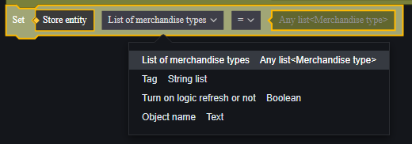
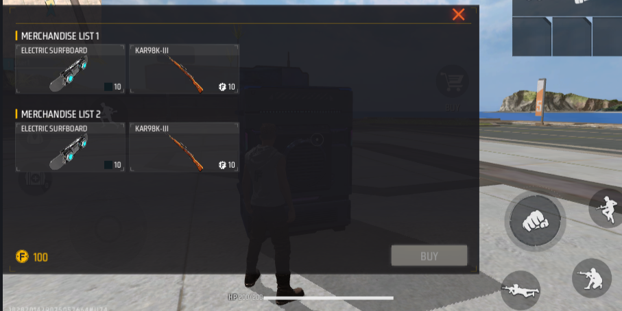
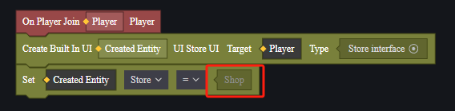
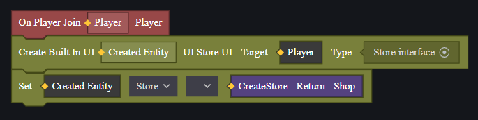
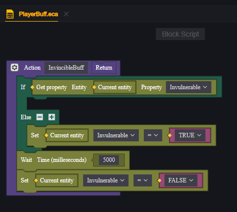
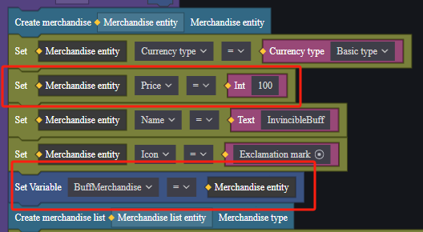
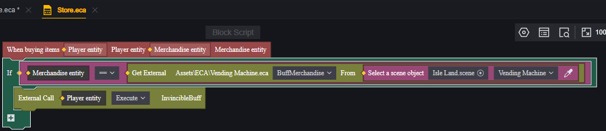
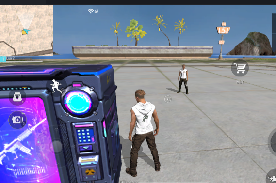
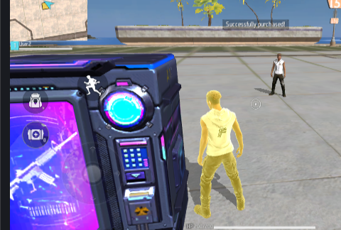

# 经济-用户手册

## 使用经济模组

经济模组支持玩家以货币购买物品。常用于内置HUD模板，可以快速搭建一个游戏内商店。

经济模组是一个可选模组，要使用货币、商店等内容，需要加载经济模组。

加载过经济模组后，就可以在脚本的模组分类使用经济相关的图元。

卸载经济模组时，需要 注意之前使用过的经济模组图元都会失效，这也许会对您的项目产生影响。

## 货币和钱包

默认情况下，游戏中只有一种默认货币。在不额外设定的情况下，所有使用货币的场景都是在使用这个默认货币。

> 100个默认货币

### 新建货币

您可以在经济模组中创建自定义货币。

您可以为新建的货币命名、选择货币的图标和更改它的颜色。

货币的图标可以从工程自带的图片或外部导入的图片选择，外部导入的图片会置于图片选择器的底端。

> 自定义图片

使用新建的货币，需要将商品属性和给予玩家的货币设置为该货币类型，请见下文相关内容。

### 增删货币

货币必须存放在钱包中，所以需要先为玩家创建一个钱包。

> 创建复数个钱包是没有意义的，只有最初创建的钱包会生效。
>
> 玩家初始没有钱包，但是任何有关的钱包的操作，例如购买、打开内置商店UI、显示货币数量，都会为该玩家创建一个钱包。

向玩家的钱包中可以添加、移除默认货币或自定义货币。

## 商店

### 商店组成

一个商店界面显示的是一个商店实体，商店实体由货架组成，货架由商品组成，商品是创建出来的。

#### 商品

使用物品作为商品时，将物品添加至商品才可以作为商品使用

对于商品，可以通过设置图元来调整属性

可以调整商品的售价、货币类型、购买限制、商品名、图标等作为商品时的属性。

其中货币类型可以选择默认货币或自定义货币，选择自定义货币后，购买该商品就需要买家玩家钱包内有该货币。

#### 货架

货架是若干商品的集合。

> 该商店中的两个货架

在已经制作了若干商品后，需要将商品摆入货架：

货架在创建后也可以修改属性。

#### 商店

商店是货架的集合。

在制作好若干货架后，将其放入创建的商店中，商店实体就可以正常执行售卖逻辑了。

商店的属性：

在商店下方，会显示玩家钱包中所拥有的商店绑定的货币类型的数量

> 默认只显示默认拥有的默认货币的数量

### 创建商店

按照顺序，先制作商品、再制作货架、再制作商店，我们得到了一个商店实体。但是它还不能在游戏中显示出来。

我们可以通过以下几个手段将商店在游戏中显示出来。

#### 自动贩卖机

关卡物件中有一个带功能物件：自动贩卖机，使用自动贩卖机可以打开指定的商店实体。

自动贩卖机带有两个默认配置：

1. 触发范围：距离自动贩卖机一定距离内会激活商店按钮。
2. 显示自动贩卖机：自动贩卖机的模型是否显示在地图上。

要使用制作好的商店实体，需要为自动贩卖机添加脚本。

我们将创建商店的逻辑封装为一个返回值为创建商店的函数，在自动贩卖机脚本中将函数创建出的商店设为自动贩卖机的商店。

在靠近自动贩卖机时，会先激活一个商店图标，点击该图标会打开商店界面。

如果需要使用按键打开商店，建议直接使用自动贩卖机物件，可以通过关闭该物件的显示来达成固定范围内触发按键商店。

#### 内置商店UI

如果需要直接打开商店UI，比如游戏回合开始时直接打开商店界面，或者进入某个区域立刻打开商店，需要使用内置商店UI。

内置商店UI可以通过创建内置游戏UI图元进行创建：

创建内置商店UI后，就可以将该UI的属性中绑定商店一项设为创建好的商店实体。

### 公用和私用商店

默认创建的是公用商店，不需要额外处理，所有玩家都可以从该商店中进行购买，商品被买光之后其他玩家就无法继续购买这个商店中的商品了。

如果需要每位玩家单独使用相同的商店，可以通过为每位玩家创建一个商店来实现。

> 强烈建议将创建商店封装为一个方法或者将创建出的商店实体存入公共变量。

例如在全局脚本中，为每位加入游戏的玩家展开一个商店UI：

这样每个玩家的UI上都是使用同一个商店实体创建出的不同实例，可以达成每个人专享自己商店的目的。

## 示例

在商店中出售无敌BUFF。

首先我们在玩家模组下创建一个 管理玩家BUFF的脚本：

在该脚本中编写一个无敌BUFF，会给当前玩家施加持续5秒的无敌：

在场景摆放一个自动贩卖机，为其添加脚本：

在自动贩卖机的脚本中编写一个创建商店的方法：

在这个商店中，只有一个货架，货架上只有一个商品，这个商品不对应任何实际的物品。

商品图标选用叹号，或任何您喜欢的图标：

商品的售价定为100，并将创建的商品存入脚本变量待用。

在自动贩卖机创建时，调用这个方法创建商店实体，并将商店实体与自动贩卖机绑定：

此时商店中已有这个商品，但是无法触发无敌BUFF。

额外创建一个商店脚本，监控玩家购买事件：

> 结合上面存入商品的变量是脚本变量，这里使用了外部链接取得这个变量。您也可以通过组件属性的方式将商品存入全局变量来取得商品实体。

因为购买物品的事件，这个脚本需要挂载在商店实体上，而商店是游戏运行后创建出来的，所以需要动态挂载。

回到自动贩卖机脚本上，将这个商店脚本挂载给创建出的商店实体：

这样商店已经构建完成，但是玩家并没有购买商品的金钱，创建一个全局脚本，为每位玩家添加500默认货币。

运行游戏：

初始两位玩家都没有无敌：

打开商店，商品存在，玩家钱包内货币数量符合预期：

购买成功，购买的玩家获得了无敌效果：

5秒后，无敌效果结束：

再次打开商店，发现钱正常减少了100：

