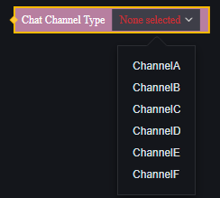

# 语音频道-用户手册

玩家使用语音沟通时，只有在相同语音频道的玩家才可以互相沟通。

我们默认提供了6个自定义语音频道，以供您编辑自定义地图时使用。

## 改变玩家的语音频道

通过脚本，您可以在游戏过程中使玩家进入指定的语音频道：

也可以使玩家退出语音频道：

玩家加入新的语音频道后，默认退出原先的语音频道。

## 语音频道相关的事件

通过事件，您可以监听到玩家在游戏中进出语音频道的时机，进而实现其他逻辑。

【图先欠着】

## 快捷聊天状态

快捷聊天是玩家快速发送一些预置好的聊天内容的功能。

通过脚本，您可以在游戏过程中调整玩家是否可以使用这一功能的权限：

