# 小地图-用户手册

小地图是整局游戏地图的缩略图，可以实时显示玩家的位置和朝向，用于玩家定位自身所在和其他地图信息。

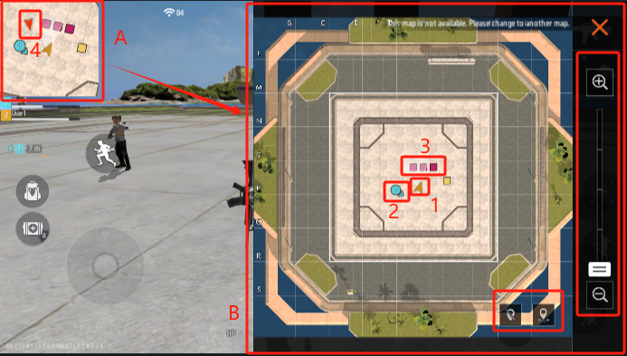

A: 常驻的缩略小地图。

B: 点击A之后展开的详细小地图。

1: 玩家自身，箭头指向的方向为朝向，箭头前的锥形范围为玩家视野。

2: 玩家的队友，箭头指向的方向为朝向。

3: 地图上的物件。小地图中表示物件的彩色方块我们称为像素点。

4: 被检测到的敌人，仅在缩略图展示。

缩略小地图总是会保持当前玩家朝向向上，而详细小地图方向是固定的：

在展开小地图后，可以通过右侧菜单缩放小地图：

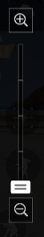

可以通过右下方按钮标记小地图或取消标记：

## 深度图

默认小地图支持深度图功能，可以根据物件的高度标记不同的颜色以区分其高度。

在模组-机制参数中，可以找到默认小地图分类，其下有深度图开关功能：

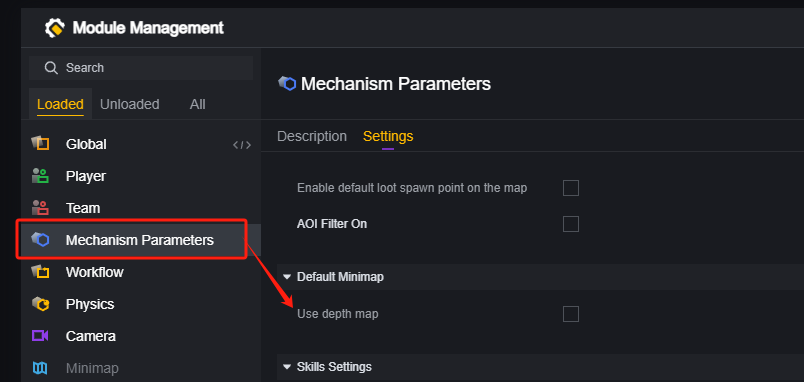

关闭这个选项，地图上的物件会统一标记为同样的颜色：

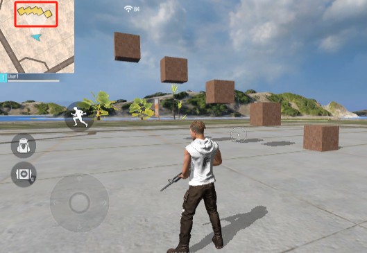

开启这个选项，地图上的物件会根据自身碰撞体高度最高的表面标记不同的颜色：

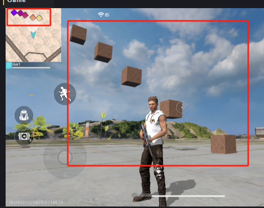

对于多个物件的组合物件，取其最高的那个有碰撞表面。

将上图的最高和最低的组合起来，以最低的为父物体，表现为：

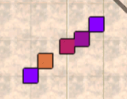

> 可以看到处于低处的物件视为在高处，且深度判断与父子关系无关。

保持上文的父子关系，但关闭最高的方块的碰撞：

> 方块后面的数字越大方块所处的位置越高，数字仅代表排行，不表示绝对高度。

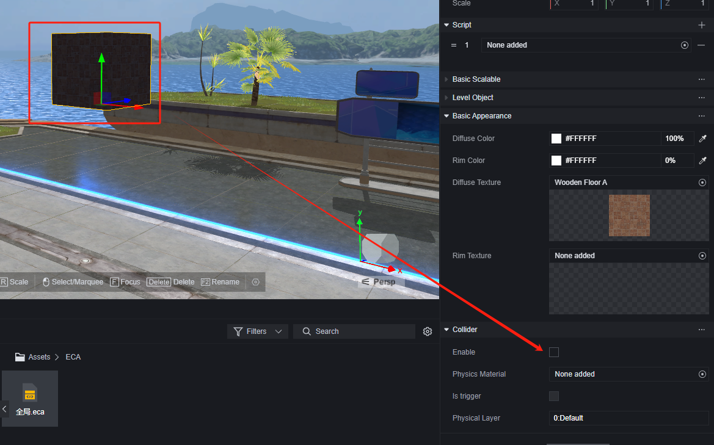

此时表现为：

可以看到关闭了碰撞的方块不再显示在小地图上，且最低和最高的组合体也按照还有碰撞的最低方块处理。

### 补充

1. 深度图的精度为1米。
2. 一些物件不会被小地图读取到，如基础白模物件：

3. 深度图设置也会影响到下文会提到的自定义小地图上标记的物件的深度表现。

## 自定义小地图

您可以自定义小地图背景、其他图标和显示哪些物体，

要自定义小地图，需要加载自定义小地图模组。自定义小地图模组是可选模组，卸载后之前使用的内容和图元会失效。

开启自定义小地图模组功能后，小地图部分会自动显示自定义小地图内容，如果尚未编辑自定义小地图，则会表现为：

### 自定义小地图属性

自定义小地图拥有若干属性

**中心和地图大小**：小地图以世界坐标的哪一点为中心，展示地图上多大区域的内容。小地图的在玩家看来的UI大小是不会变的，地图大小越大，小地图UI这块固定区域表示的区域就越大。如果您使用的小地图背景是对场景地形的描绘，中心和地图大小就需要调整至与实际场景匹配。

**是否开启深度图**：此属性可以通过模组配置修改，在脚本内可以动态地修改。

### 设置小地图图标

使用模组中带有的图元可以在小地图上添加图标：

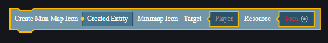

图标具有以下属性：

#### 设置背景

调整图标的层级和大小，可以使用图标作为背景。

我们导入一张纯黑的图片：

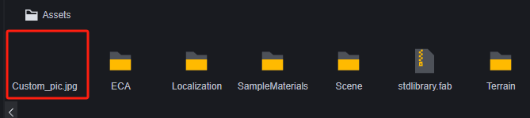

将这张图片的层级设为-1，缩放调整为10。

#### 设置高关注度单位

您或许需要在地图上高亮标注宝箱、重点关注的玩家。使用图标的跟随目标属性可以将图标绑定在该物体上。

我们在地图内添加一个自动贩卖机：

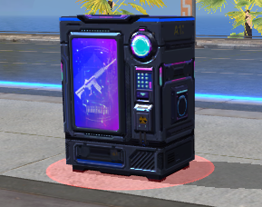

为其添加一个商店图标：

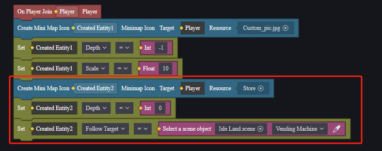

再为每个其他玩家都添加一个会跟随玩家的图标：

这样地图上的商店和其他玩家都会显示出来：

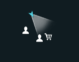

### 设置像素点

上文提到过，地图上的物件显示到小地图上会是一个带有颜色的方块，这个方块称为像素点。

在自定义小地图中，默认不显示任何像素点。

通过图元可以设置显示哪些物件为像素点：

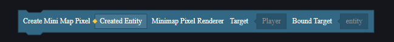

为所有关卡物件设置像素点：

> 图中是开启了深度图设置的表现。
