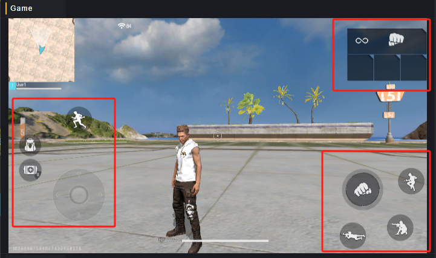
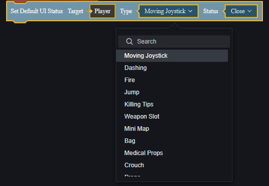

# 输入系统-用户手册

输入系统是一个默认模组，可以通过修改输入系统配置来对游戏操作进行重映射。

## 局内通用按钮

游戏中自带有一套局内通用按钮，这个默认UI是自动创建的、并且可以用来操控玩家。

可以通过脚本来控制这些局内通用按钮的显隐：

{
  "type": "a",
  "id": "A5dC35^!WzQibCaFKtGx",
  "extraState": {
    "X": 528,
    "L": [
      1,
      2,
      3
    ],
    "T": "SetPlayerHubSwitch",
    "OT": null
  },
  "inputs": {
    "P1": {
      "shadow": {
        "type": "tys",
        "id": "yQYArCczLxf9yw3FNXAT",
        "extraState": "Player"
      }
    },
    "P2": {
      "shadow": {
        "type": "ipe",
        "id": "-)h5GeGgU0{HBI{KpY[.",
        "extraState": "PlayerHudSwitchType",
        "fields": {
          "I": "MovementHUD"
        }
      }
    },
    "P3": {
      "shadow": {
        "type": "ipe",
        "id": "Spr.Q/3v;moE6P^U%6x2",
        "extraState": "CommonHudSwitchValue",
        "fields": {
          "I": "Close"
        }
      }
    }
  }
}

## 自定义输入系统

在输入系统中可以添加或删除一项输入：

对于一项输入，可以选择输入类型为键盘、鼠标或是UI文件。

### 键盘和鼠标

键盘和鼠标输入目前仅对PC Debug时生效，不做介绍。

### 自定义UI

对于自定义地图来说，游戏内操作主要通过自定义UI重映射。

在输入系统中，可以将某一项输入与自定义UI上的一个控件绑定，这样可以使用自定义UI的控件来实现操作。这将有助于您制作独特的游戏模式或其他想改变玩家输入的场景。

### 如何配置自定义输入

以自定义UI为例，您需要先准备好用于自定义输入的自定义UI。

我们在这个自定义UI下制作一个仅有一个按钮的UI，计划让这个按钮起到使玩家前进的效果。

在输入系统模组中，新增一项输入。

选择映射操作为前进、类型为UI文件，选择之前创建的自定义UI和按钮、输入手势为按住。

为玩家创建自定义UI，这个图元脚本创建在全局模组上。

{
  "type": "e",
  "id": "*%pI`W(dS_piURm|VMA!",
  "extraState": {
    "X": 14,
    "L": [
      1
    ],
    "T": "OnPlayerAdd",
    "OT": null
  },
  "fields": {
    "P1": {
      "name": "Player",
      "type": "Player"
    }
  },
  "next": {
    "block": {
      "type": "a",
      "id": "rk0cKIssMKf0cmAf5K1b",
      "extraState": {
        "X": 34,
        "L": [
          1,
          2,
          3
        ],
        "T": "CreateCustomHud",
        "OT": null
      },
      "fields": {
        "P1": {
          "name": "Created Entity",
          "type": "CustomHud"
        }
      },
      "inputs": {
        "P2": {
          "shadow": {
            "type": "tys",
            "id": "zCSt9:DaP7Fym?RosxoY",
            "extraState": "Player"
          },
          "block": {
            "type": "lcg",
            "id": "9f?Pdkf6=$dO1G6psZ?%",
            "extraState": "*%pI`W(dS_piURm|VMA!P1",
            "fields": {
              "VR": "Player"
            }
          }
        },
        "P3": {
          "shadow": {
            "type": "pkh",
            "id": "bjBa_(1|Qv}i=[l#w=p7",
            "fields": {
              "HD": "02xr50iei5df-m11x1qdn-kqt9qw8jx19"
            }
          }
        }
      }
    }
  }
}

运行游戏，发现这个按钮的功能已经正常生效。

