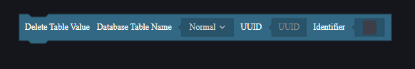
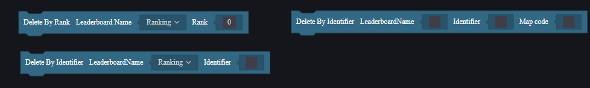
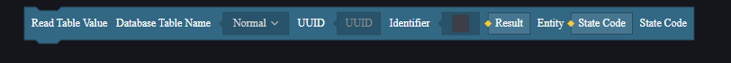
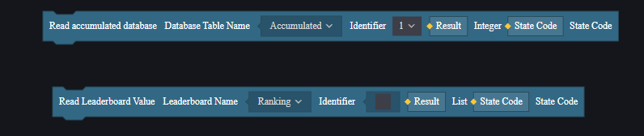
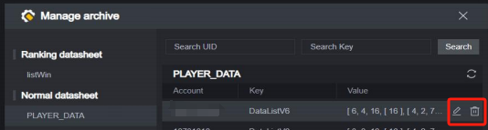
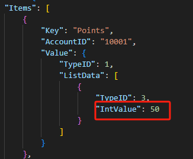

# 数据存储-用户手册

数据存储可以在游戏进程外存储数据，并可以使用在存档、排行、统计、储存游戏设置等功能上。

数据存储的意义是同一张地图的不同对局间的数据互通。

## 加载数据存储模组

要使用数据存储，需要先加载数据存储模组，这是一个可选模组，卸载该模组会导致之前使用的相关图元、代码和配置失效。

## 分类

在加载数据存储模组后，会看到三个配置，分别是排行数据存储、统计数据存储、普通数据存储。

由数据存储创建出的表格不可直接浏览，但是在本篇文档中会给出表格样式说明。

### 普通数据存储

#### 参数说明

在普通数据存储中添加参数，每条参数代表着一个数据表，每条参数有以下可配置项：

**表格名**：创建的表格名

**数据类型**：表格中接受的数据类型

可以发现每张数据表只接受一种数据类型的输入。

#### 表格样式

DataSheetName

| UUID | Key  | Value |
| ---- | ---- | ----- |
|      |      |       |

**DataSheetName**：在数据存储模组添加的表格名。

**UUID**：玩家独特ID，在写入数据时，需要填入当前玩家的UUID。

**Key**：在进行数据存储操作时由脚本创建的索引。

**Value**：在进行数据存储操作时由脚本填入的值，只接受数据存储模组内设置的类型。

#### 使用场景

用于玩家存档。

用于其他可以使用该表格数据的场景。

### 排行数据存储

#### 参数说明

类似于普通数据存储的结构，但是排行数据存储只接受Int型输入，且额外提供了一个排序功能。排行数据存储的表格中会按照您配置的排序方式将数据进行排列。

**表格名**：创建的表格名。

**排序方式**：选择升序还是降序排列输入的Int型值。

#### 表格样式

**DataSheetName**

| Ranking | Key  | Value(Only Int) |
| ------- | ---- | --------------- |
| 1       |      |                 |
| 2       |      |                 |
| 3       |      |                 |

排行数据存储没有UUID，但是支持自定义KEY，而且值只接受Int型输入。排行数据存储会根据值这一列的数据将整表进行排序。

#### 使用场景

玩家排行，例如击杀排行、积分排行、竞速排行。

### 统计数据存储

#### 参数说明

类似于普通数据存储的结构，但是统计数据存储也只接受Int型输入，而且必须预设Key。

**表格名**：创建的表格名。

**Key管理**：预设的Key列表。

#### 表格样式

DataSheetName

| **Key**  | **Value(Only Int)** |
| -------- | ------------------- |
| **KEY1** |                     |
| **KEY2** |                     |

统计数据存储没有UUID，所有同Key信息都会存到同一条数据下。

**Key**：预设的索引。

**Value**：值，只接受Int型数据。

#### 使用场景

全服统计，如总击杀BOSS数，总消费金钱。

## 使用方法

### 增与改

向一个数据存储表格增加一条数据和修改一条数据的操作是一样的，都使用写入图元。

对于排行数据存储和统计数据存储来说，都要使用对应的图元。

### 删

删除一条数据使用删除图元。

不同类型的数据存储使用的数据索引不同。

统计数据存储因为是提前设定的KEY，所以不支持整行删除，只能修改KEY对应的值。

### 查

查询数据需要使用读取图元，不同类型的数据存储使用的索引不同。

在排行数据存储中，可以根据排名一次取出多行数据，数据以列表形式返回。

## 使用限制

数据存储具有一些使用限制。

1. 每分钟读写有限制，每分钟支持读取数据60次、写入数据75次。在使用时需要尽量降低数据存储的读写频率，并检查是否读写成功。
2. 数据存储的一个Key的value存储大小上限是4k。
3. 排行数据存储每个表最多只能储存150行的数据，额外的数据完全不会记录。
4. 统计数据存储最多只支持建立120张表。

## 数据中心

已经发布的自定义地图如果开启了数据存储，可以在数据中心查看：

打开对应地图的数据存储，可以浏览当前地图储存的数据：

在数据中心中，数据是按照表格形式展示的，可以直观地查看各类数据存储：

在排行数据存储与统计数据存储中，可以通过设置定期清理数据：

在数据中心中，排行数据和统计数据可以输入Key或Value进行查询：

但是普通数据表必须同时输入UID和Key才能查询：

数据中心的查询不支持模糊搜索。

在数据中心中，也支持直接对存储的数据进行更改：

## 示例

接下来通过一个简单示例来演示如何通过数据存储来对玩家数据进行存档。

我们计划制作一个简单的小游戏，玩家每次攻击目标圆柱体会获得1积分。

在存档中，我们会记录玩家的位置、朝向和积分，玩家再一次进入这个地图会继承存档中的数据。

### 制作游戏

首先制作一个简单游戏：

在场景中摆放一个目标圆柱，并加入三个用于定位的装饰：

玩家每次命中这个白色圆柱体就会获得1积分，玩家当前积分会显示在自定义UI上：

### 制作存档

在本示例中，我们只储存玩家的位置、朝向和玩家的积分。

其中积分已经设置为了玩家的自定义属性，三个数据都可以从玩家实体上取得。

位置、朝向的数据类型是Vector3，积分的数据类型是Int。尽量避免使用多张表储存玩家数据，因为每多一张表，就会多出玩家数量的数据读写量。为避免超过使用限制，我们将两种不同类型的数据以任意类型列表的形式储存到存档表中。

数据存储选择普通数据存储，并设定接受的值类型为任意类型列表。

> 您也可以使用任意类型并分三个Key储存数据，但是位置和朝向往往一同使用，这里使用列表来一并储存两个数据作为玩家的初始位置和朝向信息。

在全局脚本中：

在游戏每回合结束和玩家退出时，为玩家存档：

在玩家加入时，将其的积分、位置和朝向设置为存档的数据，并在显示积分的UI显示当前玩家积分。

如果因为某种原因导致读取数据失败了，需要加上读取失败的处理，这里仅打印失败报错：

用两个调试客户端运行游戏：

在获得一定积分后退出游戏，然后重新进入，会发现退出的玩家积分与位置与退出前一致。

在回合结束时，会正常保存玩家数据，所以如果等待到游戏自然结束，再开启调试时玩家与游戏关闭前的积分和位置一致。

## 本地查看数据存储

数据存储是作用于已发布地图的，通常来说只能在数据中心中查看。

但是我们提供了一个开发者工具用来本地测试：

在您的工程使用了数据存储并已经存入了数据后，点击这个选项会打开本地文件浏览器，其中会有一个生成的.jason文件：

如果没有使用数据存储或者尚未向数据存储中储存数据，则会提示文件不存在：

这个.jason文件由数据存储导出，可以用于查验储存了的数据：

> 上文示例中储存的玩家存档的一部分

这个.jason文件的数据就是本地调试时的数据源，合法地修改.jason文件会直接改变游戏内读取的数据存储数据：

