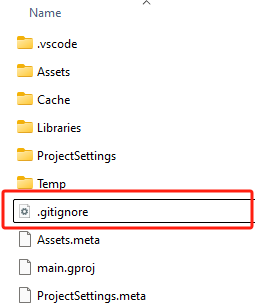
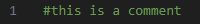
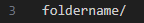
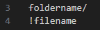

# 流程管理-gitignore-用户手册

## 简介

Git是一个开源的分布式版本控制系统，可以有效、高速地处理从很小到非常大的项目版本管理。本文主要面向已经使用git进行版本管理的用户，为这些用户介绍gitignore功能和官方提供的gitignore配置。

### 什么是gitignore

在工程目录中，并非所有文件都需要同步至远程仓库，比如个人偏好配置、临时文件。使用gitignore可以标记那些不需要Git追踪的文件，避免过度同步和覆盖协作者的个人设置，从而提升工程的版本管理效率。

## .gitignore文件

.gitignore是一个特殊的纯文本配置文件，包含了项目中所有需要忽略的文件或文件夹。配置在.gitignore文件中的文件或文件夹会被Git忽略和不追踪。

我们在每个工程中默认创建了该文件，并已经配置了推荐忽略的文件和文件夹。

您可以在工程中找到该文件：



如果您使用的是linux系统，需要使用ls命令的-a标志以显示隐藏的文件：

```defalut
ls -a
```

该文件的默认配置为：

```default
.vscode/
Cache/
Libraries/
Temp/
*.lock
```

其中：

文件夹名+“/”代表屏蔽该文件夹下所有文件、“*”+文件名后缀代表屏蔽所有该后缀的文件。

.vscode/  ：这是VS Code的配置文件夹。

Cache/  ：这是缓存文件夹。

Libraries/ ：这是不可编辑的官方库文件夹。

Temp/：这是临时文件夹，包含运行日志等内容。

*.lock：这是所有锁定的文件。

以上为官方推荐Git忽略的文件。

## .gitignore文件编辑规则

通常来说，您不需要编辑.gitignore文件。不过如果您有额外想忽略的文件或者有想添加为关注的文件，可以查看此条说明。不过需要注意的是，,gitignore文件本身是需要同步至远程仓库的，所有在对应仓库的协作者都会受到该文件配置更改带来的影响。

### 注释

以#开头的行是注释。



### 忽略文件和目录

单独输入一段字符串会屏蔽名字相同的目录和文件：


> 不过一般来说，文件会有后缀名，从而区别于目录名。

### 仅忽略目录



忽略该名称的目录下的所有文件。包括多级目录下的同名目录，例如：*/foldername/

### 使用通配符

1. 星号"*"，匹配多个字符。\*.test表示屏蔽所有以.test结尾的文件。
2. 问号"?"，匹配除"/"外的任意一个字符。t?st表示屏蔽所有名字为四个字符、且第1、3、4个字符为t、s、t的文件或目录。

3. 方括号"[]"，匹配方括号中的每个字符。*.[abc]表示所有以.a、.b或.c为结尾的文件会被忽略。

   在方括号中使用短横线，表示匹配两个字符范围内的字符，[0-9]表示依次匹配0到9的数字。

### 反向操作

使用"!"可以将之前已忽略的文件加回跟踪列表。



> foldername下的filename文件会被重新跟踪。

### 其他规则

1. .gitignore文件每一行是一种匹配模式，空行不匹配任何文件。
2. Git跟踪的是文件，而不是目录。
3. 如果文件已被Git跟踪，那么即使添加至.gitignore文件也不会被忽略。


如果您有进一步的需求，可以自行查阅gitignore和Git的使用指南。
