# 代码脚本-用户手册

介绍如何编辑代码脚本

## 概念介绍

### 服务器脚本和客户端脚本

不同运行平台的脚本能使用的事件和接口不同。通过对库的查询可以确认该元素的适用范围。

服务器脚本和客户端脚本无法直接互相调用，只能通过事件的方式通知调用另一端。

脚本的后缀名为.fcg

### 库

库的后缀名为.fcc

创建一个代码脚本后，会自动添加标准库：

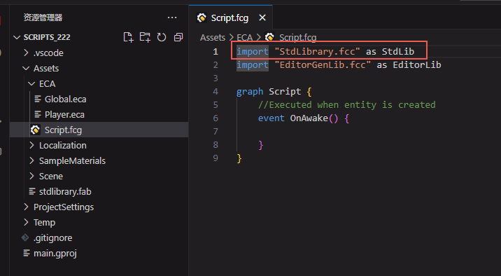

标准库文件：

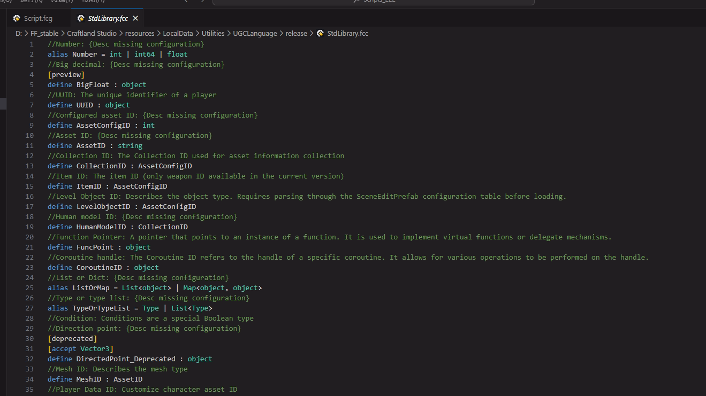

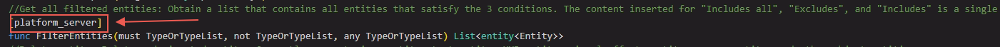

[platform_server]标签表示了该元素适用的平台为服务器，只有服务器脚本才可以使用这个元素。

[platform_Client]表示该元素适用平台为客户端。只有客户端脚本才可以使用这个元素。

没有标签的元素服务器和客户端都可以使用。

[deprecated]表示该元素已被弃用，请不要使用这些元素。

在编辑器路径：\Craftland Studio\resources\LocalData\Utilities\UGCLanguage\release下存有官方提供的库文件，可以根据需要进行引用。

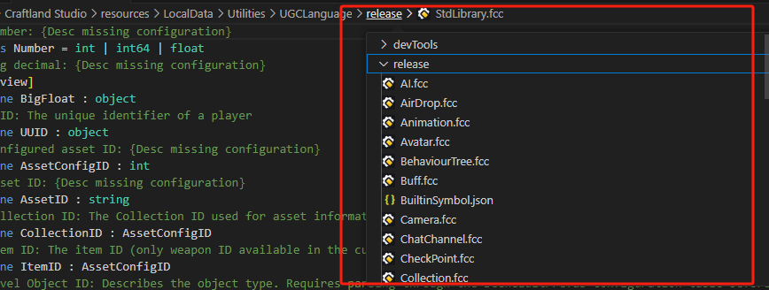

打开任何一个引用了库的代码脚本，按住Ctrl键点击库可以直接跳转至该库。

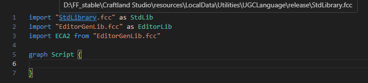

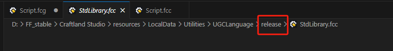

> release就是存放官方库文件的路径

使用一个库，需要在文件头部对其进行引用，语法为：

import "库文件" as 别名

对于官方的库文件和在编辑器内新建的自定义库文件，不需要添加路径。

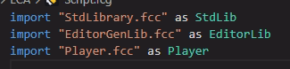

> EditorGenlib.fcc是存放注册了的资产，主要用于引用图元脚本的库

支持玩家自定义库，请查看下文的自定义库相关的部分。

## 环境准备

### VS Code插件

#### 安装插件

插件已经发布到 VS Code 的插件市场，在VS Code插件处搜索Free Fire Craftland Code或部分关键字：

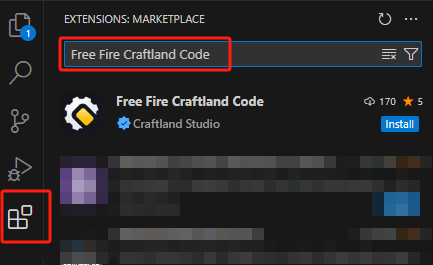

点击安装即可。

安装完成后，在已安装的插件列表就可以找到名为 `FFUGCLanguage` 的插件了，用 VS Code 打开代码脚本文件，看到对应的语法高亮生效，就说明插件安装成功了。

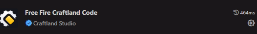

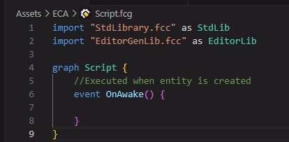

#### 重要功能介绍

插件详细信息可以参考VS Code中插件的说明。这里介绍一些重要的插件功能。

1. **代码片段补全**：输入贝塞尔曲线、向量等固定格式、但较为复杂的代码片段时，只需要输入关键词即可触发代码片段补全。

   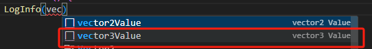

   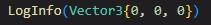

   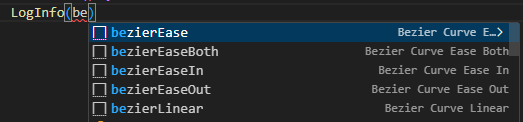

   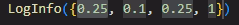

   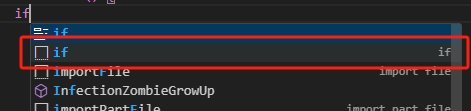

   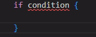

   具有这个标记的自动补全即为插件中的代码片段补全。

   

   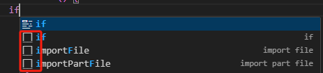

   > 图中第一个if的补全是VS自带的关键字补全，第二到第四个为插件中定义的三个不同的代码片段补全

2. **智能提示与补全**：自动补全上下文出现过的变量、自动补全事件与API名称、调用函数时，提示函数的形式参数与返回值信息、使用未引用库的事件或API时，自动引用库。

   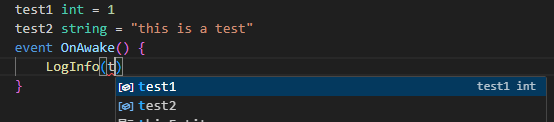

   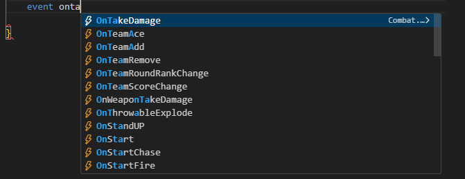

   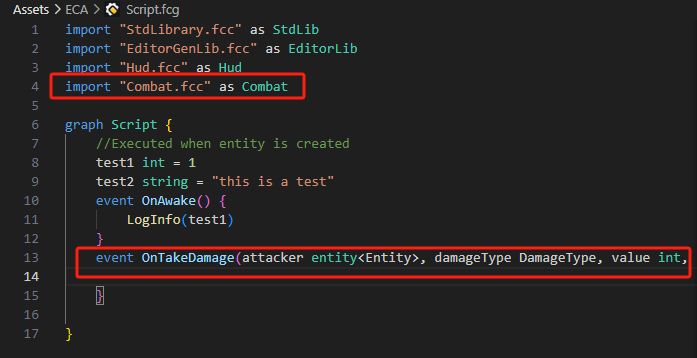

3. **诊断**：有语法和语义错误的代码标红

   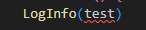

   鼠标悬停在错误上显示错误提示：

   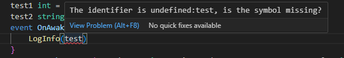

   应为：

   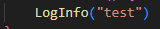

4. **悬浮提示**：鼠标放在感兴趣的代码上就能看到详细信息

   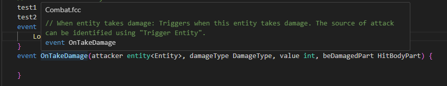

5. **跳转到定义**：通过 F12 或右键对应代码可以跳转到定义位置

   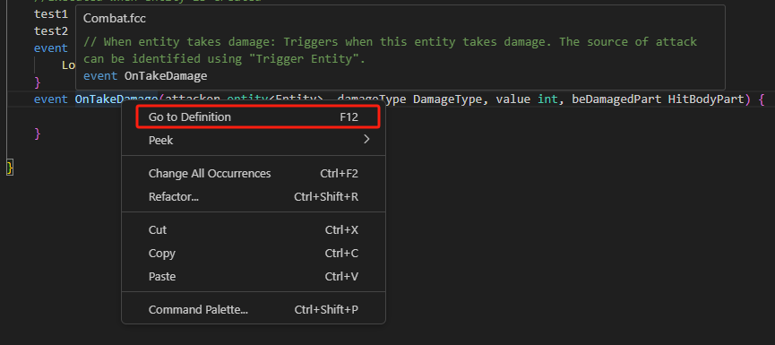

   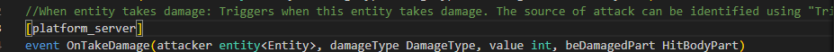

## 脚本结构

下面是对一个代码脚本结构的概要说明，一个代码脚本文件中，包含有三个部分：

- 脚本成员
  - 变量定义
  - 函数定义
  - 事件定义

也就是说脚本的一级成员只能是这三类之一。

```golang
graph 脚本名称 {
    脚本变量名 类型 = 初始值

    func 函数名(形参列表-可选) {
        //do sth...
    }

    event 监听事件名() {
        //do sth...
    }
}
```

我们引入一个`代码块 `的概念，它是指被一组花括号`{...}`所包裹的代码内容。

举个例子，将一个调用日志打印这种表达式直接写在脚本的一级成员中是错误的，但是它可以写在函数或者事件的代码块中：

```golang
graph Demo {
    //LogInfo("Hello") //这是错误的书写位置

    func Hello() {
        LogInfo("Hello") //可以写在函数或者事件的代码块中
    }

    event OnAwake() {
        LogInfo("Hello") //可以写在函数或者事件的代码块中
    }
}
```

## 编辑相关

### 基本语法

代码脚本的基本语法，可以查看下方链接对应部分详细了解：

 [脚本附加说明-用户手册.md](./脚本附加说明-用户手册.md) 

### 数据类型

代码脚本的数据类型，可以查看下方链接对应部分详细了解：

 [脚本附加说明-用户手册.md](./脚本附加说明-用户手册.md) 

### 运算符

运算符用于在程序运行时执行数学或逻辑运算。

内置的运算符有：

- 算术运算符
- 关系运算符
- 逻辑运算符
- 赋值运算符
- 其他运算符

代码脚本的运算符，可以查看下方链接对应部分详细了解：

 [脚本附加说明-用户手册.md](./脚本附加说明-用户手册.md) 

### 流程控制

代码行的默认执行顺序是自上而下顺序执行，为了实现更加复杂的流程控制，我们需要引入流程控制语句。

代码脚本的流程控制，可以查看下方链接对应部分详细了解：

 [脚本附加说明-用户手册.md](./脚本附加说明-用户手册.md) 

### 变量

变量在使用前，需要在代码中进行声明，即创建该变量。变量有以下几种：

#### 局部变量

声明局部变量的一般形式是使用`var`关键字，其类型在有右侧赋值语句的情况可以由编译器自动推断，否则就应该主动声明。

局部变量的作用域为从声明位置开始到所在语句块结束。

```go
func Demo() int {
    //完整语句
    //var value int = 10
    //省去类型的声明
    //var value = 10
    //省去右侧的赋值语句
    var value int
    value = 10 //ok
    if value == 10 {
        var localVar = 20
        value = localVar //ok
    }
    value = localVar //not ok
    return value
}
```

#### 脚本变量

脚本变量的作用域是当前脚本，脚本变量定义后也可以在其它脚本中通过实体实例进行访问。

```go
graph HelloWorldGraph {
    SayTipWords string = "Hello, " //脚本变量
    
    func SayHello(name string) {
        std.PrintString(SayTipWords + name)
    }
    
    event OnAwake() {
        start SayHello("FF_UGC")
    }
}
```

#### 组件属性

组件属性的作用域是当前组件，组件属性都是公开的数据，可在任意脚本中通过实体实例进行访问。

```go
graph EntityDataStore {
    func EntityPropModify(input int) int {
        thisEntity.EcoKillMoney = input
        return thisEntity.EcoKillMoney
    }

    func EntityPropModifyV2(input int) int {
        thisEntity<std.Global>.EcoKillMoney = input
        return thisEntity<std.Global>.EcoKillMoney
    }
}
```

#### 值类型和引用类型

bool、int、float、string和Vector2、Vector3、Quaternion这些基本类型都属于值类型，值类型不可能为nil，一定会具有一个值。值类型在赋值时，都会进行值拷贝。

而List<T>、Map<T>、entity<T>都是引用类型，其值可能为nil。引用类型在赋值时，只是改变其指向的地址，其地址上的内容改变时会改变所有指向它的变量的值。

### 函数

一个函数是把一些相关的语句组织在一起，用来执行一个任务的语句块。要使用一个函数，你需要：

- 定义函数
- 调用函数

#### 定义函数

当定义一个函数时，实际是声明函数的相关元素，其基本结构如下：

```golang
func 函数名(形参参数名 形参类型, ...) 返回值类型 {

}
```

下面是一个简单的示例：

```golang
func TryAddExp(player entity<Player>, exp int) bool {
    //...
    return false
}
```

#### 调用函数

你可以使用函数名来调用它，下面是一个简单的示例：

```golang
event OnAwake() {
    //...
    //调用当前脚本的用户函数
    var isSuc = TryAddExp(curPlayer, 15)
    //标准库的调用
    LogInfo(Format("AddExp %v:%v", List<object>{curPlayer, isSuc}))
}
```

#### 同步函数与异步函数

同步函数是执行并且立即返回的函数，中间不会有异步过程；

异步函数是函数实现内使用了会进行异步等待的API，比如`WaitForSeconds`。

在语法上，异步函数必须以`async`关键字进行声明：

```golang
async func ShowGameTime(){
    while(thisEntity<Global>.GameTimeMs < 10000){
        LogInfo("GameTime:" + thisEntity<Global>.GameTimeMs)
        WaitForSeconds(1000)
    }
}
```

##### 调用异步函数

当调用异步函数时，我们可以选择执行的方式:

- start
  - 调用异步函数，不阻断，继续执行下一行
- wait
  - 调用异步函数，阻断，直到异步函数结束再执行下一行

在缺省的状态下，默认为wait方式，会等待异步函数执行。

```golang
event OnAwake() {
    LogInfo("1")
    start TryAddExp(curPlayer, 15)
    LogInfo("2")
    wait TryAddExp(curPlayer, 15)
    LogInfo("3")
}
```

##### 异步函数的传染性

如果在一个自定义函数中调用异步函数，且选择以`wait`方式调用，那么这个自定义函数也必须声明为`async`：

```golang
async func ShowGameTime(){
    while(thisEntity<Global>.GameTimeMs < 10000){
        LogInfo("GameTime:" + thisEntity<Global>.GameTimeMs)
        //async的API
        WaitForSeconds(1000)
    }
}

async func Start() {
    //wait了一个async的函数
    wait ShowGameTime()
    LogInfo("Show End!")
}
```

#### 输出参数

return 语句可用于只从函数中返回一个值。但是，可以使用 out 来从函数中返回多个值，输出参数会把函数输出的数据赋给自己。

基本形式如下：

```
out var 形参名
```

下面是一个示例：

```golang
import "StdLibrary.fcc" as std
import "List.fcc" as list
import "EconomyModule.fcc" as economy

graph APIOutParam {
    func CreateWallet() int {
        NewWalletForEntity(nil, thisEntity, out var walletEntity)
        IncreaseMoneyForWallet(walletEntity, MoneyType.Basic, 1)
        return Length(walletEntity<Wallet>.Content)
    }
}
```

输出参数在定义和调用时都必须明确声明它是out的输出参数，它本质是在函数调用处定义一个局部变量，在函数内部为域外定义的这个局部变量赋值。

### 自定义库

支持用户创建自定义库文件，在资产处新建脚本时新建库文件即可创建库文件。

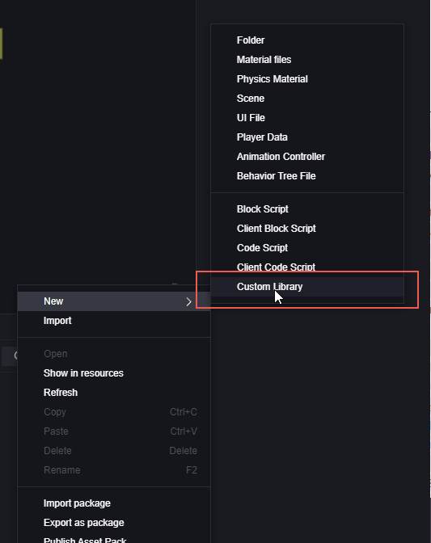

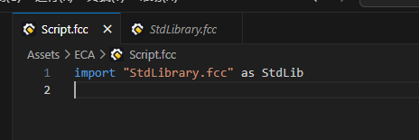

自定义库内支持自定义事件、组件、类型、枚举。

#### 自定义事件

将需要的事件在库中进行注册：

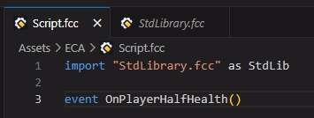

事件逻辑需要在代码脚本中编写，写有事件逻辑的代码脚本需要在使用时保证运行。

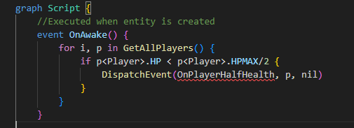

> DispatchEvent是用于自定义事件的接口，事件激活时可以发送自定义事件信号至库中，调用自定义库中的事件便会接受到该信号从而实现事件逻辑触发。

#### 自定义组件

参考标准库中对组件的定义：

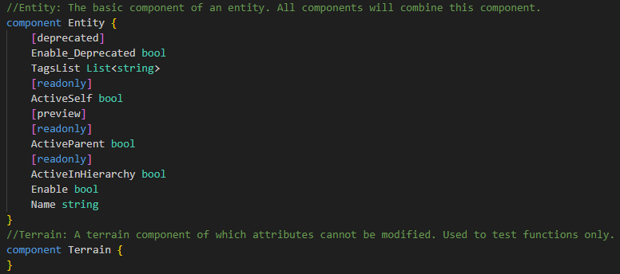

抽象组件：

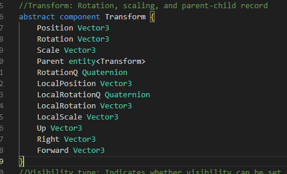

定义组件时，同时可以定义其中的属性。

#### 扩展官方组件属性

使用partial关键字可以扩展官方组件的属性：

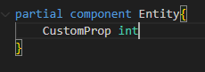

#### 自定义枚举

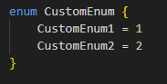

### 导入脚本

可以导入库文件和代码脚本。

库文件包含类型定义、组件定义、事件定义、API定义、脚本声明等等。

脚本文件包含脚本属性定义、事件处理函数、自定义函数等内容。

导入方式如下：

```golang
import "文件路径" as 别名
```

下面是导入标准库和自定义库文件的示例：

```golang
import "StdLibrary.fcc" as std
import "./MyEditorGenLib.fcc" as gen
```

- 当文件路径是一个文件名时，会从编译器所包含的标准库中查找
- 当文件路径是一个文件路径时，会按照文件路径进行查找

### 导入图元脚本

图元脚本会以每个文件一个graph的形式存放在EditorGenlib库中。要引用图元脚本，需要注意：

1. 图元脚本为非静态脚本时，需要在使用时指定脚本挂载的实体。

   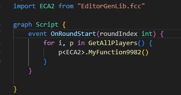

   > ECA2是挂载在玩家实体上的图元脚本，拥有成员MyFunction9982。

2. 图元脚本名不能为保留关键字。

图元脚本名为关键字时，必须通过以下方法更改脚本后才可以顺利引用：

在图元脚本上右键、选择修改脚本名，进行修改。这个操作不会影响显示的文件名，而是单纯修改代码用的脚本名称。

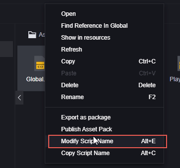

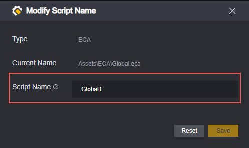

> 关键字不能作为用户自定义标示符，不只限于自定义图元脚本名。

对于满足条件的图元脚本，可以使用以下语句：

```golang
import 脚本名 from "EditorGenLib.fcc" 

//or

import 脚本名 as 脚本别名 from "EditorGenLib.fcc"
```

可以通过访问EditorGenLib.fcc库文件查看脚本的脚本名和路径信息

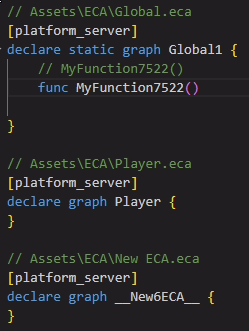

下面是导入的示例：

```golang
import Global1 as GLB from "EditorGenLib.fcc"
```

### 访问资产

脚本虽然可以使用一些常量、字面量的方式来指定资产ID，但是这种方式维护性较差，容易出现问题。因此，在脚本中访问资产需要使用资产注册的方式。

#### 资产注册

在FE编辑器中依次点击工具-脚本工具-脚本资产注册打开资产注册菜单：

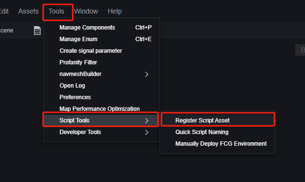

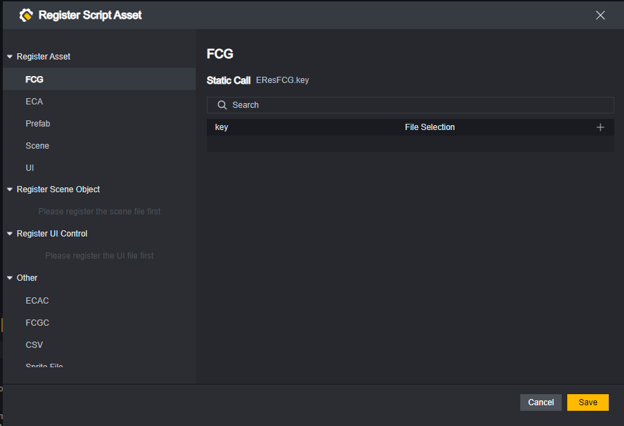

在左侧选择您要注册的资产类别，然后选择加号添加一条注册资产：

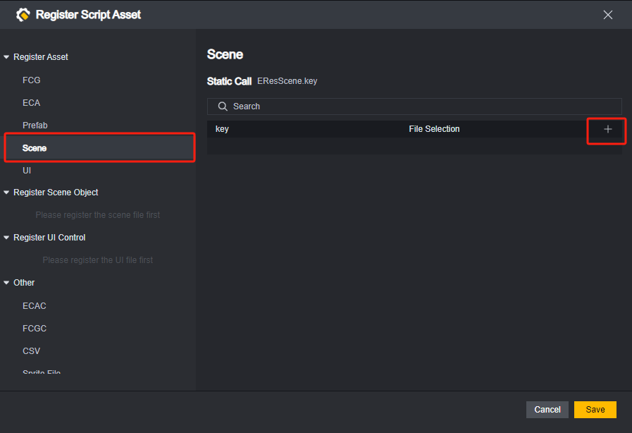

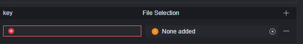

输入一个合法的key名，并选择对应的资产。

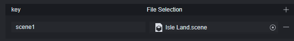

点击下方保存按钮完成资产注册。

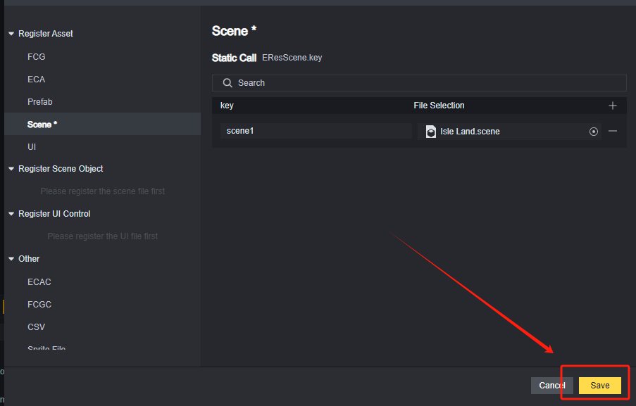

> 对于场景和UI，需要特别注意
> 场景之中有物件，UI 之中有 widget。您既可以注册场景、UI，也可以注册其中的物件、widget。
> 但是注册是有先后关系的：要先确保场景、UI 文件已注册，才可以再注册其中的物件、widget。

#### 静态调用

在脚本中使用FE编辑器菜单中的静态调用语法调用对应资产：

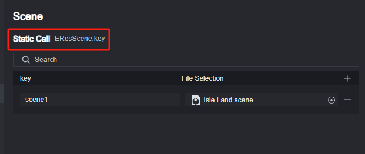

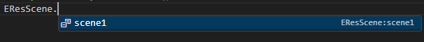

静态调用的资产可以在EditorGenLib.fcc库中的枚举处查看

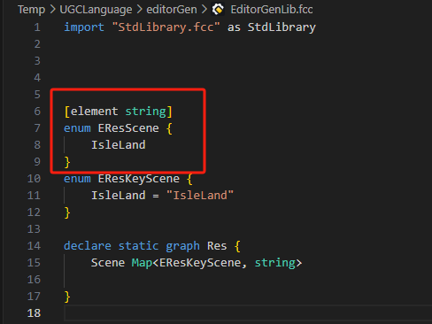

#### 动态调用

基于枚举访问的资产，虽然方便，但丧失了灵活性：考虑这样的场景，如果通过配置 csv 表，决定游戏中的某个物品的贴图。这时，就需要动态地访问资产。

在 EditorGenLib.fcc 中，会生成一个特殊的 Res graph。它的成员变量是收集每种资产的 map。

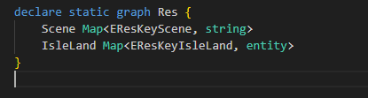

map 的 value 就是对应的资产 ID，因此还会根据资产类型生成枚举 EResKeyXXX，通过自动补全的方式，将注册了的资产填入枚举：

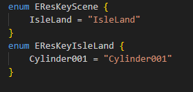

基于 map 访问的方式，可以实现动态访问资产的需求。例如，从 csv 读取的资产 key，就可以直接作为 map 的索引使用。

```go
var CSVKey string 
// ...
// 通过读取 csv 表，获取 key
var MySceneID = Res.Scene[CSVKey]
```

### 编译

启动DEBUG或保存工程会自动编译。

在VS Code中，使用快捷键Alt+B可以手动编译当前文件。

> 这是Free Fire Craftland Code插件的功能

在FE编辑器中，使用快捷键Alt+B手动编译。

编译错误和信息可以在对应软件的控制台查看。

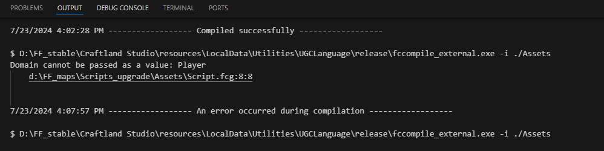


## 示例

通过一个简单示例，演示如何使代码脚本生效：

在图元脚本中自定义一个函数，效果是打印日志”开始“。在自定义代码脚本中实现玩家每次开火时，运行这个自定义函数，并在打印“开始”之后玩家生命值大于25点以上时扣除25当前生命值，玩家生命值小于等于25点时扣至1点。

> 这是一个毫无意义的需求设定，仅用于展示代码脚本的使用方法

首先在图元代码中实现自定义函数。函数名为TestFunc。脚本名为CustomFunc。


> 因为脚本文件命名为CustomFunc、并非保留关键字，所以无需额外修改脚本名。

将该图元脚本文件设为静态脚本以便后续引用。如果不设置为静态脚本，需要将该脚本挂载在游戏内活跃的实体上，并在引用时使用该实体。


新建一个代码脚本，因为减少生命值是需要与服务器通信的信息，所以配置为服务器脚本。又因为玩家每次开火是一个需要监听玩家行为的事件，所以选择将该脚本挂载在玩家实体上。


打开Player.fcg进行编辑：


首先确认事件触发是玩家开火时，尝试通过VS Code自动补全选择对应的事件：


自动补全该事件，会发现自动引用了该事件所在的Player库：


如果没有通过自动补全选到想要的事件或者对该事件不清楚，可以直接打开对应模块的库，进行搜索。


在玩家开火后，需要先运行自定义函数：TestFunc()，这需要引用CustomFunc.eca。


TestFunc()作为CustomFunc的成员，可以通过”别名.“进行快速填入：


将当前玩家的生命值属性-25。


需要对玩家当前的生命值进行判断，不足时只设置到1：


因为脚本结构限制一级结构下只能存在：函数、事件或变量定义。

所以需要对条件判断包装一层函数。


也可以使用如下代码快速处理HP减25的逻辑：

```golang
thisEntity<Player>.HP -= 25
```

运行测试：


表现符合预期。

下面是代码脚本的代码：

```golang
import "StdLibrary.fcc" as StdLib
import "EditorGenLib.fcc" as EditorLib
import "Player.fcc" as Player
import CustomFunc as Custom from "EditorGenLib.fcc"

graph Script {
    func DmgWhenFire(){
        if thisEntity<Player>.HP>25 {
            thisEntity<Player>.HP = thisEntity<Player>.HP-25
            //thisEntity<Player>.HP -= 25
        }else {
            thisEntity<Player>.HP = 1
        }
    }
    event OnStartFire() {
        Custom.TestFunc()
        DmgWhenFire()
    }
}
```

