# 图元脚本-用户手册

本文介绍图元脚本的编辑方法。

## 界面说明

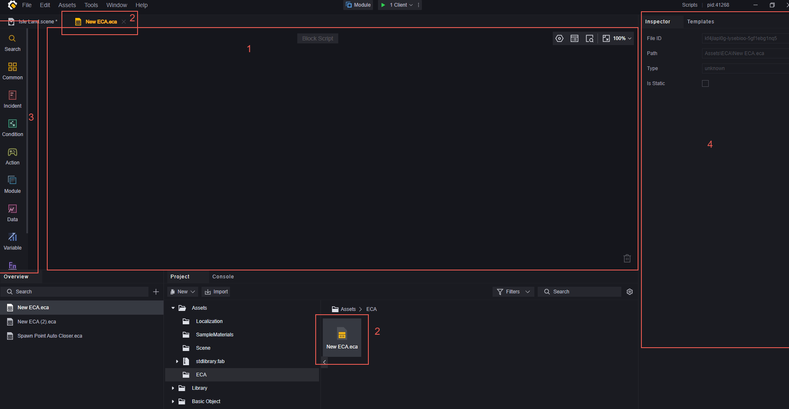

1. 画布，主要编辑区域
2. 当前正在编辑的文件
3. 节点分类、点击任意节点会展开节点选择界面
4. 属性面板

## 节点分类说明

3.区域对应的节点分类分别是：

1. 搜索：输入关键字搜索出的节点。
2. 常用：设为常用节点的节点会在此处。
3. 事件：满足条件即会触发，是逻辑的开始。
4. 条件：用于脚本的流程控制。
5. 行为：对实体\数据的实际操作。
6. 模组：一些模组专有的行为。
7. 数据：对数据的处理。
8. 变量：使用已有的变量或添加变量。
9. 函数：使用或新建自定义函数。
10. 外部调用：调用其他脚本的自定义函数。

## **节点的使用**

### 节点说明

节点下方的凸起代表着该节点后可以链接其他节点。

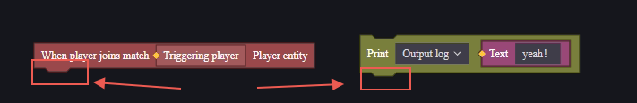

节点上方的凹陷代表着该节点前可以链接其他节点，且必须前置节点运行后才会运行。

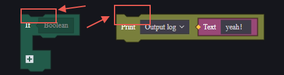

如果上方没有凹陷但下方有凸起，代表着该节点为一段逻辑的起点，一般为事件节点。

如果上下方都没有凸起或凹陷，代表着该节点为一段数据，可以应用于其他节点。

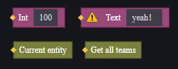

节点中会带有输入和输出参数：

**输入参数**：

输入参数默认为空白，其内部标注的类型即为所需参数的类型。

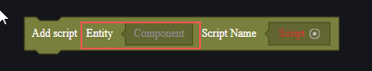

> 脚本名也是所需参数，但是使用的是资源选择器，可以直接选择项目内的资源，无需考虑类型匹配。

**输出参数**：

输出参数默认为彩色方块，可以拖动该方块填入需要的输入参数框内：

### 节点使用

在分类处选择自己想使用的节点后，单击或拖动到画布即使用了对应的节点。

使用上方带有凹槽的节点，即可将两个节点拼接在一起：

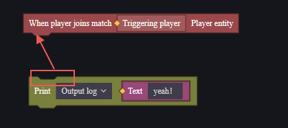

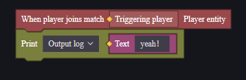

一组节点的逻辑总是从上到下的：

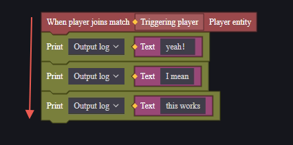

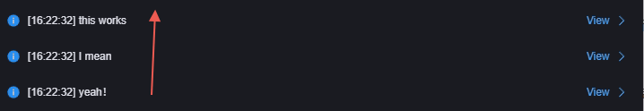

对于串联起来的一组节点，必要的入参需要填入合适的数据才能保证脚本正常工作。不合适的变量会报错，鼠标点击报错可以看到报错信息：

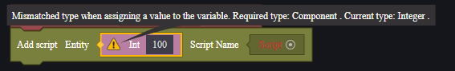

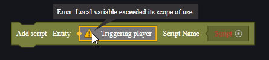

拖动图元时，会将下方图元一并拖走：

按住Ctrl键拖动，可以只拖动当前节点，下方节点会自动连接到上方：

## 流程控制

图元脚本默认的执行顺序是从上到下的，您也许时常需要代码的流程控制来实现复杂逻辑。

请参考下面链接中图元脚本-流程控制查看详细说明：

 [脚本附加说明-用户手册.md](./脚本附加说明-用户手册.md) 

## 变量

变量处可以定义或修改三种变量：

1. 全局实体属性：全局组件的属性，支持自定义。可以在任何脚本取到或修改自定义的全局实体属性。
2. 脚本变量：仅用于当前脚本的变量，其他脚本可以通过外部取得并修改。
3. 局部变量：仅用于当前代码块的变量，代码块外无效。

### 全局实体属性

通过组件设置中的实体组件属性，可以添加全局实体属性。

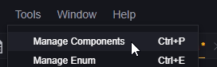

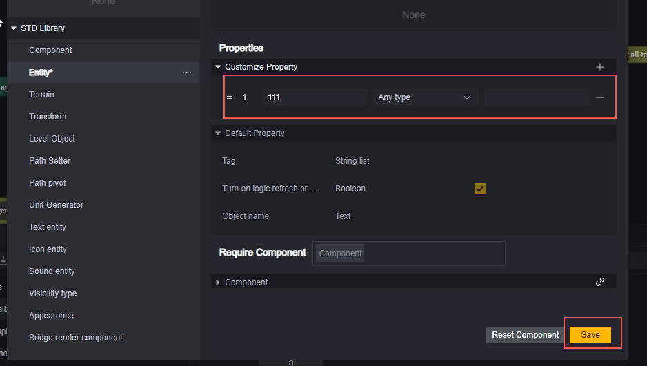

创建好全局实体属性后，就可以使用获取全局节点取得该属性：

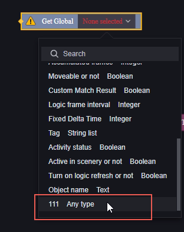

使用设置全局节点设置该属性：

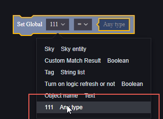

### 脚本变量

在变量分类中，存在一个创建变量按钮：

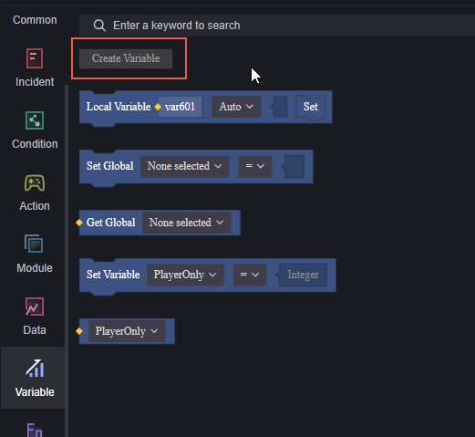

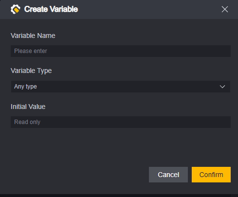

通过该方式创建的变量为脚本变量，用于当前脚本数据处理。

在其他脚本中可以通过外部引用的方式获取并设置该变量：

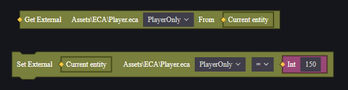

> 在其他脚本外部引用时需要注意：获取和设置时需要指定引用脚本挂载的对应实体。

### 局部变量

通过局部变量图元可以创建仅当前代码块可用的变量：

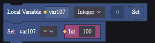

可以通过双击变量名的方式重命名该变量：

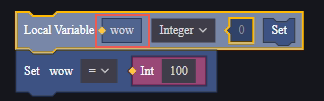

代码块是指一段连续的图元，值得特别注意的是，条件分类中的”如果-否则“图元默认是两个代码块。每段如果、否则、否则如果都是一块独立的代码块。

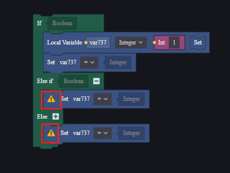

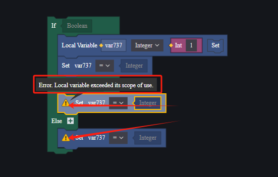

## 自定义函数与使用

在图元脚本中支持有返回值函数和无返回值函数。

有返回值函数在调用时不可链接其他节点，调用图元即为返回值。

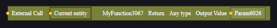

无返回值函数在调用时可以链接其他节点。

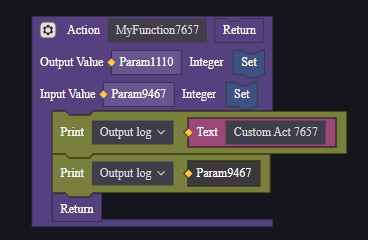

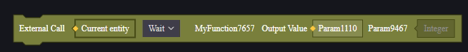

等待：该节点为异步函数时阻断，等待异步函数执行完再执行下面的节点。

执行：该节点为异步函数时不阻断，继续执行下面的节点。

异步函数是函数实现内使用了会进行异步处理的节点，比如“等待”。

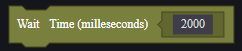

**注意**：不支持在带有返回值的函数中使用异步图元。

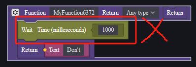

如果需要异步函数返回值，请使用无返回值函数，并使用输出变量。

无论是否有返回值，自定义函数都可以在调用图元的下方使用函数的输出变量来获取输出。

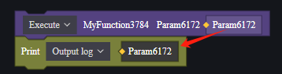

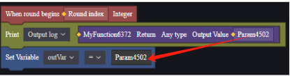

## 节点的搜索与常用

输入关键字可以搜索出对应的节点

在节点选择界面右键节点可以将节点设为常用节点，在常用节点分类可以快速使用节点。

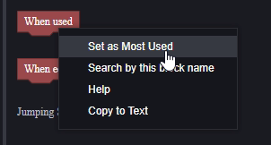

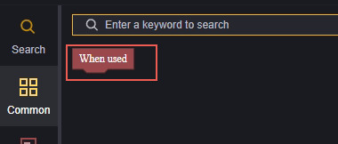

## 示例

利用一个简单示例对脚本使用进行演示：

设计如下：

1. 每位玩家加入比赛时，为其发放一把M4A1。
2. 玩家开火时，每次开火扣除自身1点生命值。

**创建脚本**：

1.的需求是全局的，2.是针对每个玩家的。所以需要在全局和玩家上各挂载一个脚本。发放道具与扣除生命均需要服务器知晓，所以均创建为服务器脚本。

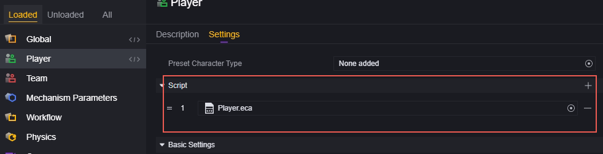

**编辑脚本：**

对于1来说，需要每位玩家加入比赛均执行一次发放道具：

对于添加道具节点，需要添加道具的目标、添加的道具、添加道具的数量三个参数。

添加道具的目标就是触发了当玩家加入比赛事件的玩家，道具通过资源管理器选择M4A1，数量为1。

对于2来说，每次开火时需要执行一次扣除生命值：

我们发现实际上没有扣除生命值的节点：

> 恢复生命值节点的参数填入负数不会扣除生命值

不过生命值作为玩家的一个属性，可以通过设置属性来进行调整：

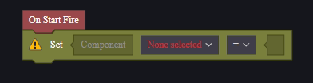

设置属性节点需要被设置属性的实体、被设置的属性和数值以及运算几个参数。

其中被设置属性的实体就是当前玩家，所以可以使用此实体，双击该参数位置即可快速填充此实体。

需要更改的属性值是当前生命值，选择当前生命值。

而设置的值是当前生命值减去1，所以需要取得当前生命。

使用数据分类中的减法对其减一，添入参数：

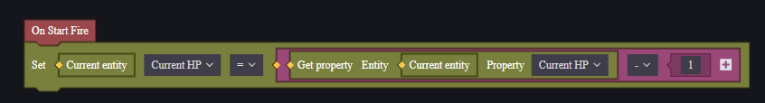

也可以直接使用设置属性节点的运算来实现该逻辑：

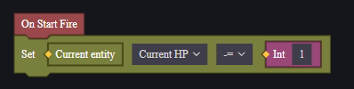

运行调试查看结果：

> 每个人都发放了一把M4A1。

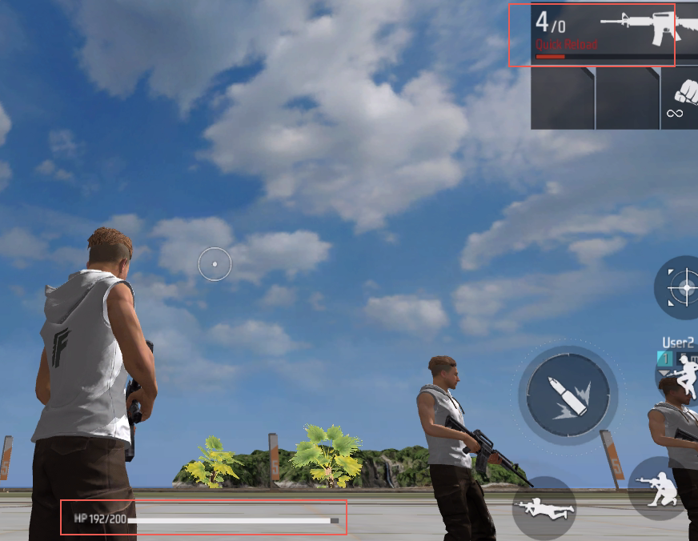

> 开火8次掉了8点生命值。
>
> 当开火时触发是每次执行开火指令时触发，连发武器在武器放下前进行的射击都视为一次开火，只能触发一次该事件。

