# 脚本-用户手册

脚本用来控制游戏进程，在合适的条件下对特定的对象进行操作，进而实现依靠自带物件不能或难以实现的逻辑。

## 脚本类型的区分

### 图元和代码脚本

我们提供了两种方式编辑脚本：图元和代码。

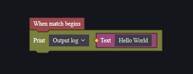

图元脚本以可视化的图元进行脚本编辑，更直观，易于操作。但是在编写复杂逻辑时复杂度上升较快，难以维护。

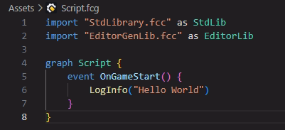

代码脚本使用代码进行脚本编辑，自由度高，处理复杂逻辑时维护性强。

### 服务器和客户端脚本

无论图元或代码，脚本需要区分运行平台：服务器和客户端。
服务器脚本只能使用服务器支持的事件和接口，客户端同理。

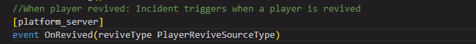

> 仅可以在服务器平台下运行的事件

### **静态脚本**

脚本均支持配置为静态脚本：

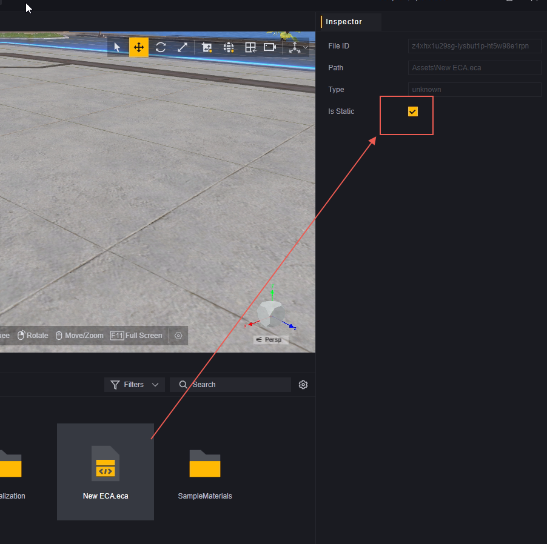

静态脚本总是会在全局模组下运行。

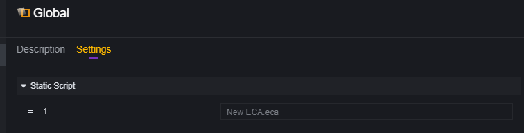

静态脚本同时也可以挂载在其他实体下，但是要注意是否与全局实体上的自身逻辑冲突。

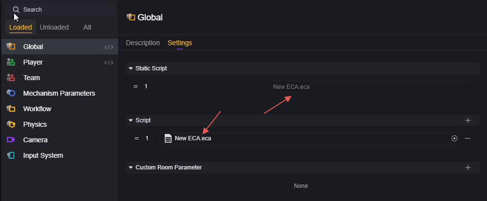

> 在全局实体上挂载了静态脚本New ECA.eca，内部的事件会触发两次。（不推荐这样配置）

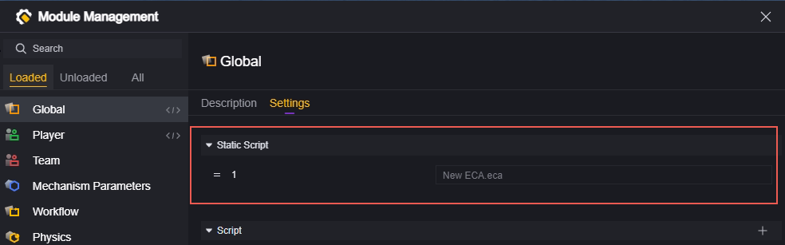

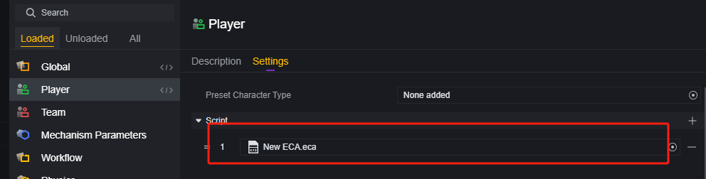

> 同时在Global与Player上配置了New ECA.eca，在支持的情况下，内部的事件会分别在全局实体和玩家实体上触发一次。

## 创建脚本

在可编辑资产区右键新建脚本

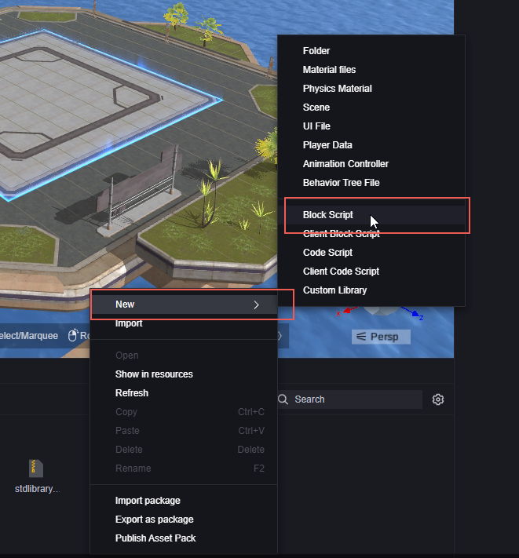

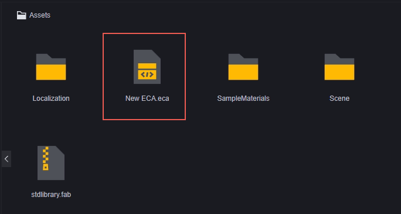

在挂载脚本时选择新建：

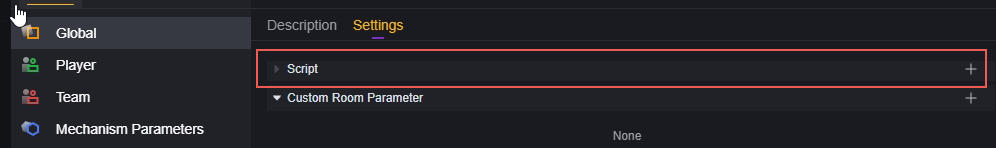

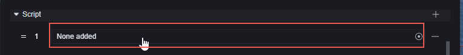

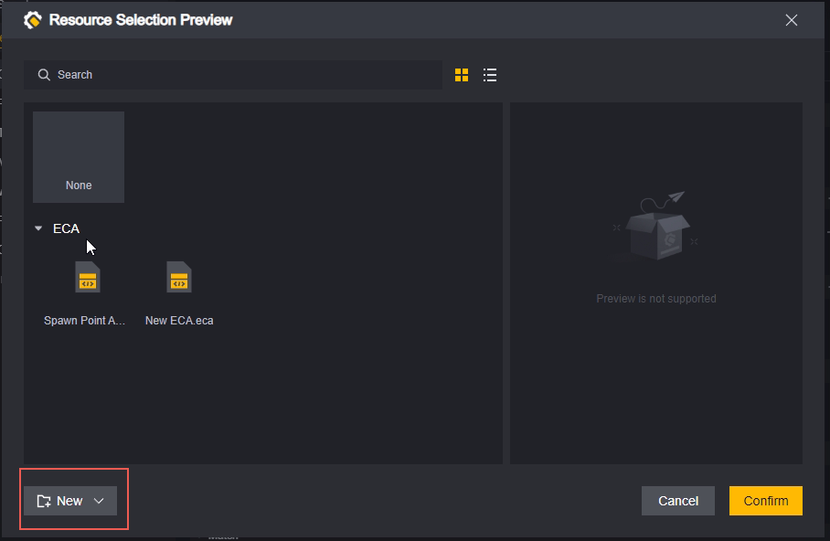

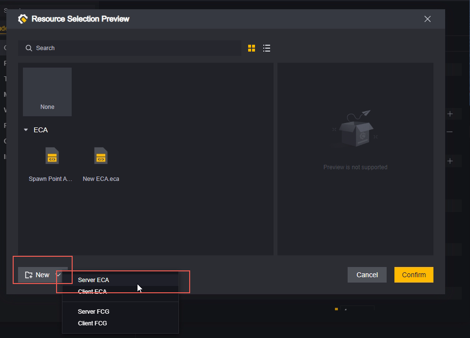

通过此方式新建的脚本会自动挂载在对应实体上，并且会自动命名为当前实体的名称。

创建脚本时，需要选择/配置脚本的类别：

1. 服务器脚本还是客户端脚本，这影响到该脚本可以使用的事件和接口。
2. 图元脚本还是代码脚本，这影响到脚本的编辑方式。

## 编辑脚本

双击脚本文件打开编辑，对于图元和代码脚本的编辑请参考以下文档：

[图元脚本-用户手册.md](图元脚本-用户手册.md) 

[代码脚本-用户手册.md](代码脚本-用户手册.md) 

## 挂载脚本

**挂载到模组上**：

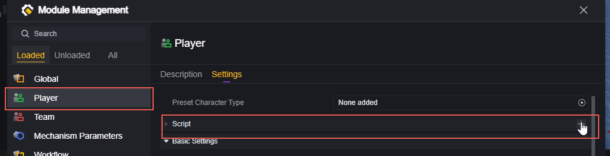

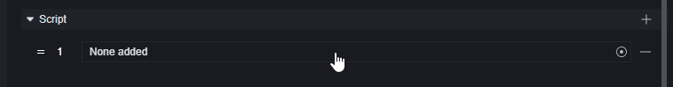

**挂载到物件上**：

选中要添加脚本的物体，在其inspector面板选择添加脚本：

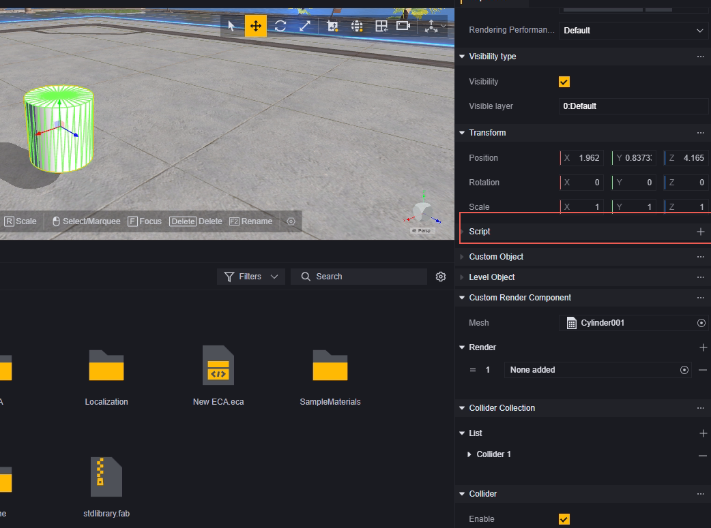

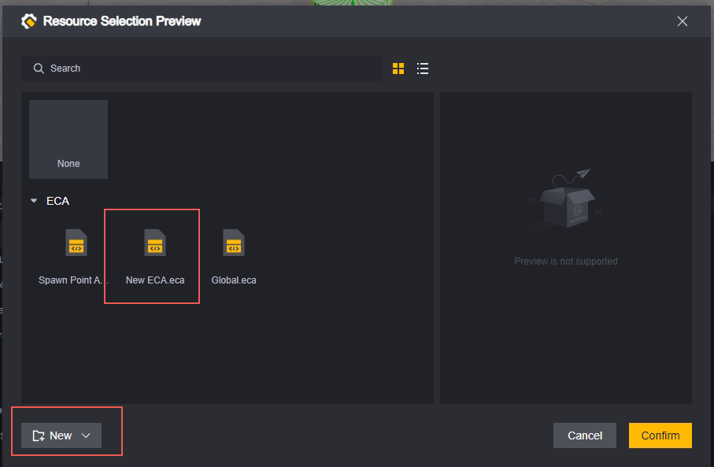

同样可以选择已有的脚本或新建脚本。

**使用脚本添加脚本**：

我们提供了一个可以为实体挂载脚本的接口：

添加脚本：

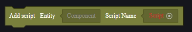

建议您在添加脚本前使用 是否存在脚本 接口确认该实体是否已经拥有同样的脚本。

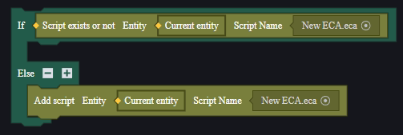

## 卸载脚本

在游戏启动前静态地卸载脚本，只需要找到挂载的位置点击减号：

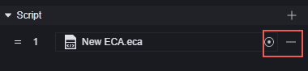

在游戏启动后动态地卸载脚本，可以使用删除脚本接口：

同样，我们建议在删除前确认该实体确实挂载着需要删除的脚本：

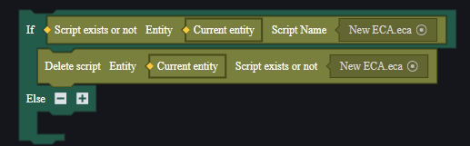

## 脚本文件的管理

在添加脚本时新建脚本的话，会自动在Assets文件夹下新建一个ECA文件夹收纳新建的脚本：

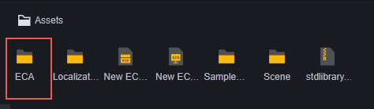

> 我们也建议您使用文件夹对创建的脚本进行分类管理

### 删除

使用快捷键Delete、或右键资产中的脚本，可以删除脚本：

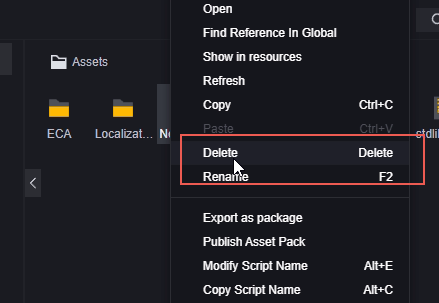

对于已经挂载了该脚本的实体，会出现黄色叹号的报错：

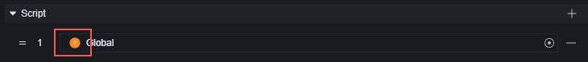

### 复制

使用快捷键Ctrl+C、Ctrl+V，或使用右键菜单，可以复制脚本，复制的脚本名为原脚本名加上（X），X为副本数量-1。

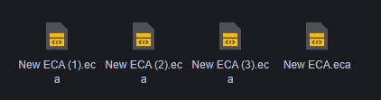

### 重命名

使用快捷键F2、或使用右键菜单，可以重命名脚本。

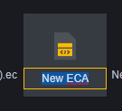

脚本是不可以重名的，命名为与现有脚本同名时会报错并取消该次重命名：

