# Global-全局

全局实体是一个唯一的抽象实体，它即代表着整个游戏。作为抽象实体，它仅可以在游戏编辑器内的模组菜单内进行编辑。您也可以使用脚本获取它的属性值，或者修改那些支持修改的属性值。

在本篇文章中，将会介绍在模组菜单可供您修改的全局实体属性，和图元脚本中全局模组的使用方法。

## 模组

您需要在模组-全局菜单下对全局实体进行编辑。

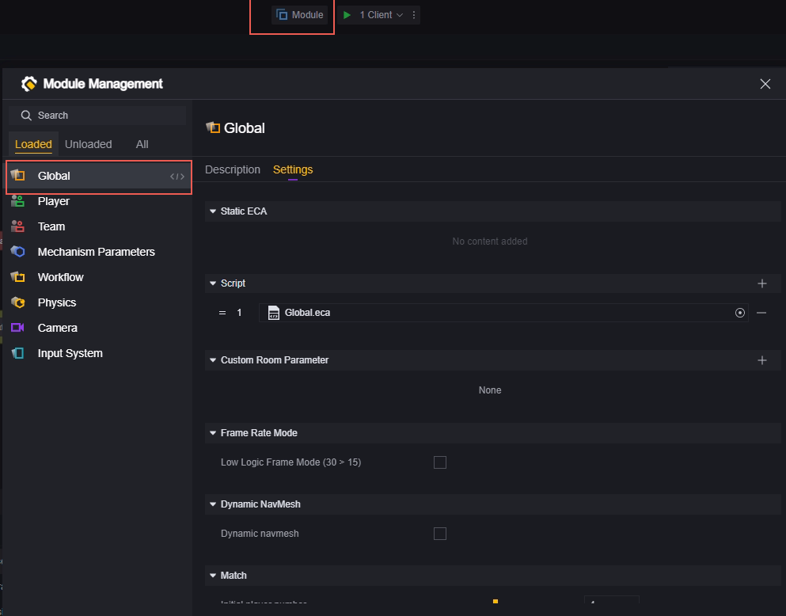

### 静态ECA与脚本

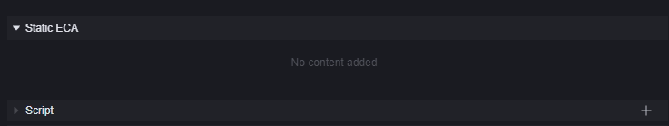

静态ECA和挂载在全局实体上的脚本都可以视为全局脚本。即游戏只要开始，挂载的脚本就会运行。

不同之处在于，静态ECA一经创建，一定会挂载在全局实体上。

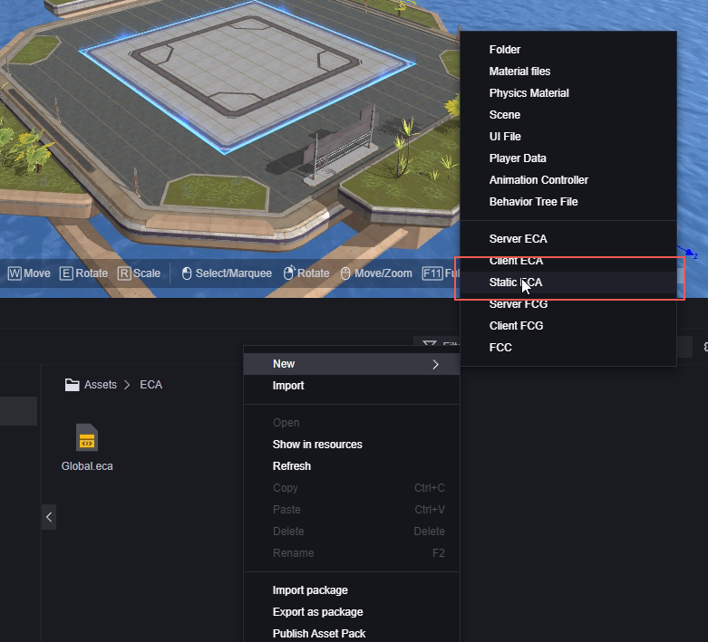

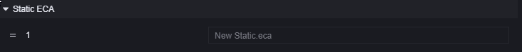

而脚本可以自由选择使用哪个或卸载已经挂载的脚本。

挂载：

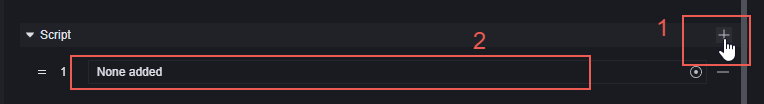

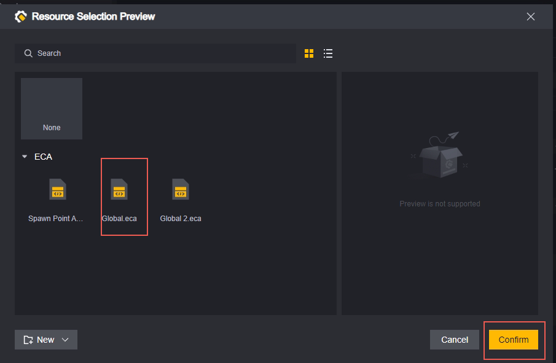

> 静态ECA不会显示在选择脚本界面

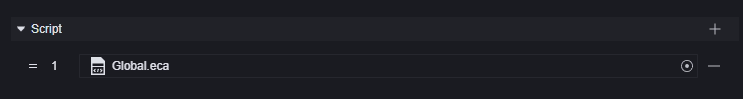

卸载：

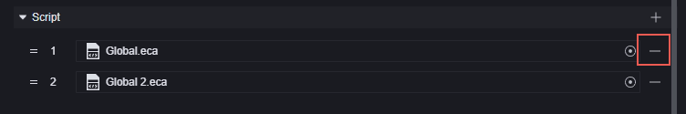

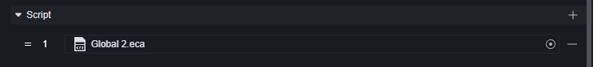

卸载的脚本仍在您的工程当中，可以挂载在任何支持的实体或组件上。

在全局脚本中，我们推荐您进行初始化工作，如设定全局变量，设定公共函数。

### 自定义房间参数

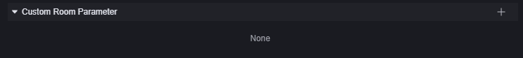

自定义房间参数是一种特殊的自定义属性。它可以作为全局实体的自定义属性使用，同时它可以在建立房间后开始游戏前进行修改。例如此地图可以设定敌人血量为50%-100%，就可以自定义一个血量参数，在进入游戏前设定其值为多少。

因为自定义房间参数是一种自定义属性，所以新建一个房间参数和全局实体的自定义属性一致，都在组件中的游戏实体处：

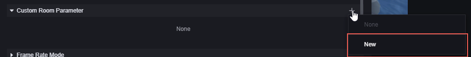

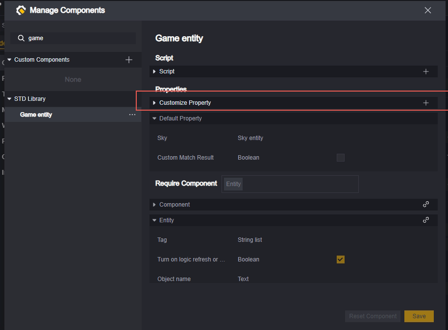

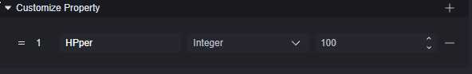

在游戏实体组件处新建自定义属性后，它先会出现在下方的游戏实体中：

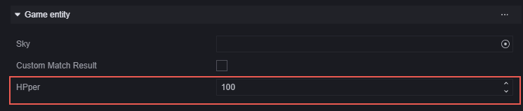

在自定义房间参数处点击加号，可以将该属性设置为自定义房间参数：

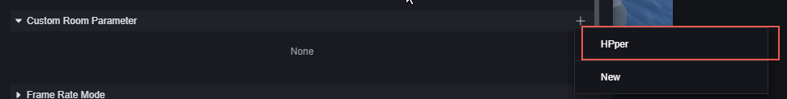

选择该属性，会出现属性设置界面：

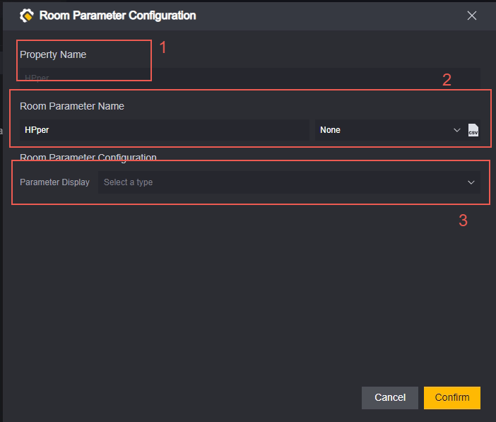

1. 属性名，在此界面不可编辑。
2. 房间参数名称，您希望其在房间中显示的名称和用于多语言翻译的KEY。
3. 参数显示方式，您希望在房间中这个参数的显示方式，在案例中我们希望其是从50到100中选择一个整数。

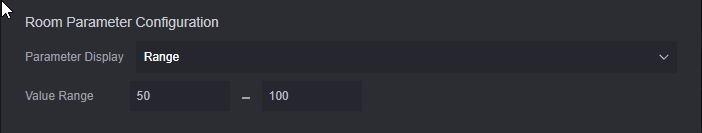

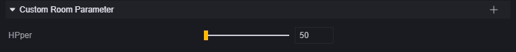

您可以在自定义房间参数上右键来重新打开编辑界面或移除这个参数：

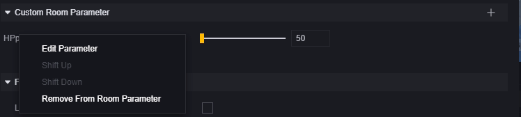

添加为自定义房间参数的自定义属性就不会再出现在游戏实体栏中，而删除自定义房间参数会使该属性重新回到游戏实体栏中。

### 帧率

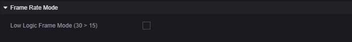

帧率栏只有一个选项：是否开启低逻辑帧模式。

我们游戏默认逻辑帧为30，即每秒钟执行30次逻辑检查，主要影响脚本中的“更新时”事件。

开启低逻辑帧模式，“更新时”事件每秒钟仅会执行15次。

> “当固定帧更新时“节点不受此配置影响，始终是每秒钟运行30次

### 动态Navmesh

navmesh是自动寻路系统。仅会作用在需要寻路的单位上，如怪物、NPC或一些依赖寻路的技能。

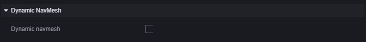

关闭状态下，游戏开始时场景上的路径就会自动确认，此后增减的阻挡物不会改变寻路路径。如果在寻路路径上动态地创建阻挡，可能会出现单位直接穿过障碍物的表现。

开启状态下，游戏会实时识别场景中阻挡物的增减，从而动态地修改自动寻路的路径。

关闭此配置的意义是节省性能开销。

### 匹配

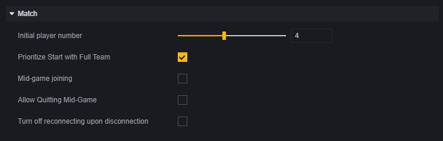

匹配开局人数：匹配到多少人游戏就会开始。

优先满员开局：勾选后，在开始匹配的一段时间内（10秒左右），即使玩家人数达到了匹配开局人数，游戏也会优先等待房间满员。在这段时间之后，达到匹配开局人数即会立刻开局。

中途补人：是否允许游戏过程中加入玩家。如果勾选，会展开进一步的设置：

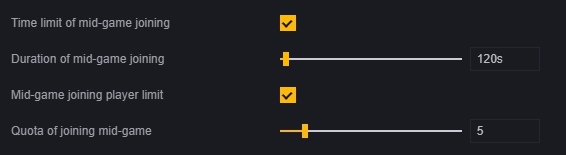

​	匹配补人时间限制：是否限制匹配补人的时间，如果开启则下一条配置展开，匹配补人时长。
​	匹配补人时长：开局多久内允许补人。
​	匹配补人数量限制：是否限制匹配补人的数量，如果开启则下一条配置展开，累计匹配补人数量。
​	累计匹配补人数量：最大支持的补人数量。

允许中途退出：中途退出是玩家主动退出的操作，开启后不会对中退玩家进行惩罚。

关闭断线重连：开启时禁止断线重连。关闭时允许断线重连，关闭游戏再开启默认自动重连该局游戏。

### 挂机与作弊

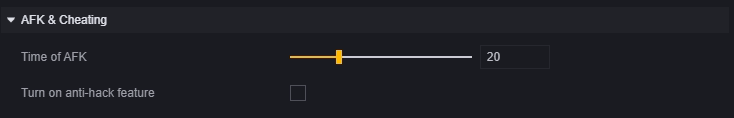

挂机判断时间：玩家不操作多久会被判定为挂机。判为挂机的玩家会被踢出游戏。

是否开启防作弊功能：是否开启防作弊。

## 脚本全局模组

在图元脚本中，存在一个全局模组，可以对全局机制进行一定操作。

### 操作毒圈

与其说是操作毒圈，其实更接近于操作安全区。

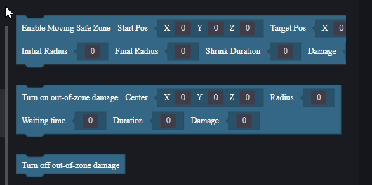

移动毒圈：安全区从起点出发、在持续时间内平滑移动到重点。且半径由初始半径缓缓变为最终半径。在安全区外的玩家每秒会受到等于伤害量的伤害。
开启毒圈：安全区初始生成在以中心点为中心，设定半径大小。在等待配置的时长之后，在持续时间内平滑的向中点移动，直到消失。在安全区外的玩家每秒会受到等于伤害量的伤害。
关闭毒圈：取消持续掉血的毒圈，这个接口只会关闭系统生成的毒圈，对于场景中【自定义安全区物件】生成的毒圈无效。但是本接口的实现方式是创建一个巨大的安全区，所以玩家会处于安全区中，不受其他毒圈的伤害。因此，不建议同时使用系统毒圈和自定义安全区物件。

> 移动毒圈和开启毒圈接口均会设置一个新安全区，从而取代之前的。
> 移动毒圈和开启毒圈在脚本中开始执行后就会继续向下执行，请注意前后衔接的逻辑。

### 暂停和恢复游戏

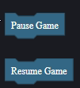

这两个节点只影响当固定帧更新时事件的触发。

暂停游戏后当固定帧更新时事件不再抛出，恢复游戏后继续抛出。

暂停与恢复游戏也会分别触发当游戏暂停时和当游戏恢复时两个事件：

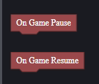

> 在暂停时暂停游戏指令无效，恢复游戏同理。
