# 玩家-用户手册

## 简介

玩家是游戏的重要概念。默认的玩家已经具有了诸如血量、移动、背包的基础功能，通过对玩家的编辑可以对玩家的功能、属性或者外观、动作表现进行自定义。本篇将从玩家模组与玩家脚本两方面对玩家这个重要概念进行介绍。
玩家模组可以在游戏运行前对玩家进行设置。
玩家脚本可以在游戏运行时对玩家进行调整。

> 玩家是以玩家实体的实例存在于游戏中的，这意味着在模组中的编辑会映射到每一个创建出的玩家实体实例上，而对于脚本来说要注意其作用范围是“具体某个玩家”还是“所有玩家”。

## 玩家模组

通过玩家模组，您可以对玩家的各种属性进行设置，从而使玩家以您想要的状态开始游戏。
玩家模组对应着玩家实体，在此处的修改会对游戏中每个创建出来的玩家生效。

在编辑器-模组中进入玩家菜单：

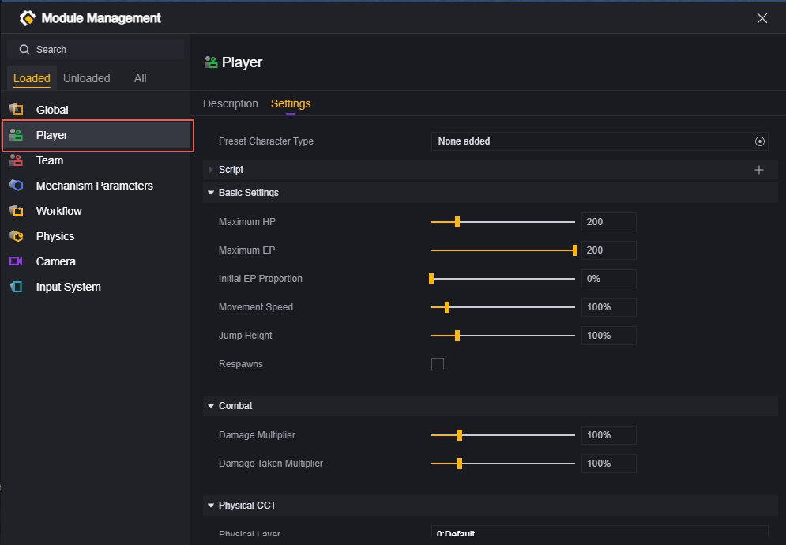

### 预设玩家类型

在此设置处，您可以使用自定义的玩家资源而非默认的形象。这意味着您可以让玩家外表变得不一样，以及在部分或全部地使用自定义的动作。

#### 如何创建一个玩家数据：

在工程-资产处新建一个玩家数据文件：

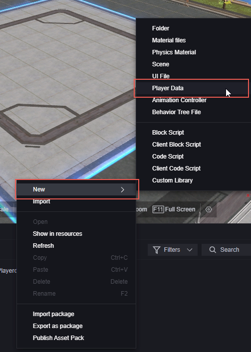

玩家数据文件包含该玩家使用的模型、动作资源。

#### 如何编辑玩家数据：

首先，需要准备好需要的模型、动作资源。角色模型推荐使用与位于您本地编辑器路径\resources\LocalData\Utilities\UGC_Cos_Artist_Rig中的默认模型相匹配的骨骼。

添加资源：

角色模型（示例）：

角色动作（示例）：

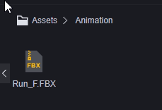

双击新建的玩家数据文件打开编辑页面：

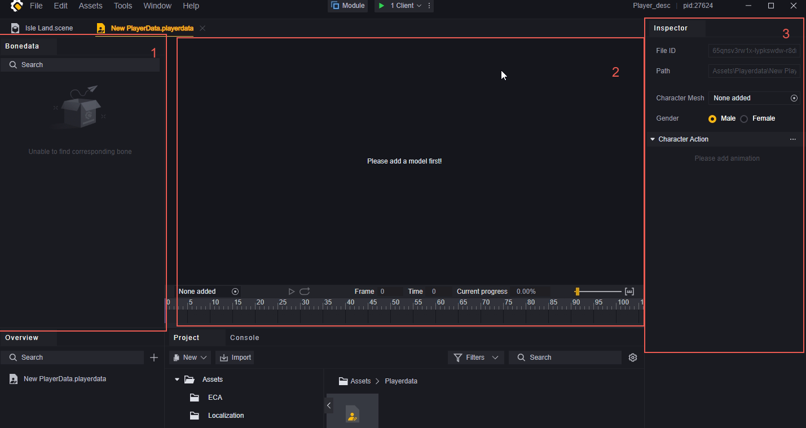

1. 骨骼数据
2. 预览窗口
3. 编辑窗口

首先在3.编辑窗口，需要选择您需要的角色模型，并选定性别。

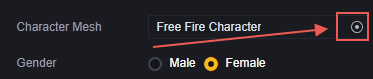

> 也可以通过拖动资产界面的模型到2.预览界面来快速修改使用的模型。

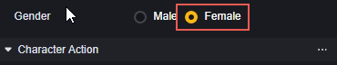

这里我们作为示例使用的是一个女性模型，所以选择女性。

添加好模型之后，已经可以在2.预览界面看到模型的样子。这里因为是演示用，所以只是一个白模。

您可以通过滚轮放大缩小、按住右键旋转摄像机来观察模型细节。

在左下角添加您想以这个模型预览的动作，可以查看该动作在模型上的表现：

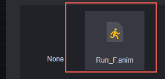

现在下方的动作预览界面显示的是该动作的信息，点击播放可以预览：

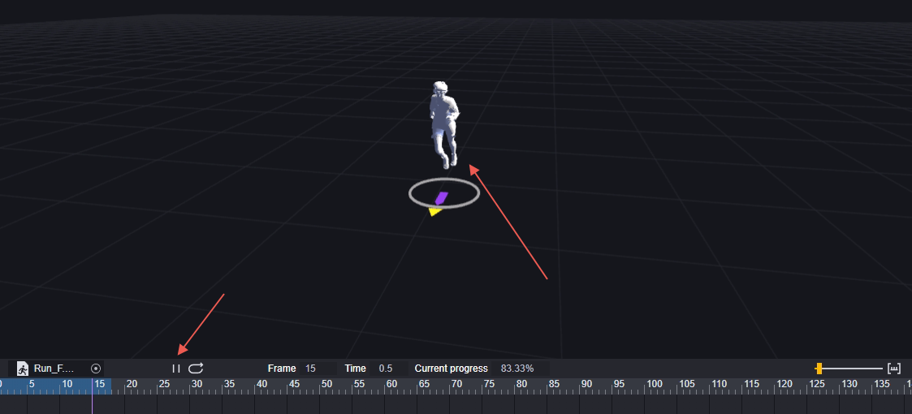

在1.骨骼数据中可以查看该模型的骨骼结构：

准备好模型之后，可以在3.编辑窗口中的角色动作窗口添加您需要修改的动作种类，比如修改奔跑、站立。没有修改的动作会播放默认动画。

作为演示，我们添加一个站立idle的动作：

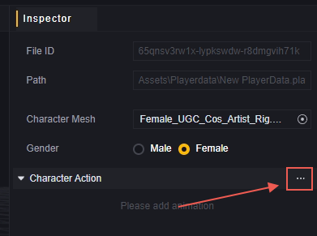

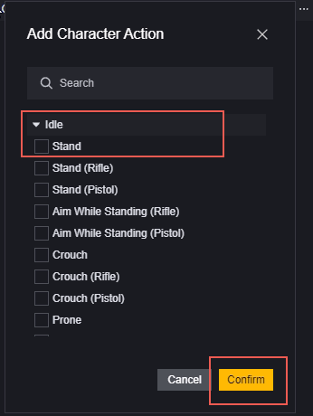

修改这个动作，当游戏需要玩家人物播放站立-idle时就会播放您添加的自定义动作。

仅用作演示，我们将奔跑动作配置在站立idle上。请注意这样会导致奇怪的表现，实际操作时请按照您的设计添加合适的动作到合适的触发场景上。

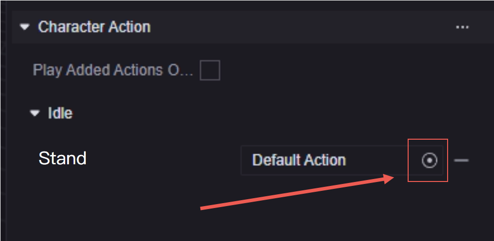

这样这个玩家数据会对玩家进行如下修改：

1. 将玩家模型替换为一位白模女性。
2. 将玩家站立idle替换为奔跑动作。

#### 如何添加玩家数据到玩家上：

在模组中配置，会将该玩家数据应用到所有玩家上：

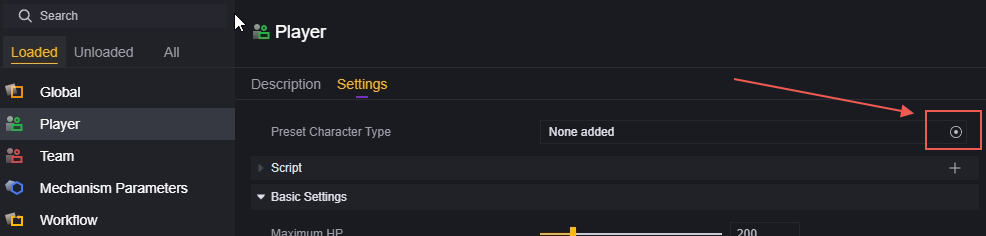

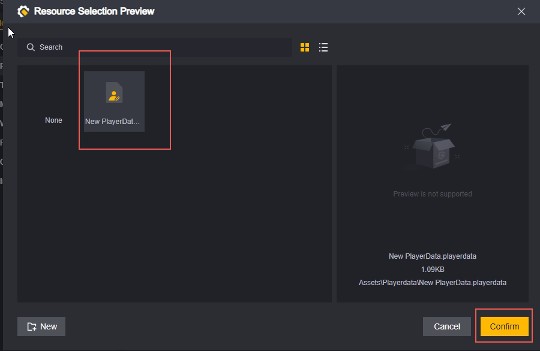

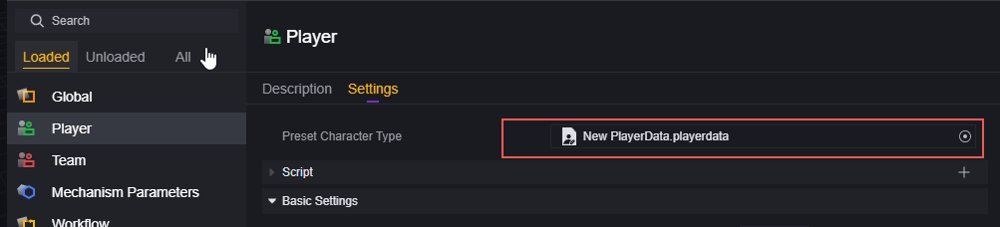

游戏内表现：

> 所有人在本该站立IDLE时进行奔跑动作，没有实际发生位移。

进行其他动作时依然播放对应性别的默认动作：

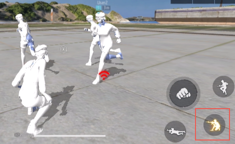

> 这也是推荐使用默认骨骼的模型的原因，如果没有全量进行动作修改，使用不符合标准的骨骼播放默认动作会导致非常奇怪的表现。

如果只想对特定的玩家修改玩家数据，可以通过使用脚本特定节点的方式实现：

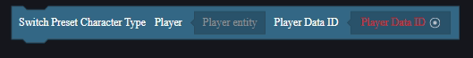

该节点可以为特定的玩家添加指定的玩家数据，可以进行根据您的需求对指定的玩家触发或在满足合适的条件后触发。

### 脚本

可以为玩家实体挂载脚本，运行时会在每个玩家上挂载配置的脚本。

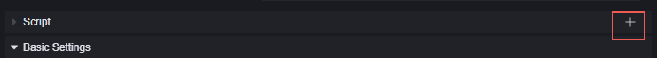

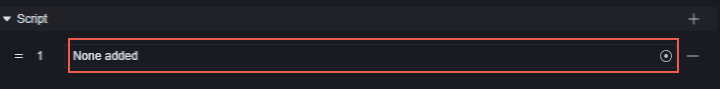

可以添加现有的脚本或新建：

有关脚本内容请参考下文玩家脚本部分。

### 基础设置

设置玩家的基础属性：

**生命上限：**玩家的最大生命值，范围20-1000。

**EP上限：**玩家的最大EP，范围0-200。

**初始EP比例：**初始玩家拥有的EP=初始EP比例*EP上限，范围0%-100%。

**移动速度：**移动速度的缩放比例，小于100%比默认速度慢，大于100%比默认速度快。范围50%-500%。

**跳跃高度：**跳跃高度的缩放比例，小于100%比默认高度低，大于100%比默认高度高。范围10%-500%。

**重生：**勾选后玩家在死亡后会自动重生，并且新增重生等待时间配置。

**重生等待时间：**只在勾选重生后出现。死亡后等待多长时间重生，范围0-9999秒。

> 移动速度和跳跃高度的修改会改变玩家初始的移速和跳跃高度，玩家的默认移动速度缩放、跳跃高度缩放属性仍然为1。在脚本中修改这两条属性是基于模组内的配置上进行缩放修改。

### 战斗

对玩家战斗属性进行设置：

伤害倍率：造成的伤害大小，小于100%比默认伤害低，大于100%比默认伤害高。范围0%-500%。

受到伤害倍率：承受的伤害大小，小于100%比默认伤害低，大于100%比默认伤害高。范围0%-500%。

> 同移动速度和跳跃高度、对于伤害倍率和受到伤害倍率的修改会改变玩家初始的伤害和承伤，玩家的默认伤害倍率、受到伤害百分比属性仍然为1。在脚本中修改这两条属性是基于模组内的配置上进行缩放修改。

### 带物理效果的玩家控制器

**物理层级：**决定玩家的物理所在层级，不同层级的碰撞是否发生取决于物理配置。

为玩家配置一个非默认物理层级：

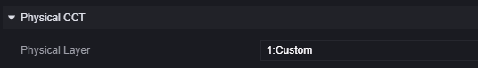

在物理配置中取消Custom层级和默认层级的碰撞：

会发现玩家可以无感穿过任何默认物理层级的物体：

依赖碰撞触发的道具也不会触发：

**是否使用带物理效果的玩家控制器：**勾选则使用带自定义物理效果的控制器，并展开相关配置。

**总高度，包括上下半球：**人物胶囊碰撞体的高度。

**上下半球的半径：**胶囊体半径，不能超过高度的1/2。

**质量：**玩家质量。

**最大上坡角度：**超过该角度的斜坡无法走上去，玩家会开始滑落。

**步距垂直偏移：**允许玩家偏离该配置的距离而不脱离地面或被阻挡，常用于在楼梯上移动时。

**最小移动距离：**如果角色控制器要移动的距离小于这个值，玩家则会一动不动。

**皮肤厚度：**允许其他物体嵌入角色碰撞体的深度，用于避免抖动或卡住。

**自身受到的重力加速度：**在三维方向上所受的重力加速度。对于玩家，这个设置会覆盖全局物理设置。

**启用自定义推力：**开启后，角色推动刚体时施加的力可以自定义。开启后展开相关配置。

**自定义推力力量：**角色推动刚体时施加的力大小。

**多段跳高度：**进行多段跳时跳跃的高度。

**多段跳的最大次数：**每次多段跳最多支持的跳跃次数。

**空中移动：**开启后，玩家可以在空中改变移动速度和朝向。

## 玩家脚本

在模组-玩家中挂载的脚本会挂载在每一个玩家上，请注意全局事件可能会不符合设计地多次触发。

通常，我们会在玩家脚本上进行对玩家和其组件的操作。通过私有事件触发，可以限定触发的对象范围：

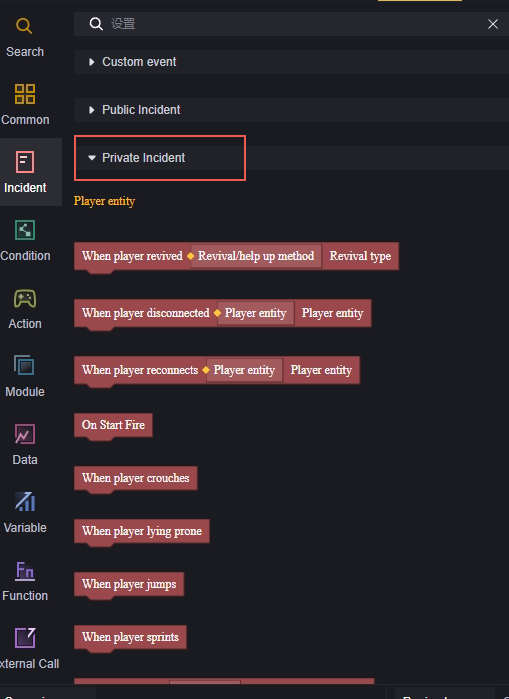

例如，在玩家复活时，为复活的玩家发放一把M4A1。

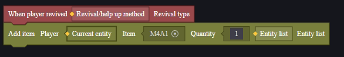

其中，私有事件”当玩家复活时“，只在当前玩家实体复活时触发。

添加道具为此实体添加一把M4A1，此实体即是复活的玩家本身，所以可以达成需求。

> 实际编辑中，还需要考虑添加M4A1时武器是否已满等问题。

如使用公共事件”当玩家复活时“，会使一位玩家复活时所有玩家的对应逻辑都触发一次。类似的逻辑推荐放在全局脚本中。

> 在玩家模组上配置这样的脚本会导致每次有玩家复活时所有玩家都添加一把M4A1。

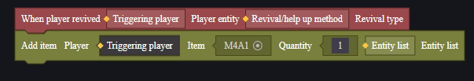

> 在玩家模组上配置这样的脚本会导致每次有玩家复活时该玩家被添加玩家总数把M4A1。
