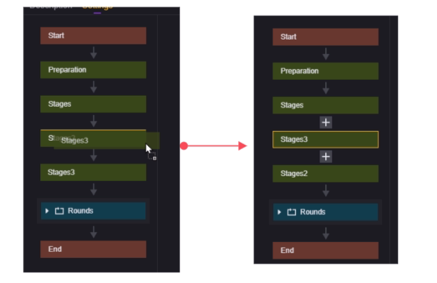
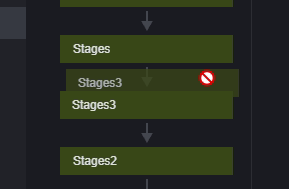
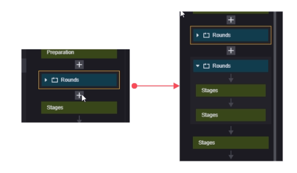
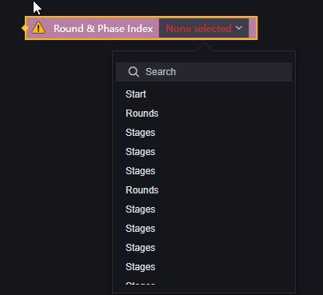
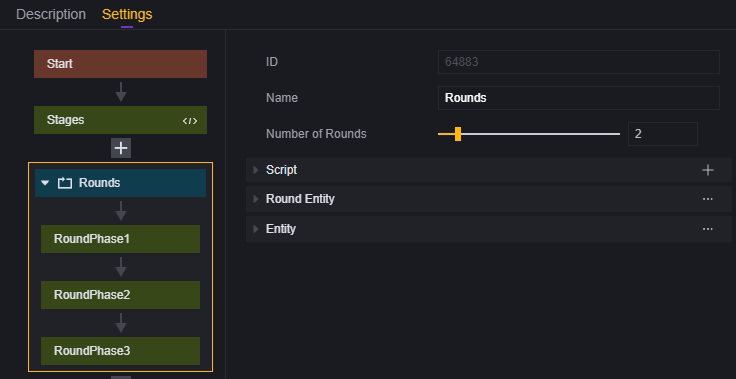
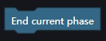
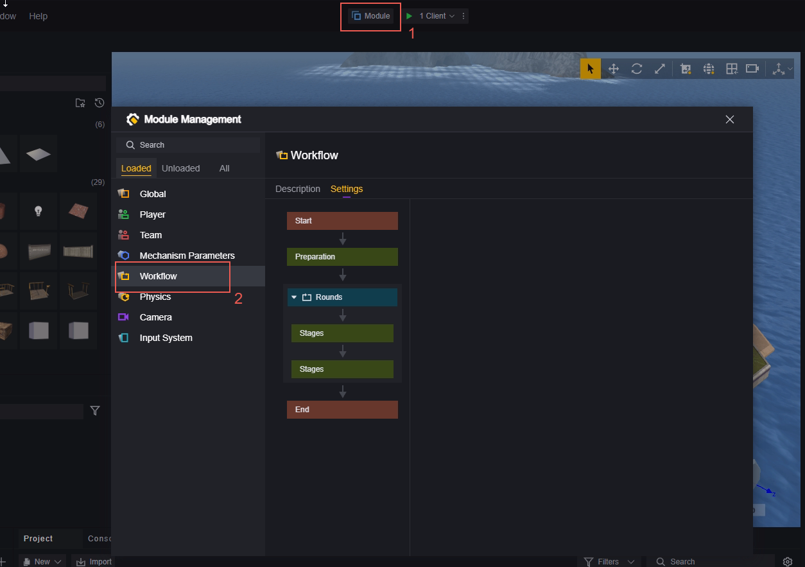
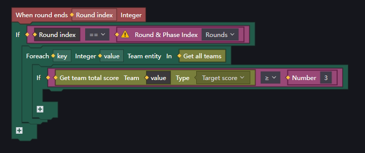
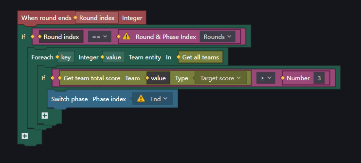

# Workflow-游戏流程

在该模组，你可以以阶段和回合为单位，自由的设定游戏的流程和时间。以及为阶段、回合实体挂载脚本。

## 概念说明

我们的游戏流程是由阶段构成的，游戏从固定的游戏开始阶段开始，经过设置的若干个阶段，到固定的游戏结束阶段结束。
每个阶段都可以设置时长，但至少设置5秒，结束后会按照流程进入下一阶段。
其中游戏开始、游戏结束两个阶段必须存在，且作为游戏的起点和终点，因此不可以删除这两个阶段或修改它们的名称。
回合是一种特殊的阶段，它是若干个阶段的集合，并且可以指定循环的次数。每当流程进入回合时，会在回合中重复地按顺序执行它所包含的若干阶段，并在达成循环次数后结束回合继续向下进行。回合中不可以包含回合。

所有阶段或回合实体都是在开始时创建，在结束时销毁。挂载在其上的脚本和有关实体可能会受其影响。

> 没有特殊说明的情况下，下文中的”阶段“会包含回合的概念。

## 流程的查看和配置

在模组-流程菜单中可以查看当前游戏的流程并对其进行配置

我们已经为您默认创建了若干阶段，可以自定义所有的阶段以及其排序，属性说明如下：

1. ID：每个阶段都会被分配一个独特的ID，ID不可修改。脚本中使用的阶段索引或回合索引即是这个ID。
2. 名称：除游戏开始和游戏结束外均支持自定义。有条理地自定义阶段名对于脚本是很有帮助的，下文会进行详细说明。
3. 时间：这个阶段持续的时长，单位为秒，达到时长时阶段强制结束。最低配置5秒，最高支持16777216秒。不过每局游戏最多只支持一个小时的时长，过长的阶段时长配置没有意义。
4. 脚本：挂载在指定阶段的脚本只有在该阶段才会生效。
5. 阶段实体：可以通过自定义阶段实体组件的方式为阶段添加脚本、属性。在组件添加的脚本或属性会在每一个阶段实体创建时被继承下来。
7. 循环次数：仅用于回合，决定了回合内的阶段循环多少次后退出，最低值为1，最高值为10。

## 阶段的顺序

默认创建的游戏开始，游戏结束阶段不可以修改顺序。
游戏开始：永远在最上方。
游戏结束：永远在最下方。

> 游戏准备阶段只是一个普通的阶段。你可以修改游戏准备阶段的名称，甚至可以删除它。

对于其他阶段，你可以通过拖动到其他阶段的方式将该阶段放置在指定阶段的上方。

当你的鼠标在拖动时变为禁止符号，意味着你没有选中任何节点，此时松开鼠标顺序不会发生任何变化。试图修改游戏开始、游戏结束、游戏准备节点的顺序也不会使阶段顺序发生任何变化

## 阶段的添加和删除

选中除游戏开始、游戏结束阶段外的阶段，会出现上下两个加号，点击加号会在对应位置**根据加号上方的阶段类型**创建一个新的阶段，与选中阶段的类型无关。
在回合内使用加号新建，新建的一定是回合的子阶段。

例1：加号位于回合下方，创建的是回合：

例2：加号位于阶段下方，创建的是阶段

还可以右键点击阶段：

可以对该阶段进行更名、新增一个阶段、新增一个回合、删除此阶段。

## 脚本相关说明

### 添加脚本

在模组-流程菜单选中节点后添加脚本，会为该节点实体挂载对应的脚本

### 属性

使用全局可以取到当前阶段索引和当前回合索引：

使用回合或阶段索引可以取到当前游戏中配置的任一回合或阶段索引：

该图元会按照执行顺序拉取所有的阶段和回合，建议一开始就给每个阶段和回合进行合理的命名。

### 事件

我们提供了如下四个事件，可以监听到阶段或回合的开始与结束，运用它们可以方便地撰写您想要的逻辑。

当回合开始时
当回合结束时
当阶段开始时
当阶段结束时

这里将回合与阶段区分开了，阶段开始/结束时只会触发**当阶段开始时**、**当阶段结束时**事件；而不会触发**当回合开始时**、**当回合结束时**事件。回合同理。
**实例1：**当指定回合开始时

**实例2**：当指定阶段开始时

**实例3**：判断本阶段是否为指定阶段

> 需要注意当回合开始时、 当回合结束时带出的参数为回合的索引；当阶段开始时、当阶段结束时带出的参数为阶段的实体。
> 阶段和回合的索引即为其在模组-流程面板的ID字段。

### API

我们提供了两个API可供使用：

切换游戏阶段
结束游戏当前阶段

切换游戏阶段可以让游戏强制切换到指定的阶段，值得注意的是，这个API也支持输入回合索引，从而直接切换到指定回合。
直接切换到回合内的阶段需要谨慎，阶段会按照回合内的顺序依次执行，直到回合中的最后一个阶段，然后重新开始回合的第一个阶段。无论切换到回合内的哪一个阶段，第一次执行均不计入回合数，重新开始回合时算做回合的第一次执行。

假设我们拥有一个需要循环2次的回合

回合外某处的脚本使用了切换游戏阶段切换到了回合阶段2，游戏接下来会按照这样的顺序执行：

这是因为回合的运行逻辑是在开始后为循环计数器加1，在最后一个子阶段结束后检查循环计数是否大于等于配置的循环数，强制跳入回合中某个阶段或者在回合内进行阶段跳跃有可能会产生与预期不符的表现。

#### 切换至阶段或回合：

#### 结束游戏当前阶段：

## 示例

一盘五局三胜的游戏，游戏前准备时间5秒，每回合准备时间10秒，游戏时间180秒。

1. 设定流程中的阶段并命名：

   

   

2.配置需要的时长：

3.添加脚本：

脚本逻辑是：每回合游戏结束时，如果有任一支队伍得分大于等于3，则游戏结束。
一般我们会建立一个全局脚本，用来判断整局游戏的流程。

对这个脚本进行编辑：

我们将使用**当回合结束时**事件触发逻辑运算，满足条件时使用**切换至阶段或回合**API结束掉比赛。

当指定的回合结束时

如果某一边队伍的得分大于等于3，就结束掉比赛（跳转到游戏结束阶段）

> 请无视示例图中的黄色感叹号。
> 本示例仅作参考，您可以自由发挥编写自己想要的逻辑。
