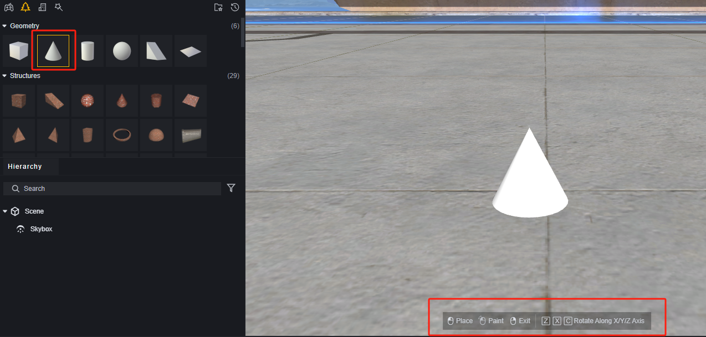
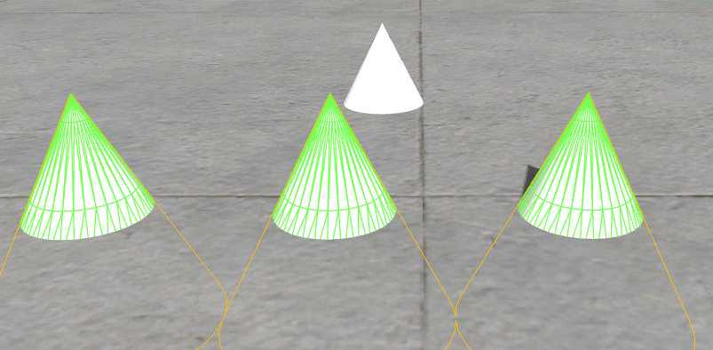
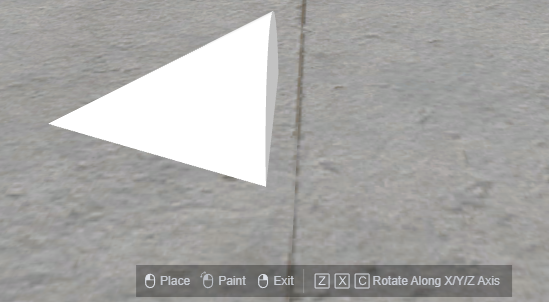
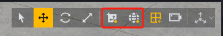
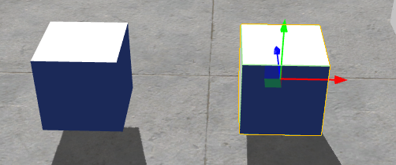
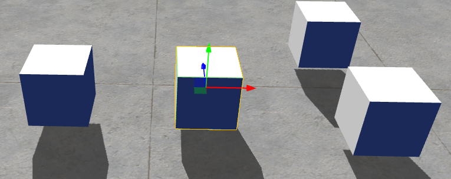

# Scene Editor - User Manual

This article will provide instructional references related to the scene editor.

## Overview

1. Object Selector: Choose objects from the object selector to place in the scene.
2. Hierarchy Menu: Displays all editable objects in the scene in layers.
3. Overview: Displays the current editing file type in the project. In this context, it shows all scene files.
4. Scene Editor: Canvas for scene editing, adjust object placement, preview scene performance.
5. Attribute Menu: Edit specific object attributes.

## Object Placement

### Placing a Single Object

Drag an object from the object selector to the scene to create a corresponding object at the specified location:

Right-click on an object to create an object in the scene. Objects created this way will be placed at world coordinates (0,0,0).

### Placing Objects Continuously

Click on an object in the object selector and then move the mouse to the scene editor.

According to the instructions below:

1. Clicking once will place the object at the current position.
2. Dragging while holding down the left mouse button will continuously create the object. It can only be created along the X and Z axes.

   

3. Use the ZXC shortcut keys to quickly rotate the object along three axes. It rotates 90 degrees each time.

   

4. Right-click to exit the current object placement mode.

Pressing Ctrl+D allows you to duplicate a selected object with identical transform information.

### Deleting Objects

Select the object to delete in the scene or hierarchy menu, then use the Delete shortcut key:

Alternatively, you can right-click on a specified object in the hierarchy menu to delete it:

## Camera Operations

Camera operations allow you to view the placement of objects in the scene.

1. Holding down the middle mouse button allows you to move the camera on the current plane.
2. Using the mouse scroll wheel enables you to zoom in and out with the camera.
3. Holding down the right mouse button lets you move the camera.
   1. Dragging with the right mouse button pressed allows you to rotate the camera view.
   2. Holding down the right mouse button and using WASD keys allows you to move the camera.
   3. Holding down the right mouse button and using QE keys lets you raise or lower the camera.
   4. Holding down Shift while moving with the right mouse button accelerates camera movement.

> Permanent instructions for adjusting the camera while holding down the right mouse button.

In the top-right menu, you can adjust the default movement speed of the camera:

## Adjusting Objects

### Adjustment Modes

Use shortcut keys QWER or select from the menu to enter four adjustment modes for objects.

Q: Select - clicking on an object selects it, dragging it will automatically place it on a plane directly below.

W: Move - dragging along a coordinate axis moves objects only along that axis. Dragging on a plane moves objects only within that plane.

E: Rotate - dragging along an axis rotates objects only in that direction.

R: Scale - dragging along a coordinate axis scales objects only on that axis.

When adjusting objects, if a parent or multiple objects are selected, they will all be affected. If a child object is selected, its parent will not be affected.

### Auxiliary Icon Control

Placing two cubes in the scene for illustration purposes:

In the hierarchy, merge two cubes into one object, with one on the left as a parent and one on the right as a child.

#### Pivot/Center

In pivot mode, auxiliary icons appear on selected objects.

When selecting multiple objects, auxiliary icons appear on the first selected object.

In center mode, auxiliary icons appear at the center of objects, automatically calculated by the program for multiple objects:

> When selecting a parent object

> When selecting a child object

## Game Object/World Space

When in game object mode, the coordinate axis of the auxiliary icon is in local coordinates and will change orientation with the game object.

When in world space mode, the coordinate axis of the auxiliary icon is always in world coordinates and will not change orientation with the object.

### Grid

The grid only affects official provided objects and has no effect on pure models or imported resources.

After enabling the grid, moving objects will snap to the green grid center on the current horizontal plane.

### Alignment

With alignment enabled, you can configure the granularity of movement, rotation, and scaling. Objects will only change according to the configured scale.

**Move:** Use the buttons on the right to enable or disable axis alignment. When enabled, you can specify the distance moved on each axis, in meters. This setting only affects movement mode, quick movement in selection mode is not affected.

**Rotate:** The angle of rotation for each change.

**Scale:** The multiplier for each scaling adjustment.

### Attribute Adjustment

In addition to the above functions, the transform component in the attribute menu records specific data for the current object's position, rotation, and scale. You can directly adjust these component parameters to precisely adjust the object.

## Scene File Management

In the overview, you can view all scene files.

The name of a scene file is used as its reference name when included in a scene, without the .scene extension.

Right-clicking on a non-default scene allows you to set it as the default scene. The default scene is loaded when entering the game and there must always be a default scene.

