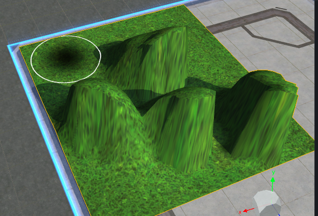
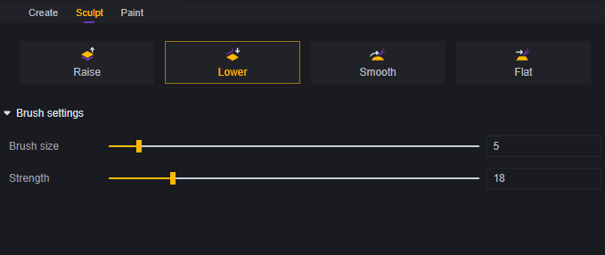
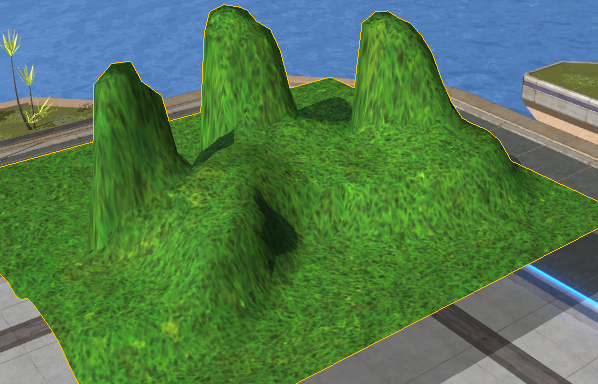
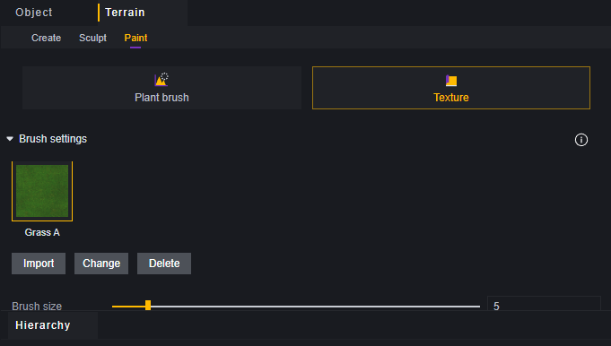
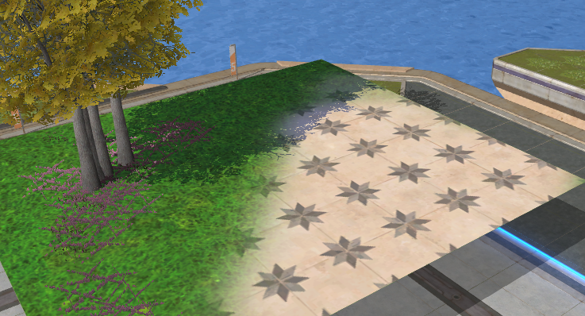

# Terrain Editor - User Manual

This article provides instructional references related to the Terrain Editor.

## Terrain Objects

Terrain is a special scene object that allows you to create a custom surface. It is a plane with collision properties but no thickness.

If placed in mid-air, the terrain will be invisible from below, but its shadow will be visible.

As a scene object, terrain can be edited in the scene interface, but only its position can be changed.

## Creating and Deleting Terrain

Select "New" in the terrain edit menu to enter pre-creation mode:

A blue terrain preview will appear in the scene:

You can adjust parameters in the pre-creation interface or drag the blue sphere to adjust the size and position of the terrain:

The position of the terrain can be changed later, but its size and aspect ratio cannot be altered once set.

Select the terrain area and use the Delete shortcut key or the hierarchy menu to delete the selected terrain area.

## Sculpting

Sculpting modifies the undulations of the terrain with four options: Raise, Lower, Smooth, and Flatten.

### **Raise**

The brush raises the terrain it passes over. Continuously clicking a spot will keep raising it. Brush size affects the area raised per click or drag. Brush strength determines how quickly the terrain rises. Each piece of terrain has a maximum height limit; brush strength only affects how fast it reaches this limit.

### **Lower**

Opposite to Raise, the brush lowers the terrain it passes over. Similarly, there is a lower limit for how much the terrain can descend. Brush size affects the area impacted per click or drag, while brush strength influences how quickly it reaches the lowest depth.

### **Smooth**

This option adjusts the height of the affected area to match the average height of its surroundings for a smoothing effect. Brush size affects the area impacted per click or drag, while brush strength influences how quickly it reaches target height.

> As moving the brush affects terrain height, previously smoothed areas may generate new target heights. Repeated smoothing results in overall height changes, equal to all raised and lowered parts combined.

### **Flatten**

Flattening sets affected terrain to a target height. The flatten target is this height. Brush size affects impact range per click or drag. Additionally, Flatten offers three modes:

The first mode processes all terrain, the second only those above target height, and the third only those below target height.

## Painting

Painting offers two editing options: Vegetation Brush and Texture.

### Vegetation Brush

Place decorative plants or rocks on the terrain.

Brush size affects grass and erasure, determining impact range per click or drag.

Brush density affects grass generation rate per click and during dragging.

For trees and rocks, each click generates one object; dragging continuously generates objects.

Hold Ctrl while using brush to erase selected plants from terrain; hold Shift to erase all vegetation or rocks touched by brush.

Each type of decoration has a quantity limit with Vegetation Brush.

### Texture

Texture determines the appearance of the terrain itself.

Edit alternative terrain textures through import, replace, or delete options.

Brush size affects impact range per click or drag. Checking "Fill Entire Terrain" fills entire area with texture.

Using new textures will overwrite old ones.

## Terrain Property Settings

Terrain has several properties:

**Position**: Overall position of the terrain.

**Decimation Ratio**: Reduces face count to improve performance, range 0.1–1; 1 means no decimation, 0.1 means faces reduced to 1/10th of default.

**Terrain File**: Each edited piece generates a file; modify files to apply settings from other blocks directly.

**Texture Pixels**: Pixels for each texture; changing one axis value alters another. Larger values mean denser terrain. For example:

In (1,1) case:

In (3,3) case:

