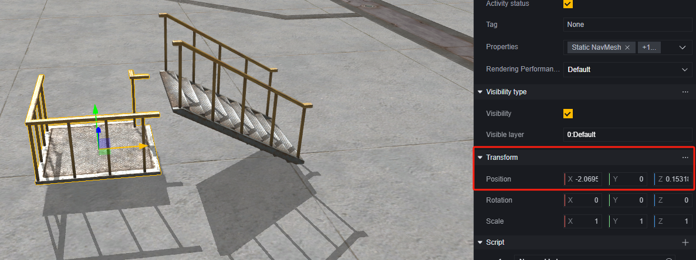
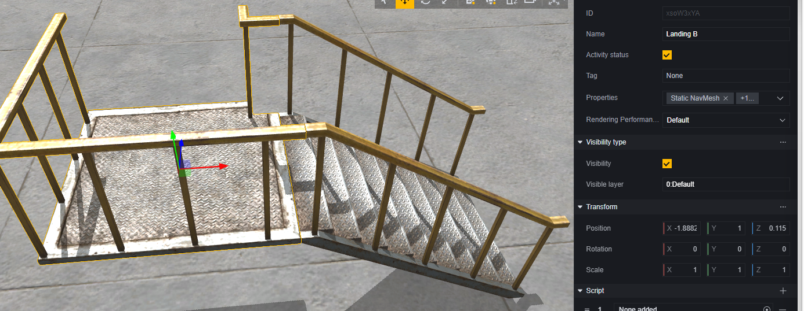

# Level Objects - User Manual

Level objects are crucial components of a level. To help you build levels more efficiently, we provide templates for some level objects. They are mainly divided into:

1. Functional level objects, such as tires that can bounce players and portals.
2. Structural objects.
3. Decorative objects.

An object can have multiple functions mentioned above. For example, a tire can serve as a springboard to reach the second floor and also act as decoration. This depends on your design.

In the object selector, we've categorized and organized level objects for you, making it easier to find what you need:

Tab 1 contains functional objects with default logic processing, which can be further configured to adjust their functionality.

Tab 2 contains general structures and decorations.

Tab 3 contains buildings and furniture.

Tab 4 contains themed objects, which are also structures or decorations but have distinctive themed appearances.

Next, we'll introduce some methods for building objects and using important level objects.

## General - Object Building Methods

Here are some methods for building and managing objects. You can also use your preferred methods for level editing and management.

### Height Alignment

When building with basic structural components, it's recommended to use scene dragging + transform to adjust the position and height of each object.

For example, in the image below, we used a staircase and a platform. However, the platform is placed on the ground by default and needs to be raised to the height of the end of the staircase.

First, nest the platform as a child object of the staircase so that the platform's transform position is relative to the staircase:

Adjust the platform height and try to align it:

You'll find that the platform's height relative to the staircase is close to 1. Assuming the end height of the staircase is 1, set the platform height to 1. Then align it horizontally.

### Horizontal Plane Editing

When editing planes at multiple heights in the vertical direction, you can place an auxiliary geometric object to use the editor's auto-grounding feature, simplifying height adjustment operations.

For example, in the previous staircase platform scenario, if you want to continue editing a plane at height 1, you can add a geometric plane:

> You can also use any object with a plane as a reference. However, when using objects with thickness, you'll need to slightly adjust the reference object's height. Geometric planes have no thickness collision bodies, making them ideal references.

Assuming the editing range is within 10*10, set the plane scale to (10,1,10), set its height to 1, then drag it horizontally into the area you want to edit:

At this point, it's equivalent to generating a ground at height 1 within the plane range. Dragging objects onto this ground or using shortcut key Q to quickly move objects onto this ground will automatically set their height to match the ground:

After editing is complete, delete this reference object or set it to inactive.

### Hierarchical Management

Typically, a scene will contain a considerable number of objects. It's recommended to use hierarchical management to categorize objects for better maintainability.

You can organize objects based on their function, area, or other suitable criteria.

> Renaming objects can help you find corresponding items more accurately.
## Basic Structures

Basic structures are purely structural components with minimal functionality. They can be used to piece together custom level structures, serving as barriers, platforms, cover, etc., in the map.

> A simple stair platform.

For an assembled custom structure group, it's recommended to organize the corresponding objects under a parent object in the hierarchy for easier management and fine-tuning:

> Here, the stairs are used as the parent object. You can also create an empty object as the parent, choose any suitable object as the parent, or further manage sub-object hierarchies based on actual needs.

If the structure group will be reused extensively, you can set it as a Prefab by dragging it from the hierarchy to the asset directory:

By dragging the prefab into the scene, you can quickly create a copy of that structure group.

It's recommended to manage prefabs in dedicated folders within assets. Subfolders can be created for queries and maintenance if necessary:

> Directly editing a prefab affects all objects using that prefab, while editing an object instance does not affect the prefab.

## Spawn Points

Spawn points are where players appear when they enter the game. If there are no spawn points or suitable ones in the scene, players will spawn near (0,0,0).

The rotating arrow on a spawn point indicates the front of the spawn point and the player's orientation upon spawning.

Spawn points have two unique configurations: capacity and team affiliation:

**Capacity:** Determines how many players can spawn simultaneously at this point.

**Team Affiliation:** Determines which team's players can spawn at this point. If not set for all teams, only one team can be chosen.

When set for a specific team, the spawn point will display that team's configuration in the scene.

Multiple spawn points can be configured in a scene.

## Combat Items

There are two ways to generate items at specified locations: generators and units.

Using generators to spawn weapons or items allows setting them to refresh each round but only by type. If an item from a previous refresh is not picked up, it will be replaced by a newly generated item.

Using units to place weapons or items allows precise specification of what is generated. By default, only one of each item is generated.

### Generators

Select the corresponding generator based on type; for example, weapons:

In configuration, you can choose the weapon type to generate:

In each round's reset component, you can set whether this generation point refreshes at each round's start.

Notably, when generating weapons, a matching set of ammo and attachments will also be generated.

### Units

Using weapons and items in units allows generating configured weapons or items at specified locations.

Items placed this way can have their properties modified:

## Safe Zone Objects

Using safe zone objects creates both a safe zone start object and an end object simultaneously.

> Safe Zone Start Object

> Safe Zone End Object

The safe zone transitions smoothly from the start's range and position to the end's range and position as configured. There are no limits on start and end ranges or positions; you can shrink, expand, or move the safe zone as needed.

Both safe zone start and end objects can configure related settings:

> Their configurations are shared; modifying one immediately affects the other.

**Safe Zone Activation Time:** Time after round start before safe zone effects begin (damage outside zone), measured in milliseconds.

**Shrink Duration:** Time taken for safe zone to transition from start to end range/position, measured in milliseconds.

**Damage Interval:** Interval between damage ticks outside safe zone, measured in milliseconds.

**Damage Per Tick:** Amount of damage dealt per tick outside safe zone.

**Safe Zone Disappearance Time:** Time after round start when safe zone disappears. If less than activation time, it won't appear at all, measured in milliseconds.

**Initial Safe Zone Radius:** Initial radius size of safe zone in meters. Changing this setting allows observing start object's range change in scene.

**Final Safe Zone Radius:** Final radius size of safe zone in meters. Changing this setting allows observing end object's range change in scene.

**Shrink Start Time:** Time after round start when safe zone begins changing, measured in milliseconds.

## Triggers

Triggers are level objects that detect entities entering their range. They're often used to trigger events under specific conditions.

We provide various shapes of basic triggers and some with built-in functions.

Basic triggers differ only by shape and have no logic. To use triggers for specific events, attach scripts to them and use relevant events on those scripts to detect entity triggers.

Triggers can detect entities entering or leaving their area. Player entry/exit events trigger only when player entities enter/exit triggers; entity entry/exit events trigger for any entity, like proximity mines.

These trigger events need to be used on scripts attached to triggers.

Next are some functional triggers. You can also attach scripts for extra logic on these triggers, but they'll always perform their inherent logic:

**Gravity Change Zone**

Within a gravity change zone, gravity acceleration and jump height change to set values. You can also set whether this area is visible.

**Death/Invincibility Zone**

Can be set as death or invincibility zones.

Players or AI entities entering death zones die instantly; invincible players or AI entities remain unaffected during invincibility states like other instant-death logic.

Players or AI entities entering invincibility zones gain invincibility until they leave. Leaving clears invincibility even if gained elsewhere; leaving removes invincibility effects too.

You can set whether this area is visible.

**Vault Trigger**

Players entering vault triggers from reverse directions can vault over them. This is mainly used for obstacles like windows.

Vault triggers preview vault directions in scenes; players must align with vault direction to trigger vault keys. For bidirectional vaulting, set two such triggers.

You can set vault height and distance.

## Zombies

Zombies are AI-controlled monsters. You can use zombie spawn points for continuous generation or place specific zombies using zombie units in scenes.

Regardless of how they're generated, zombies' types and attributes can be configured.

For AI entity information, refer to the AI entity user manual:

[AI Entity Documentation Link Here]

Generators have special settings compared to units:

**Zombies Per Wave:** Number of zombies generated per wave.

**Number of Waves:** Number of waves generated per round if not continuous generation is selected.

**Continuous:** Continuously generates zombies regardless of wave settings.

**Start Generation Time:** Time after round start before first zombie wave generates, measured in seconds.

**Wave Interval Time:** Interval between zombie waves' generation times, measured in seconds.

Zombies generated by generators are eliminated at next round's start without dropping loot.
