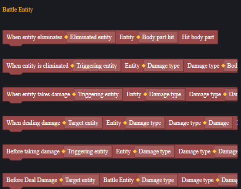
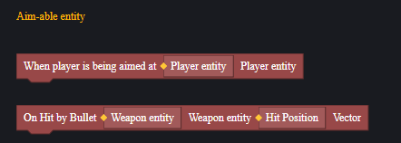
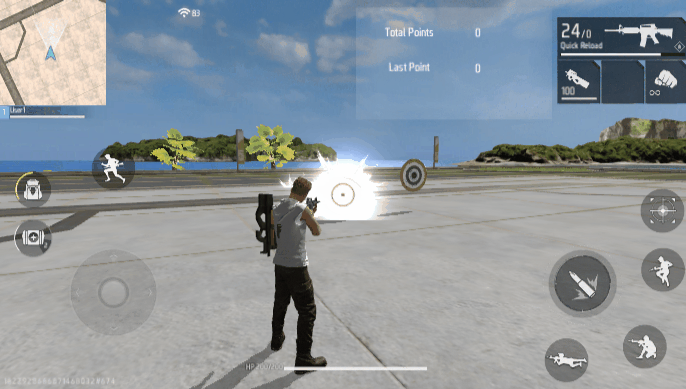
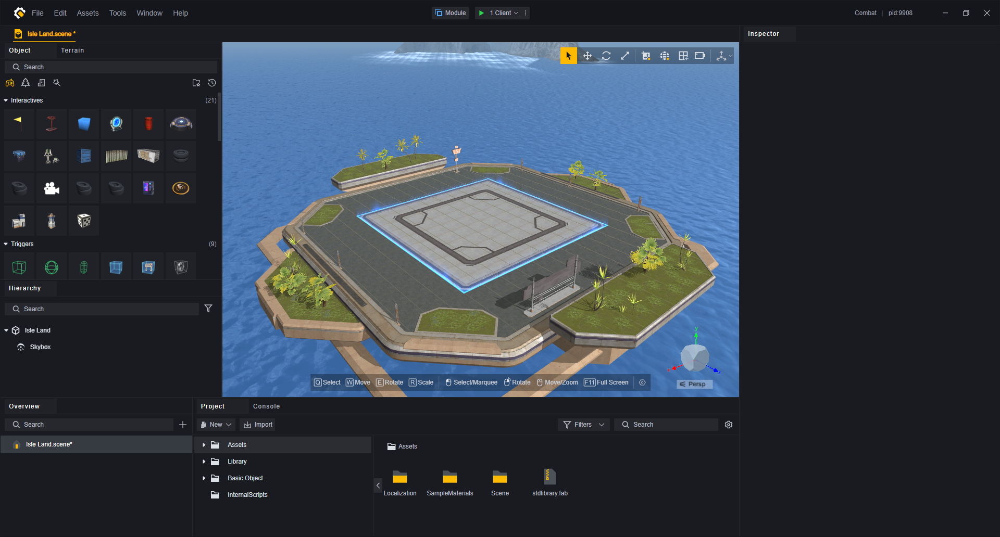
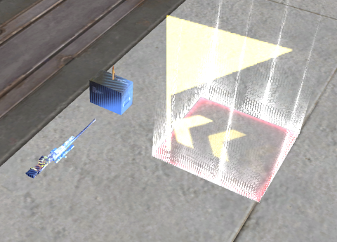
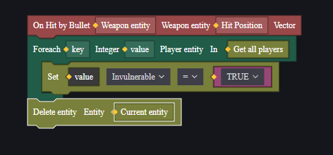
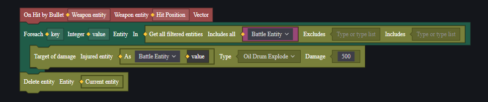
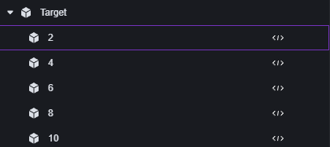
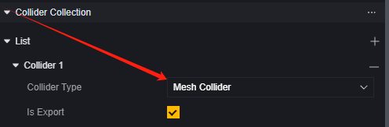

# Combat - User Manual

The combat system is a crucial component of the game.

By default, players, AI zombies, and defense towers are combat entities, inherently possessing attributes like health and damage capability.

Custom combat targets rely on targetable entities and are closely related to concepts such as aim assist and attackability.

By flexibly using the combat system, you can create a custom combat setup that even surpasses the limits of shooting games. However, using FF's native firearms for shooting combat is well-supported. If you wish to create combat without firearms (like sword and magic battles), it may require more effort and resources. This document mainly introduces the combat system under the premise of using officially provided firearms, but you might gain further inspiration.

This document will introduce the following topics in sequence:

1. Combat Entities
2. Custom Combat Entities
3. How to Create Combat Entities
4. How to Create a Combat Instance
5. Expansion: Custom Targets and Firearms with AOE Ammunition

## Combat Entities

Combat entities are those that participate in battles by default; currently, only players, AI zombies, and defense towers are combat entities.

You can use events and interfaces related to combat; the combat entity component does not support custom additions.

All combat entities can inflict damage and have health attributes; when health reaches zero, they die or are destroyed.

### Scripts

Combat entities can use some events and interfaces that depend on themselves.

By flexibly using these script contents, you can customize and expand FF's combat content to some extent.

Players, AI zombies, and defense towers can also use other entity components' events and interfaces that depend on themselves.

> Add a temporary shield for yourself before taking damage; the damage value is before amplification or reduction, so it cannot fully block headshot damage.

> Recover 10 health points for the player after being hit.

### Firearms and Items

Combat relies on firearms and items; most of the damage dealt by players depends on them.

In battle, only players can directly use firearms and items.

#### Distribution of Firearms and Items

You can distribute firearms and items to players through the script's add item interface. Each player can carry two primary weapons, one secondary weapon, one melee weapon, and several items by default.

Items exceeding the carry limit will drop at the player's location by default when distributed.

> Adding a weapon to a slot already occupied will replace the currently used weapon.
>
> If the player's discard item attribute is disabled, extra weapons or items will disappear.

> Note that the add item interface returns a list of added items.

Additionally, you can place weapons and items or their generators directly on the field using level objects. You can also sell weapons or items to players through shops. The method of distributing items to players depends on game design needs.

#### Attribute Configuration

For firearms and items placed in the scene through generators and level objects, you can configure their attributes directly in the panel.

> Firearm units and their configuration

For adjusting firearm and item attributes after game launch, you can achieve this through script settings.

> Modify player primary weapon attributes

When attempting to modify firearm attributes via script, pay attention to correctly targeting the firearm entity.

For example, after adding firearms to a player using the add item interface, note that it returns an entity list that requires processing to obtain specific firearm entities.

> Adjust the base damage of the M4A1 numbered 0 from a batch of three added at once to 10.

Weapons themselves also support some script events:

When using these events, this script needs to be mounted on the weapon entity. Practical explanations will be provided in the explosive projectile example below.

### Players

For players in combat, the player module provides the following configurations:

This determines the ratio of damage dealt and received by players.

Besides combat configuration, basic player attribute configurations also impact combat, such as health, energy, movement speed, and respawn capability.

Similarly, during gameplay, you can modify player attributes via setting properties methods.

You can also use combat-specific events to receive trigger signals from participating players or execute damage operations on them.

> Modifying health via setting properties differs from dealing damage; it does not trigger damage-related events nor respects invincibility or damage reduction states.

Further player-related information can be found in their respective documentation.

[Link should redirect to player documentation]

### AI Zombies

AI zombies are monsters with a unique set of AI entity attributes.

AI zombies actively attack players from different factions but do not attack other zombies or defense towers.

For more information about AI zombies, refer to their respective documentation.

[Link should redirect to AI documentation]

### Defense Towers

Similar to AI zombies, defense towers have their own unique attribute configurations.

Defense towers also only attack players from different factions and do not attack other towers or zombies.

## Custom Combat Entities

Besides default combat entities, you may need to add shootable targets like targets in your map.

> Instructions on creating a functional target will be provided later.

To create a custom combat entity, you must add a **Targetable Entity** component. You may also add an **Aim Assist Entity** component for aim assist functionality if needed.

### Targetable Entity

Without considering completely customizing a combat system from scratch, using official firearms requires units that can be hit in battle to have a **Targetable Entity** component attached.

Units with this component can trigger related events to complete combat logic.

> Players, zombies, and defense towers naturally have this component as combat entities.

The implementation of targetable entity component events relies on collisions; ensure collision components are added and enabled.

### Aim Assist Entity

For players, an aim assist feature is available in-game. When firing, crosshairs automatically lock onto targetable entities.

The aim assist entity component relies on the **Targetable Entity** component.

However, for this component to work effectively, the target entity must be an **Attackable Entity by Player**. For AI zombies, other players, and defense towers with different factions from current players are considered attackable entities; for other targetable entities, manual attack relationships need setting via scripts.

### Example

Using a basic sphere as an example: after creating this object, add a targetable entity component ensuring collision is active:

If you want this object capable of triggering player's aim assist functionality: additionally add an aim assist entity while handling its attack relationship with players via scripts:

## Battle Example

Here's a simple example to introduce how to create battle content.

1. **Create Project**

2. **Set Scene Objects**

We need a spawn point to designate the player's starting position, some zombies, and some custom battle objects. Here, cones, cylinders, and cubes are used as custom battle objects.

Add a targetable entity component to the custom battle objects.

Place a gun and ammo in front of the player's spawn point using weapon and item units.

Adjust the gun's properties so that each shot only deals 1 point of damage.

Adjust the zombies' properties to be neutral faction, with a long tracking distance and 200 health points.

> Neutral faction zombies will actively attack players within range.

At this point, you should notice that players can't eliminate zombies with firearms. We now need to add some functions to the custom battle entities:

Cone: When aimed at by the player, it adjusts the player's current main weapon damage to 500 and then destroys itself.

Cube: When hit by bullets, it grants all players invincibility and then destroys itself.

Cylinder: When attacked, it deals 500 barrel explosion-type damage to all **combat entities** and then destroys itself.

**Cone Script**:

**Cube Script**:

**Cylinder Script**:

**Add Scripts to Custom Battle Objects**:

**Directly Attack Zombies**:

**Combat Method 1**:

Gain damage boost by aiming at the cone and kill all zombies.

> The cone has been destroyed by aiming

> Easily kill zombies after damage boost

**Combat Method 2**:

Gain invincibility by attacking the cube and eliminate all zombies by attacking the cylinder.

> Gain invincibility after destroying the cube.

> Eliminate all zombies after destroying the cylinder.

## Expansion Example

### Simple Target

Create a target in the scene.

Create a parent object and drag in five basic spheres below it, representing rings 2, 4, 6, 8, and 10 respectively.

Scale the spheres to X=0.01, Y and Z as 1, 0.8, 0.6, 0.4, 0.2 respectively. This creates five discs for detecting which ring a bullet hits.

Adjust the X position so that higher ring numbers are further forward.

> Transform of ring 2 sphere

> Transform of ring 10 sphere

Modify the sphere rendering so adjacent rings appear different.

Change all child objects' collision type to Mesh for collision to closely fit the object's shape.

Add targetable entity components to all child objects.

This gives us a target object where higher ring number collisions are detected first when hit by bullets.

Place a large background behind the target, disable its visibility but keep collision and targetable entity for miss detection.

Create a UI to display the current player's score.

Add three custom attributes for players: current target score, total target score, and whether they are the active player.

> The active player attribute determines which player is currently shooting when multiple players are present; non-active players' actions won't count towards scores.
>

Add scripts to all target child objects and miss detection objects; their script structure is similar but modifies different player score attributes:

> Script for ring 2 object

> Script for miss background

Add scripts to global modules to set active players when they join matches and create custom UI.

> In practice, you can modify active players based on conditions.

When targets or backgrounds are hit by bullets, an event is sent to players.

Add scripts for players to update their custom UI text upon receiving target hit events.

Place firearms in the scene and test in-game.

 

> In this example, misses caused by hitting the ground are not handled.

### Explosive Bullets

Here's how to create guns that fire AOE damage bullets with explosion effects.

First analyze: damage and hit effects should occur when bullets actually hit targets, so use bullet hit events.

This event relies on weapon entities so scripts should be attached to weapons .

Add explosion effects on hit .

> For each player , this effect is visible .

Add AOE damage .

> Calculate distances between hit points & combat entities , dealing damage within range .
>
> Only AI zombies & players take damage here .

Weapon scripts complete , attach them onto corresponding weapons .

> Player scripts here , any player equipping weapons gains AOE ability .

Add some AI zombies into scenes & test multi-client .

