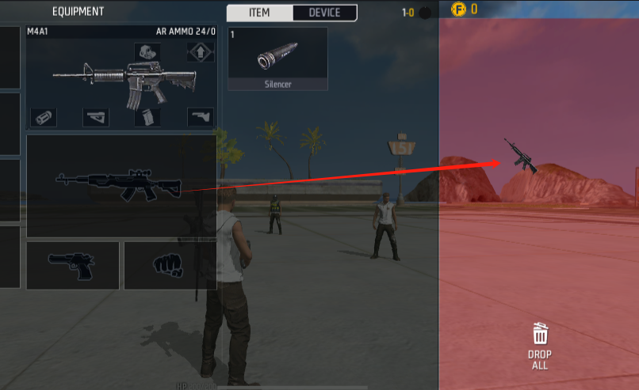
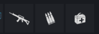
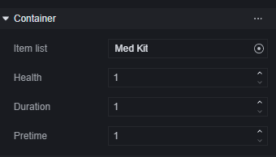

# Item - User Manual

A firearm, a grenade, some bullets—these are all items. In the game, when it comes to equipment or tools, the concept of items is indispensable.

Items rely on the player's backpack when they are with the player. The player's backpack holds these items.

## Item Categories

Items are categorized as follows:

### Equipment

Equipment includes weapons, armor, backpacks, attachments, and functional gear.

Here, "backpack" refers to a specific item rather than the concept mentioned earlier of holding items.

> Backpack

### Tools

Tools include grenades, healing items, special items, and various types of bullets.

## Player Backpack

The player backpack here differs from the backpack; it refers to the abstract concept of the player's item space. A backpack can increase the space of a player's backpack and provide cosmetic changes.

> Player Backpack

### Backpack Content Categories

#### Equipment Slot

Part 1 in the image above is the equipment slot in the player's backpack. The equipment slot contains the player's currently equipped weapons, armor, backpack, and functional gear.

#### Tool Slot

Part 2 in the image above is the tool slot button in the player's backpack. The area directly below displays tools.

> When there are tools

All visible tools are stored here.

#### Device Slot

Part 3 in the backpack image is the device slot button. For editors, currently only an ice wall generator is available as a device.

Devices can be activated by scripts. Once activated, equipment appears under this category in the backpack.

#### Black Hole Space

Equipment and tools not displayed in the backpack interface exist in black hole space. Players cannot directly view these items in their backpacks.

### Using Items in the Backpack

Generally speaking, most items can be used or automatically used outside of the backpack, including weapons, attachments, grenades, etc.

However, certain operations can still be performed within the backpack.

Using specific items:

Detach/Replace/Install attachments:

> Detach Attachment

Discard items inside the backpack:

## Placing Items in Scenes

There are two ways to generate items at a designated location: generators and units.

Using a generator to spawn items can be set to refresh each round but can only specify types. If an item from a previous spawn isn't taken before refreshing, it will be replaced with newly generated items.

Using units to place items allows for precise specification of weapon or tool types generated. By default, only one corresponding item will be generated.

### Generator

Select a generator based on type; take weapons as an example:

In configuration, you can choose the type of weapon generated:

In each round's reset component, you can set whether this spawn point refreshes at each round's start.

Notably, when choosing to generate weapons, a matching set of ammo and attachments will also be generated.

### Unit

Using weapons and tools from units allows you to generate configured weapons or tools at specified locations.

Items placed this way can have their properties modified:

## Item Events

You can listen to certain item-related events to implement your desired logic.

Here are some common events:

| Name           | Script Name  | Description                                                              | Parameter 1                                    | Parameter 2                                                         | Parameter 3                                                                                            | Dependent Entity |
| -------------- | ------------ | ------------------------------------------------------------------------ | ---------------------------------------------- | ------------------------------------------------------------------- | ------------------------------------------------------------------------------------------------------ | ---------------- |
| On Obtain Item | OnObtainItem | Triggered when a player obtains an item from any source                  | Item ID, ID of the obtained item by the player | Item entity, entity of the obtained item by the player, can be null |                                                                                                        | Player           |
| On Use Item    | OnUseItem    | Triggered when a player uses an item                                     | Item ID, ID of the used item by the player     | Item entity, entity of the used item by the player, can be null     | New item entity created after use. Items like portable turrets can be accessed through this parameter. | Player           |
| On Drop Item   | OnDropItem   | Triggered when a player drops an item                                    | Item ID, ID of the dropped item by the player  | Item entity, entity of the dropped item by the player, can be null  |                                                                                                        | Player           |
| On Pickup      | OnPickup     | Triggered when an item is picked up; must be attached to the item entity | Player picking up the item                     |                                                                     |                                                                                                        | InventoryBase    |
| On Used        | OnUsed       | Triggered when an item is used; must be attached to the item entity      |                                                |                                                                     |                                                                                                        | InventoryBase    |
| On Drop        | OnDrop       | Triggered when an item is dropped; must be attached to the item entity   | Player dropping the item                       |                                                                     |                                                                                                        | InventoryBase    |

## Item API

Use the Item API to perform operations on items.

Here are some common APIs categorized:

**Add Items**

| Name        | Script Name     | Description                           | Input 1                    | Input 2       | Input 3           | Return 1                                                        |
| ----------- | --------------- | ------------------------------------- | -------------------------- | ------------- | ----------------- | --------------------------------------------------------------- |
| Add Item    | AddItemToPlayer | Sends items to player's inventory     | Player receiving the items | Items added   | Quantity of items | List of added items. Regardless of quantity, returns as a list. |
| Create Item | AddItemInScene  | Creates items at a specified location | Item location              | Items created | Quantity of items |

**Remove Items**

| Name              | Script Name      | Description                                                                 | Input 1             | Input 2       | Input 3           | Return 1       |
| ----------------- | ---------------- | --------------------------------------------------------------------------- | ------------------- | ------------- | ----------------- | -------------- |
| Remove Item       | PlayerRemoveItem | Removes items from a player's inventory                                     | Player losing items | Items removed | Quantity of items |
| Destroy Equipment | DeleteEquipment  | Destroys equipped items based on slot; only equippable items can be removed | Player losing items | Slot          | Quantity of items | Success status |
| Clear Inventory   | ClearInventory   | Clears all items from a player's inventory, including equipped ones         | Player losing items |               |                   |                |

**Query Items**

| Name                    		| Script Name    	| Description                        		| Input 1         		| Input 2  		| Return 1          		| Return 2            	|
| ----------------------------		| -----------------	| ----------------------------------------		| ---------------------		| ------ 		| ---------------------		| ---------------------|
| Get Equipments in Inventory Slot   	| GetEquipments    	| Retrieves equipped items based on slot   		| Player with items   		| Slot   		| Equipped item entity  		| List of attachments for that item |
| Get Item Count             			| GetItemCount     	| Retrieves quantity of a specific item in player's inventory 		| Player with items   		| Item ID 		| Quantity of this item  	 |

**Modify Items**

| Name                  			| Script Name     			| Description                              			| Input 1 		| Input 2 		| Input 3      		| Return 1    	 		|Return 2    	 	 |  
|------------------------------	|	 ------------    |		 ----------------------------------	|	 ----- 	|	 ----- 	|	 ---------- 	|	 -------- 	|	 --------|
Grant Weapon Attachments to Player| 	 AddAttachments |		 Grants attachments for weapons in specified slots to a player 		| Player 	|	 Slot 	|	 AttachmentItem ID 	|	 Success status 	|	 Attachment entity
Switch Player Weapon |			 SwitchWeapon 		|	 Switches weapon in specified slot to player's current weapon 		|	 Player 	|	 Slot 		|	 	|		 Success status|
II