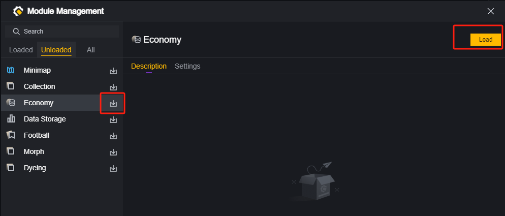
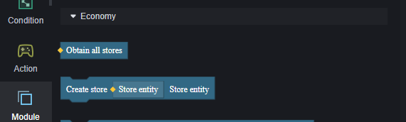
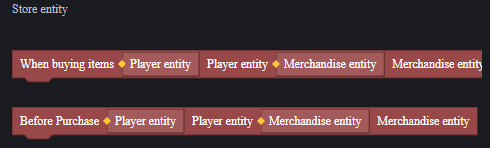
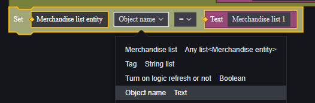
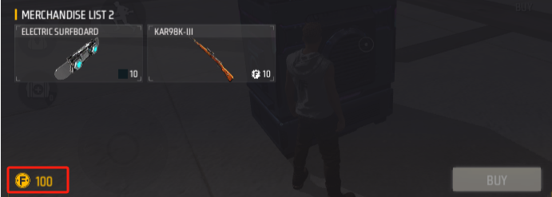
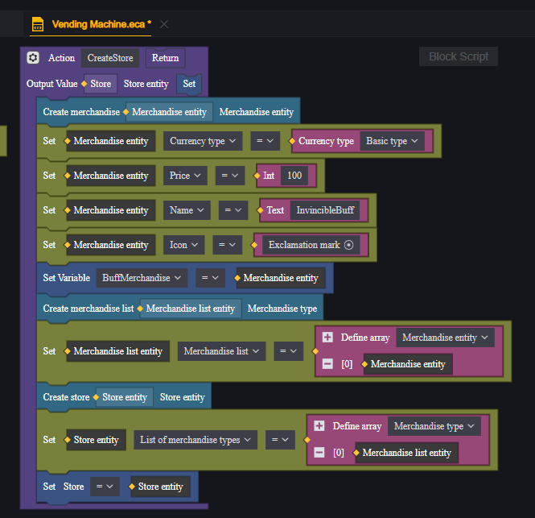
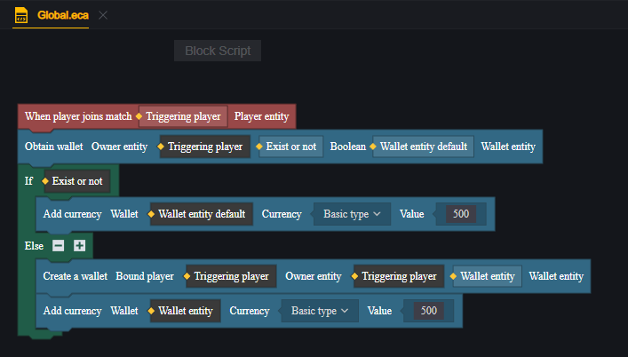
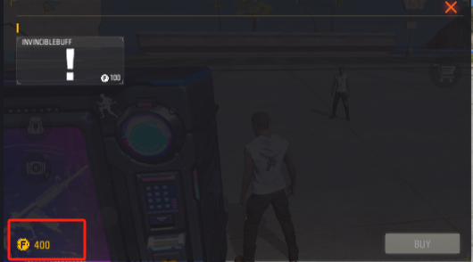

# Economy - User Manual

## Using the Economy Module

The economy module allows players to purchase items with currency. It's commonly used in built-in HUD templates to quickly set up an in-game store.

The economy module is optional. To use currency, stores, and related features, you need to load the economy module.

Once the economy module is loaded, you can use economy-related elements in the script's module category.

When unloading the economy module, be aware that previously used economy elements will become invalid, which may affect your project.

## Currency and Wallets

By default, there is only one default currency in the game. Without additional settings, all scenarios using currency will use this default currency.

> 100 default currency

### Creating New Currency

You can create custom currencies within the economy module.

You can name the new currency, choose its icon, and change its color.

Currency icons can be selected from built-in images or imported images. Imported images will appear at the bottom of the image selector.

> Custom image

To use newly created currency, set the item properties and player-given currency to this type. See related content below.

### Adding and Removing Currency

Currency must be stored in a wallet, so you need to create a wallet for the player first.

> Creating multiple wallets is pointless; only the initially created wallet will be effective.
>
> Players initially have no wallet, but any wallet-related operations, such as purchasing, opening the built-in store UI, or displaying currency amounts, will create a wallet for that player.

You can add or remove default or custom currencies from a player's wallet.

## Store

### Store Composition

A store interface displays a store entity composed of shelves, which are made up of items created as products.

#### Products

To use items as products, add them to the product list to make them usable as products.

For products, you can adjust properties by setting elements.

You can adjust product price, currency type, purchase limits, product name, icon, and other attributes when used as a product.

The currency type can be set to default or custom. If custom currency is chosen, purchasing the product requires that currency in the buyer's wallet.

#### Shelves

Shelves are collections of several products.

> Two shelves in this store

After creating several products, place them on shelves:

Shelf properties can also be modified after creation.

#### Store

A store is a collection of shelves.

After preparing several shelves, place them into the created store. The store entity can then execute sales logic normally.

Store properties:

Below the store, it will display the amount of store-bound currency type owned by the player's wallet.

> By default, only the amount of default-owned default currency is displayed.

### Creating a Store

In sequence, first create the product, then the shelf, and finally the store. This gives us a store entity. However, it cannot yet be displayed in the game.

We can display the store in the game using the following methods.

#### Vending Machine

There is a functional object in the level objects: the vending machine. Using it can open a specified store entity.

The vending machine has two default configurations:

1. Trigger Range: Activates the store button within a certain distance from the vending machine.
2. Display Vending Machine: Determines whether the vending machine model is shown on the map.

To use a created store entity, you need to add a script to the vending machine.

We encapsulate the logic of creating a store into a function that returns the created store. In the vending machine script, set the store created by this function as the vending machine's store.

When approaching the vending machine, a store icon will first be activated. Clicking this icon will open the store interface.

If you need to open the store with a button, it's recommended to use the vending machine object directly. You can achieve button-triggered stores within a fixed range by hiding this object.

#### Built-in Store UI

If you need to open the store UI directly, such as at the start of a game round or when entering a specific area, use the built-in store UI.

The built-in store UI can be created by making an in-game UI element:

After creating a built-in store UI, bind its properties to the created store entity.

### Public and Private Stores

By default, a public store is created, which requires no extra handling. All players can purchase from it, but once items are sold out, others can't buy them anymore.

If each player needs their own instance of the same store, create one for each player.

> It's strongly recommended to encapsulate store creation into a method or save created store entities into a public variable.

For example, in a global script, open a store UI for each player joining the game:

This way, each player's UI uses different instances of the same store entity, allowing everyone to have their own exclusive store.

## Example

Selling an invincibility buff in a store.

First, create a script under the player module to manage player buffs:

In this script, write an invincibility buff that grants 5 seconds of invincibility to the current player:

Place a vending machine in the scene and add a script to it:

In the vending machine's script, write a method to create a store:

In this store, there is only one shelf with one product that doesn't correspond to any actual item.

Choose an exclamation mark or any icon you like for the product icon:

Set the product price at 100 and save it into a script variable for later use.

When creating the vending machine, call this method to create a store entity and bind it to the vending machine:

At this point, there's already this product in the store but it can't trigger invincibility yet.

Create an additional store script to monitor player purchase events:

> Since we're using script variables for storing products above, here we use external links to access these variables. Alternatively, you can save product entities into global variables via component properties.

Since this script handles purchase events and needs to be mounted on the store entity created during gameplay, it requires dynamic mounting.

Go back to the vending machine script and mount this store script onto the created store entity:

Now that the store is complete but players don't have money for purchases yet, create a global script adding 500 default currency for each player.

Run the game:

Initially, neither player has invincibility:

Open the store; products are available and players' wallets have expected amounts:

Purchase successful; buying player gains invincibility effect:

5 seconds later, invincibility ends:

Reopen the store and notice 100 currency has been deducted correctly:

