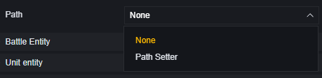

# AI Zombie - User Manual

Strictly speaking, AI refers to the AI entity component. Like other functional components, when attached to any entity, that entity becomes an AI unit.

Currently, however, AI entities are only attached to zombie entities and cannot be customized. Therefore, this article will introduce AI from the perspective of configuring and controlling zombies.

## Configuring AI Zombies

You can configure individual zombies through unit settings, periodically generate and configure zombies via the zombie generator, or batch generate pre-set zombie templates using the unit generator.

Both generators and zombies can configure zombie attributes. Generators have additional configurations for how zombies are generated.

### **Unit Zombie Configuration**

These entries also appear in the zombie generator.

**Health**: The health of the AI zombie.

**Attack Damage**: Base attack damage. Skill damage is calculated separately and is not affected by this configuration.

**Enemy Detection Range**: The base range for AI zombies to detect enemies. Modifiers will adjust this base value.

**Movement Speed**: Base movement speed. Modifiers will adjust this base value.

**Enable Loot Drop**: Whether loot drops upon being killed. The type of loot dropped cannot be configured.

**Damage Multiplier**: Percentage of damage taken, ranging from 10-10000. A minimum of 10 means only 10% of the original damage is taken.

**Type**: AI type, i.e., the type of zombie.

**Auto Enemy Detection**: Whether to automatically detect enemies within range.

**Faction**: The faction of the AI zombie.

**Attack Mode**: Aggressive: Actively attacks detected enemies. Passive: Attacks only when attacked. No Attack: Does not attack.

> Zombies with skills may not strictly follow detection and attack configurations but will always use skills to attack enemies within range.
>
> BOSS-type zombies come with skills: Butcher, Mr.V, Samurai.

**Pathing**: Default pathing route used with waypoints.

Set up the path in the scene using waypoint objects:

Once the path is set, you can select it in the AI zombie configuration.

### **Zombie Generator Specific Configuration**

**Zombies per Wave**: Number of zombies generated each time.

**Number of Waves**: In non-continuous generation, how many waves of zombies are generated per round.

**Continuous**: Continuously generates zombies, ignoring wave settings.

**Start Generation Time**: Time after round start to generate the first wave of zombies, in seconds.

**Interval Between Waves**: Time interval between each wave of generated zombies, in seconds.

> Zombies generated by the generator will be eliminated at the start of the next round and do not drop loot.

### Unit Generator Configuration

**Units per Wave**: Number of configured units generated per wave.

**Number of Waves**: Total number of waves generated.

**Template**: Select a unit template from the scene to generate. Mutually exclusive with Prefab.

**Start Generation Time**: Time after game start to generate the first wave of units, in seconds.

**Continuous Generation**: When checked, continuously generates units per wave regardless of wave settings.

**Interval Between Waves**: Interval between each wave generation, in seconds.

**Prefab Template (Prefab)**: Select a unit to generate from Prefab. Mutually exclusive with Template.

## Controlling AI Zombies via Primitives

After statically configuring AI zombies or their generators in a scene, you can control them during gameplay via scripts.

This section mainly introduces primitive scripts; code scripts can use corresponding APIs and events for similar operations.

### Generator Operations

Not limited to AI zombies; generator APIs and events can operate on all generators.

> Use this combination to obtain entities generated by each wave from a generator

### AI Zombie Operations

Besides being an AI entity, a zombie is also a combat entity, targetable entity, etc.

Use corresponding events to monitor AI zombie behaviors and APIs to control their actions.

> Events for AI entities

### Example

A simple example illustrating how to use primitive scripts to control AI zombies:

Assume the requirement is that whenever a player targets a zombie, it dodges.

Attach this script to the zombie entity.

This allows the zombie to randomly move horizontally when targeted.
