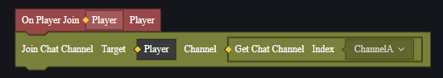

# Voice Channel - User Manual

When players use voice communication, only those in the same voice channel can communicate with each other.

We provide 6 custom voice channels by default for you to use when editing custom maps.

## Changing a Player's Voice Channel

Through scripting, you can assign players to a specific voice channel during the game:

You can also remove players from a voice channel:

When players join a new voice channel, they automatically leave their previous one.

## Voice Channel Related Events

Using events, you can monitor when players enter or exit voice channels in the game, allowing you to implement other logic.

[Image Placeholder]

## Quick Chat Status

Quick Chat allows players to send preset chat messages rapidly.

Through scripting, you can adjust whether players have permission to use this feature during the game:

