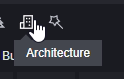
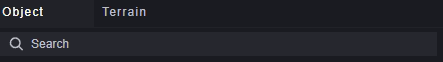
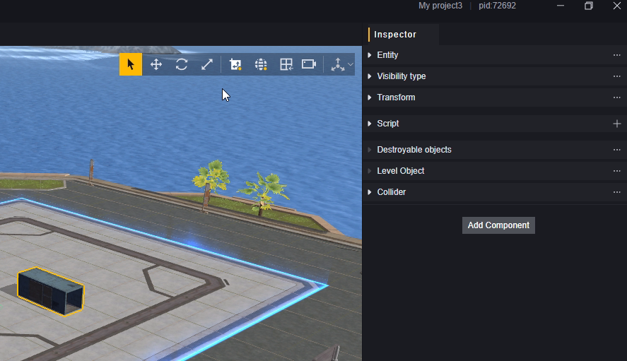
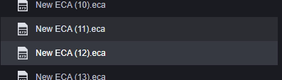
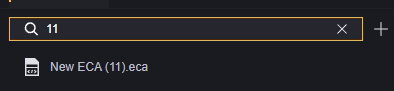
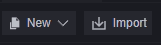
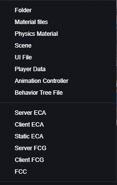

# Understanding the Editor Window

## Project Management Interface

### Layout

### Layout Introduction

#### 1. Projects and Other Interfaces

In the project manager window, there are four tabs:

1. Project Management: Manage local projects.
2. Data Center: Data of maps published by the current account.
3. Resource Store: Provides various resources needed for game development.
4. My Resources: Resource management for purchases made by the current account.

This section mainly introduces the content in **1. Project Management**.

#### 2. Create/Open Project

##### Create Project

Clicking the Create Project button opens the new project interface.

1. **Template Type**: We have prepared several template categories for you, including:

   Basic Templates: These are templates without code. We provide some initial maps with different sizes and preset scenes that you can choose based on your needs.

   Gameplay Templates: These templates come with gameplay code and offer some popular game extensions that you can use directly or customize.

2. **Template Selection**: After selecting a template category, you can choose a specific template, and view its brief description in section 3.

3. **Template Description**: A brief introduction of the template.

4. **Project Name and Storage Path**: You can freely name and modify the path, but ensure no projects with the same name exist in the same path (regardless of using the same template), otherwise, you'll get a prompt.

5. **Cancel and Create**: Cancel closes this window without saving any edits. Create will set up a new project with the current settings and open it automatically.

##### Open Project

Opening a project will load an existing local project and add it to your project management list. Clicking the **Open Project** button will expand the system's file selection interface, where you need to choose the project folder, usually named after the project, with subfolders and files inside it.

For example, this "My project" folder is a project folder:

Its subdirectory should be:

> This is a newly created blank project; edited projects may have different structures.

Selecting "My project" or not choosing any files or folders after expanding its hierarchy will successfully open the project. If the hierarchy is incorrect or incomplete, you'll receive a prompt.

In some cases, additional prompts may appear; these won't prevent you from opening the project but may cause issues when modifying it.

#### 3. Project Sorting

All projects you've created or opened are saved on the main interface of the project management screen, where you can sort them.

Sort by project name to toggle between ascending and descending order.

Sort by modification time to toggle between ascending and descending order.

Sort by project version to toggle between ascending and descending order.

You can click the star button in a project to favorite it:

Activating favorites in the menu will pin favorited projects to the top.

Favorited and non-favorited projects are sorted separately in descending order of modification time.

> Only one sorting rule can be used at a time.
> Favoriting is also a sorting rule and cannot be used simultaneously with other sorts.

#### 4. Search Existing Projects

You can search saved projects; searches match both project names and paths. Only projects containing input from the search box in their name or path will appear.

Search results are sorted by modification time in descending order, with the most recently modified at the top.

> Other sorting settings do not apply during searches.

#### 5. Settings and User

##### Settings

​	**Language**: Change language display in real-time for both project management and editing interfaces. However, real-time changes do not affect custom fields.

​	**Check for Updates**: Check if there's a newer version of the editor available.

​	**Update Log**: View update details.

​	**About**: Coming soon.

##### User

You can manage logged-in users; login is required to use the project editor properly.

### Operate Projects

Right-clicking a project opens the operation panel:

**Open in Explorer:** Browse projects in local explorer.

**Rename:** Rename a project.

> Project names cannot contain special characters as indicated by prompts.

**Delete:** Delete a project

Clicking delete prompts a secondary confirmation screen:

Selecting **Delete Local Files as Well** removes the project's folder from your local storage.
Not selecting **Delete Local Files as Well** keeps the folder locally, allowing you to re-add it to your management panel anytime by opening it again.

### Multiple Project Instances

Clicking a project opens it; multiple projects can be opened simultaneously.

> When working on multiple projects, ensure you're editing the intended one.
## Engineering Edit Interface

### Layout

> Elements 3-7 are unique to scene editing and will be explained in detail in other articles.
>
> All windows support resizing by dragging the edges, which helps you focus more on specific aspects during editing.

### Layout Introduction

#### 1. Menu

The menu is used for operations on the entire project and is categorized as follows:

1. File: Operate on project files, configure system settings, and exit project editing.
2. Edit: Save, undo, redo operations on the entire project, and edit operations on selected objects.
3. Assets: Import/export assets and perform online purchase-related operations.
4. Tools: Tools provided for developers, which can be used as needed.
5. Help: Provides user manuals, instructions, and other assistance.

#### 2. File Tabs

All opened files, regardless of type, are arranged sequentially in the tabs.

Files that have been modified but not saved are marked with an "*". Only modifications to file content (or file deletion) will be marked; changes to file location or tab order will not be marked.

The currently selected file is highlighted with a yellow underline.

Depending on the type of file selected, the main page will switch to the corresponding file type's editing interface. This includes but is not limited to:

1. Scene Editing
2. Element Script Editing
3. Behavior Tree Editing
4. Animation Controller
5. Player Data
6. UI Files

You can rearrange the order of tabs by dragging them.

When the number of open files reaches a certain limit, you can scroll through the tab directory using the mouse wheel. Quick jump buttons to the first/last tab will also appear at the ends of the tab row.

Right-clicking on a file tab opens an operation menu.

Closing tabs to the right will close all tabs to the right of that file; closing other tabs will close all tabs except for that one.

> The main scene cannot be closed.
> If there are unsaved changes, prompts will appear sequentially.

Viewing file location will locate the file in section 9: Project Assets.

Opening local file location will locate the file on your local system.

#### 3. Object Selector

The Object Selector is an editor for scene files where you can choose objects to place in your scene.

We offer several categories:

Functional Objects:

Objects with inherent logic that can be used to build gameplay.

Structures and Decorations:

Standalone structures or decorations without logic.

Building Related:

Complete buildings or furniture without logic.

Themed Objects:

Various themed structures or decorations categorized by theme, used to create specific thematic atmospheres without logic.

Common Objects:

You can right-click to set some objects as common and view them under Common Objects:

Objects set as common can have this setting removed.

Objects support search functionality.

> Detailed instructions on how to place objects in scenes will be provided in other articles.

#### 4. Terrain Editor

Allows editing of scene terrain, such as creating mountains and valleys.

> Detailed instructions will be provided in other articles.

#### 5. Scene Editor

The Scene Editor visually displays elements within the current scene.
You can modify scenes using the Object Selector (3) and Terrain Editor (4).

> Detailed instructions will be provided in other articles.

#### 6. Hierarchy

The hierarchy displays all custom objects in a scene and their hierarchical relationships. You can build parent-child relationships through the hierarchy menu.

> Detailed instructions will be provided in other articles.

#### 7. Inspector

Selecting an object in the Scene Editor (5) displays all components of that entity in the Inspector panel.

Here you can modify component parameters and add or remove custom components.

> Detailed instructions will be provided in other articles.

#### 8. Overview

The Overview displays a certain type of file within your project, depending on the file type selected in File Tabs (2). The image shows an Element Script file selection:

Double-clicking any file in the Overview opens it for editing. If it's not already open in File Tabs (2), it will open; if it's open but not selected, it will switch to it.

Editing any file in a tab automatically highlights its corresponding file in the Overview more brightly than manual selection:

Currently editing New ECA(12).eca while New ECA(11).eca is selected in the Overview.

Right-clicking any file in the Overview allows these operations:

Save, rename, delete, or browse this file resource locally.

The Overview supports search functionality mainly for locking onto a specific file when there are many files of that type.

Clicking the plus button creates a new file of that type stored in its designated folder:

| File Type     | Extension   | Folder              |
| ------------- | ----------- | ------------------- |
| Element Script| .eca        | Assets/ECA          |
| Behavior Tree | .xbt        | Assets/XBT          |
| Scene         | .scene      | Assets/Scene        |
| Animation Controller | .ac  | Assets              |
| Player Data   | .playerdata | Not supported for new creation |
| UI Files      | .ui         | Assets/UI           |

#### 9. Project Assets

Project Assets display your project's asset files. You can categorize files here for easier resource location.

Content within the Assets folder is customizable; other folders are not modifiable. You can view these unmodifiable official assets.
The editor only recognizes corresponding folders within local files; other folders won't appear in the editor.

A newly created blank project's Assets folder looks like this:

The left area shows folder structure; only folders appear here. The right shows specific files; both folders and files appear here. You can zoom display on the right using Ctrl+mouse wheel. We added an ECA file and minimized it here:

In folder structure, you can create new content using the New button or import local assets using Import button.

For new creation operations, right-click a folder in folder structure or right-click blank space in file area to create content within specified folder:

> This is based on version v1.9.0's new content list; supported file types may vary by version

#### 10. Console

Used to display overall game prompts, warnings, and errors. There's also a console under Debug (12) mainly for displaying information during a single game run.

Using Console provides time points for each node occurrence along with warning/error information aiding debugging efforts:

Clicking categories toggles their display:

Using search matches prompt information containing search content within displayed categories; right-side category display also changes according to search results' category situation:

