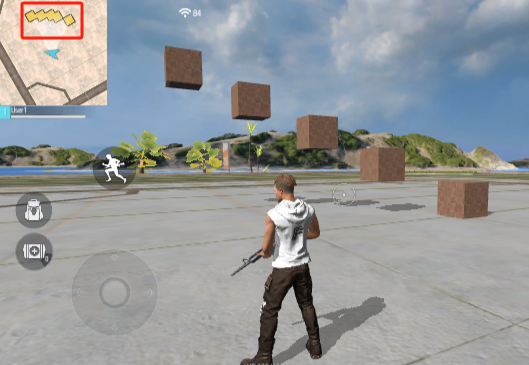
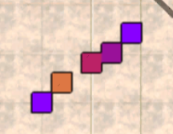
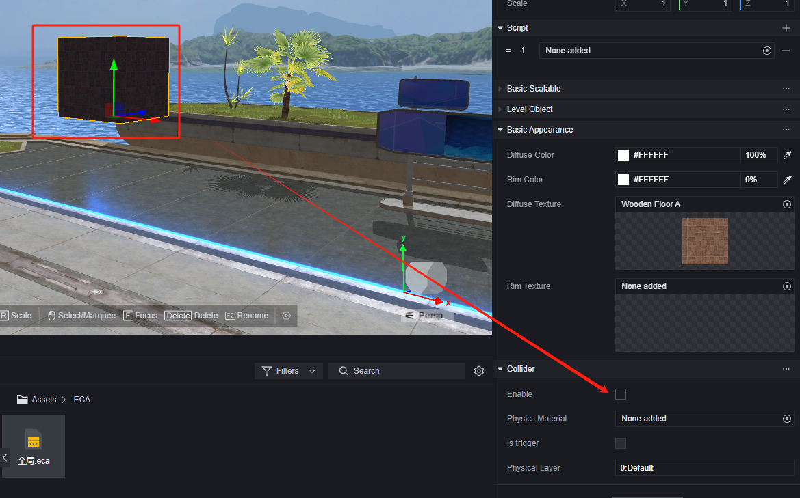
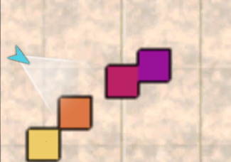
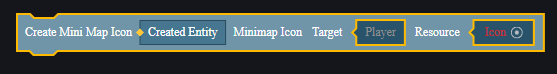
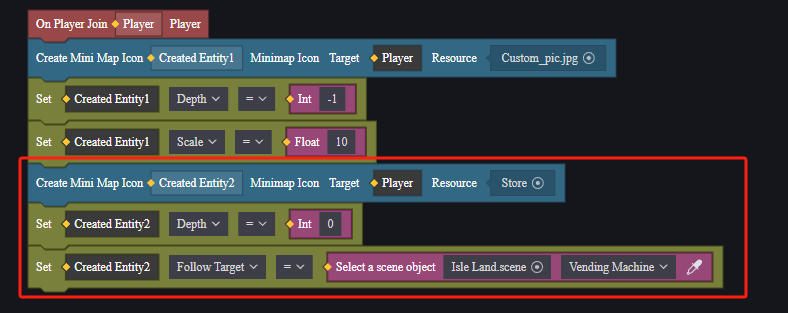
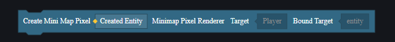

# Mini-Map User Manual

The mini-map is a thumbnail of the entire game map, showing the player's position and orientation in real-time, helping players locate themselves and gather other map information.

A: Permanent thumbnail mini-map.

B: Detailed mini-map that expands when A is clicked.

1: The player, with the arrow indicating direction and the cone in front of the arrow representing the player's field of view.

2: The player's teammates, with the arrow indicating direction.

3: Objects on the map. Colored squares representing objects on the mini-map are called pixels.

4: Detected enemies, shown only on the thumbnail.

The thumbnail mini-map always keeps the player's current orientation facing up, while the detailed mini-map has a fixed orientation:

After expanding the mini-map, you can zoom in or out using the right-side menu:

You can mark or unmark the mini-map using the button at the bottom right:

## Depth Map

The default mini-map supports depth map functionality, marking different colors based on object height to distinguish their elevation.

In Module - Mechanism Parameters, you can find the default mini-map category, which includes a depth map toggle function:

Disabling this option will mark all objects on the map with the same color:

Enabling this option will mark objects on the map with different colors based on the highest surface of their collision body:

For composite objects made of multiple items, take the highest collision surface.

Combine the highest and lowest from above, treating the lowest as the parent object, resulting in:

> You can see that objects at lower positions are considered higher, and depth judgment is not related to parent-child relationships.

Maintain the above parent-child relationship but disable collision for the highest block:

> The larger the number behind a block, the higher its position. The number only represents ranking, not absolute height.

At this point, it appears as:

You can see that blocks with disabled collisions no longer appear on the mini-map, and composite objects of lowest and highest are treated according to the lowest block with collision.

### Supplement

1. The precision of depth maps is 1 meter.
2. Some objects won't be read by the mini-map, such as basic white model objects:

3. Depth map settings will also affect how objects marked on custom mini-maps are displayed in terms of depth.

## Custom Mini-Map

You can customize mini-map backgrounds, other icons, and which objects are displayed.

To customize a mini-map, you need to load a custom mini-map module. The custom mini-map module is optional; uninstalling it will invalidate previously used content and elements.

Once you enable custom mini-map module functionality, part of the mini-map will automatically display custom content. If no custom mini-map has been edited yet, it will appear as:

### Custom Mini-Map Properties

Custom mini-maps have several properties:

**Center and Map Size**: Which world coordinate point serves as the center for displaying content over what area on the map. The UI size of the mini-map from a player's perspective remains unchanged; a larger map size means a larger area is represented within this fixed UI region. If your mini-map background depicts scene terrain, adjust center and map size to match actual scenes.

**Enable Depth Map**: This property can be modified via module configuration and dynamically within scripts.

### Setting Mini-Map Icons

Using elements provided in modules, you can add icons to your mini-map:

Icons have these properties:

#### Setting Background

Adjust icon layering and size; icons can be used as backgrounds.

We import a plain black image:

Set this image's layer to -1 and scale it to 10.

#### Setting High-Priority Units

You might want to highlight chests or key players on your map. Use an icon's follow target property to bind it to an object.

We add a vending machine to our map:

Add a shop icon for it:

Then add an icon that follows each other player:

This way, shops and other players will appear on your map:

### Setting Pixels

As mentioned earlier, objects displayed on a mini-map appear as colored squares called pixels.

In custom mini-maps, no pixels are shown by default.

Elements can be used to set which objects are displayed as pixels:

Set pixels for all level objects:

> The image shows how it looks with depth map settings enabled.
