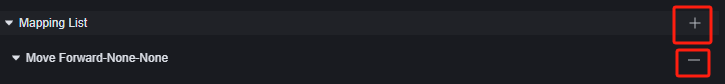
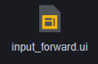

# Input System - User Manual

The input system is a default module that allows you to remap game controls by modifying the input system configuration

# Input System - User Manual

The input system is a default module that allows you to remap game controls by modifying the input system configuration

You can control the visibility of these in-game universal buttons through scripts: 

{
  "type": "a",
  "id": "A5dC35^!WzQibCaFKtGx",
  "extraState": {
    "X": 528,
    "L": [
      1,
      2,
      3
    ],
    "T": "SetPlayerHubSwitch",
    "OT": null
  },
  "inputs": {
    "P1": {
      "shadow": {
        "type": "tys",
        "id": "yQYArCczLxf9yw3FNXAT",
        "extraState": "Player"
      }
    },
    "P2": {
      "shadow": {
        "type": "ipe",
        "id": "-)h5GeGgU0{HBI{KpY[.",
        "extraState": "PlayerHudSwitchType",
        "fields": {
          "I": "MovementHUD"
        }
      }
    },
    "P3": {
      "shadow": {
        "type": "ipe",
        "id": "Spr.Q/3v;moE6P^U%6x2",
        "extraState": "CommonHudSwitchValue",
        "fields": {
          "I": "Close"
        }
      }
    }
  }
}

## Custom Input System

In the input system, you can add or remove an input:

For an input, you can choose the input type as keyboard, mouse, or UI file.

### Keyboard and Mouse

Keyboard and mouse inputs are currently only effective during PC Debug and will not be introduced here.

### Custom UI

For custom maps, in-game operations are primarily remapped through custom UI.

In the input system, you can bind an input to a control on the custom UI, allowing you to use the custom UI controls to perform operations. This will help you create unique game modes or other scenarios where you want to change player inputs.

### How to Configure Custom Input

Taking custom UI as an example, you first need to prepare a custom UI for custom input.

We create a UI with only one button under this custom UI, intending for this button to make the player move forward.

Add a new input in the input system module.

Select the mapping operation as forward, type as UI file, choose the previously created custom UI and button, and set the input gesture to hold.

Create a custom UI for the player; this element script is created on the global module.

{
  "type": "e",
  "id": "*%pI`W(dS_piURm|VMA!",
  "extraState": {
    "X": 14,
    "L": [
      1
    ],
    "T": "OnPlayerAdd",
    "OT": null
  },
  "fields": {
    "P1": {
      "name": "Player",
      "type": "Player"
    }
  },
  "next": {
    "block": {
      "type": "a",
      "id": "rk0cKIssMKf0cmAf5K1b",
      "extraState": {
        "X": 34,
        "L": [
          1,
          2,
          3
        ],
        "T": "CreateCustomHud",
        "OT": null
      },
      "fields": {
        "P1": {
          "name": "Created Entity",
          "type": "CustomHud"
        }
      },
      "inputs": {
        "P2": {
          "shadow": {
            "type": "tys",
            "id": "zCSt9:DaP7Fym?RosxoY",
            "extraState": "Player"
          },
          "block": {
            "type": "lcg",
            "id": "9f?Pdkf6=$dO1G6psZ?%",
            "extraState": "*%pI`W(dS_piURm|VMA!P1",
            "fields": {
              "VR": "Player"
            }
          }
        },
        "P3": {
          "shadow": {
            "type": "pkh",
            "id": "bjBa_(1|Qv}i=[l#w=p7",
            "fields": {
              "HD": "02xr50iei5df-m11x1qdn-kqt9qw8jx19"
            }
          }
        }
      }
    }
  }
}

Launch the game to find that this button's function is now working properly.

