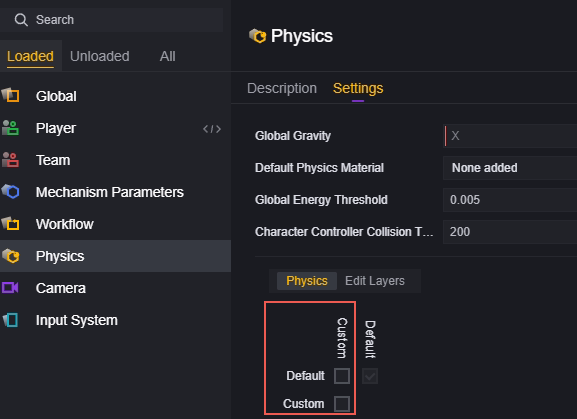
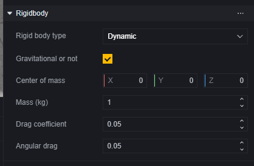
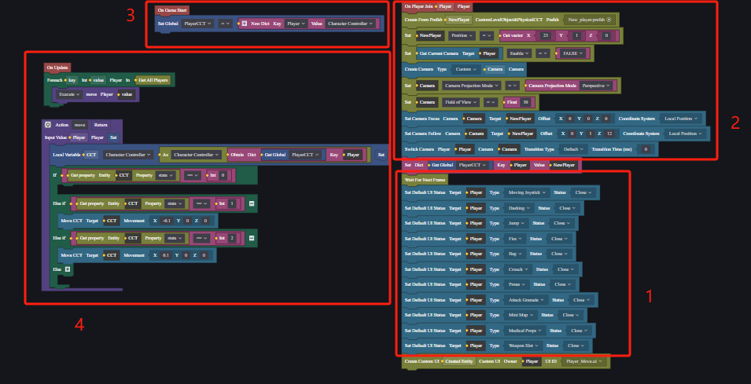

# Physics - User Manual

The physics system helps you simulate real-world physical behaviors like collisions and forces.

## Physics Module

Physics is a module that loads by default.

You can modify the global physics settings here:

1. **Direction and magnitude of gravity**.
2. **Default physical material**. Please refer to the section on collision-physical materials below.
3. **Global energy threshold**. The kinetic energy of an object is calculated using the formula:

   $$
   Ek=1/2*m*v^2
   $$

   where m is the mass of the object in kg, and v is the velocity in m/s. When an object's kinetic energy is less than this threshold, it stops moving. For example, if the threshold is set to 0.5, a 1kg object will stop moving when its speed drops below 1m/s.

4. **Character controller collision threshold**. This applies only when the player module has enabled [Use physics-based player controller] or a fully custom character controller.

   The momentum formula is:
   $$
   p=mv
   $$
   where m is mass in kg, and v is velocity in m/s. During a collision, subtract the momentum of the player from that of the impacted rigid body, and compare the magnitude of the momentum difference along the collision normal with the character controller collision threshold. If it's less than this threshold, it will stably push the rigid body; otherwise, a severe collision will occur.

   In general, factors affecting severe collisions are:

   1. The greater the mass of the player or character, the more likely a severe collision.
   2. The faster the relative speed between the player or character and the impacted rigid body, the more likely a severe collision.
   3. The larger the character controller collision threshold, the less likely a severe collision.

   For example, if the character controller collision threshold is set to 50, a 50kg player moving at 1m/s can severely collide with any stationary rigid body with similar mass to that of the player or character.

5. **Physics layers**. Whether collisions occur between different layers depends on physics configuration.

   To assign a non-default physics layer to a player:

   

   Disable collisions between Custom layer and default layer in physics configuration:

   

   You will find that players can pass through any object with default physics layers without interaction:

Objects relying on collision triggers will also not activate:

## Collision Shapes and Collisions

Custom objects applied to the physics system require two basic components: 

Collision shape component and collision component.

For most objects, you will only find one collision component because they generally do not have custom object components:

For custom collision shapes and physical material needs, we recommend creating an empty node and operating on it:

### Collision Shapes

Collision shape components define the boundaries for object collisions.

Collision types:

Collision types determine basic shapes for collisions; we offer cube, sphere, capsule shapes, and mesh colliders.

Mesh colliders simulate collision shapes nearly identical to a model's visual appearance based on its boundaries.

For created empty nodes, add custom rendering components to specify their mesh shape and size.

For basic shape collision shapes, you can adjust their position, size or manually fine-tune their appearance:

> Dragging yellow dots on collision boxes allows fine-tuning of collision shapes.

Mesh collider shapes have an option for convex polygons:

Convex polygons: Determine whether to collide with other mesh colliders. Mesh colliders without convex polygons enabled are only supported on game objects without rigid body components. To use mesh colliders for rigid body components, check the convex polygon option.

### Collisions

#### Physical Material

Physical material determines certain physical properties of this collider.

For custom objects, you can customize physical materials for collisions. However, for most officially provided objects, physical materials cannot be modified.

Physical material files can be created.

You can modify attributes in the inspector panel of physical material files to grant corresponding physical properties to all objects mounted with this physical material.

#### Is Trigger

When checking the "Is Trigger" checkbox, this collider ignores physical collisions but can trigger events.

This means that this object will not participate in default physical collision logic:

But it can trigger collision events:

#### Physics Layer

Determines which layer physics belongs to; whether collisions occur between different layers depends on configuration in the physics module.

## Rigid Body

Rigid body components allow objects to be controlled by physics and affected by forces.

To add a rigid body component, you must first have a collision component.

Rigid bodies are categorized as static, dynamic, or kinematic.

**Static Rigid Bodies** are objects without velocity or forces acting upon them, such as ground or walls that do not move. Modifying their position or scale increases performance cost.

**Dynamic Rigid Bodies** have mechanical properties like mass and velocity and can be influenced by forces.

You can modify physics-related parameters under dynamic rigid body options such as center of mass and mass itself.

Kinematic rigid bodies can be manually controlled for movement and rotation but are unaffected by other rigid bodies' collisions or forces; they are often used in animation or effects creation.

## Character Controller

### FF Player Controller

By default, player actions on the character inherit from the FreeFire player controller.

### Player Controller with Physical Effects

In the player module, check "Use Player Controller with Physical Effects" to modify certain physical parameters of the player controller. In this case, players participate to some extent in the in-game physics simulation. For example, the "Character Controller Collision Threshold" setting in the physics module will take effect.

**Use Player Controller with Physical Effects:** Check to use a controller with custom physical effects and expand related settings.

**Total Height, Including Upper and Lower Hemispheres:** The height of the character capsule collider.

**Radius of Upper and Lower Hemispheres:** Capsule radius, cannot exceed half of the height.

**Mass:** Player mass.

**Maximum Slope Angle:** Slopes steeper than this angle cannot be climbed, causing the player to slide down.

**Step Offset Vertical Displacement:** Allows players to deviate from this setting's distance without leaving the ground or being blocked, commonly used when moving on stairs.

**Minimum Movement Distance:** If the character controller's movement distance is less than this value, the player will remain stationary.

**Skin Thickness:** The depth that allows other objects to embed into the character collider, used to prevent jittering or getting stuck.

**Gravity Acceleration on Self:** Gravity acceleration applied in three-dimensional directions. For player characters, this setting overrides global physics settings.

**Enable Custom Thrust:** When enabled, the force applied when the character pushes a rigid body can be customized. Expand related settings when enabled.

**Custom Thrust Force:** The magnitude of force applied when the character pushes a rigid body.

**Multi-Jump Height:** The height of jumps during multi-jump sequences.

**Maximum Number of Multi-Jumps:** The maximum number of jumps supported per multi-jump sequence.

**Airborne Movement:** When enabled, players can change movement speed and direction while in the air.

### Fully Customizable Character Controller

In a fully customizable character controller, you can completely customize any actions and effects without any default functionalities.

To use a fully customizable character controller, you need to use a character controller component. The object controlled as a character should not have collision, collider shapes, rigid bodies, etc., components.

Refer to the example below for specific usage methods.

## Example

We will illustrate how to use a custom character controller by creating a simple side-scrolling mode character controller.

### Building the Scene

Set up a simple scene.

### Creating a Player Character

Here we create a simple player character.

Create an empty object:

Add a character controller component to this object.

Add custom properties to the character controller: State. We will use State later to control left and right movement of the player character.

Currently, the character has no appearance, so add an empty child node to this empty node to display an appearance.

Add a custom rendering component to the empty child node.

Select Mesh as Cylinder.

Now select the parent node and observe our character in the scene editor.

The capsule is the parent object's character controller component, and the cylinder is the child object's custom rendering component. We notice that the character controller seems taller than its appearance and its range is smaller than the model's.

Adjust the relative height of the child object and match it approximately with the appearance of the character controller.

Please note that for a character controller, its height must be greater than twice its radius.

Set up your completed character as a prefab and rename it New_player (or any name you like). Delete any empty objects used for creation from the scene.

### Initialization

Create a global script to disable default players, create new players, and set movement methods.

#### 1. Clear Default UI

To use a custom character controller, first address the built-in player controller. Player characters cannot be deleted from the game; however, we can make them non-controllable and invisible using certain methods.

By disabling default UI interfaces, we can hide all UIs that directly control default players.

#### 2. Use Custom Camera

The default camera follows default player characters. We need to use a new custom camera solely for observing our newly created player characters.

#### 3. Store Player Data

Create a global variable to store each player's custom character controller.

#### 4. Set Movement Method

We control movement by determining the state of the character controller: 0 means stationary, 1 means moving left, 2 means moving right.

During each update, allow all custom controllers to execute one move method. Within this method, check if the player controller is in motion; if so, move it by a small displacement.

> When fixed frame updates occur at 30 times per second, it equates to moving at 30*0.1=3m/s for the character controller.

### Create Custom Control UI

Create a UI for controlling custom character controller movement.

Three buttons are used for moving left, right, and jumping respectively for players.

Add scripts to UI entities and handle logic using callbacks:

1. Jump

   Implement jumping by applying force to custom character controllers.
   
   
   
   > The apply force interface can directly choose velocity application without calculating force and mass.
   
2. Move

   We control movement by changing states; handle states when pressing or releasing buttons separately.
   
   
   
   
   
Add callbacks on buttons calling these methods respectively:

1. Jump
   
   
   
2. Move
   
   
   
   
   
### Debugging

Logic runs correctly; however finding suitable camera parameters using custom lenses may sometimes be challenging during development stages.
  
We can adjust lenses during game debugging by adding UI controls similar in approach which helps optimize performances throughout debugging phases continuously improving your own role-controller performances:

#### 1.Create UI
  
Use buttons controlling lens movements up/down/left/right/front/back along with one button printing current lens offsets.
  

  
#### 2.Write Script
  
Add scripts onto UI entities:
  
Move Lens Example Upwards:
  

  
Print Lens Parameters:
  

  
#### 3.Add Callbacks
  
For each button add callbacks:
  
Move Example Upwards:
  

  
Print Lens Parameters:
  

  
This way you can adjust lenses during game debugging achieving desired effects: 
  

