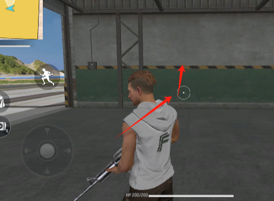
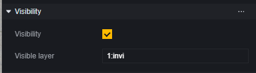

# Máy quay - Hướng dẫn sử dụng

Người chơi sử dụng máy quay để quan sát trận đấu trong game, sử dụng các chế độ và thông số khác nhau của máy quay có thể cung cấp trải nghiệm hình ảnh game khác nhau.

## Mô-đun máy quay

Mô-đun máy quay là mô-đun mặc định, không cần tải thêm.

Bạn có thể cấu hình máy quay chính trong mô-đun máy quay.

## **Chế độ máy quay**

Trong mô-đun máy quay, sau khi chọn chế độ máy quay, bạn có thể thiết lập thêm các thông số cho chế độ đó.

Trong các thông số, có một số thông số chung cho các chế độ máy quay:

### Cấu hình chung

**Loại giới hạn góc xoay ống kính**: Chọn giữ nguyên logic gốc, máy quay sẽ giới hạn góc xoay do người chơi thao tác. Chọn WideRange, giới hạn này sẽ được nới lỏng.

**Phạm vi tầm nhìn**: Góc mà máy quay có thể nhìn thấy.

**Chế độ che chắn**: Ngoại trừ camera góc nhìn thứ nhất, cách xử lý khi có vật cản giữa máy quay và nhân vật người chơi. Có ba cách: cố định, đẩy gần và xuyên thấu.

> Lúc này máy quay tiếp tục xoay sẽ bị tường chắn lại.

Trong chế độ cố định, dù có vật cản giữa máy quay và nhân vật người chơi cũng không xử lý.

Trong chế độ đẩy gần, máy quay sẽ thay đổi vị trí của mình, như bị vật cản ép sát vào nhân vật người chơi.

Trong chế độ xuyên thấu, nhân vật người chơi sẽ được đánh dấu bằng viền đỏ.

**Chế độ chiếu**: Trong chế độ xuyên thấu, máy quay xử lý sự vật theo quy tắc gần lớn xa nhỏ như thực tế. Trong chế độ trực giao, máy quay không sử dụng quy tắc gần lớn xa nhỏ khi xử lý sự vật.

> Chế độ xuyên thấu

> Chế độ trực giao, thường áp dụng cho game đi cảnh ngang có yêu cầu đặc biệt về cảnh quan.

**Độ lệch**: Trong camera hỗ trợ thiết lập độ lệch, khi độ lệch là (0, 0, 0) thì đây là vị trí mặc định ban đầu của máy quay. Bằng cách thiết lập tham số này, bạn có thể điều chỉnh vị trí mặc định của camera.

### Camera góc nhìn thứ ba

Camera góc nhìn thứ ba cách nhân vật người chơi một khoảng nhất định và sẽ hiển thị nhân vật người chơi. Trong chế độ camera góc nhìn thứ ba mặc định, người chơi có thể tự do xoay camera và lệnh di chuyển về phía trước của người chơi sẽ khiến nhân vật di chuyển theo hướng mà camera quan sát.

> Người chơi sẽ chuyển hướng trước rồi mới tiến lên.

#### FF cổ điển

FF cổ điển giống như camera góc nhìn thứ ba trong game FreeFire. Chế độ FF cổ điển không thể thay đổi tham số.

#### Theo sau lưng

Camera theo sau lưng luôn chú ý đến lưng của người chơi. Trong chế độ này, hướng ngang của nhân vật luôn bằng với hướng ngang của camera và thao tác xoay camera cũng đồng thời xoay nhân vật người chơi.

### Camera góc nhìn thứ nhất

Vị trí của camera góc nhìn thứ nhất trùng với nhân vật người chơi, như là quan sát thế giới game từ góc nhìn của nhân vật. Camera góc nhìn thứ nhất mặc định không hỗ trợ điều chỉnh phạm vi tầm nhìn.

#### Tài nguyên mới cho góc nhìn thứ nhất

Ở phần dưới của mô-đun, bạn có thể sử dụng tài nguyên mới cho góc nhìn thứ nhất.

Khi tài nguyên mới cho góc nhìn thứ nhất được chọn, camera sẽ luôn hiển thị đôi tay thay vì chỉ hiển thị khi thực hiện hành động như trước đây.

#### FF cổ điển

Camera góc nhìn thứ nhất FF cổ điển giống với góc nhìn thứ nhất trong game FreeFire. Camera góc nhìn thứ nhất FF cổ điển có hiệu ứng động thay đổi phạm vi tầm nhìn khi di chuyển.

### Camera từ trên xuống

Camera từ trên xuống trong trạng thái mặc định luôn hướng về mặt phẳng ngang và sẽ di chuyển theo khi người chơi di chuyển.

### Camera góc ngang

Camera góc ngang trong trạng thái mặc định luôn hướng về phía dương của trục Z trong hệ tọa độ thế giới và sẽ di chuyển theo khi người chơi di chuyển.

Camera góc ngang có cấu hình độc đáo:

**Góc nghiêng và góc ngang**: Có thể điều chỉnh góc ban đầu của camera. Sau khi cấu hình, camera sẽ giữ nguyên góc này.

**Có cho phép người chơi di chuyển trên trục X không**: Khi bật lên, lệnh di chuyển vào trong hoặc ra ngoài màn hình sẽ bị chặn lại. Người chơi chỉ có thể di chuyển sang hai bên trái phải của màn hình.

### Camera tự do

Trong chế độ camera tự do, lệnh di chuyển của người chơi sẽ điều khiển camera thay vì nhân vật. Ở trạng thái mặc định, điều khiển góc dọc của camera tự do bị đảo ngược.

### Camera tùy chỉnh

Camera tùy chỉnh chỉ theo dõi người chơi mà không có chức năng nào khác. Biểu hiện khi người chơi sử dụng camera phụ thuộc vào cấu hình của bạn.

## Script

Ngoài việc cấu hình cho camera chính, sử dụng script có thể điều chỉnh động các tham số của camera hoặc tạo hoặc chuyển đổi camera.

### Tạo & chuyển đổi camera

Bằng cách tạo camera mới, bạn có thể tạo thêm một camera nhưng nó chưa được sử dụng và camera của người chơi không thay đổi.

Sau khi tạo camera mới, bạn có thể điều chỉnh biểu hiện của nó bằng cách thiết lập thuộc tính cho nó.

Sử dụng chức năng chuyển đổi camera để chuyển sang một camera cụ thể thì người chơi mới bắt đầu sử dụng camera mới đó.

### Mặt nạ

Máy quay có thể chọn lọc render các đối tượng hoặc người chơi trên bản đồ bằng cách thay đổi cấp bậc mặt nạ. Tất cả các đơn vị có thể thấy đều mang thành phần khả kiến.

Thiết lập cấp bậc trong thành phần này rồi thay đổi cấp bậc render trong mặt nạ của máy quay để quyết định cấp bậc nào sẽ được render bởi máy quay đó.

> Theo mặc định, máy quay sẽ render tất cả các cấp bậc (0–15), hình trên là không render các đối tượng ở cấp bậc 1.

Bằng cách thay đổi cấp bậc mặt nạ, bạn có thể đạt được mục đích ẩn khả kiến của đơn vị thuộc loại cụ thể nào đó hoặc tiết kiệm hiệu suất,...

Tuy nhiên, dù đơn vị không khả kiến nhưng các chức năng khác như va chạm vẫn tồn tại. Người chơi vẫn bị chặn hoặc kích hoạt một số sự kiện va chạm bởi các đối tượng không được render.
