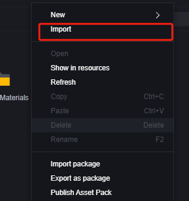
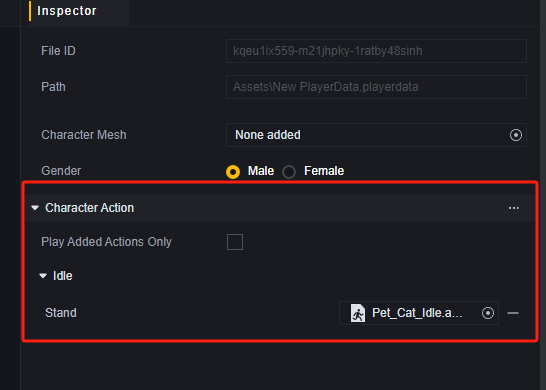

# Animation System - User Manual

# Overview of the Animation System

The basic concept of the animation system is the animation clip. An animation clip contains information about a specific object's changes in position, rotation, or other attributes over time. This linear record allows for animation effects like opening doors, walking, or jumping. Typically, an animation clip only includes short-duration animation information.

With an animation controller, clips can be organized for more logical and complex animation scenarios.

The animation system supports importing custom clips to create unique animations or replace default character animations.

# Supported Formats

Craftland Studio PC only supports FBX format for animation imports.

# Importing Animations

Like importing any other resource, you can drag the animation resource directly into the Assets folder or use the import function.

# Previewing Animations

Open the imported FBX file, where you should find the animation clip files.

Double-click the animation, and you'll be prompted to use a model to play it.

Drag in the prepared corresponding model to preview the animation.

# Using Animations

Imported animations become assets in your game project. Here are two main ways to use them:

## Replacing Player Actions

In player data, you can replace default player action animations with imported ones.

When replacing action animations, ensure they match the skeleton used in player data. In this example, using a cat's idle action requires replacing the player model with a cat model.

In this setup, the player is replaced by a cat and only plays actions in idle state; no actions are played during other activities.

Further details on player data are available in the [Player] user manual.

## Animation State Machine

An animation state machine allows you to define a sequence of actions and play them as needed.

### Creating an Animation State Machine

### Editing an Animation State Machine

1. Status Bar: Set multiple states for easy switching under appropriate conditions. An animation state machine must have at least one Idle state.
2. Current State Clips: Edit clips and their playback order within a state.
3. Properties Panel: Modify state or clip configurations here.

In state properties, you can change names and set whether the entire state group loops.

> The default Idle state's properties cannot be edited.

The loop property means that once all animations in a state finish playing, they will restart from the first one. Note that if a clip is set to loop within a state, it typically won't complete automatically and won't enter another loop.

> Looping clips won't automatically proceed to the next clip or cause the current state to loop.

### Animation State Machine Application Example

We place a cat model in the scene and want it to run to a specified location at round start, then loop through an Idle + Eat animation combo.

1. Add Component

   The animation state machine relies on adding an animation state machine component:

   

2. Edit Animation State Machine

   Edit the added component's animation state machine.

   Add two states: Idle and Run.

   

   In Idle state, add two actions: Idle and Eat.

   

   Since Idle state's mode is set to loop, both clips are set not to loop to continuously play Idle + Eat.

   In Run state, add a running clip and set it or Run state to loop. These settings affect a script node parameter later; here we only set the clip's mode to loop.

   

3. Edit Script

   Add a script to the cat model and write logic. Since added animations don't include actual displacement, use playable to add orientation and displacement:

   

   > An invisible Box001 is added at displacement's endpoint on the map for consistent orientation towards it.

4. Test

   During preparation phase, Idle state auto-starts due to added animation state machine.

   

​	Movement phase.

​	After reaching destination.

