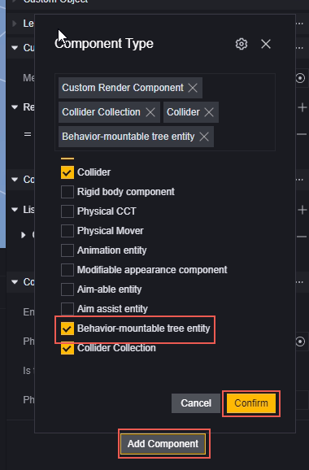
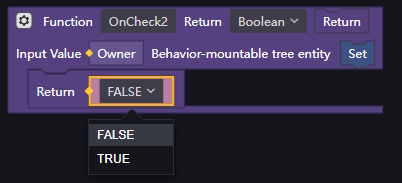
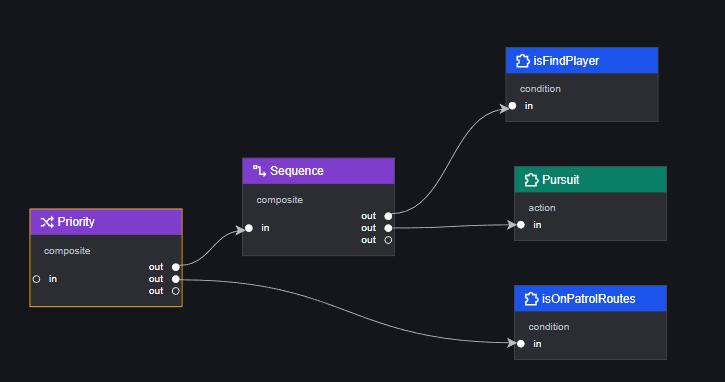
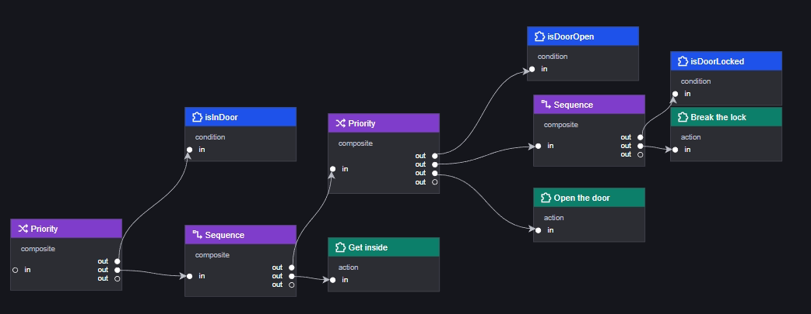

# BehaviourTree - Behavior Tree

A behavior tree is a decision-making model used to define the behavior of any object that can mount a behavior tree entity component, such as monsters or custom NPCs. The tree structure of behavior trees aligns with human thinking, making behavior design more intuitive. Its modularity also aids developers in making modifications and adjustments. In this tutorial, you will learn the operating principles of behavior trees and how to create one. The example will demonstrate how to create a behavior tree for a zombie that can patrol and chase players.

## Structure and Logic of Behavior Trees

A behavior tree consists of logic nodes, leaf nodes, and a special root node.

The behavior tree traverses all executable nodes in the defined order every Tick (one or more frames, adjustable in the properties of the behavior tree) and eventually stops at a node.

The behavior tree starts from the root node and executes sequentially from left to right, top to bottom, until it reaches a stop node or traverses all connected behavior tree nodes.

> The behavior tree always starts execution from the root node, so only nodes directly or indirectly connected to the root node will be executed.
> Node execution order is marked with numerical labels in the editor; nodes that won't be executed have no labels.
> Each Tick, when the behavior tree stops at a certain node, nodes after that point in the execution order will not be executed.

## Nodes of Behavior Trees

Root Node: The initial node every tree has; all logic begins running from the root node. The root node is automatically created and cannot be deleted.

Logic Nodes: Classified as Composite or Decorator nodes. Logic nodes determine the execution logic of child nodes. They cannot be used as the last node in a branch.

Leaf Nodes: Classified as Condition or Action nodes. Leaf nodes determine the actual behavior of entities. They must be used as the last node in a branch.

## Creating a Behavior Tree

You can right-click in the Assets window to create a behavior tree file and manage it there. The file extension for a behavior tree is .xbt.

## Mounting a Behavior Tree

Before mounting a behavior tree to any entity, you must first add the "Mountable Behavior Tree Entity" component in the inspector panel.
After adding the "Mountable Behavior Tree" component, you can quickly mount a behavior tree file.

Each entity can only mount one behavior tree.

## Editing a Behavior Tree

Opening a behavior tree file opens the edit panel for that behavior tree.

The behavior tree edit panel is divided into three parts:

1. Node List
2. Canvas
3. Inspector Panel

### Node List

All official, custom, and imported nodes are displayed here.
Drag nodes onto the canvas to create new corresponding nodes.
Node search is supported.
The button in the upper right corner allows you to create custom nodes or import nodes.

#### Custom Nodes

Clicking "+" in the upper right corner opens the Create Node panel, where you can customize the following attributes:

1. Node Name
2. Node Type: Currently supports custom Action and Condition types only.
3. Node Script: Only existing scripts can be added to custom nodes during creation; they can be edited afterward.
4. Node Variable Type: Allows creating custom attributes for script calls.
5. Node Description

All content except for 2. Node Type can be modified after creation.

#### Import Nodes

Clicking the import button in the upper right corner opens the file selection interface for importing.
You can import nodes from other projects; their extension is .xbttemp.
Note that imported nodes may contain scripts not present in this project.

> Important! Modifying nodes in the Node List does not affect those already dragged onto the canvas.

### Canvas

The canvas is where you primarily edit your behavior tree. By dragging nodes from the Node List onto it, you can arrange them freely and connect any two nodes using lines from "out" to "in" to edit their execution order. The canvas always contains a fixed root node.

When connecting an "out" tab from one node to an "in" tab on another, we call the connected "out" node the parent (output node), and the connected "in" node is called the child (input node).
Depending on their type, nodes may have one or more "out," but only one "in." (Except for root nodes, which have no input.)

A behavior tree only executes nodes directly or indirectly connected to its root node, known as active nodes. The canvas automatically identifies active nodes and orders them from left to right, top to bottom; gray numbers in their upper right corners indicate their call order—inactive nodes show no numbers.

> You can drag panels with left or middle mouse buttons.
> Use Ctrl + mouse wheel to zoom panels.

### Node Inspector Panel

Each node on the canvas contains some or all of these details: basic information, scripts, and variable lists.

Basic Information: Includes Node ID, Name, Type, Description.
Scripts: The script attached to this behavior tree node; each can only have one script controlling its execution when reached.
Variable List: Variables required for this node's operation; some are provided officially while others are added by creators during creation.

> IDs are auto-assigned; other info can be fully edited in Node List but only names on dragged canvas ones.
> Scripts can be added during creation or edited on canvas—each node holds just one script.
> Variable lists are settable both during creation and on canvas.
> Always remember that variable lists' data differs from canvas data—use canvas data for specific trees' operations.

## Types of Behavior Tree Nodes

Behavior trees have four types of nodes: Action, Condition, Composite, Decorator.

Composite and Decorator are logic categories that cannot end branches.
Action and Condition are leaf categories that must end branches.

### Action

Action-type nodes represent behaviors for execution by trees; except for "Wait @ms," all others are creator-defined. They're often used for specific actions by entities or their owners like moving somewhere specific or activating effects.
Action results are either Complete or Running.

- Wait @ms: Contains "WaitTime" variable for waiting specific milliseconds during execution—returns Running until time ends then Complete afterward.

> Note: Since trees execute per Tick using wait primitives may cause repeated waits each Tick leading freezes—use Wait @ms instead within scripts' waiting actions instead!

### Condition

Condition-type represents conditional checks needed by trees—all creator-defined too! They're often used checking conditions met/not met status-wise!
Condition results are True/False only!

### Composite

Composite-type has four official ones mainly controlling child execution orders:

- Priority: Implements OR relation among children stopping when any returns true else false if none do! Doesn't store single-run results next time!
- Sequence: Implements AND relation among children stopping when any returns false else true if none do! Doesn't store single-run results next time!
- MemPriority: Same as Priority but stores single-run results next time!
- MemSequence: Same as Sequence but stores single-run results next time!

> Note: Composite control over child orders applies solely towards its connected children!
> Customization unsupported here!

### Decorator

Decorator-type mainly controls execution logic currently having five official ones:

- Repeat @X: Contains "MaxLoop" variable repeating direct child's executions max times returning last result!
- Repeat Until Failure: Repeats direct child's executions until failure (false)!
- Repeat Until Success: Repeats direct child's executions until success (true)!
- Max @Ms: Contains "MaxTime" variable checking timeout during direct child's executions returning false if timed out!
- Inverter: Inverts direct child's result e.g., false becomes true!

> Customization unsupported here!

## Basic Rules for Behavior Tree Node Scripts

Each editable node supports adding up-to-one script! Editable ones include Actions/Conditions whose scripts must return specific values based upon type differences!

Condition scripts return Bool values!
Action scripts return "Node Running Status" values i.e., Complete/Running!

> If multiple values returned within scripts towards trees they'll default first returned value as result here!
> Official base ones preset return values—see types section details!
> Logic ones judge based upon leaf returns too—see types section details!

Nodes need special functions specifying input/output parameters allowing calls via trees themselves!
Special function requirements explained below!

Use "On Node Enter" events recommended initializing work writing logic into special functions themselves instead!
This way when returning Running results each tick directly executes special functions without repeated initialization needed instead!

### How to Return Execution Results in Nodes

Behavior trees determine return values by reading the value of a special function, which can only exist once in the script of the same node.

The syntax for this function differs between Condition scripts and Action scripts.

In a Condition node, the syntax is as shown:

Input parameter: Mountable behavior tree entity (Owner, i.e., the entity to which we have attached the corresponding behavior tree file).

Return value: Bool (the execution result of this node).

In an Action node, the syntax is as shown:

Input parameter: Mountable behavior tree entity (Owner, i.e., the entity to which we have attached the corresponding behavior tree file).

Return value: The running status of the behavior tree node (the execution result of this node).

> The behavior tree automatically reads this type of function in the node script (ensuring there is only one function of this format) and calls it every Tick to obtain a return value. There is no need to call this special type of function separately.
> Each time a behavior tree node runs, the sequence of events triggered is: when entering the node, calling the special function, and when exiting the node.
> This special function can only exist once per script. Do not design functions with the same input and return value types. You can incorporate other logic you wish to execute within this function, as long as it ultimately returns a corresponding type of return value.
> Non-special format functions can exist in unlimited numbers within a script and will not affect the normal operation and logic judgment of the behavior tree.
> Asynchronous functions are not currently supported in this special function; results must be returned immediately per tick.

## Example

For a simple requirement, create and apply a behavior tree.

> The actual script writing will not be covered in this example.

Suppose there is a scenario with a zombie and two coconut trees. Use a behavior tree to make the zombie patrol between the coconut trees continuously, chase players when nearby, and return to patrolling after losing sight of them.

First, create a behavior tree file and edit it:

Analyze the requirements; possible actions for the zombie include:

1. Patrolling
2. Chasing players
3. Returning to patrol path

Conditions for changing actions include:

1. Spotting a player
2. Losing sight of a player
3. Realizing it's off the patrol path
4. Realizing it's on the patrol path

Conditions 1 and 2 are opposites, as are 3 and 4. Therefore, only two Condition nodes are needed.
Create all custom nodes:

Action nodes:

1. Patrolling
2. Chasing players
3. Returning to patrol path

Condition nodes:

1. Has spotted a player
2. Is on patrol path

Analyze conditions for Action nodes:

| Action Node     | Condition 1        | Condition 2      |
| --------------- | ------------------ | ---------------- |
| Patrolling      | Zombie hasn't spotted player | On patrol path   |
| Chasing players | Zombie has spotted player   |                  |
| Returning to patrol path | Zombie hasn't spotted player | Off patrol path |

Extract actions requiring minimal conditions: chasing players, and use Sequence nodes with their condition nodes to form a group:

> Sequence Node: Executes child nodes in order until one returns false, then stops and returns false; if all return true, it returns true.

In this group, chasing must execute after "Has spotted a player" returns true.

If the zombie hasn't spotted a player, another condition—whether it's on the patrol path—determines its action. We need a logic node to connect previous groups with new conditions.
Since we're dealing with logic where the zombie hasn't spotted a player, previous Sequence nodes will return false, so our new logic node needs to continue running even when receiving false.

Enter Priority Node:

> Priority Node: Executes child nodes in order until one returns true, then stops and returns true; if all return false, it returns false.

This group checks whether it's on patrol when the zombie hasn't spotted a player. Based on Priority Node's characteristics, we can directly connect actions for when "Is on patrol path" returns false: returning to patrol path.

When "Is on patrol path" returns true, Priority Node stops running due to receiving true and returns true. We need a logic node that continues executing when its child nodes return true for the final action: patrolling.

Thus, a behavior tree is complete.

Next, mount this behavior tree onto the zombie entity:

Select zombie and add "Mountable Behavior Tree Entity" component

Add the newly edited behavior tree:

All done!

> This example demonstrates one method for creating; it's for reference only.
> The same logic can be drawn differently based on personal preference.
> After adding a behavior tree to an entity, you can continue editing it without following this example's process exactly.

## Supplementary Information

### Preconditions

When Behavior X must execute after meeting Condition A, Condition A is called Behavior X's precondition. Use Sequence nodes to build logical units.
Preconditions satisfy if-then logic needs; e.g., doors must open before entering:

### Postconditions

After executing Behavior X, Condition B inevitably holds true; thus Condition B is Behavior X's postcondition. Use Priority nodes for logical units.
Postconditions ensure that when logical blocks execute successfully, conditions are met; e.g., if entering succeeds, units are inside:

### PPA Pattern (Postcondition-Precondition-Action)

Combining both conditions allows using PPA Pattern—a widely used design method.

The advantage of this pattern is viewing entire trees as logic under postconditions' premise—supporting layered design better; e.g., doors may have locked states:

New logic mainly affects whether doors open—edit extended logic by setting door opening as postcondition.
